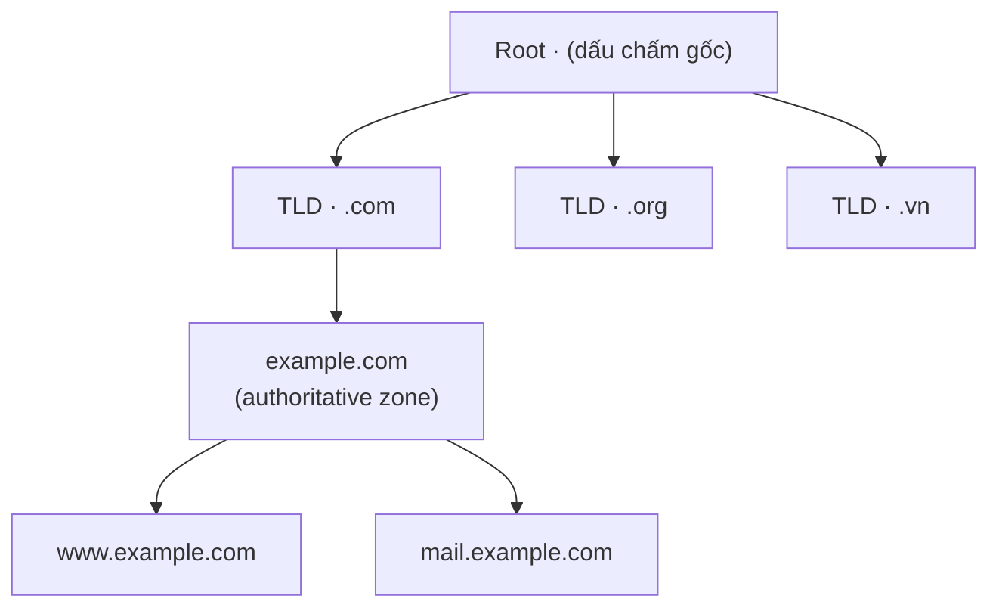

import { Callout } from "nextra/components";

# DNS — Hệ thống phân giải tên miền

**DNS** (Domain Name System — hệ thống phân tán biến tên miền dễ nhớ như `www.example.com` thành địa chỉ IP mà máy tính dùng để định tuyến) là một trong những protocol nền tảng nhất của Internet. Con người nhớ tên, còn máy móc cần địa chỉ IP (đã học ở Chương 4); DNS là lớp "danh bạ" nối hai thế giới đó. Bài học này đi qua kiến trúc phân cấp của DNS, phân biệt **recursive query** với **iterative query** theo từng bước, liệt kê các record type quan trọng, và kết thúc bằng một phiên `dig` có output quan sát được.

## DNS giải quyết vấn đề gì?

Mỗi dịch vụ trên Internet nằm sau một hoặc nhiều địa chỉ IP, nhưng địa chỉ IP vừa khó nhớ vừa hay thay đổi. DNS cho phép ta tham chiếu dịch vụ qua một **domain name** (tên miền — chuỗi nhãn phân tách bằng dấu chấm, ví dụ `mail.google.com`) ổn định, trong khi địa chỉ IP phía sau có thể đổi tự do. Nhờ đó, một website có thể chuyển sang server mới mà người dùng không cần biết.

DNS chạy chủ yếu trên **port 53** (dùng UDP cho phần lớn truy vấn vì nhanh và nhẹ, chuyển sang TCP khi phản hồi lớn hoặc khi truyền zone). Vì mỗi truy vấn thường chỉ là một cặp request/response ngắn, UDP là lựa chọn mặc định — đây là một ví dụ thực tế của việc chọn transport protocol đã bàn ở Chương 5.

<Callout type="info">
  Một phép so sánh: DNS giống như danh bạ điện thoại. Bạn biết tên người cần
  gọi (domain name) nhưng cần tra ra số điện thoại (địa chỉ IP) trước khi máy có
  thể kết nối.
</Callout>

## Cấu trúc phân cấp của không gian tên

Không gian tên DNS là một cây phân cấp, đọc từ phải sang trái. Ở gốc là **root** (vùng gốc, ký hiệu bằng dấu chấm rỗng ở cuối tên), tiếp theo là **TLD** (Top-Level Domain — miền cấp cao nhất như `.com`, `.org`, `.vn`), rồi tới domain do tổ chức đăng ký (`example.com`), và cuối cùng là các **subdomain** (tên miền con như `www.example.com`).



Mỗi cấp được phục vụ bởi các **name server** (máy chủ tên — server lưu và trả lời dữ liệu DNS cho một phần của cây). Server giữ dữ liệu chính thức cho một vùng gọi là **authoritative server** (máy chủ thẩm quyền — nơi nắm bản ghi gốc, đáng tin cậy nhất cho domain đó). Phần cây mà một authoritative server chịu trách nhiệm gọi là một **zone** (vùng quản lý — một nhánh liền mạch của không gian tên được quản trị như một đơn vị).

## Hai vai trò trong quá trình phân giải

Khi một chương trình cần địa chỉ IP, có hai thành phần phối hợp. Thứ nhất là **stub resolver** (bộ phân giải tối giản — thư viện DNS nằm trong hệ điều hành, chỉ biết hỏi một server rồi chờ câu trả lời cuối cùng). Thứ hai là **recursive resolver** (bộ phân giải đệ quy — server, thường của ISP hoặc dịch vụ như `1.1.1.1`, đảm nhận việc đi hỏi khắp cây DNS thay cho client).

Sự phân vai này dẫn tới hai kiểu truy vấn. Trong một **recursive query** (truy vấn đệ quy — "hãy trả lời giúp tôi câu trả lời cuối cùng"), bên hỏi yêu cầu bên kia làm mọi việc và chỉ trả về kết quả hoàn chỉnh. Trong một **iterative query** (truy vấn lặp — "cho tôi câu trả lời, hoặc chỉ tôi nên hỏi ai tiếp"), bên được hỏi hoặc trả lời ngay hoặc trả về một **referral** (lời giới thiệu — gợi ý sang name server kế tiếp gần đích hơn).

## Quá trình phân giải từng bước

Stub resolver gửi một recursive query tới recursive resolver. Recursive resolver sau đó thực hiện một chuỗi iterative query xuống cây: hỏi root để biết TLD server, hỏi TLD server để biết authoritative server, rồi hỏi authoritative server để lấy bản ghi cuối cùng. Sơ đồ tuần tự dưới đây mô tả trọn vẹn lượt phân giải `www.example.com`:

```mermaid
sequenceDiagram
    participant App as "Ứng dụng (browser)"
    participant Stub as "Stub resolver"
    participant Rec as "Recursive resolver"
    participant Root as "Root server"
    participant TLD as "TLD server .com"
    participant Auth as "Authoritative example.com"
    App->>Stub: cần IP của www.example.com
    Stub->>Rec: Recursive query A www.example.com
    Note over Rec: kiểm tra cache trước; nếu miss thì đi hỏi
    Rec->>Root: Iterative query A www.example.com
    Root-->>Rec: Referral tới TLD .com (NS + glue)
    Rec->>TLD: Iterative query A www.example.com
    TLD-->>Rec: Referral tới authoritative example.com
    Rec->>Auth: Iterative query A www.example.com
    Auth-->>Rec: Answer A 93.184.216.34 TTL 86400
    Rec-->>Stub: Answer A 93.184.216.34
    Stub-->>App: 93.184.216.34
```

Điểm mấu chốt cần phân biệt: chỉ chặng đầu tiên (stub đến recursive resolver) là **recursive**; ba chặng tiếp theo (recursive resolver đi hỏi root, TLD, authoritative) đều là **iterative**. Nói cách khác, recursive resolver "gánh" toàn bộ công việc lặp để stub resolver chỉ phải hỏi đúng một lần.

### Vai trò của caching và TTL

Recursive resolver không lặp lại toàn bộ hành trình cho mỗi truy vấn. Mỗi bản ghi đi kèm một **TTL** (Time To Live — số giây mà một bản ghi được phép lưu trong cache trước khi phải hỏi lại). Trong ví dụ trên, `TTL 86400` nghĩa là kết quả được cache một ngày; mọi truy vấn `www.example.com` trong vòng 24 giờ sau đó sẽ được trả lời ngay từ cache, bỏ qua root/TLD/authoritative.

<Callout type="warning">
  TTL là con dao hai lưỡi: TTL cao giảm tải và tăng tốc, nhưng khi bạn đổi địa
  chỉ IP của dịch vụ, các resolver vẫn trả về IP cũ cho tới khi TTL hết hạn. Vì
  vậy trước khi migrate, lập trình viên thường hạ TTL xuống thấp vài giờ trước.
</Callout>

## Các loại bản ghi DNS

Dữ liệu DNS được lưu thành các **resource record** (bản ghi tài nguyên — một dòng dữ liệu gồm tên, loại, TTL và giá trị). Mỗi loại bản ghi phục vụ một mục đích khác nhau; bảng dưới liệt kê các loại quan trọng nhất, trong đó bốn loại đầu là cốt lõi.

| Record  | Tên đầy đủ      | Mục đích                                                                 |
| ------- | --------------- | ------------------------------------------------------------------------ |
| `A`     | Address         | Ánh xạ một hostname sang một địa chỉ **IPv4** (ví dụ `93.184.216.34`)     |
| `AAAA`  | IPv6 Address    | Ánh xạ một hostname sang một địa chỉ **IPv6** (ví dụ `2606:2800:220::1`)  |
| `CNAME` | Canonical Name  | Tạo **alias** (bí danh) trỏ một tên sang một tên chính (canonical) khác   |
| `MX`    | Mail Exchange   | Chỉ định mail server nhận email cho domain, kèm số **priority**           |
| `NS`    | Name Server     | Khai báo authoritative name server cho một zone (dùng khi ủy quyền)       |
| `TXT`   | Text            | Lưu chuỗi văn bản tự do, hay dùng cho xác thực (SPF, DKIM)                |

Bốn loại cốt lõi đáng nhớ kỹ. Bản ghi **A** và **AAAA** là cặp song sinh: cùng trỏ tên sang địa chỉ, chỉ khác A dành cho IPv4 còn AAAA cho IPv6 (tên "AAAA" gợi ý địa chỉ dài gấp bốn lần A). Bản ghi **CNAME** không chứa địa chỉ mà trỏ tên này sang tên khác, nên resolver phải tra tiếp tên đích — hữu ích khi nhiều dịch vụ dùng chung một địa chỉ. Bản ghi **MX** trả về tên của mail server kèm priority, trong đó số nhỏ hơn được ưu tiên dùng trước.

## Ví dụ thực tế: phân giải bằng `dig`

`dig` (Domain Information Groper — công cụ dòng lệnh truy vấn DNS và in chi tiết phản hồi) là cách trực quan nhất để quan sát DNS. Lệnh sau hỏi bản ghi A của `example.com`:

```bash
$ dig example.com A

; <<>> DiG 9.18.18 <<>> example.com A
;; global options: +cmd
;; Got answer:
;; ->>HEADER<<- opcode: QUERY, status: NOERROR, id: 42337
;; flags: qr rd ra; QUERY: 1, ANSWER: 1, AUTHORITY: 0, ADDITIONAL: 1

;; QUESTION SECTION:
;example.com.                   IN      A

;; ANSWER SECTION:
example.com.            86400   IN      A       93.184.216.34

;; Query time: 12 msec
;; SERVER: 1.1.1.1#53(1.1.1.1) (UDP)
;; WHEN: Mon Jan 15 10:30:00 UTC 2024
;; MSG SIZE  rcvd: 56
```

Phần `ANSWER SECTION` là kết quả ta cần: tên `example.com.` có bản ghi `A` trỏ tới `93.184.216.34`, với TTL `86400` giây. Dòng `SERVER: 1.1.1.1#53` xác nhận recursive resolver được hỏi là `1.1.1.1` tại port `53`, đúng như lý thuyết. Cờ `status: NOERROR` báo truy vấn thành công.

Để quan sát các record type khác, ta đổi tham số loại. Lệnh dưới hỏi bản ghi MX và CNAME, dùng `+short` cho gọn:

```bash
$ dig gmail.com MX +short
5 gmail-smtp-in.l.google.com.
10 alt1.gmail-smtp-in.l.google.com.
20 alt2.gmail-smtp-in.l.google.com.

$ dig www.github.com CNAME +short
github.com.
```

Ở kết quả MX, mỗi dòng có dạng `priority hostname`; số `5` nhỏ nhất nên mail server đó được thử trước. Ở kết quả CNAME, `www.github.com` thực ra là alias trỏ sang tên chính `github.com`, nên client sẽ tra tiếp bản ghi A/AAAA của `github.com`.

## Tóm tắt nhanh

- **DNS** biến domain name thành địa chỉ IP, chạy trên **port 53** (UDP là mặc định, TCP khi phản hồi lớn).
- Không gian tên phân cấp: **root → TLD → authoritative**, mỗi cấp do name server riêng phục vụ.
- **Recursive query** yêu cầu câu trả lời cuối cùng; **iterative query** trả về câu trả lời hoặc một referral. Stub hỏi recursive resolver kiểu recursive; resolver đi hỏi root/TLD/authoritative kiểu iterative.
- **TTL** điều khiển thời gian cache; TTL cao giảm tải nhưng làm thay đổi lan truyền chậm.
- Bốn record cốt lõi: **A** (IPv4), **AAAA** (IPv6), **CNAME** (alias), **MX** (mail server + priority).

## Bài tập

### Câu hỏi lý thuyết

1. Trong một lượt phân giải `www.example.com`, hãy chỉ rõ chặng nào là **recursive query** và chặng nào là **iterative query**, và giải thích vì sao recursive resolver lại là thành phần "làm việc nặng".
2. Phân biệt mục đích của bản ghi `A`, `AAAA`, `CNAME` và `MX`. Vì sao một resolver gặp bản ghi `CNAME` thì phải thực hiện thêm một bước tra cứu nữa?

### Thực hành (dùng `dig`)

3. Viết lệnh `dig` để (a) lấy bản ghi `AAAA` của `example.com` và (b) lấy danh sách `MX` của `example.com` ở dạng ngắn gọn. Trong output của câu (b), trường số đứng trước mỗi hostname có ý nghĩa gì?
4. Chạy `dig example.com A` hai lần liên tiếp và quan sát trường TTL. Dự đoán điều gì xảy ra với giá trị TTL ở lần chạy thứ hai nếu kết quả được phục vụ từ cache, và giải thích tại sao.

<details>
  <summary>Đáp án & gợi ý</summary>

1. Chỉ chặng **stub resolver → recursive resolver** là recursive query (yêu cầu câu trả lời cuối cùng). Ba chặng **recursive resolver → root**, **→ TLD**, **→ authoritative** đều là iterative query (mỗi bước trả về referral hoặc câu trả lời). Recursive resolver "làm việc nặng" vì nó phải lần lượt đi hỏi từng cấp, gom referral và tiến dần tới authoritative server, trong khi stub chỉ hỏi đúng một lần.
2. `A` trỏ tên sang địa chỉ **IPv4**; `AAAA` trỏ tên sang địa chỉ **IPv6**; `CNAME` trỏ tên sang một tên chính (alias) khác; `MX` trỏ domain sang mail server nhận email kèm priority. Gặp `CNAME`, resolver phải tra tiếp vì bản ghi này không chứa địa chỉ IP — nó chỉ ra một tên khác mà resolver cần tra bản ghi `A`/`AAAA` của tên đó.
3. (a) `dig example.com AAAA` — hoặc `dig example.com AAAA +short`. (b) `dig example.com MX +short`. Số đứng trước mỗi hostname là **priority**: số nhỏ hơn được ưu tiên dùng trước; các server có cùng priority được chia tải.
4. Nếu kết quả đến từ cache của recursive resolver, TTL ở lần thứ hai sẽ **nhỏ hơn** lần đầu (đếm ngược dần về 0). Lý do: resolver lưu bản ghi kèm thời điểm hết hạn và trả về phần TTL còn lại; khi TTL về 0, nó sẽ hỏi lại authoritative server và TTL được nạp lại giá trị gốc.

</details>

## Nguồn tham khảo

- P. Mockapetris, _Domain Names — Concepts and Facilities_, RFC 1034, mục 3 (cấu trúc không gian tên và quá trình phân giải recursive/iterative).
- P. Mockapetris, _Domain Names — Implementation and Specification_, RFC 1035, mục 3.2 (các resource record type: A, NS, CNAME, MX).
- J. F. Kurose & K. W. Ross, _Computer Networking: A Top-Down Approach_, 8th ed., mục 2.4 (DNS — The Internet's Directory Service).
