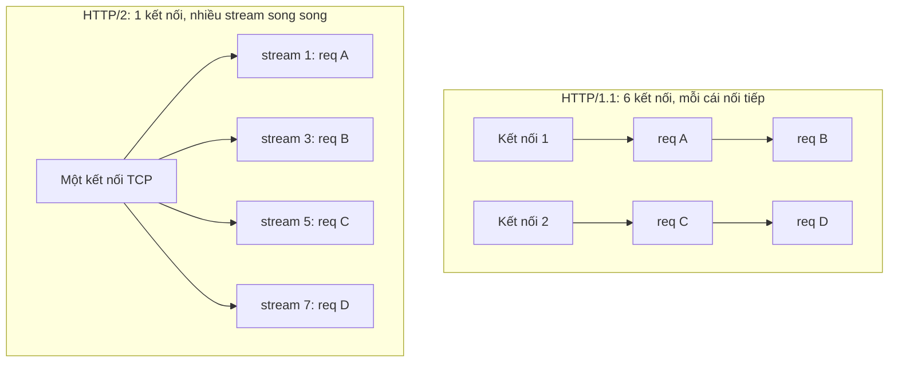
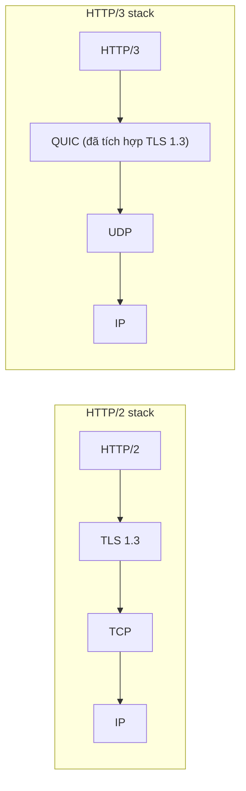

import { Callout } from "nextra/components";

# HTTP/2 & HTTP/3

Bài **HTTP & HTTPS** đã đi qua HTTP/1.1 — dòng máu chảy suốt Web hai thập kỷ. Nhưng khi trang web hiện đại tải hàng trăm tài nguyên (JS, CSS, ảnh, font) trên một kết nối, HTTP/1.1 lộ ra ba nút thắt: **head-of-line blocking** trên một kết nối TCP, **overhead của header** (không nén), và **latency của handshake** (TCP + TLS). HTTP/2 và HTTP/3 lần lượt được sinh ra để gỡ từng nút. Bài này giải thích cả hai theo cách một developer cần: cái gì khác, ai được lợi, và khi nào dùng cái nào.

## Vấn đề HTTP/1.1 để lại

HTTP/1.1 gửi request-response theo dạng **văn bản dòng lệnh nối tiếp** trên một kết nối TCP: hết request/response này mới tới lượt request kế. Có `Keep-Alive` để tái dùng kết nối, có `pipelining` (gửi nhiều request liên tiếp) nhưng response vẫn phải trả về đúng thứ tự — một response chậm sẽ chặn mọi response sau. Browser lách bằng cách mở 6 kết nối song song mỗi origin, nhưng vẫn không đủ khi trang có 100+ tài nguyên.

Ba vấn đề cần nhớ:

- **Head-of-line blocking ở tầng ứng dụng**: response chậm chặn response nhanh sau nó trên cùng kết nối.
- **Header khổng lồ, không nén**: mỗi request gửi lại cookie, `User-Agent`, `Accept-*` (có khi vài KB) dạng plaintext.
- **Ba vòng bắt tay**: TCP (1 RTT) + TLS (thường 2 RTT với TLS 1.2) trước khi byte HTTP đầu tiên đi được.

## HTTP/2: multiplexing và HPACK

**HTTP/2** (định nghĩa trong RFC 9113, ra đời 2015 dựa trên SPDY của Google) không đổi ngữ nghĩa của HTTP (method, status code, header vẫn nguyên) — nó thay **cách đóng gói dữ liệu** trên đường truyền. Ba đổi mới quan trọng nhất:

**Binary framing**. HTTP/2 dùng **frame** nhị phân (khác nghĩa với frame Ethernet ở Chương 3) thay vì text. Mỗi frame có header cố định 9 byte gồm type, flags, và **stream ID**. Các frame thuộc cùng một request/response chia sẻ chung một stream ID.

**Multiplexing qua streams**. Trên một kết nối TCP duy nhất, nhiều **stream** cùng chạy song song, mỗi stream là một cặp request/response độc lập. Client có thể gửi 20 request cùng lúc, server trả về theo tiến độ chứ không phải theo thứ tự gửi. Đây là điểm giết head-of-line blocking ở tầng ứng dụng.



**HPACK — nén header**. Client và server giữ chung một **bảng động** các header đã gửi; lần sau chỉ gửi số index thay vì cả chuỗi. Cookie 4 KB gửi 100 lần chỉ tốn ~4 KB tổng thay vì 400 KB.

Server còn hỗ trợ **server push** (gửi tài nguyên trước khi client hỏi), nhưng đa phần browser đã bỏ tính năng này vì phức tạp và ít hiệu quả trong thực tế.

<Callout type="info">
  **Điểm cho dev**: bạn thường không phải viết code khác cho HTTP/2 — thư viện
  HTTP client (Go `net/http`, Node.js `http2`, `curl --http2`) tự thương lượng
  qua **ALPN** (Application-Layer Protocol Negotiation, mở rộng của TLS handshake
  giúp hai bên chọn HTTP/2 hay HTTP/1.1 trong lúc bắt tay TLS). Bạn chỉ cần bật
  HTTPS + HTTP/2 ở reverse proxy hoặc CDN là hầu hết browser dùng ngay.
</Callout>

## Nhưng HTTP/2 vẫn có TCP head-of-line blocking

HTTP/2 xử lý HOL blocking ở tầng ứng dụng nhờ multiplexing. Nhưng **tất cả stream chạy trên một kết nối TCP duy nhất**, mà TCP đảm bảo dòng byte đúng thứ tự (đã học ở Chương 5). Nếu một segment TCP mất, TCP dừng chuyển byte lên tầng trên cho tới khi retransmit xong — **mọi stream cùng bị kẹt**, dù chỉ một stream có gói mất.

Đây là "TCP head-of-line blocking" — nút thắt mà HTTP/2 không giải được vì nó vẫn chạy trên TCP.

## HTTP/3: QUIC thay thế TCP

**HTTP/3** (RFC 9114, chuẩn hóa 2022) là HTTP/2 chạy trên **QUIC** thay vì TCP. **QUIC** (Quick UDP Internet Connections, RFC 9000) là một transport protocol mới do Google phát triển, chạy trên UDP và tự xây lại độ tin cậy, sắp xếp, congestion control ở tầng ứng dụng — nhưng mỗi stream có bộ đếm thứ tự riêng.

Ba khác biệt cốt lõi của QUIC so với TCP + TLS:

- **Stream độc lập ở tầng transport**. Gói mất chỉ dừng đúng stream đó, các stream khác vẫn chạy. Đây là điểm khắc phục TCP HOL blocking.
- **Handshake 1-RTT (thậm chí 0-RTT)**. QUIC gộp TCP handshake và TLS handshake làm một. Với **0-RTT resumption**, kết nối lại có thể gửi HTTP request ngay trong gói đầu — không tốn RTT nào.
- **Connection migration**. QUIC định danh kết nối bằng **connection ID** thay vì 4-tuple `(src IP, src port, dst IP, dst port)` như TCP. Đổi mạng (Wi-Fi sang 4G) không làm rớt kết nối — cực kỳ hữu ích cho mobile.



<Callout type="warning">
  QUIC chạy trên UDP nên một số firewall nghiêm ngặt (đặc biệt trong doanh nghiệp)
  chặn UDP ngoài port 53. Server HTTP/3 luôn phải cấu hình **fallback về HTTP/2**
  qua header `Alt-Svc` nếu QUIC không kết nối được. Đây là lý do đa phần trang
  ngày nay chạy song song HTTP/2 + HTTP/3.
</Callout>

## Ví dụ thực tế: kiểm tra bằng curl

`curl` hỗ trợ đầy đủ ba phiên bản. Cờ `--http1.1`, `--http2`, `--http3` ép dùng một phiên bản cụ thể để bạn quan sát khác biệt:

```bash
$ curl -sI --http1.1 https://cloudflare.com | head -1
HTTP/1.1 301 Moved Permanently

$ curl -sI --http2 https://cloudflare.com | head -1
HTTP/2 301

$ curl -sI --http3 https://cloudflare.com | head -1
HTTP/3 301
```

Dòng đầu của response phản ánh đúng phiên bản. Với HTTP/2 và HTTP/3, header name theo quy ước là chữ **thường** (`content-type` thay vì `Content-Type`) — đây là điểm mà thư viện parser phải chuẩn hóa để code cũ vẫn chạy.

Đo thời gian handshake để thấy lợi ích của HTTP/3:

```bash
$ curl -w "connect: %{time_connect}s  appconnect: %{time_appconnect}s\n" -o /dev/null -s --http2 https://cloudflare.com
connect: 0.024s  appconnect: 0.078s
$ curl -w "connect: %{time_connect}s  appconnect: %{time_appconnect}s\n" -o /dev/null -s --http3 https://cloudflare.com
connect: 0.024s  appconnect: 0.036s
```

`appconnect` (thời điểm handshake TLS hoàn tất) trong HTTP/3 nhỏ hơn hẳn — QUIC gộp TCP + TLS thành một RTT.

## Chọn phiên bản nào cho hệ thống của bạn

Bảng dưới là hướng dẫn nhanh:

| Tình huống                                          | Phiên bản khuyến nghị          |
| --------------------------------------------------- | ------------------------------ |
| Trang web/API tổng quát, hầu hết người dùng có browser | **HTTP/2** (mặc định qua CDN)  |
| Mobile app cần chuyển mạng liên tục                  | **HTTP/3** (connection migration) |
| Client tự viết, gọi API server-to-server nội bộ      | **HTTP/2** (đơn giản, ổn định)   |
| Client cũ, môi trường cần tương thích tối đa         | **HTTP/1.1** (còn phổ biến)     |
| Streaming, tải file lớn nhiều người song song        | HTTP/2 hoặc HTTP/3 (multiplex hiệu quả) |

Trong thực tế, đa phần dev **không phải chọn**: bật CDN (Cloudflare, Fastly, CloudFront) hoặc reverse proxy (nginx, Caddy, Envoy) là đã có sẵn HTTP/1.1 + HTTP/2 + HTTP/3 và tự negotiate với client.

<Callout type="info">
  **Với gRPC**: đây là RPC framework của Google (sẽ nói kỹ ở bài kế tiếp), chạy
  bắt buộc trên **HTTP/2** để tận dụng multiplexing + streaming. Không có phiên
  bản gRPC over HTTP/1.1.
</Callout>

## Tóm tắt nhanh

- **HTTP/1.1** nối tiếp trên mỗi kết nối, HOL blocking ở tầng ứng dụng, header không nén, browser mở nhiều kết nối để bù.
- **HTTP/2** giữ nguyên ngữ nghĩa HTTP, đổi cách vận chuyển: **binary framing + streams multiplex** trên một kết nối TCP + **HPACK** nén header; tự negotiate qua **ALPN** khi TLS handshake.
- HTTP/2 vẫn dính **TCP head-of-line blocking** vì mọi stream chia sẻ một kết nối TCP.
- **HTTP/3 = HTTP + QUIC**, QUIC chạy trên UDP với **stream độc lập ở transport**, **handshake 1-RTT/0-RTT**, và **connection migration**.
- Thực tế: bật cả ba song song qua CDN/reverse proxy; browser chọn HTTP/3 khi được, fallback HTTP/2 nếu UDP bị chặn.

## Bài tập

### Câu hỏi lý thuyết

1. Giải thích **head-of-line blocking** ở HTTP/1.1 và cách HTTP/2 giải quyết nó ở tầng ứng dụng. Vì sao HTTP/2 vẫn dính HOL blocking ở tầng transport?
2. QUIC được xây trên UDP thay vì tạo protocol mới ở tầng Network. Nêu ít nhất hai lý do vì sao chọn UDP hợp lý (gợi ý: firewall và tốc độ triển khai).

### Bài tập tình huống

3. Ứng dụng mobile của bạn thường mất kết nối khi người dùng đi từ Wi-Fi ra 4G, phải đăng nhập lại mỗi lần. Giải thích tại sao HTTP/1.1 và HTTP/2 gặp vấn đề này, và HTTP/3 sửa nó ra sao qua **connection migration**.

### Thực hành

4. Chạy `curl -sI --http2 https://<domain-của-bạn>` và `curl -sI --http3 https://<domain-của-bạn>`. Dòng đầu và header **`alt-svc`** (nếu có) cho biết gì về hỗ trợ phiên bản của server?

<details>
  <summary>Đáp án & gợi ý</summary>

1. HTTP/1.1 gửi response nối tiếp trên mỗi kết nối: một response chậm chặn mọi response sau. HTTP/2 dùng **multiplexing qua streams** — mỗi request/response một stream riêng trên cùng kết nối, response chậm không chặn cái khác. Nhưng mọi stream chia sẻ **một kết nối TCP**, và TCP đảm bảo byte đúng thứ tự; nếu một segment TCP mất, TCP dừng cả dòng byte cho đến khi retransmit — **mọi stream cùng kẹt**, dù chỉ 1 stream có gói mất.

2. (a) **Firewall/NAT** khắp Internet đã hiểu và cho phép UDP — thiết kế protocol mới ở tầng Network sẽ bị firewall chặn im lặng khắp nơi, mất nhiều năm để phổ cập. (b) **Deploy nhanh**: QUIC nằm trong user-space (thư viện ở phần mềm), không cần đợi kernel/OS được update như thay đổi tầng Network — Google có thể update Chrome và server một đêm là hàng tỉ người dùng có phiên bản mới.

3. Với HTTP/1.1 và HTTP/2, kết nối TCP định danh bằng **4-tuple** `(src IP, src port, dst IP, dst port)`. Đổi mạng ⇒ đổi src IP ⇒ 4-tuple thay đổi ⇒ TCP coi là kết nối mới, kết nối cũ chết. Session token/cookie trên kết nối cũ mất theo. HTTP/3/QUIC định danh bằng **connection ID** không phụ thuộc IP; đổi mạng, connection ID vẫn giữ nguyên, QUIC tự xử lý packet đến từ IP mới. Ứng dụng thấy kết nối liên tục, không phải đăng nhập lại.

4. Dòng đầu cho biết server hỗ trợ HTTP/2 hay HTTP/3 tại thời điểm hỏi. Header **`alt-svc: h3=":443"; ma=86400`** báo cho client biết "cùng dịch vụ này cũng chạy HTTP/3 trên UDP port 443, ghi nhớ trong 86400 giây (24h)"; lần sau client sẽ ưu tiên thử HTTP/3 và fallback nếu không được. Đây là cơ chế chính mà server công bố hỗ trợ HTTP/3.

</details>

## Nguồn tham khảo

- M. Thomson, C. Benfield, _HTTP/2_, RFC 9113 (thay thế RFC 7540), phần "Streams", "Framing", và "HPACK Reference".
- M. Bishop (Ed.), _HTTP/3_, RFC 9114 (ánh xạ HTTP lên QUIC).
- J. Iyengar, M. Thomson (Eds.), _QUIC: A UDP-Based Multiplexed and Secure Transport_, RFC 9000.
- M. Nottingham, P. McManus, J. Reschke, _Alternative Services_, RFC 7838 (header `Alt-Svc`).
