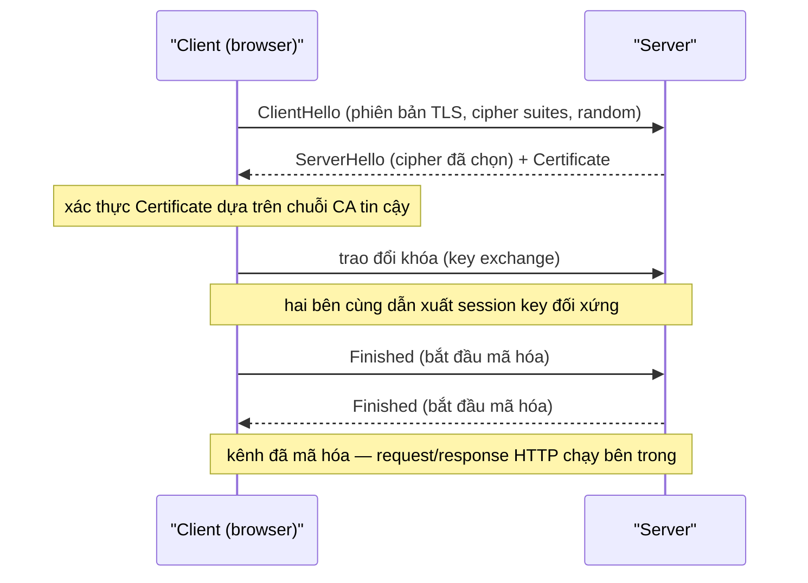

import { Callout } from "nextra/components";

# HTTP & HTTPS

**HTTP** (HyperText Transfer Protocol — protocol tầng ứng dụng để client và server trao đổi tài nguyên web theo mô hình request/response) là ngôn ngữ của World Wide Web. Mỗi lần bạn mở một trang, gọi một API hay tải một ảnh, trình duyệt đang nói HTTP với server. Bài học này mổ xẻ cấu trúc một request và một response, phân loại đủ 5 nhóm **status code**, rồi giải thích **HTTPS** thêm gì vào HTTP qua vai trò của **TLS**. Đây là phần mở rộng trực tiếp của ví dụ HTTP đã gặp ở Chương 1.

## HTTP hoạt động ra sao?

HTTP theo mô hình **client–server**: client (thường là browser) gửi một **request** (yêu cầu — thông điệp hỏi tài nguyên), server trả về một **response** (phản hồi — thông điệp chứa kết quả). Mỗi cặp request/response là độc lập vì HTTP là **stateless** (không trạng thái — server không tự nhớ các request trước đó của cùng một client). Trạng thái như đăng nhập được mô phỏng nhờ cookie hoặc token nằm trong header.

HTTP chạy trên TCP — đã học ở Chương 5 — tại **port 80**, còn HTTPS tại **port 443**. Việc dùng TCP đảm bảo các byte của một trang web đến nơi đầy đủ và đúng thứ tự.

## Cấu trúc của một request

Một HTTP request gồm ba phần. Dòng đầu là **request line** chứa **method** (phương thức — động từ cho biết hành động mong muốn, ví dụ `GET`), đường dẫn tài nguyên, và phiên bản HTTP. Tiếp theo là các **header** (tiêu đề — các dòng `Tên: giá trị` mang metadata như host, kiểu nội dung, thông tin xác thực). Cuối cùng, sau một dòng trống, là **body** (thân — dữ liệu kèm theo, thường có ở `POST`/`PUT`).

```http
POST /api/users HTTP/1.1
Host: api.example.com
Content-Type: application/json
Content-Length: 26

{"name": "Lan", "age": 30}
```

Ở đây method là `POST`, đường dẫn `/api/users`, và body là một đối tượng JSON. Header `Content-Type` báo cho server biết body là JSON, còn `Content-Length` cho biết body dài 26 byte.

Các method phổ biến mỗi cái mang một ngữ nghĩa riêng:

| Method   | Mục đích                                            | Đặc tính           |
| -------- | --------------------------------------------------- | ------------------ |
| `GET`    | Lấy tài nguyên, không làm thay đổi dữ liệu           | safe, idempotent   |
| `POST`   | Gửi dữ liệu để tạo mới hoặc xử lý                    | không idempotent   |
| `PUT`    | Tạo hoặc thay thế toàn bộ một tài nguyên             | idempotent         |
| `DELETE` | Xóa một tài nguyên                                  | idempotent         |
| `HEAD`   | Như `GET` nhưng chỉ lấy header, không lấy body       | safe, idempotent   |

<Callout type="info">
  Một method được gọi là **idempotent** (lũy đẳng — gọi nhiều lần cho cùng kết
  quả như gọi một lần) khi việc lặp lại request không gây thêm tác dụng phụ. Ví
  dụ `DELETE` cùng một tài nguyên hai lần thì sau lần đầu trạng thái không đổi.
</Callout>

## Cấu trúc của một response

Một response cũng có ba phần. Dòng đầu là **status line** chứa phiên bản, một **status code** (mã trạng thái — số ba chữ số tóm tắt kết quả xử lý) và một lý do dạng chữ. Sau đó là các header, rồi tới body chứa nội dung thật (HTML, JSON, ảnh...).

```http
HTTP/1.1 201 Created
Location: /api/users/42
Content-Type: application/json
Content-Length: 25

{"id": 42, "name": "Lan"}
```

Status code `201 Created` cho biết tài nguyên đã được tạo; header `Location` chỉ ra đường dẫn của tài nguyên mới. Như vậy chỉ cần đọc status line và vài header, client đã hiểu chuyện gì xảy ra mà chưa cần đọc body.

## Năm nhóm status code

Status code được chia theo chữ số đầu tiên thành 5 nhóm. Bảng dưới nêu ý nghĩa từng nhóm kèm ít nhất hai mã tiêu biểu:

| Nhóm    | Ý nghĩa chung                                  | Mã ví dụ                                                       |
| ------- | ---------------------------------------------- | -------------------------------------------------------------- |
| **1xx** | Informational — đã nhận, đang xử lý tiếp        | `100 Continue`, `101 Switching Protocols`                      |
| **2xx** | Success — xử lý thành công                      | `200 OK`, `201 Created`, `204 No Content`                      |
| **3xx** | Redirection — cần thêm bước, thường chuyển hướng | `301 Moved Permanently`, `302 Found`, `304 Not Modified`       |
| **4xx** | Client Error — lỗi từ phía client               | `400 Bad Request`, `401 Unauthorized`, `404 Not Found`         |
| **5xx** | Server Error — lỗi từ phía server               | `500 Internal Server Error`, `502 Bad Gateway`, `503 Service Unavailable` |

Hiểu nhóm giúp đoán hướng xử lý. Nhóm **1xx** hiếm gặp, báo hiệu tiến trình trung gian (ví dụ `101` khi nâng cấp lên WebSocket). Nhóm **2xx** là thành công, trong đó `204 No Content` nghĩa là thành công nhưng không có body. Nhóm **3xx** yêu cầu client làm thêm: `301` báo tài nguyên đã dời vĩnh viễn, còn `304 Not Modified` cho phép dùng lại bản cache. Nhóm **4xx** chỉ lỗi do client (sai cú pháp, thiếu quyền, sai đường dẫn); phân biệt `401 Unauthorized` (chưa xác thực) với `403 Forbidden` (đã xác thực nhưng không đủ quyền) là điểm hay nhầm. Nhóm **5xx** là lỗi phía server, ví dụ `502 Bad Gateway` khi một proxy nhận phản hồi hỏng từ server phía sau.

## Từ HTTP sang HTTPS: vai trò của TLS

HTTP thuần gửi dữ liệu dưới dạng plaintext, nên bất kỳ ai trên đường truyền cũng đọc và sửa được. **HTTPS** chính là HTTP chạy bên trong một kênh **TLS** (Transport Layer Security — protocol mã hóa tạo kênh truyền bí mật và xác thực giữa hai bên). TLS bổ sung ba bảo đảm: **confidentiality** (bí mật — dữ liệu được mã hóa), **integrity** (toàn vẹn — phát hiện nếu bị sửa), và **authentication** (xác thực — chứng minh server đúng là nó tuyên bố).

Việc xác thực dựa trên **certificate** (chứng chỉ — tài liệu số gắn một domain với khóa công khai, do một bên thứ ba tin cậy ký). Bên ký là **CA** (Certificate Authority — tổ chức cấp và bảo chứng cho certificate). Trình duyệt tin một certificate khi nó được ký bởi một CA nằm trong danh sách tin cậy sẵn có.

Trước khi truyền dữ liệu, hai bên thực hiện một **handshake** (bắt tay — chuỗi thông điệp mở đầu để thỏa thuận tham số và thiết lập khóa). Sơ đồ dưới tóm tắt handshake:



Điểm cốt lõi: handshake dùng **asymmetric cryptography** (mã hóa bất đối xứng — cặp khóa công khai/bí mật) chỉ để xác thực và thỏa thuận an toàn một **session key** (khóa phiên — khóa đối xứng dùng chung). Sau đó toàn bộ dữ liệu được mã hóa bằng khóa đối xứng vì nó nhanh hơn nhiều. **Cipher suite** (bộ thuật toán — tổ hợp các thuật toán trao đổi khóa, mã hóa và băm được dùng cho phiên) được chọn ngay trong bước Hello.

## Ví dụ thực tế: một phiên `curl -v`

`curl` (công cụ dòng lệnh gửi request HTTP và in chi tiết) cho ta thấy cả handshake TLS lẫn cặp request/response. Các dòng bắt đầu bằng `>` là request gửi đi, `<` là response nhận về:

```bash
$ curl -v https://example.com/
*   Trying 93.184.216.34:443...
* Connected to example.com (93.184.216.34) port 443
* TLS connection using TLSv1.3 / TLS_AES_256_GCM_SHA384
* Server certificate:
*  subject: CN=example.com
*  issuer: CN=DigiCert TLS RSA SHA256 2020 CA1
> GET / HTTP/1.1
> Host: example.com
> User-Agent: curl/8.4.0
> Accept: */*
>
< HTTP/1.1 200 OK
< Content-Type: text/html; charset=UTF-8
< Content-Length: 1256
< Cache-Control: max-age=604800
<
<!doctype html>
```

Quan sát được trọn chuỗi: kết nối TCP tới port `443`, handshake `TLSv1.3` với cipher suite `TLS_AES_256_GCM_SHA384`, certificate có `subject: CN=example.com` do một CA cấp, rồi mới tới request `GET / HTTP/1.1` và response `200 OK`. Toàn bộ request/response này đã được mã hóa bên trong kênh TLS.

## Tóm tắt nhanh

- HTTP là protocol **request/response**, **stateless**, chạy trên TCP **port 80** (HTTPS **port 443**).
- Request gồm **method + path + version**, các **header**, và **body**; response gồm **status line**, **header**, **body**.
- 5 nhóm status code: **1xx** thông tin, **2xx** thành công, **3xx** chuyển hướng, **4xx** lỗi client, **5xx** lỗi server.
- **HTTPS = HTTP + TLS**, đem lại confidentiality, integrity và authentication.
- TLS handshake dùng **certificate** (do **CA** ký) và mã hóa bất đối xứng để thỏa thuận một **session key** đối xứng cho phần dữ liệu.

## Bài tập

### Câu hỏi lý thuyết

1. Phân biệt ba nhóm status code `2xx`, `4xx` và `5xx`. Với mỗi nhóm cho một mã cụ thể và một tình huống xảy ra mã đó.
2. Giải thích vì sao TLS dùng cả mã hóa bất đối xứng lẫn mã hóa đối xứng thay vì chỉ dùng một loại. Mỗi loại đảm nhận vai trò gì trong handshake?

### Phân tích

3. Một client gửi `GET /profile HTTP/1.1` mà không kèm thông tin đăng nhập và nhận về `401 Unauthorized`. Sau khi đăng nhập, cùng request lại nhận `403 Forbidden`. Hãy giải thích sự khác nhau giữa hai mã này và vì sao thứ tự xảy ra như vậy là hợp lý.

### Thực hành (dùng `curl`)

4. Viết lệnh `curl` hiển thị chi tiết (verbose) một request HTTPS tới `https://example.com`. Trong output, hãy chỉ ra (a) dòng cho biết phiên bản TLS, (b) dòng cho biết certificate của server, và (c) dòng status line của response.

<details>
  <summary>Đáp án & gợi ý</summary>

1. `2xx` = thành công, ví dụ `200 OK` khi tải trang thành công. `4xx` = lỗi do client, ví dụ `404 Not Found` khi gọi một đường dẫn không tồn tại. `5xx` = lỗi do server, ví dụ `500 Internal Server Error` khi code phía server ném exception. Điểm phân biệt: `4xx` lỗi nằm ở phía người gửi request, `5xx` lỗi nằm ở phía xử lý.
2. Mã hóa **bất đối xứng** (khóa công khai/bí mật) được dùng để **xác thực server qua certificate** và thỏa thuận an toàn một khóa chung, nhưng nó chậm. Mã hóa **đối xứng** (session key) nhanh hơn nhiều nên được dùng cho **toàn bộ dữ liệu** sau handshake. Kết hợp cả hai vừa an toàn khi thiết lập, vừa hiệu quả khi truyền dữ liệu lớn.
3. `401 Unauthorized` nghĩa là **chưa xác thực** — client cần đăng nhập trước. `403 Forbidden` nghĩa là **đã xác thực nhưng không đủ quyền** truy cập tài nguyên. Thứ tự hợp lý vì hệ thống kiểm tra danh tính trước (chưa đăng nhập → `401`), sau khi đã biết bạn là ai mới kiểm tra quyền (đã đăng nhập nhưng không được phép → `403`).
4. `curl -v https://example.com` (hoặc `curl -vvv ...`). (a) Dòng bắt đầu `* TLS connection using TLSv1.3 ...`. (b) Khối `* Server certificate:` với `subject: CN=example.com`. (c) Dòng `< HTTP/1.1 200 OK`.

</details>

## Nguồn tham khảo

- R. Fielding và cộng sự, _HTTP Semantics_, RFC 9110, mục 9 (methods), mục 15 (status codes 1xx–5xx).
- E. Rescorla, _The Transport Layer Security (TLS) Protocol Version 1.3_, RFC 8446, mục 2 (Protocol Overview — handshake).
- J. F. Kurose & K. W. Ross, _Computer Networking: A Top-Down Approach_, 8th ed., mục 2.2 (The Web and HTTP).
