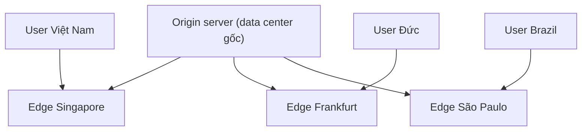

import { Callout } from "nextra/components";

# HTTP Caching & CDN

Latency giữa Việt Nam và một data center ở US East không thể nhỏ hơn ~180 ms — đó là giới hạn vật lý (Chương 2 đã nói). Cách duy nhất để trang tải nhanh cho người dùng khắp thế giới là **không phải bay tới data center gốc mỗi lần**. Hai kỹ thuật lồng nhau giải quyết chuyện đó: **HTTP caching** (client và các bên trung gian nhớ response cũ để tái dùng) và **CDN** (Content Delivery Network — mạng lưới server đặt gần người dùng, phục vụ response từ điểm gần nhất). Bài này giải thích cả hai theo cách một developer cần: header nào điều khiển gì, và design pattern nào tránh cache bug.

## Vì sao cần cache

Mỗi request có ba loại chi phí: **latency** (RTT từ client tới server), **bandwidth** (tải trên đường truyền và server), và **compute** (CPU/DB query để tạo response). Cache cắt gọn cả ba:

- Client giữ bản cũ ⇒ **0 network request**, latency ~0.
- Bên trung gian (CDN, reverse proxy) giữ bản cũ ⇒ chỉ ~10 ms tới CDN gần nhất, khỏi bay về origin.
- Origin server không phải render lại ⇒ CPU và DB được giảm tải.

Đổi lại, cache mang một rủi ro cổ điển: **stale data** (dữ liệu cũ). Người dùng có thể thấy version cũ khi bạn đã deploy version mới. Hầu hết bugs cache đều rơi vào một trong hai loại: **cache khi không nên** hoặc **không cache khi nên**.

## Bốn loại cache

Trước khi vào header, phải phân biệt **cache nằm ở đâu**:

- **Browser cache** (private cache): trong bộ nhớ/disk của browser một người dùng. Chỉ người đó dùng lại.
- **Shared cache** (còn gọi proxy cache hoặc CDN cache): dùng chung cho nhiều người dùng, nằm ở CDN, reverse proxy, hay corporate proxy.
- **Application cache**: cache trong code (Redis, Memcached, in-memory) — nằm ngoài phạm vi HTTP caching, không do header điều khiển.
- **Service worker cache**: chạy trong browser nhưng do JavaScript của trang điều khiển; dùng cho PWA offline. Cũng nằm ngoài phạm vi bài này.

Bài này nói về hai cái đầu, do server điều khiển qua HTTP header.

## Cache-Control — trung tâm điều khiển

**`Cache-Control`** là header response chính. Nó gồm một hoặc nhiều **directive** phân tách bằng dấu phẩy. Bảng dưới liệt kê các directive dev cần thuộc:

| Directive              | Ý nghĩa                                                                       |
| ---------------------- | ----------------------------------------------------------------------------- |
| `public`               | Cả browser lẫn shared cache được lưu.                                          |
| `private`              | Chỉ browser (private cache) được lưu; CDN/proxy không lưu.                     |
| `no-store`             | **Không lưu ở bất kỳ đâu**. Dùng cho dữ liệu nhạy cảm (bank statement, PII).   |
| `no-cache`             | Được lưu nhưng **phải validate lại với server** trước khi dùng (không phải "không cache" như tên gọi). |
| `max-age=N`            | Response tươi trong N giây; sau đó phải validate hoặc refetch.                  |
| `s-maxage=N`           | Như `max-age` nhưng chỉ áp cho **shared cache** (override `max-age` ở CDN).    |
| `immutable`            | Cam kết nội dung không đổi trong `max-age`; browser bỏ qua validation ngay cả khi user bấm reload. |
| `must-revalidate`      | Khi hết `max-age`, cache **bắt buộc** validate với origin (không dùng stale).  |
| `stale-while-revalidate=N` | Sau khi hết `max-age`, có thể phục vụ stale trong N giây và validate background. |

<Callout type="warning">
  **Bẫy tên gọi**: `no-cache` **không** có nghĩa "không cache". Nó có nghĩa "cache
  được, nhưng luôn hỏi server trước khi dùng". Muốn cấm cache hoàn toàn, dùng
  **`no-store`**.
</Callout>

Kết hợp thực tế cho từng loại response:

```text
# HTML động, ngắn hạn: cache riêng cho từng user, luôn kiểm tra lại
Cache-Control: private, no-cache

# API response người dùng phụ thuộc: không cache ở CDN
Cache-Control: private, max-age=60

# Tài nguyên tĩnh với hash trong tên (bundle.a3f2.js): cache mãi
Cache-Control: public, max-age=31536000, immutable

# Ảnh dùng chung không đổi mỗi ngày: cache 1 giờ ở CDN, browser 5 phút
Cache-Control: public, max-age=300, s-maxage=3600

# Dữ liệu tài chính nhạy cảm: cấm cache tuyệt đối
Cache-Control: no-store
```

## ETag và Last-Modified: validation

Hai header này cho phép cache **hỏi server "còn tươi không?"** mà không phải tải lại nội dung nếu không đổi.

**`ETag`** (Entity Tag — chuỗi định danh phiên bản của response, do server tính, có thể là hash hoặc số version) đi kèm với response. Lần sau khi cache muốn dùng lại, client gửi header **`If-None-Match: <ETag>`**; server so sánh, nếu chưa đổi thì trả về **`304 Not Modified`** (không kèm body) — tiết kiệm băng thông.

```text
# Lần đầu: server gửi kèm ETag
GET /avatar.jpg
    <- 200 OK
       ETag: "abc123"
       Cache-Control: max-age=3600
       Content-Length: 82341
       (nội dung ảnh)

# Sau khi hết max-age, client hỏi lại
GET /avatar.jpg
    If-None-Match: "abc123"
    <- 304 Not Modified
       ETag: "abc123"
       (không có body — dùng lại bản trong cache)

# Nếu ảnh đã đổi:
GET /avatar.jpg
    If-None-Match: "abc123"
    <- 200 OK
       ETag: "def456"
       Content-Length: 91024
       (nội dung mới)
```

**`Last-Modified`** hoạt động tương tự nhưng dùng timestamp thay vì hash: client gửi `If-Modified-Since: <date>`; nếu file không đổi từ đó thì server trả `304`. ETag chính xác hơn (một byte đổi là hash đổi) và ổn trong hệ thống phân tán (nhiều server có thể tính cùng hash).

## Vary — cache theo header nào

Đôi khi cùng một URL trả về nội dung khác nhau tùy header của request (ví dụ trang có phiên bản tiếng Việt và tiếng Anh dựa vào `Accept-Language`). Header **`Vary`** báo cho cache biết phải phân biệt bản cache theo trường nào:

```text
Vary: Accept-Language, Accept-Encoding
```

Với header này, CDN sẽ giữ hai bản: một cho request có `Accept-Language: vi`, một cho `Accept-Language: en`. Tương tự với `Accept-Encoding` để không gửi bản `gzip` cho client chỉ hiểu plaintext.

<Callout type="warning">
  Đừng `Vary` theo header có giá trị quá phong phú (như `User-Agent`, `Cookie`)
  vì mỗi giá trị khác nhau tạo một bản cache riêng, gần như phá tan hiệu quả
  cache. Nếu response phụ thuộc cookie, thường tốt hơn là `Cache-Control: private`
  hoặc `no-store`.
</Callout>

## CDN: đưa cache tới gần người dùng

**CDN** (Content Delivery Network — mạng lưới các server "edge" phân tán khắp thế giới, cache nội dung từ origin và phục vụ request tại điểm gần nhất) là mở rộng của khái niệm shared cache. Thay vì một cache đứng trước origin, CDN có hàng trăm điểm — mỗi request được chuyển tới edge server gần nhất địa lý qua **anycast** (một IP duy nhất được quảng bá từ nhiều địa điểm; routing tự đưa client tới điểm gần nhất theo BGP).



Ba việc CDN làm giúp bạn:

- **Cache tài nguyên tĩnh**: JS bundle, CSS, ảnh, font — miễn set `Cache-Control` đúng, CDN tự phục vụ hàng triệu request mà không đụng origin.
- **TLS termination gần user**: TLS handshake (đã học) mất ít nhất 1 RTT; RTT tới edge gần nhất nhỏ hơn nhiều so với tới origin.
- **DDoS/attack absorption**: CDN có băng thông và số điểm khổng lồ, hấp thụ được các đợt tấn công mà origin nhỏ không chịu nổi.

Đi kèm là các cơ chế:

- **Origin pull**: CDN chỉ tải nội dung từ origin khi có request đầu tiên (lazy), sau đó cache.
- **Purge/invalidation**: khi bạn deploy phiên bản mới, gọi API của CDN xóa cache của URL đó (thường trong vài giây).
- **Cache key**: CDN quyết định "hai request có cùng cache entry không" dựa trên URL + một số header (`Vary`). Đôi khi cấu hình sai làm mất hit rate.

## Cache-busting: pattern chuẩn cho asset tĩnh

Vì tài nguyên tĩnh (JS, CSS, ảnh) nên cache lâu, nhưng khi bạn deploy phiên bản mới thì cache lại thành vấn đề. Cách chuẩn: **đưa hash nội dung vào tên file**.

```html
<!-- Sai: cache lâu và deploy đổi nội dung file, người dùng thấy bản cũ -->
<script src="/app.js"></script>

<!-- Đúng: mỗi build sinh tên file khác nhau theo hash -->
<script src="/app.a3f2c891.js"></script>
```

Với pattern này:

```text
Cache-Control: public, max-age=31536000, immutable
```

Là an toàn — file `app.a3f2c891.js` **không bao giờ đổi nội dung**; khi build mới, tên file mới sẽ khác. Browser cache mãi mãi (immutable), CDN cũng vậy. HTML gốc thì cache ngắn hoặc `no-cache` để browser luôn lấy phiên bản mới sinh tên file mới.

Đây là pattern mọi bundler hiện đại (Webpack, Vite, esbuild) sinh tự động.

## Ví dụ thực tế: quan sát bằng curl

```bash
$ curl -I https://cdn.example.com/app.a3f2c891.js
HTTP/2 200
content-type: application/javascript
cache-control: public, max-age=31536000, immutable
etag: "a3f2c891"
age: 12432
cf-cache-status: HIT

$ curl -I -H 'If-None-Match: "a3f2c891"' https://cdn.example.com/app.a3f2c891.js
HTTP/2 304
etag: "a3f2c891"
```

Dòng `cf-cache-status: HIT` (Cloudflare) cho biết CDN phục vụ từ cache, không đụng origin. `age: 12432` = response đã ở trong cache 12 432 giây (~3.5 giờ). Lần thứ hai `If-None-Match` trả về `304`, cho phép browser tái dùng bản trong local cache mà không tải lại 500 KB JavaScript.

## Tóm tắt nhanh

- Cache tồn tại ở nhiều lớp: **private (browser)**, **shared (CDN/proxy)**, **application**, **service worker**.
- **`Cache-Control`** là trung tâm điều khiển; nhớ **`no-cache` = validate, `no-store` = không lưu**.
- **`ETag` + `If-None-Match`** cho phép validate không phải tải lại body; server trả **`304 Not Modified`** khi chưa đổi.
- **`Vary`** báo cache phân biệt bản theo header nào; đừng vary theo `Cookie`/`User-Agent`.
- **CDN** đưa cache tới gần user, giảm latency, giảm tải origin; dùng anycast + edge nodes toàn cầu.
- Pattern **cache-busting bằng hash trong tên file** + `immutable, max-age=1y` là chuẩn cho asset tĩnh.

## Bài tập

### Câu hỏi lý thuyết

1. Phân biệt `Cache-Control: no-cache` với `no-store`. Với một trang admin panel hiển thị dữ liệu người dùng, chọn cái nào và giải thích.
2. Vì sao pattern "hash trong tên file + `Cache-Control: immutable`" lại an toàn khi deploy phiên bản mới? Nếu ngược lại, bạn set `max-age=31536000` cho `app.js` (không có hash), điều gì có thể xảy ra?

### Bài tập tình huống

3. API của bạn trả về response cá nhân hóa (dữ liệu user hiện tại) tại endpoint `/api/me`. CDN đang cache endpoint này và người dùng A đôi khi thấy dữ liệu của người dùng B. Chẩn đoán nguyên nhân và đề xuất header response phù hợp.

### Thực hành

4. Chạy `curl -I https://www.google.com` và `curl -I https://<một-domain-của-bạn>/<asset-tĩnh>`. Đọc các header `cache-control`, `etag`, `age`, và header của CDN nếu có (`cf-cache-status`, `x-cache`, `x-served-by`). Với mỗi giá trị bạn thấy, giải thích ý nghĩa và tình huống bạn suy ra được về cache.

<details>
  <summary>Đáp án & gợi ý</summary>

1. **`no-cache`**: response **được lưu** trong cache nhưng luôn phải validate với server (qua `ETag`/`Last-Modified`) trước khi phục vụ; nếu server trả `304` thì dùng lại bản cache. **`no-store`**: **không lưu ở bất cứ đâu**, mọi request đều tải mới hoàn toàn. Với admin panel hiển thị dữ liệu người dùng: nếu dữ liệu **nhạy cảm cao** (bank statement, PII), dùng **`no-store`** để không tồn tại bản copy trong ổ đĩa browser/proxy nếu máy bị mất. Nếu dữ liệu chỉ **cá nhân hóa** nhưng không quá nhạy cảm, dùng **`private, no-cache`** hoặc **`private, max-age=0, must-revalidate`** — vẫn cache nhưng chỉ ở browser của chính user và luôn kiểm tra.

2. Vì file với hash trong tên (`app.a3f2c891.js`) **không bao giờ đổi nội dung** — nếu code đổi thì hash đổi, sinh ra tên file khác (`app.9d0e1f2.js`). Cache một file bất biến trong 1 năm là an toàn tuyệt đối; deploy mới chỉ cần cập nhật HTML để trỏ tới tên file mới. Nếu set `max-age=31536000` cho `app.js` **không có hash**: sau khi deploy đổi nội dung `app.js`, browser và CDN vẫn phục vụ bản cũ trong 1 năm — người dùng thấy version cũ, không có cách nào force cập nhật (trừ khi bạn purge CDN và người dùng hard-refresh).

3. Nguyên nhân: response cá nhân hóa **không có `Vary`** hoặc **không có `private`**, nên CDN coi mọi request tới `/api/me` là chung một cache entry và trả cùng một bản cho mọi user. Khắc phục: thêm header **`Cache-Control: private, no-store`** (an toàn nhất cho dữ liệu user) hoặc chí ít **`Cache-Control: private, max-age=60`** để CDN không lưu, chỉ browser của mỗi user cache. Nếu buộc phải cache ở CDN theo user, cấu hình cache key kèm token/user ID và **`Vary: Authorization`** — nhưng chấp nhận rằng hit rate sẽ rất thấp.

4. Đáp án tùy trang. Điểm cần đọc: **`cache-control`** cho biết chiến lược cache; **`etag`** cho biết version của response; **`age`** cho biết response đã trong cache bao lâu (0 = tươi từ origin, > 0 = phục vụ từ shared cache); **`cf-cache-status: HIT`** / **`x-cache: HIT from ...`** cho biết CDN phục vụ, không đụng origin — nếu `MISS`, request đã đi tới origin. Với trang tĩnh nổi tiếng như Google, thường thấy `age` cao và `HIT`, chứng tỏ CDN hoạt động hiệu quả.

</details>

## Nguồn tham khảo

- R. Fielding, M. Nottingham, J. Reschke (Eds.), _HTTP Caching_, RFC 9111, mục 5.2 (`Cache-Control`), mục 4.3 (validators như ETag), mục 4.1 (freshness).
- M. Nottingham, _Caching Tutorial for Web Authors and Webmasters_, tài liệu công khai giải thích các directive theo góc dev.
- MDN Web Docs, "HTTP caching" — reference thân thiện với ví dụ cho từng header.
