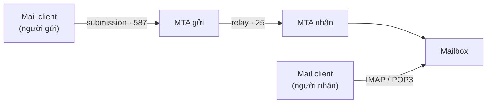
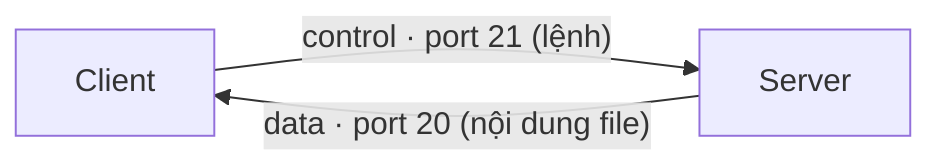

import { Callout } from "nextra/components";

# SMTP, FTP & SSH

Ngoài web, lập trình viên thường xuyên gặp ba application protocol kinh điển: **SMTP** để gửi email, **FTP** để truyền file, và **SSH** để truy cập máy từ xa một cách an toàn. Mỗi protocol chạy trên một port TCP cố định và giải quyết một bài toán riêng. Bài học này trình bày, cho từng protocol: mục đích, port hoạt động, một kịch bản thực tế của lập trình viên, kèm một phiên làm việc có input/output quan sát được.

## SMTP — gửi và chuyển email

**SMTP** (Simple Mail Transfer Protocol — protocol đẩy email từ người gửi tới server và giữa các mail server với nhau) lo phần **gửi đi**, không lo phần lấy thư về. Nó vận chuyển thư giữa các **MTA** (Mail Transfer Agent — phần mềm máy chủ chịu trách nhiệm nhận và chuyển tiếp email). Việc lấy thư từ hộp thư về máy người đọc là việc của IMAP hoặc POP3 — đó là các protocol khác chuyên cho việc đọc thư.

SMTP dùng hai port chính. **Port 25** dành cho **relay** (chuyển tiếp — luồng giữa hai MTA trên Internet). **Port 587** dành cho **submission** (nộp thư — khi mail client gửi thư lên server của mình, thường kèm xác thực và STARTTLS). Tách hai port giúp nhà mạng chặn spam trên port 25 mà không cản người dùng hợp lệ nộp thư qua 587.



**Kịch bản lập trình viên**: ứng dụng của bạn cần gửi email giao dịch (xác nhận đăng ký, đặt lại mật khẩu). Bạn cấu hình app trỏ tới một SMTP relay qua port `587` với username/password, và thư được đẩy đi. Quan sát một phiên SMTP thủ công:

```text
$ openssl s_client -connect smtp.example.com:587 -starttls smtp
220 smtp.example.com ESMTP ready
EHLO client.example.org
250-smtp.example.com Hello
250 AUTH LOGIN PLAIN
MAIL FROM:<alice@example.org>
250 2.1.0 Sender OK
RCPT TO:<bob@example.com>
250 2.1.5 Recipient OK
DATA
354 Start mail input; end with <CRLF>.<CRLF>
Subject: Xin chao

Noi dung thu.
.
250 2.0.0 Ok: queued as 9F3A1C
QUIT
221 2.0.0 Bye
```

Mỗi lệnh của client (`EHLO`, `MAIL FROM`, `RCPT TO`, `DATA`) được server đáp bằng một mã ba chữ số: `250` là OK, `354` mời nhập nội dung, `221` là đóng kết nối. Cấu trúc "lệnh dạng chữ + mã phản hồi số" này rất giống tinh thần status code của HTTP.

## FTP — truyền file

**FTP** (File Transfer Protocol — protocol truyền file giữa client và server qua hai kết nối tách biệt) là một trong những protocol lâu đời nhất còn dùng. Điểm đặc biệt là FTP tách làm hai kênh: một **control connection** (kênh điều khiển — nơi truyền lệnh và phản hồi) và một **data connection** (kênh dữ liệu — nơi truyền nội dung file thật).

Kênh điều khiển luôn ở **port 21**. Kênh dữ liệu ở **port 20** trong **active mode** (chế độ chủ động — server chủ động mở kết nối dữ liệu về client), hoặc ở một port tạm do server thông báo trong **passive mode** (chế độ bị động — client chủ động mở kết nối dữ liệu, thân thiện với firewall hơn).



<Callout type="warning">
  FTP gốc truyền cả mật khẩu lẫn dữ liệu dưới dạng plaintext, nên ngày nay nên
  dùng **SFTP** (truyền file qua kênh SSH) hoặc **FTPS** (FTP bọc trong TLS) thay
  cho FTP thuần khi đi qua mạng công cộng.
</Callout>

**Kịch bản lập trình viên**: bạn cần đẩy các file tĩnh đã build lên một web server dùng FTP. Quan sát một phiên FTP, để ý các mã phản hồi `220/331/230/226`:

```text
$ ftp ftp.example.com
Connected to ftp.example.com.
220 Welcome to Example FTP
Name: deploy
331 Password required for deploy
Password:
230 Login successful.
ftp> put index.html
200 PORT command successful
150 Opening data connection for index.html
226 Transfer complete (1256 bytes)
ftp> bye
221 Goodbye.
```

Lệnh `put index.html` mở kênh dữ liệu (`150 Opening data connection`) rồi truyền file; `226 Transfer complete` xác nhận xong. Toàn bộ lệnh đi trên kênh điều khiển port 21, còn nội dung file đi trên kênh dữ liệu riêng.

## SSH — truy cập từ xa an toàn

**SSH** (Secure Shell — protocol tạo kênh mã hóa để đăng nhập và chạy lệnh trên máy từ xa) ra đời để thay thế các công cụ cũ như Telnet vốn truyền mọi thứ dạng plaintext. Mọi dữ liệu qua SSH đều được mã hóa, và server tự chứng minh danh tính bằng một **host key** (khóa máy chủ — khóa công khai mà client ghi nhớ để phát hiện mạo danh ở các lần sau).

SSH chạy trên **port 22**. Ngoài đăng nhập shell, SSH còn là nền cho nhiều việc khác: **SCP/SFTP** để truyền file an toàn, **port forwarding** (chuyển tiếp cổng — tạo đường hầm mã hóa cho một dịch vụ khác đi xuyên qua SSH), và truy cập Git qua `git@`.

```bash
$ ssh deploy@server.example.com
The authenticity of host 'server.example.com (203.0.113.7)' can't be established.
ED25519 key fingerprint is SHA256:Zm9vYmFyMTIzNDU2Nzg5MA.
Are you sure you want to continue connecting (yes/no)? yes
Warning: Permanently added 'server.example.com' to the list of known hosts.
deploy@server.example.com's password:
Welcome to Ubuntu 22.04.3 LTS
Last login: Mon Jan 15 09:12:44 2024 from 198.51.100.5
deploy@server:~$ whoami
deploy
```

Lần đầu kết nối, client hỏi xác nhận **fingerprint** (dấu vân tay — bản rút gọn của host key) rồi lưu vào `known_hosts`; các lần sau nếu fingerprint đổi, SSH cảnh báo nguy cơ mạo danh. Sau khi xác thực, bạn có một shell từ xa đã mã hóa hoàn toàn.

<Callout type="info">
  Thực tế nên dùng **public key authentication** (xác thực bằng khóa công khai —
  đặt khóa công khai của bạn trên server, giữ khóa bí mật ở máy) thay cho mật
  khẩu. Đây cũng là cách `git push` qua SSH hoạt động mà không cần nhập mật khẩu.
</Callout>

**Kịch bản lập trình viên**: bạn cần truyền một file build lên server rồi đăng nhập kiểm tra log. Cả hai việc đi qua SSH trên port 22:

```bash
$ scp ./app.tar.gz deploy@server.example.com:/var/www/releases/
app.tar.gz                          100%   18MB   6.0MB/s   00:03
$ ssh deploy@server.example.com 'tail -n 2 /var/log/app.log'
2024-01-15 10:30:01 INFO  server started on :8080
2024-01-15 10:30:02 INFO  health check OK
```

## So sánh nhanh

| Protocol | Port                          | Mã hóa mặc định          | Mục đích chính               |
| -------- | ----------------------------- | ------------------------ | ---------------------------- |
| `SMTP`   | 25 (relay), 587 (submission)  | Không (thêm qua STARTTLS) | Gửi và chuyển tiếp email      |
| `FTP`    | 21 (control), 20 (data)       | Không (dùng FTPS/SFTP)    | Truyền file giữa client/server|
| `SSH`    | 22                            | Có (luôn mã hóa)          | Truy cập từ xa, tunnel, truyền file |

## Tóm tắt nhanh

- **SMTP** gửi/chuyển email; **port 25** cho relay giữa MTA, **port 587** cho submission có xác thực. Lấy thư về là việc của IMAP/POP3.
- **FTP** truyền file qua hai kênh: **control port 21** và **data port 20**; nên thay bằng SFTP/FTPS vì FTP thuần là plaintext.
- **SSH** (**port 22**) tạo kênh mã hóa cho shell từ xa, truyền file (SCP/SFTP), port forwarding và Git.
- Cả ba dùng mô hình "lệnh + mã phản hồi" (SMTP/FTP) hoặc kênh mã hóa (SSH); chọn đúng port là bước cấu hình cơ bản.

## Bài tập

### Câu hỏi lý thuyết

1. Với mỗi protocol SMTP, FTP và SSH: nêu mục đích chính và (các) port mặc định. Vì sao SMTP cần tới hai port 25 và 587 cho hai luồng khác nhau?
2. Vì sao FTP tách thành **control connection** và **data connection** riêng? Nêu một hệ quả thực tế của việc tách kênh này đối với cấu hình firewall.

### Tình huống thực tế

3. Bạn cần (a) gửi email xác nhận đăng ký từ ứng dụng, (b) đẩy file build lên server, và (c) đăng nhập server để xem log. Với mỗi việc, hãy chọn protocol và port phù hợp, và nêu một lý do bảo mật khi chọn.

### Thực hành (dùng `ssh`/`scp`)

4. Viết hai lệnh: một lệnh `scp` để chép file `report.pdf` từ máy bạn lên thư mục `/tmp` của `user@host`, và một lệnh `ssh` chạy trực tiếp `ls -l /tmp` trên `host` rồi thoát ngay. Cả hai dùng port nào?

<details>
  <summary>Đáp án & gợi ý</summary>

1. **SMTP** — gửi/chuyển email, port `25` (relay) và `587` (submission). **FTP** — truyền file, port `21` (control) và `20` (data). **SSH** — truy cập từ xa an toàn, port `22`. SMTP cần hai port vì hai luồng khác nhau: port 25 cho MTA chuyển thư cho nhau (hay bị nhà mạng chặn để chống spam), port 587 cho mail client nộp thư có xác thực — tách ra để chặn spam mà không cản người dùng hợp lệ.
2. FTP tách kênh để **lệnh và dữ liệu đi độc lập**: kênh điều khiển (port 21) giữ phiên và truyền lệnh, kênh dữ liệu truyền nội dung file. Hệ quả với firewall: kênh dữ liệu dùng port động (passive mode) nên firewall phải mở/để ý dải port phụ, đó là lý do passive mode thân thiện với firewall phía client hơn active mode.
3. (a) **SMTP** qua port `587` (submission có xác thực + STARTTLS để mã hóa thông tin đăng nhập). (b) **SSH/SCP** qua port `22` thay vì FTP, vì SSH mã hóa cả dữ liệu lẫn thông tin đăng nhập. (c) **SSH** qua port `22`, vì shell từ xa được mã hóa hoàn toàn, tránh lộ mật khẩu như Telnet.
4. `scp report.pdf user@host:/tmp/` và `ssh user@host 'ls -l /tmp'`. Cả hai dùng **port 22** (SSH), vì SCP truyền file bên trong kênh SSH.

</details>

## Nguồn tham khảo

- J. Klensin, _Simple Mail Transfer Protocol_, RFC 5321, mục 3 (mô hình gửi thư và các lệnh EHLO/MAIL/RCPT/DATA).
- J. Postel & J. Reynolds, _File Transfer Protocol_, RFC 959, mục 3 (control và data connection, active/passive).
- T. Ylonen & C. Lonvick, _The Secure Shell (SSH) Protocol Architecture_, RFC 4251, mục 4 (host key và xác thực server).
