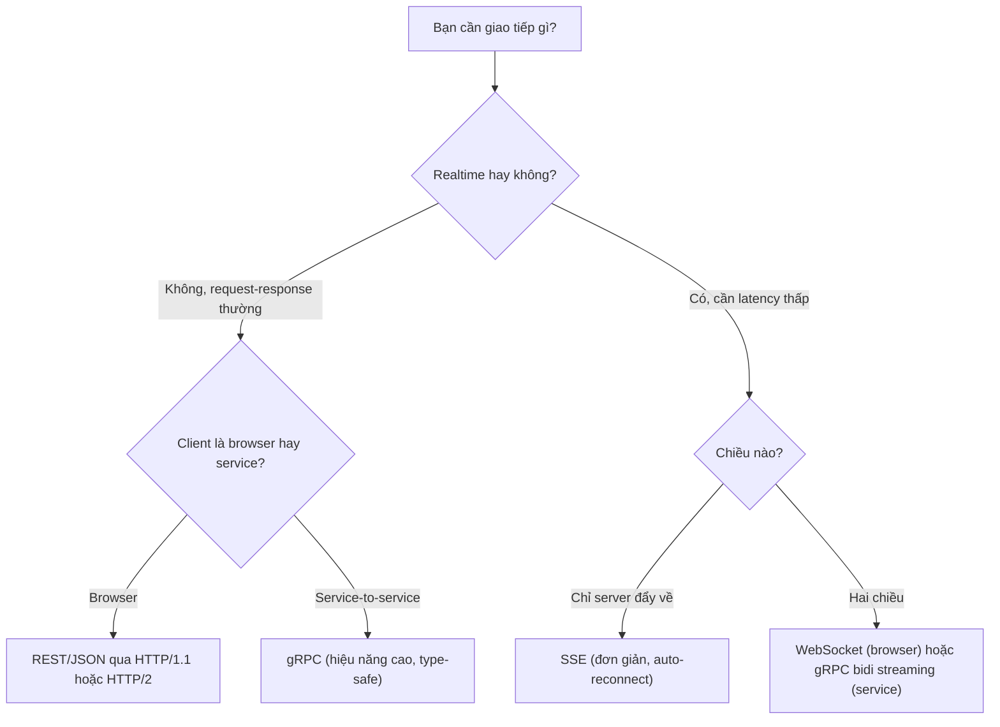

import { Callout } from "nextra/components";

# WebSocket, SSE & gRPC

Mô hình HTTP request-response mặc định là **client hỏi, server trả**: server không tự chủ động gửi gì khi client không hỏi. Nhưng nhiều ứng dụng thực tế cần chiều ngược lại — chat, thông báo, giá stock cập nhật liên tục, gaming — hoặc cần một cách giao tiếp có type-safety và hiệu quả hơn JSON qua HTTP thuần. Bài này giới thiệu ba giao thức tầng ứng dụng mà developer hay chạm: **WebSocket** cho hai chiều thời gian thực, **Server-Sent Events** cho một chiều server → client, và **gRPC** cho RPC hiệu năng cao giữa các service.

## WebSocket: kênh song hướng đầy đủ

**WebSocket** (RFC 6455, ra đời 2011) là một protocol tầng ứng dụng cung cấp **kênh giao tiếp full-duplex** (hai chiều đồng thời) trên một kết nối TCP duy nhất. Sau khi thiết lập, cả client và server đều có thể gửi thông điệp bất kỳ lúc nào mà không cần đối tác "hỏi" trước — đúng ngược lại với HTTP thuần.

Điều khôn khéo là WebSocket bắt đầu như một **HTTP upgrade**: client gửi một HTTP request thường với các header đặc biệt để "nâng cấp" kết nối lên WebSocket. Nhờ đó nó đi qua được firewall và proxy vốn đã hiểu HTTP.

```text
Client -> Server (HTTP upgrade request)
    GET /chat HTTP/1.1
    Host: example.com
    Upgrade: websocket
    Connection: Upgrade
    Sec-WebSocket-Key: dGhlIHNhbXBsZSBub25jZQ==
    Sec-WebSocket-Version: 13

Server -> Client (nếu chấp nhận nâng cấp)
    HTTP/1.1 101 Switching Protocols
    Upgrade: websocket
    Connection: Upgrade
    Sec-WebSocket-Accept: s3pPLMBiTxaQ9kYGzzhZRbK+xOo=

# Từ đây trở đi, kết nối TCP KHÔNG còn là HTTP.
# Cả hai bên gửi WebSocket frame qua lại tùy ý.
```

Từ code phía client trong browser, API rất gọn:

```javascript
const ws = new WebSocket("wss://example.com/chat");

ws.onopen = () => ws.send(JSON.stringify({ type: "hello" }));
ws.onmessage = (event) => console.log("Server said:", event.data);
ws.onclose = () => console.log("Kết nối đóng");
```

<Callout type="info">
  URL scheme là **`ws://`** (không mã hóa) hoặc **`wss://`** (WebSocket over TLS,
  bọc trong TLS như HTTPS). Luôn dùng `wss://` trong production — cùng lý do
  luôn dùng `https://`.
</Callout>

**Use case dev thường gặp**: chat, live cursor collaboration (Figma, Google Docs), thông báo real-time, dashboard trực tiếp, multiplayer game, và bất kỳ tình huống nào cần **latency thấp cho cả hai chiều**.

### Điểm cần cẩn thận

WebSocket đơn giản để bắt đầu nhưng cần lưu ý:

- **Không có retry tự động**. Nếu mạng chập chờn, kết nối chết là chết; ứng dụng phải tự reconnect + resume trạng thái.
- **Load balancer sticky**. Reverse proxy hoặc LB phải hiểu WebSocket và "sticky" cùng một client tới cùng một backend suốt phiên (vì trạng thái nằm ở server).
- **Scaling ngang**. Server dùng bộ nhớ cho mỗi kết nối; 100k kết nối đồng thời cần thiết kế cẩn thận (pool, tin nhắn qua message broker như Redis pub/sub).

## Server-Sent Events (SSE): một chiều, đơn giản, mạnh

**SSE** (Server-Sent Events, chuẩn hóa trong HTML spec) là một cách để **server đẩy dữ liệu về client qua HTTP** trên một response mở suốt phiên. Client gửi một GET thường, server trả về `Content-Type: text/event-stream` và **giữ kết nối mở**, gửi liên tiếp các "event" text mỗi khi có dữ liệu mới.

```text
Client -> Server
    GET /events HTTP/1.1
    Accept: text/event-stream

Server -> Client (kết nối MỞ SUỐT PHIÊN)
    HTTP/1.1 200 OK
    Content-Type: text/event-stream
    Cache-Control: no-cache

    data: {"user": "alice", "msg": "hello"}

    data: {"user": "bob", "msg": "hi"}

    event: price
    data: {"symbol": "BTC", "price": 68000}

    (server tiếp tục gửi khi có dữ liệu mới, không đóng kết nối)
```

Mỗi event là một hoặc vài dòng `field: value` kết thúc bằng một dòng trống. Trường phổ biến: `data` (nội dung), `event` (tên loại event), `id` (để reconnect biết dừng ở đâu), `retry` (báo client chờ bao lâu trước khi reconnect).

Từ code client trong browser:

```javascript
const es = new EventSource("/events");

es.onmessage = (e) => {
  const data = JSON.parse(e.data);
  console.log("New message:", data);
};

es.addEventListener("price", (e) => {
  const p = JSON.parse(e.data);
  console.log(`${p.symbol} = ${p.price}`);
});
```

Điểm mạnh của SSE mà WebSocket không có: **tự động reconnect** khi mất kết nối, và **event ID** giúp server biết client đã nhận đến đâu để gửi tiếp từ điểm đó — không cần code retry logic.

## WebSocket vs SSE: chọn cái nào?

| Tiêu chí                  | WebSocket                          | SSE                                     |
| ------------------------- | ---------------------------------- | --------------------------------------- |
| Chiều dữ liệu             | Hai chiều (full-duplex)            | Một chiều (server → client)             |
| Protocol nền              | Kênh TCP mới sau HTTP upgrade      | HTTP thường (`text/event-stream`)       |
| Kiểu dữ liệu              | Text + binary                      | Chỉ text (JSON qua chuỗi ổn)            |
| Auto-reconnect            | Không (phải tự code)               | Có sẵn (browser tự reconnect)           |
| Đi qua HTTP proxy/CORS    | Cần cấu hình đặc biệt              | Hoạt động như HTTP thường               |
| Support browser cũ        | Không có IE9-                      | Không có IE, nhưng modern browser đủ    |
| Overhead mỗi message      | Rất thấp (frame vài byte)          | Cao hơn (text với `data:` prefix)       |
| Use case tiêu biểu        | Chat, gaming, collab realtime      | Feed, notification, streaming logs      |

**Quy tắc chọn nhanh**: nếu chỉ cần server đẩy dữ liệu về (feed, notification, dashboard update), dùng **SSE** — đơn giản hơn và có auto-reconnect miễn phí. Nếu client cần gửi lệnh liên tục (chat, gaming, edit đồng thời), dùng **WebSocket**.

## gRPC: RPC hiệu năng cao qua HTTP/2

**gRPC** (do Google phát triển, "gRPC Remote Procedure Calls") là một framework RPC hiện đại chạy trên **HTTP/2** và mã hóa dữ liệu bằng **Protocol Buffers** (protobuf — định dạng nhị phân có schema, nhỏ và nhanh hơn JSON nhiều lần). Nó thay thế cho việc gọi API HTTP+JSON giữa các service, đặc biệt trong microservices và giao tiếp server-to-server.

Cấu trúc điển hình: bạn khai báo dịch vụ trong file `.proto`, compile ra code cho ngôn ngữ đang dùng, rồi gọi hàm như gọi thẳng trong process — client stub tự lo serialize, gửi qua HTTP/2, và deserialize response.

```protobuf
// user.proto — định nghĩa dịch vụ
syntax = "proto3";

service UserService {
  rpc GetUser (GetUserRequest) returns (User);
  rpc StreamUsers (StreamRequest) returns (stream User);
}

message GetUserRequest {
  string user_id = 1;
}

message User {
  string id = 1;
  string name = 2;
  string email = 3;
}
```

Compile bằng `protoc` cho Go, Node, Python, Java... và bạn có sẵn class client/server. Gọi từ client trông như một hàm thường:

```javascript
// Client Node.js
const client = new UserServiceClient("service.example.com:50051", credentials);

const user = await client.getUser({ userId: "123" });
console.log(user.name);
```

### Bốn kiểu gọi của gRPC

Nhờ HTTP/2 hỗ trợ multiplexing và streaming ở cả hai chiều, gRPC có bốn kiểu gọi:

| Kiểu                    | Client gửi          | Server trả          | Use case                             |
| ----------------------- | ------------------- | ------------------- | ------------------------------------ |
| **Unary**               | 1 request           | 1 response          | Gọi RPC thường (giống REST)          |
| **Server streaming**    | 1 request           | Stream nhiều response | Server đẩy feed, tương tự SSE       |
| **Client streaming**    | Stream nhiều request | 1 response         | Upload file, aggregate logs          |
| **Bidirectional streaming** | Stream request  | Stream response    | Chat, gaming, sync realtime          |

<Callout type="info">
  **gRPC vs REST/JSON**: gRPC nhanh hơn nhiều với payload nhỏ (protobuf compact,
  HTTP/2 header nén), có type-safety qua `.proto`, và code sinh tự động cho nhiều
  ngôn ngữ. Đổi lại, **khó debug bằng mắt** (không đọc được bằng `curl` thuần),
  cần công cụ như `grpcurl` hoặc BloomRPC, và **browser không gọi trực tiếp
  được** — cần **gRPC-Web** làm cầu (một biến thể dùng HTTP/1.1 hoặc HTTP/2 qua
  proxy như Envoy).
</Callout>

### Ví dụ với grpcurl

`grpcurl` là "cURL cho gRPC", cho phép test service từ dòng lệnh:

```bash
$ grpcurl -plaintext -d '{"user_id": "123"}' \
    service.example.com:50051 \
    user.UserService/GetUser

{
  "id": "123",
  "name": "Alice",
  "email": "alice@example.com"
}
```

Cờ `-plaintext` bỏ TLS (chỉ trong local dev), `-d` truyền payload JSON (grpcurl tự convert sang protobuf).

## Chọn công cụ nào cho use case nào

Đây là bảng ra quyết định thực dụng:



## Tóm tắt nhanh

- **WebSocket** (`ws://`/`wss://`): kênh **full-duplex** trên TCP, bắt đầu bằng HTTP upgrade. Không có auto-reconnect. Hợp cho chat, gaming, collab realtime.
- **SSE** (`text/event-stream`): server đẩy event một chiều qua HTTP thường; **auto-reconnect có sẵn**, event ID giúp resume. Hợp cho feed, notification, streaming logs.
- **gRPC**: RPC framework trên **HTTP/2 + protobuf**; bốn kiểu gọi (unary, server/client/bi-directional streaming); nhanh, type-safe, code-gen; browser cần **gRPC-Web** qua proxy.
- Quy tắc chọn: server-to-service → gRPC; server → browser một chiều → SSE; hai chiều realtime từ browser → WebSocket.

## Bài tập

### Câu hỏi lý thuyết

1. So sánh **WebSocket** và **SSE** trên bốn tiêu chí: chiều dữ liệu, protocol nền, auto-reconnect, và độ phức tạp triển khai. Với dashboard hiển thị giá stock đẩy về từ server, cái nào phù hợp hơn?
2. Vì sao gRPC bắt buộc chạy trên **HTTP/2** chứ không phải HTTP/1.1? Nêu ít nhất hai tính năng của HTTP/2 mà gRPC dựa vào.

### Bài tập tình huống

3. Bạn xây tính năng chat real-time giữa hai người trong browser. So sánh ba lựa chọn — polling HTTP (client hỏi mỗi 2s), SSE, WebSocket — trên hai tiêu chí: **latency** và **tải server**. Chọn cái nào và giải thích.

### Thực hành

4. Trong DevTools của browser, mở tab Network, chọn filter "WS" (WebSocket) và mở một trang có chat live (như Slack web, một trang trading, hoặc Discord web). Bấm vào kết nối WS, tab "Messages" cho thấy các frame gửi qua lại — hãy quan sát và mô tả kiểu dữ liệu (JSON text hay binary?) và tần suất message.

<details>
  <summary>Đáp án & gợi ý</summary>

1. **Chiều**: WebSocket hai chiều, SSE một chiều. **Protocol nền**: WebSocket là kênh TCP tự sau HTTP upgrade, SSE là HTTP response mở suốt. **Auto-reconnect**: SSE có sẵn, WebSocket không (phải tự code). **Độ phức tạp**: SSE đơn giản hơn (đi qua HTTP proxy như request thường), WebSocket cần LB hỗ trợ upgrade và sticky session. Dashboard chỉ nhận giá từ server → dùng **SSE**: không cần chiều ngược lại, auto-reconnect miễn phí, đi qua CDN/proxy dễ hơn.

2. gRPC bắt buộc HTTP/2 vì dựa vào: (a) **Multiplexing qua streams** để hỗ trợ **streaming** ở cả hai chiều mà không tốn nhiều kết nối; (b) **Binary framing** thay vì text để mang protobuf nhị phân hiệu quả; (c) **Header nén HPACK** giảm overhead cho các call ngắn liên tục. HTTP/1.1 nối tiếp, text-based, không có streaming đúng nghĩa — không phù hợp với mô hình RPC hiệu năng cao mà gRPC nhắm tới.

3. **Polling**: latency = khoảng thời gian giữa hai lần hỏi (2s → tin nhắn có thể trễ tới 2s); tải server = mỗi client 30 request/phút dù không có tin mới, cực lãng phí. **SSE**: latency thấp (server đẩy ngay); tải server ổn (một kết nối mở, gửi khi có tin) nhưng chỉ hỗ trợ chiều server → client, chat cần cả chiều ngược. **WebSocket**: latency thấp cả hai chiều, tải server thấp (không polling). **Chọn WebSocket** vì chat cần hai chiều realtime.

4. Đáp án tùy trang. Slack thường dùng WebSocket với message JSON text (`{"type": "message", ...}`); giao dịch tài chính có thể dùng binary. Tần suất từ vài giây một lần (Slack) đến vài chục message/giây (live trading). Điểm cần thấy: message rất nhỏ (thường vài trăm byte), khác hẳn kích thước một HTTP response tương tự — đây là lợi thế overhead thấp của WebSocket.

</details>

## Nguồn tham khảo

- I. Fette, A. Melnikov, _The WebSocket Protocol_, RFC 6455, mục 1.3 (Opening Handshake) và mục 5 (Data Framing).
- WHATWG, _HTML Living Standard_, section "Server-sent events" (spec chính thức của SSE và `EventSource` API).
- Google, _gRPC over HTTP2_, protocol design doc (mô tả mapping của gRPC lên HTTP/2 frame và streaming).
- Google, _Protocol Buffers Language Guide (proto3)_, tài liệu chính thức về `.proto` schema và encoding nhị phân.
