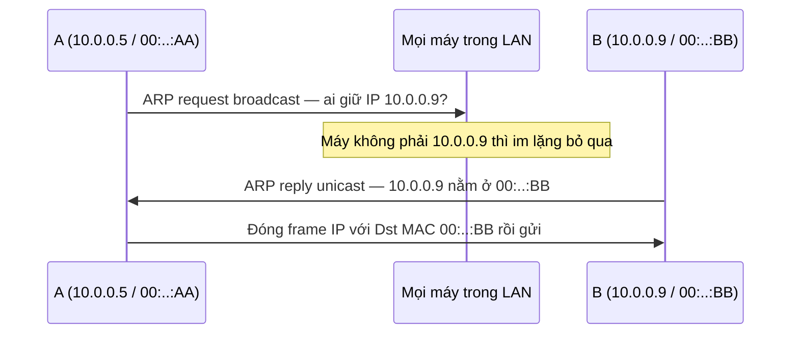
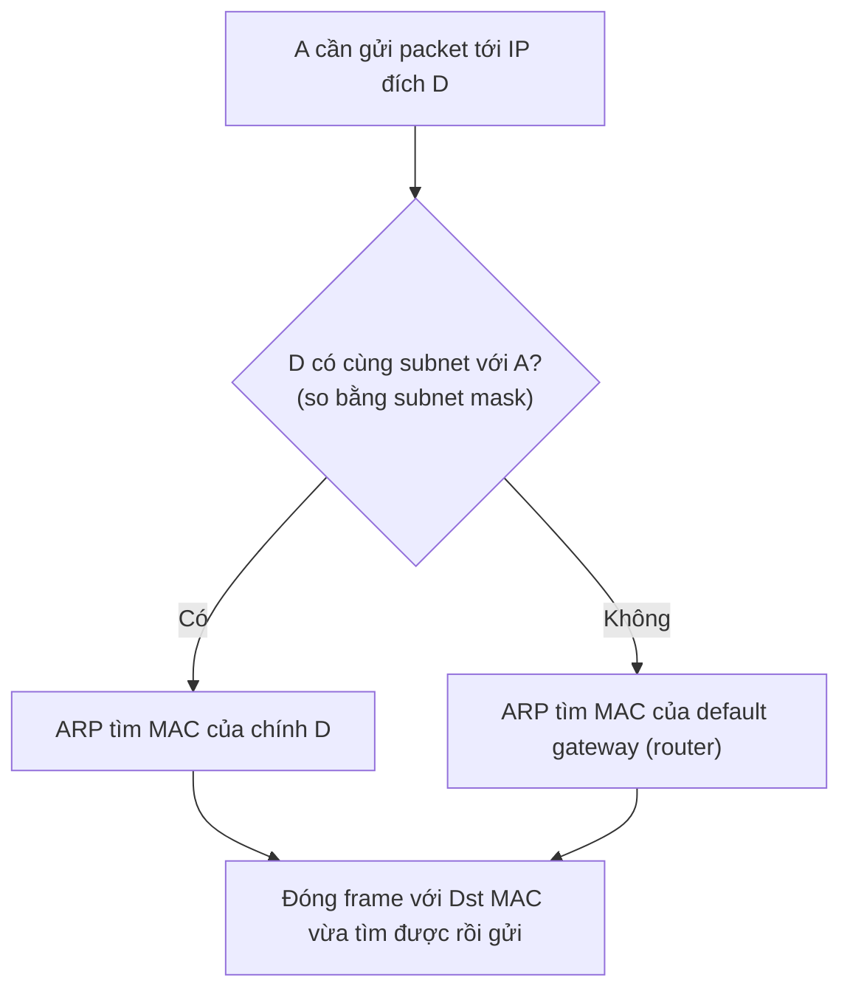

import { Callout } from "nextra/components";

# ARP: ánh xạ IP ↔ MAC

Bài trước cho thấy để gửi một frame Ethernet, máy gửi phải điền **Destination MAC** vào header. Nhưng ứng dụng và tầng Network chỉ biết **IP address** của đích, chứ không biết MAC của nó. Vậy làm sao lấp khoảng trống giữa "biết IP" và "cần MAC"? Đó chính là việc của **ARP** (Address Resolution Protocol — giao thức phân giải địa chỉ, dùng để tìm MAC address ứng với một IP address trong cùng một mạng cục bộ). Bài học này giải thích ARP hoạt động ra sao, bảng ARP cache là gì, và vì sao dev cần hiểu nó khi debug kết nối LAN.

## Vấn đề ARP giải quyết

Hãy hình dung máy A (IP `10.0.0.5`) muốn gửi dữ liệu tới máy B (IP `10.0.0.9`) trong cùng một LAN. Tầng Network đưa xuống một IP packet có đích `10.0.0.9`. Nhưng tầng Data Link cần đóng packet đó vào một frame Ethernet, mà frame lại đánh địa chỉ bằng **MAC**, không phải IP.

```text
Có sẵn (từ L3):   IP đích = 10.0.0.9
Cần để đóng frame: MAC đích = ??  <-- chỗ trống ARP phải lấp
```

ARP là cầu nối giữa hai lớp địa chỉ đã học ở bài **Framing & MAC address**: nó biến một **IP** (L3, logic) thành **MAC** (L2, vật lý) — nhưng chỉ trong phạm vi **một** mạng cục bộ.

<Callout type="info">
  **Ghi nhớ then chốt**: ARP chỉ hoạt động **trong cùng một broadcast domain**
  (cùng subnet). Nó không "hỏi xuyên router". Nếu đích nằm ở mạng khác, máy gửi
  không ARP tìm đích — mà ARP tìm MAC của **default gateway** (router). Phần
  dưới sẽ nói kỹ.
</Callout>

## Cách ARP hoạt động: request và reply

ARP dùng đúng cơ chế **broadcast** đã học ở bài trước. Quy trình gồm hai bước:

1. **ARP request** (broadcast): A hét ra toàn LAN "ai đang giữ IP `10.0.0.9`? Hãy trả lời cho tôi". Frame này có Destination MAC = `FF:FF:FF:FF:FF:FF` nên mọi máy trong LAN đều nhận.
2. **ARP reply** (unicast): chỉ máy B — máy thực sự có IP `10.0.0.9` — trả lời riêng cho A: "IP `10.0.0.9` nằm ở MAC `00:..:BB`". Các máy khác im lặng bỏ qua.



Sau khi có reply, A ghi cặp `10.0.0.9 → 00:..:BB` vào **bảng ARP** để lần sau khỏi hỏi lại, rồi mới đóng và gửi frame chở IP packet thật.

## ARP cache: nhớ để khỏi hỏi lại

Nếu mỗi packet đều phải broadcast hỏi ARP thì LAN sẽ ngập request. Vì vậy mỗi máy giữ một **ARP cache** (bộ nhớ đệm ARP — bảng ánh xạ IP → MAC đã học được, lưu tạm trong một khoảng thời gian). Trước khi gửi, máy tra cache trước; chỉ khi không có mới phát ARP request.

Các bản ghi trong cache **tự hết hạn** sau một khoảng (thường vài phút) rồi bị xóa. Điều này cho phép mạng thích nghi khi một IP được gán sang card mạng khác (ví dụ thay NIC, hoặc IP failover giữa hai server).

```text
$ ip neigh show            # Linux hiện đại
10.0.0.9   dev eth0 lladdr 00:1a:2b:3c:4d:5e REACHABLE
10.0.0.1   dev eth0 lladdr 3c:22:fb:00:11:22 STALE

$ arp -a                   # macOS / Windows / Linux cũ
? (10.0.0.9) at 00:1a:2b:3c:4d:5e on eth0
? (10.0.0.1) at 3c:22:fb:00:11:22 on eth0
```

Trạng thái như `REACHABLE`/`STALE` cho biết bản ghi còn "tươi" hay sắp cần xác minh lại. Khi debug "hai máy cùng LAN không ping được nhau", xem ARP cache là bước sớm: nếu không có bản ghi cho IP đích, nhiều khả năng ARP request không tới đích (sai VLAN, sai subnet mask, firewall L2, hoặc đích đang tắt).

## Khi đích ở ngoài LAN: ARP cho gateway

Đây là điểm dev hay hiểu sai. Giả sử A (`10.0.0.5/24`) muốn gọi một server Internet `93.184.216.34`. Địa chỉ này **không** cùng subnet với A, nên A **không** ARP tìm `93.184.216.34` (broadcast không đi xuyên router được). Thay vào đó:



Nghĩa là: với đích ngoài mạng, **IP đích trong packet vẫn là server xa** (`93.184.216.34`), nhưng **MAC đích trong frame là MAC của router**. Đây chính là minh họa sống động cho quy tắc ở bài trước: _IP giữ nguyên end-to-end, MAC thay ở mỗi hop_. Router nhận frame, bóc ra, rồi lại ARP cho hop kế tiếp của nó.

## Cấu trúc gói ARP (đủ dùng, không sa đà)

ARP message được chở thẳng trong payload của frame Ethernet với **EtherType `0x0806`** (chính là frame ví dụ bạn đã thấy ở bài **Ethernet & cấu trúc frame**). Với IPv4 trên Ethernet, message dài **28 byte**:

```text
+--------------------------+--------------------------+
| Hardware Type   = 1      | Protocol Type  = 0x0800  |  Ethernet / IPv4
+------------+-------------+--------------------------+
| HW len = 6 | Proto len=4 | Operation = 1(req)/2(rep)|
+------------+-------------+--------------------------+
| Sender MAC (6 byte)                                 |
| Sender IP  (4 byte)                                 |
| Target MAC (6 byte)   <- để trống (00..) trong req  |
| Target IP  (4 byte)                                 |
+-----------------------------------------------------+
                                     Tổng = 28 byte
```

Trong ARP request, **Target MAC** bỏ trống (toàn `0`) vì đó chính là thứ đang đi hỏi; máy trả lời sẽ điền MAC của mình vào ARP reply. Con số 28 byte này khớp với ví dụ ở bài trước: ARP dài 28 byte nên cần đệm thêm 18 byte để đạt payload tối thiểu 46 byte.

<Callout type="warning">
  **ARP không có xác thực**. Bất kỳ máy nào cũng có thể gửi ARP reply giả để
  nhận vơ "tôi là gateway", khiến nạn nhân gửi lưu lượng qua kẻ tấn công — đó là
  **ARP spoofing**, một dạng tấn công man-in-the-middle. Cơ chế phòng thủ
  (Dynamic ARP Inspection, DHCP snooping) được nói kỹ ở **Chương 7: Network
  Security**. Ở đây chỉ cần nhớ: ARP tin vào câu trả lời đầu tiên, nên nó dễ bị
  lợi dụng trong LAN.
</Callout>

## Gratuitous ARP

Đôi khi một máy tự phát một ARP **không ai hỏi** để thông báo "IP này giờ ứng với MAC của tôi" — gọi là **gratuitous ARP** (ARP tự nguyện). Hai công dụng thực tế mà dev hay gặp:

- **Phát hiện trùng IP**: khi mới lên mạng, máy gửi gratuitous ARP hỏi chính IP của mình; nếu có ai trả lời thì IP đang bị trùng.
- **Cập nhật nhanh sau failover**: khi một **virtual IP** chuyển từ server chính sang server dự phòng (HA, load balancer, `keepalived`/VRRP), server mới phát gratuitous ARP để mọi máy cập nhật cache trỏ IP đó về MAC mới — nhờ vậy dịch vụ khôi phục gần như tức thì.

## Ví dụ thực tế: theo dõi ARP trên máy bạn

```bash
# Xem cache hiện tại
$ ip neigh show                 # Linux
$ arp -a                        # macOS / Windows

# Xóa một bản ghi để buộc phân giải lại (Linux, cần quyền root)
$ sudo ip neigh del 10.0.0.9 dev eth0

# Bắt gói ARP để quan sát request/reply
$ sudo tcpdump -n -e arp
ARP, Request who-has 10.0.0.9 tell 10.0.0.5, length 28
ARP, Reply 10.0.0.9 is-at 00:1a:2b:3c:4d:5e, length 28
```

Dòng `who-has ... tell ...` chính là ARP request broadcast; `is-at` là reply unicast. Thấy `length 28` khớp đúng kích thước ARP message ở trên.

## Tóm tắt nhanh

- **ARP** phân giải **IP → MAC** trong cùng một mạng cục bộ, lấp khoảng trống giữa L3 (biết IP đích) và L2 (cần MAC đích để đóng frame).
- Quy trình: **ARP request** broadcast (`FF:FF:FF:FF:FF:FF`) hỏi "ai có IP này", **ARP reply** unicast trả về MAC tương ứng.
- Kết quả được lưu vào **ARP cache** và tự hết hạn sau vài phút; tra bằng `ip neigh` hoặc `arp -a`.
- Đích **ngoài subnet** ⇒ máy gửi ARP tìm MAC của **default gateway**, không phải MAC của đích xa; IP đích trong packet vẫn giữ nguyên.
- ARP message dài **28 byte** (IPv4/Ethernet), chở trong frame có **EtherType `0x0806`**.
- ARP **không xác thực** ⇒ dễ bị **ARP spoofing** (chi tiết ở Chương 7).

## Bài tập

### Câu hỏi lý thuyết

1. Vì sao **ARP request** phải là broadcast, còn **ARP reply** lại là unicast? Điều gì sẽ xảy ra nếu reply cũng broadcast?
2. Máy A `192.168.1.10/24` gửi dữ liệu tới `192.168.1.20` và tới `8.8.8.8`. Với mỗi đích, A sẽ ARP tìm MAC của **địa chỉ nào**? Giải thích dựa trên subnet.

### Bài tập tình huống

3. Bạn ping một máy cùng LAN nhưng thất bại. `ip neigh show` cho thấy bản ghi của IP đó ở trạng thái `FAILED` (không có MAC). Hãy nêu ít nhất hai nguyên nhân khả dĩ khiến ARP không phân giải được, và một lệnh giúp bạn quan sát trực tiếp ARP request có được trả lời hay không.

<details>
  <summary>Đáp án & gợi ý</summary>

1. Lúc phát **request**, máy gửi **chưa biết** MAC của đích nên buộc phải hỏi mọi máy — chỉ broadcast mới đảm bảo đúng máy đích cũng nhận được câu hỏi. Lúc **reply**, máy trả lời **đã biết** MAC của người hỏi (nó nằm ngay trong request, ở trường Sender MAC), nên gửi unicast là đủ và tiết kiệm. Nếu reply cũng broadcast thì mọi máy trong LAN đều phải xử lý một frame không liên quan, gây phí băng thông và tải CPU vô ích.

2. Tới `192.168.1.20`: cùng subnet `192.168.1.0/24` với A, nên A **ARP tìm MAC của chính `192.168.1.20`**. Tới `8.8.8.8`: khác subnet (không nằm trong `192.168.1.0/24`), nên A **ARP tìm MAC của default gateway**; IP đích trong packet vẫn là `8.8.8.8`, còn MAC đích của frame là MAC của router.

3. Nguyên nhân khả dĩ (nêu hai): đích đang tắt hoặc rớt mạng; hai máy không thực sự cùng broadcast domain (khác VLAN, hoặc subnet mask cấu hình sai khiến A tưởng đích ở mạng khác); firewall/port security chặn ở L2; đích trùng IP hoặc card lỗi. Lệnh quan sát trực tiếp: `sudo tcpdump -n -e arp` — nếu thấy `who-has` phát ra liên tục mà **không có** `is-at` đáp lại thì request không tới được đích hoặc đích không trả lời.

</details>

## Nguồn tham khảo

- D. C. Plummer, [RFC 826, _An Ethernet Address Resolution Protocol_](https://www.rfc-editor.org/rfc/rfc826).
- J. F. Kurose & K. W. Ross, _Computer Networking: A Top-Down Approach_, 8th ed., mục 6.4.1 (Link-Layer Addressing and ARP).
