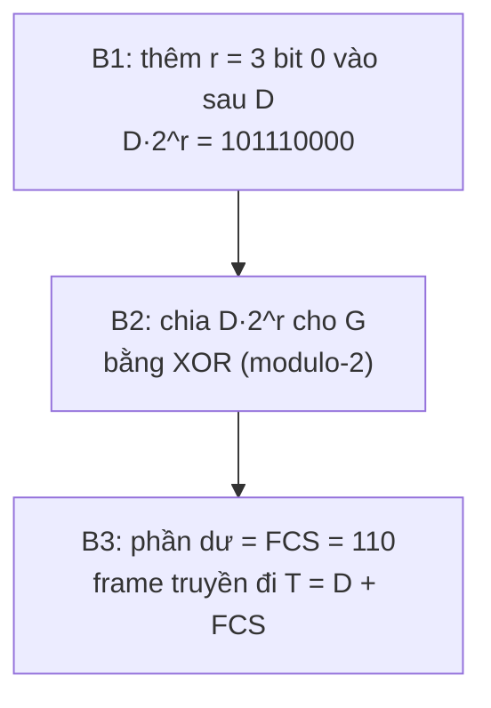

import { Callout } from "nextra/components";

# Phát hiện lỗi với CRC

Khi một frame chạy qua medium, nhiễu có thể lật một vài bit. Tầng Data Link cần một cách rẻ và hiệu quả để máy nhận biết frame có bị hỏng hay không. Kỹ thuật được dùng rộng rãi nhất là **CRC** (Cyclic Redundancy Check — kiểm dư vòng, một phương pháp phát hiện lỗi dựa trên phép chia đa thức nhị phân). Bài học này giải thích nguyên lý CRC và đi qua một ví dụ tính toán đầy đủ từng bước, cả ở phía gửi lẫn phía nhận.

## Ý tưởng: coi dữ liệu như một đa thức

CRC xem chuỗi bit như hệ số của một đa thức trên trường nhị phân. Hai bên thống nhất trước một **generator polynomial** (đa thức sinh — một chuỗi bit cố định, ký hiệu `G`, dùng làm số chia trong phép chia CRC). Sender chia dữ liệu cho `G` rồi gắn phần dư vào cuối frame; phần dư đó chính là **FCS** (Frame Check Sequence — chuỗi kiểm tra frame, là phần dư CRC đặt ở cuối frame).

Mọi phép cộng/trừ ở đây là **modulo-2**, tức phép **XOR** từng bit, không có nhớ (no carry/borrow). Nhờ vậy phép chia chỉ gồm các bước XOR đơn giản.

<Callout type="info">
  Nếu `G` có bậc `r` (tức dài `r + 1` bit), thì FCS dài đúng `r` bit. Ethernet
  thật dùng CRC-32 với `G` bậc 32, nên FCS dài 32 bit (4 byte). Ở đây ta dùng
  `G` nhỏ để tính tay cho dễ.
</Callout>

## Thiết lập bài toán

Ta chọn các giá trị nhỏ để tính bằng tay:

```text
Message  D = 101110            (6 bit)
Generator G = 1011             (4 bit, bậc r = 3)  <-> G(x) = x^3 + x + 1
```

Quy trình ở phía gửi gồm ba bước:



## Tính FCS bằng phép chia XOR (phía gửi)

Thêm `r = 3` bit `0` vào sau `D`, được số bị chia `101110000`. Thực hiện chia modulo-2 cho `G = 1011`: tại mỗi bước, nếu bit dẫn đầu hiện tại là `1` thì XOR với `G`, rồi dịch sang phải tới bit `1` kế tiếp.

```text
        1 0 1 1 1 0 0 0 0      <- D·2^3 = 101110 + 000
  XOR   1 0 1 1                <- G = 1011
        -----------------
        0 0 0 0 1 0 0 0 0      <- bit dẫn đầu kế tiếp ở vị trí thứ 5
  XOR           1 0 1 1        <- G = 1011
                -----------------
        0 0 0 0 0 0 1 1 0      <- chỉ còn 3 bit, dừng lại
                    ^ ^ ^
        remainder (FCS) = 110
```

Vậy **FCS = `110`**. Frame thật sự đặt lên dây là dữ liệu gốc nối với FCS:

```text
T = D + FCS = 101110 110  ->  101110110
```

## Máy nhận kiểm tra như thế nào

Máy nhận lấy **toàn bộ** `T` nhận được chia cho cùng `G`. Nếu phần dư bằng `0`, frame được coi là không lỗi; nếu khác `0`, chắc chắn có lỗi.

```text
Trường hợp KHÔNG lỗi: nhận T = 101110110

        1 0 1 1 1 0 1 1 0
  XOR   1 0 1 1
        -----------------
        0 0 0 0 1 0 1 1 0
  XOR           1 0 1 1
                -----------------
        0 0 0 0 0 0 0 0 0      remainder = 000  => không phát hiện lỗi
```

Bây giờ giả sử nhiễu lật một bit, biến `T` thành `101100110` (bit thứ 5 bị đổi):

```text
Trường hợp CÓ lỗi: nhận T' = 101100110

        1 0 1 1 0 0 1 1 0
  XOR   1 0 1 1
        -----------------
        0 0 0 0 0 0 1 1 0      remainder = 110  => khác 0, phát hiện lỗi!
```

Phần dư khác `0` báo cho máy nhận biết frame đã hỏng và cần loại bỏ.

<Callout type="warning">
  CRC chỉ **phát hiện** lỗi, không **sửa** lỗi. Khi phát hiện frame hỏng, tầng
  Data Link thường loại bỏ frame; việc gửi lại (nếu cần) do cơ chế ở tầng cao
  hơn đảm nhiệm.
</Callout>

## CRC mạnh tới đâu

Với generator polynomial chọn tốt, CRC phát hiện được: mọi lỗi 1 bit, mọi lỗi 2 bit, mọi lỗi số bit lẻ (nếu `G` có thừa số `x + 1`), và mọi **burst error** (chùm lỗi liên tiếp) có độ dài tối đa `r` bit. Đây là lý do các chuẩn như Ethernet chọn CRC-32 — đủ mạnh cho khung dữ liệu cỡ vài nghìn byte.

## Tóm tắt nhanh

- **CRC** phát hiện lỗi bằng phép chia đa thức nhị phân dùng **XOR** (modulo-2).
- Phía gửi: thêm `r` bit `0`, chia cho `G`, lấy phần dư làm **FCS**, gửi `T = D + FCS`.
- Phía nhận: chia `T` cho `G`; dư `0` ⇒ không lỗi, dư khác `0` ⇒ có lỗi.
- CRC chỉ phát hiện chứ không sửa lỗi; Ethernet dùng CRC-32 (FCS 4 byte).

## Bài tập

### Câu hỏi lý thuyết

1. Vì sao phần dư khác `0` ở phía nhận chứng tỏ frame có lỗi, còn dư bằng `0` thì frame được coi là hợp lệ? CRC có thể sửa lỗi không?

### Bài tập tính toán

2. Cho `D = 110101` và `G = 1011` (bậc `r = 3`). Hãy tính **FCS** và viết ra frame `T` được truyền đi. (Gợi ý: thêm 3 bit `0` rồi chia XOR như trong bài.)

### Bài tập áp dụng

3. Máy nhận nhận được `T = 110101111` và chia cho `G = 1011`, ra phần dư `000`. Máy nhận kết luận gì và làm gì tiếp theo?

<details>
  <summary>Đáp án & gợi ý</summary>

1. Vì `T = D·2^r + FCS` được xây dựng để chia hết cho `G`. Nếu không bit nào bị lật, phép chia ở máy nhận cho dư `0`. Một lỗi làm `T` thay đổi sẽ (gần như chắc chắn) khiến nó không còn chia hết, nên dư khác `0`. CRC **không sửa** được lỗi, chỉ phát hiện; muốn khôi phục phải gửi lại frame.

2. Thêm 3 bit `0`: `110101000`, chia cho `1011`:

   ```text
       1 1 0 1 0 1 0 0 0
   XOR 1 0 1 1
       -----------------
       0 1 1 0 0 1 0 0 0
   XOR   1 0 1 1
       -----------------
       0 0 1 1 1 1 0 0 0
   XOR     1 0 1 1
       -----------------
       0 0 0 1 0 0 0 0 0
   XOR       1 0 1 1
       -----------------
       0 0 0 0 0 1 1 0 0
   XOR           1 0 1 1
       -----------------
       0 0 0 0 0 0 1 1 1   remainder = 111
   ```

   Vậy **FCS = `111`**, frame truyền đi `T = 110101 111` ⇒ `110101111`.

3. Dư `000` nghĩa là **không phát hiện lỗi**: máy nhận coi frame hợp lệ, gỡ FCS ra và chuyển phần dữ liệu `110101` lên tầng trên xử lý.

</details>

## Nguồn tham khảo

- J. F. Kurose & K. W. Ross, _Computer Networking: A Top-Down Approach_, 8th ed., mục 6.2 (Error-Detection and -Correction Techniques).
- A. S. Tanenbaum & D. J. Wetherall, _Computer Networks_, 5th ed., mục 3.2.2 (Cyclic Redundancy Check).
- IEEE Std 802.3-2018, _IEEE Standard for Ethernet_, định nghĩa trường FCS dùng CRC-32.
