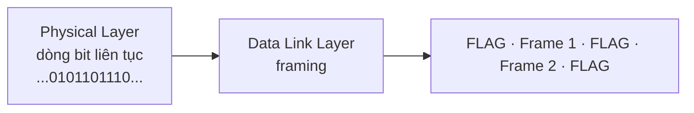

import { Callout } from "nextra/components";

# Framing & MAC address

Tầng Physical chỉ giao cho ta một dòng bit liên tục, không có dấu hiệu nào cho biết một thông điệp bắt đầu và kết thúc ở đâu. Tầng Data Link giải quyết hai việc nền tảng: gom dòng bit đó thành các **frame** (khung — đơn vị dữ liệu của Layer 2, có ranh giới rõ ràng, địa chỉ và trường kiểm lỗi) qua kỹ thuật **framing**, và gắn cho mỗi card mạng một **MAC address** để các frame biết đi tới đâu trên cùng một liên kết. Bài học này lần lượt giải thích cả hai.

## Framing là gì và vì sao cần nó

**Framing** (đóng khung — quá trình phân định ranh giới đầu/cuối của mỗi frame trong dòng bit) là bước đầu tiên của tầng Data Link. Nếu không có nó, máy nhận không thể biết 8 bit nào hợp thành một byte có nghĩa, hay đâu là điểm bắt đầu của một frame mới.

Vấn đề cốt lõi: máy nhận cần một cách đáng tin cậy để nhận ra ranh giới frame, ngay cả khi chính dữ liệu bên trong có thể chứa các bit trông giống ký hiệu ranh giới. Có vài cách tiếp cận, và hai cách phổ biến nhất là dùng ký hiệu phân định kèm "nhồi" thêm bit/byte để tránh nhầm lẫn.



### Byte stuffing (nhồi byte)

Một số protocol (ví dụ **PPP** — Point-to-Point Protocol) dùng một **flag byte** (byte cờ — một giá trị byte đặc biệt đánh dấu ranh giới frame, ví dụ `0x7E`) đặt ở đầu và cuối mỗi frame. Vấn đề nảy sinh khi chính dữ liệu chứa byte `0x7E`: máy nhận sẽ tưởng nhầm là kết thúc frame.

Giải pháp là **byte stuffing** (nhồi byte — chèn một byte thoát phía trước mọi byte dữ liệu trùng với cờ hoặc với chính byte thoát): mỗi khi byte `0x7E` (flag) hoặc `0x7D` (escape) xuất hiện trong dữ liệu, sender chèn một **escape byte** `0x7D` đứng trước nó. Máy nhận thấy `0x7D` thì bỏ nó đi và hiểu byte ngay sau là dữ liệu thật, không phải ranh giới.

```text
Dữ liệu gốc (hex):     41  7E  42  7D  43
Sau byte stuffing:     41  7D 7E  42  7D 7D  43
Đóng cờ để truyền:     7E | 41 7D 7E 42 7D 7D 43 | 7E
```

### Bit stuffing (nhồi bit)

Ở mức bit, chuẩn **HDLC** dùng mẫu cờ `01111110` (sáu bit `1` liên tiếp giữa hai bit `0`). Để mẫu này không bao giờ xuất hiện tình cờ trong dữ liệu, sender áp dụng **bit stuffing** (nhồi bit — cứ sau mỗi 5 bit `1` liên tiếp trong dữ liệu thì chèn thêm một bit `0`).

Quan sát đầu vào và đầu ra cụ thể:

```text
Dữ liệu gốc:        1 1 1 1 1 1 0 1
                    └─ 5 bit 1 ─┘↑ chèn 0 ngay sau bit 1 thứ 5
Sau bit stuffing:   1 1 1 1 1 0 1 0 1
```

Nhờ vậy dòng dữ liệu không bao giờ có 6 bit `1` liên tiếp, nên cờ `01111110` luôn được nhận ra chính xác. Máy nhận làm ngược lại: hễ thấy 5 bit `1` rồi tới một bit `0`, nó gỡ bit `0` đó ra để khôi phục dữ liệu gốc.

## MAC address: định dạng 48-bit

**MAC address** (Media Access Control address — địa chỉ vật lý 48-bit gắn cứng cho mỗi giao diện mạng, dùng để định danh trong phạm vi một liên kết Layer 2) là cách tầng Data Link gọi tên các thiết bị. Mỗi **NIC** (Network Interface Card — card giao tiếp mạng) thường mang một MAC address do nhà sản xuất gán.

Một MAC address dài 48 bit = 6 byte, thường viết dưới dạng 12 chữ số hex chia thành 6 cặp. Ví dụ: `00:1A:2B:3C:4D:5E`. 48 bit được chia làm hai nửa:

```text
MAC: 00:1A:2B:3C:4D:5E      (48 bit = 6 byte = 12 hex)

  00:1A:2B   ->  OUI   (24 bit cao,  do IEEE cấp cho nhà sản xuất)
  3C:4D:5E   ->  NIC   (24 bit thấp, số hiệu thiết bị do hãng tự gán)
```

Nửa đầu là **OUI** (Organizationally Unique Identifier — 24 bit đầu do IEEE cấp, định danh nhà sản xuất). Nửa sau (24 bit) do chính nhà sản xuất gán cho từng thiết bị, đảm bảo mỗi MAC address là duy nhất trên toàn cầu.

<Callout type="info">
  24 bit OUI cho phép khoảng 16,7 triệu nhà sản xuất; 24 bit còn lại cho mỗi
  hãng khoảng 16,7 triệu địa chỉ thiết bị. Tra OUI sẽ biết được hãng sản xuất
  card mạng, rất hữu ích khi phân tích traffic.
</Callout>

## Unicast, multicast và broadcast

Bit thấp nhất (LSB) của **byte đầu tiên** quyết định frame gửi cho một hay nhiều đích — gọi là **I/G bit** (Individual/Group bit). Bit kế tiếp là **U/L bit** (Universal/Local) cho biết địa chỉ là toàn cục hay được gán cục bộ.

```text
Byte đầu = 0x00 = 0 0 0 0 0 0 0 0
                                 │ └ I/G bit = 0  -> unicast (gửi 1 đích)
                                 └── U/L bit = 0  -> địa chỉ toàn cục (global)
```

- **unicast** (đơn hướng — frame gửi tới đúng một giao diện đích): I/G bit = `0`.
- **multicast** (đa hướng — frame gửi tới một nhóm giao diện đã đăng ký): I/G bit = `1`.
- **broadcast** (quảng bá — frame gửi tới mọi giao diện trong cùng broadcast domain): địa chỉ toàn bit `1`, tức `FF:FF:FF:FF:FF:FF`.

Ví dụ cụ thể, phân loại 3 địa chỉ bằng cách đọc byte đầu:

| MAC address           | Byte đầu (nhị phân) | I/G bit | Loại      |
| --------------------- | ------------------- | ------- | --------- |
| `00:1A:2B:3C:4D:5E`   | `0000 0000`         | 0       | unicast   |
| `01:00:5E:0A:0B:0C`   | `0000 0001`         | 1       | multicast |
| `FF:FF:FF:FF:FF:FF`   | `1111 1111`         | 1       | broadcast |

## Mục đích của MAC addressing

MAC address phục vụ việc giao frame **trong phạm vi một liên kết** (hop-to-hop), khác với IP address lo việc đi xuyên nhiều mạng (end-to-end). Khi một frame chạy trên một mạng LAN, switch dùng MAC đích để quyết định đẩy frame ra cổng nào (xem bài **Switching & VLAN**). Vì MAC chỉ có ý nghĩa nội bộ một chặng, nó được thay mới ở mỗi router trên đường đi, trong khi IP nguồn/đích giữ nguyên.

## Tóm tắt nhanh

- **Framing** phân định ranh giới frame trong dòng bit; **byte stuffing** và **bit stuffing** tránh việc dữ liệu bị nhầm thành ký hiệu ranh giới.
- **MAC address** dài 48 bit = 6 byte, viết bằng 12 hex; gồm **OUI** (24 bit, IEEE cấp) + 24 bit thiết bị.
- **I/G bit** (LSB của byte đầu) phân biệt unicast (`0`) với multicast (`1`); **broadcast** là `FF:FF:FF:FF:FF:FF`.
- MAC address định danh ở phạm vi một liên kết (hop-to-hop), được thay mới qua mỗi router.

## Bài tập

### Câu hỏi lý thuyết

1. Giải thích vì sao tầng Data Link cần framing. Nêu sự khác nhau cơ bản giữa byte stuffing và bit stuffing.
2. Cho MAC address `01:80:C2:00:00:0E`. Đây là unicast, multicast hay broadcast? OUI của nó là phần nào?

### Bài tập tính toán

3. Áp dụng bit stuffing (chèn một bit `0` sau mỗi 5 bit `1` liên tiếp) cho chuỗi dữ liệu sau và viết ra kết quả truyền đi:

   ```text
   0111111001111110
   ```

<details>
  <summary>Đáp án & gợi ý</summary>

1. Cần framing vì Physical Layer chỉ giao một dòng bit liên tục, không có mốc nào cho biết frame bắt đầu/kết thúc; framing tạo ranh giới để máy nhận tách đúng từng frame. Khác biệt: **byte stuffing** làm việc ở mức byte (chèn escape byte `0x7D` trước byte trùng cờ/escape), còn **bit stuffing** làm ở mức bit (chèn bit `0` sau 5 bit `1` liên tiếp).
2. Byte đầu `0x01` = `0000 0001`, LSB (I/G bit) = `1` ⇒ đây là **multicast** (cụ thể là một địa chỉ multicast chuẩn của IEEE). **OUI** là 24 bit đầu: `01:80:C2`.
3. Mỗi chuỗi gốc có hai cụm sáu bit `1`; sau cụm 5 bit `1` đầu tiên của mỗi cụm, chèn một bit `0`:

   ```text
   Gốc:  0 111111 00 111111 0
   Ra:   0 11111 0 1 00 11111 0 1 0
       = 011111010011111010
   ```

</details>

## Nguồn tham khảo

- J. F. Kurose & K. W. Ross, _Computer Networking: A Top-Down Approach_, 8th ed., mục 6.1 và 6.4 (Link layer, Link-Layer Addressing and ARP).
- A. S. Tanenbaum & D. J. Wetherall, _Computer Networks_, 5th ed., mục 3.1 (Framing — byte/bit stuffing).
- IEEE Std 802-2014, _IEEE Standard for Local and Metropolitan Area Networks: Overview and Architecture_, phần định dạng địa chỉ 48-bit và OUI.
