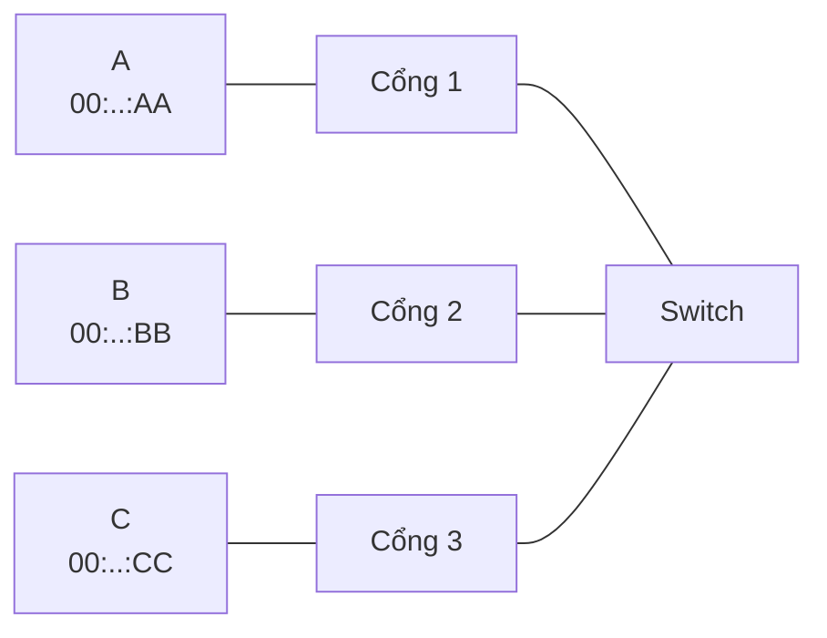
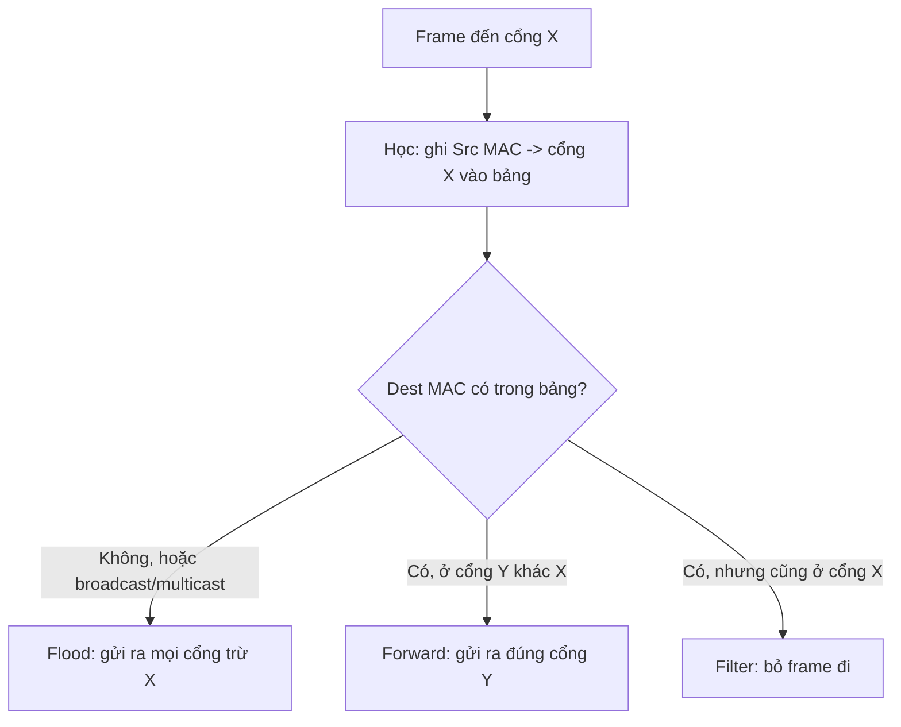

import { Callout } from "nextra/components";

# Switching & VLAN

Khi đã có frame và MAC address, câu hỏi cuối của tầng Data Link là: làm sao đưa một frame tới đúng máy đích trong mạng LAN mà không làm ngập mọi cổng? Đó là việc của **switch** (bộ chuyển mạch — thiết bị Layer 2 chuyển frame giữa các cổng dựa trên MAC address). Bài học này giải thích cách switch học địa chỉ, ra quyết định chuyển frame, khái niệm broadcast domain, và cách **VLAN** chia tách mạng một cách logic.

## MAC address table và quá trình học

Switch ra quyết định dựa trên **MAC address table** (bảng địa chỉ MAC, còn gọi CAM table — ánh xạ mỗi MAC address tới cổng vật lý mà nó được nhìn thấy). Bảng này không được cấu hình thủ công mà switch tự **học** (learning): mỗi khi một frame đến, switch đọc **Source MAC** của frame và ghi nhớ "MAC này nằm ở cổng vừa nhận được".

Xét một switch nối ba máy A, B, C ở cổng 1, 2, 3:



Ban đầu bảng rỗng. A gửi một frame tới B. Switch học được vị trí của A, nhưng chưa biết B ở đâu nên phải flood. Khi B trả lời, switch học tiếp vị trí của B:

```text
Bảng MAC ban đầu (rỗng)        Sau khi A->B (flood) rồi B->A (reply)
+-------------+------+         +-------------------+------+
| MAC         | Port |         | MAC               | Port |
+-------------+------+   ==>   +-------------------+------+
| (chưa có)   |      |         | 00:..:AA          |  1   |
+-------------+------+         | 00:..:BB          |  2   |
                              +-------------------+------+
```

Từ lúc này, frame giữa A và B được chuyển thẳng tới đúng cổng, không còn làm phiền cổng 3.

## Quyết định chuyển frame: forward, flood, filter

Với mỗi frame đến cổng `X`, switch luôn học Source MAC trước, rồi tra Destination MAC để quyết một trong ba hành động:



- **forward** (chuyển tiếp — gửi frame ra đúng cổng đích): khi Dest MAC đã có trong bảng và nằm ở cổng khác cổng nhận.
- **flood** (làm ngập — gửi frame ra mọi cổng trừ cổng nhận): khi Dest MAC chưa có trong bảng, hoặc là broadcast/multicast.
- **filter** (lọc bỏ — không chuyển frame): khi Dest MAC nằm ngay trên cổng vừa nhận, nghĩa là không cần đi đâu cả.

## Broadcast domain

**broadcast domain** (miền quảng bá — tập hợp các thiết bị mà một frame broadcast có thể tới được) mặc định gồm toàn bộ các cổng của một switch (và các switch nối với nhau). Khi một frame broadcast (`FF:FF:FF:FF:FF:FF`) đến, switch flood ra mọi cổng, nên broadcast lan khắp domain.

<Callout type="info">
  Switch chia **collision domain** (miền đụng độ — mỗi cổng là một miền riêng nhờ
  full-duplex), nhưng **không** chia broadcast domain. Muốn chia broadcast domain
  cần đến router hoặc VLAN.
</Callout>

## VLAN: chia broadcast domain một cách logic

**VLAN** (Virtual LAN — mạng LAN ảo, cho phép chia một switch vật lý thành nhiều broadcast domain độc lập về mặt logic) giải quyết đúng vấn đề trên. Hai máy cắm chung một switch nhưng thuộc hai VLAN khác nhau sẽ không thấy broadcast của nhau, như thể chúng ở hai mạng riêng.

Để phân biệt frame thuộc VLAN nào khi đi giữa các switch, chuẩn **IEEE 802.1Q** chèn một **tag** 4 byte vào ngay sau Source MAC:

```text
... Src MAC | TPID = 0x8100 | TCI (PCP/DEI/VID) | Type/Len | Payload ...
              2 byte           2 byte
  - TPID 0x8100 báo "đây là frame có VLAN tag"
  - VID (VLAN ID) dài 12 bit -> 4096 giá trị, dùng được 4094 VLAN
```

### Access port và trunk port

Một cổng switch được cấu hình theo một trong hai chế độ:

- **access port** (cổng truy nhập — chỉ thuộc một VLAN, trao đổi frame **không tag** với thiết bị đầu cuối): dùng để nối PC, máy in, server.
- **trunk port** (cổng trung kế — chở nhiều VLAN cùng lúc, gắn **tag** 802.1Q để phân biệt): dùng để nối switch với switch hoặc switch với router.

Ví dụ cấu hình (kiểu Cisco IOS) đặt cổng 1 vào VLAN 10 dạng access, còn cổng 24 làm trunk chở VLAN 10 và 20:

```text
interface GigabitEthernet0/1
 switchport mode access
 switchport access vlan 10
!
interface GigabitEthernet0/24
 switchport mode trunk
 switchport trunk allowed vlan 10,20
```

Trên trunk có thể có một **native VLAN** (VLAN gốc — VLAN mà frame của nó đi qua trunk mà không cần tag); mọi VLAN còn lại đều được gắn tag.

## Tóm tắt nhanh

- Switch tự **học** MAC address từ Source MAC của frame, lưu vào **MAC address table** ánh xạ MAC ⇒ cổng.
- Ba quyết định: **forward** (đích đã biết, cổng khác), **flood** (đích chưa biết hoặc broadcast), **filter** (đích cùng cổng nhận).
- Switch chia collision domain nhưng không chia **broadcast domain**; cần VLAN hoặc router để chia.
- **VLAN** dùng tag **802.1Q** 4 byte (VID 12 bit); **access port** chở 1 VLAN không tag, **trunk port** chở nhiều VLAN có tag.

## Bài tập

### Câu hỏi lý thuyết

1. Phân biệt ba quyết định forward, flood và filter của switch. Với mỗi loại, nêu điều kiện khiến switch chọn nó.

### Bài tập áp dụng

2. Bảng MAC của switch đang là `00:..:AA -> cổng 1` và `00:..:BB -> cổng 2`. Máy C ở cổng 3 gửi một frame tới `00:..:AA`. Hãy mô tả switch học gì và chuyển frame ra cổng nào. Sau đó nếu A gửi trả lời cho C thì switch làm gì?

### Bài tập tính toán

3. Trường VID trong tag 802.1Q dài 12 bit. Tính tổng số giá trị VLAN biểu diễn được, và số VLAN thực sự dùng được (biết hai giá trị bị dành riêng).

<details>
  <summary>Đáp án & gợi ý</summary>

1. **forward**: Dest MAC có trong bảng và ở cổng khác cổng nhận ⇒ gửi ra đúng cổng đó. **flood**: Dest MAC chưa có trong bảng, hoặc là broadcast/multicast ⇒ gửi ra mọi cổng trừ cổng nhận. **filter**: Dest MAC nằm ngay trên cổng vừa nhận ⇒ bỏ frame vì không cần chuyển đi đâu.
2. Switch đọc Source MAC của C và học `00:..:CC -> cổng 3`. Dest `00:..:AA` đã có ở cổng 1 nên switch **forward** frame ra duy nhất cổng 1. Khi A trả lời cho C: Dest `00:..:CC` giờ đã có trong bảng (cổng 3) nên switch lại **forward** thẳng ra cổng 3, không flood.
3. 12 bit ⇒ `2^12 = 4096` giá trị. Hai giá trị `0` và `4095` bị dành riêng, nên dùng được `4096 − 2 = 4094` VLAN.

</details>

## Nguồn tham khảo

- IEEE Std 802.1Q-2018, _IEEE Standard for Local and Metropolitan Area Networks — Bridges and Bridged Networks_, phần định dạng VLAN tag và phân loại cổng.
- J. F. Kurose & K. W. Ross, _Computer Networking: A Top-Down Approach_, 8th ed., mục 6.4.3 và 6.4.4 (Link-Layer Switches, VLANs).
