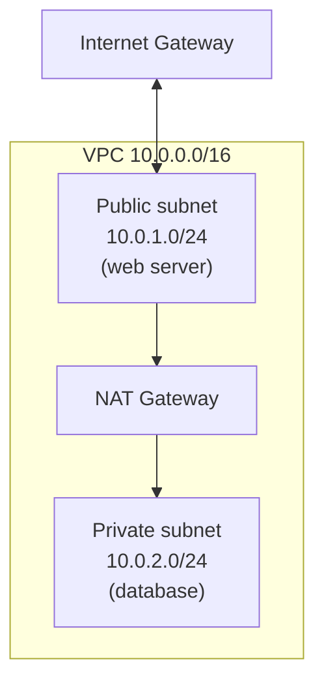
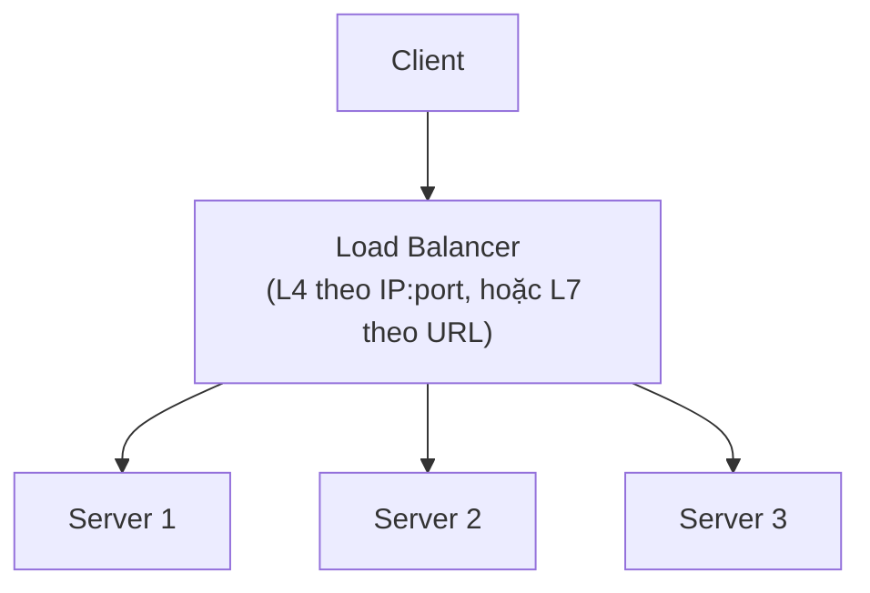

import { Callout, Tabs } from "nextra/components";

# Cloud Networking

Khi bạn dựng hạ tầng trên cloud, bạn không còn cắm dây hay cấu hình switch vật lý — bạn **khai báo** mạng bằng phần mềm. Nhưng các khối nền tảng vẫn là những khái niệm đã học: một mạng riêng, các subnet, luật lọc lưu lượng, và bộ chia tải. Bài học này trình bày bốn khối cốt lõi của cloud networking — **VPC**, **subnet**, **security group**, **load balancer** — theo cách provider-agnostic (không gắn với một nhà cung cấp cụ thể), rồi ánh xạ sang thuật ngữ của AWS, GCP và Azure.

## VPC: mạng riêng trong cloud

**VPC** (Virtual Private Cloud — một mạng ảo riêng, cô lập về mặt logic dành cho tài nguyên của bạn bên trong hạ tầng dùng chung của nhà cung cấp). Khi tạo VPC, việc đầu tiên bạn làm là chọn một dải địa chỉ dạng **CIDR**, ví dụ `10.0.0.0/16`.

Đây chính là kiến thức từ **Chương 4 — bài "Địa chỉ IPv4"**: cùng một ký hiệu CIDR, cùng cách chia phần network và phần host. Khác biệt duy nhất là dải này áp lên một mạng **ảo** do phần mềm dựng ra, không phải một mạng vật lý có dây.

<Callout type="info">
  VPC mở rộng khái niệm "một mạng LAN/WAN riêng" của **Chương 1** sang môi trường
  cloud: thay vì mua thiết bị và kéo cáp, bạn định nghĩa toàn bộ mạng bằng một
  dải CIDR và vài lệnh API.
</Callout>

## Subnet: chia VPC như subnetting truyền thống

Sau khi có VPC `10.0.0.0/16`, bạn chia nó thành các **subnet** nhỏ hơn — đúng kỹ thuật **subnetting** đã luyện ở **Chương 4 — bài "Chia mạng con (Subnetting)"**. Phép tính hoàn toàn giống nhau:

```text
VPC CIDR        : 10.0.0.0/16   (65.536 địa chỉ)
├─ Public subnet : 10.0.1.0/24  (256 địa chỉ, gắn route ra Internet)
└─ Private subnet: 10.0.2.0/24  (256 địa chỉ, không ra Internet trực tiếp)
```

Điểm mới so với Chương 4 là khái niệm **public subnet** và **private subnet**: sự khác nhau không nằm ở dải IP mà ở **route table** gắn vào subnet. Public subnet có một route trỏ ra **Internet Gateway**; private subnet thì không, nên máy trong đó muốn ra Internet phải qua **NAT Gateway** — chính là **NAT** đã học ở **Chương 4 — bài "NAT"**, nay được cung cấp như một dịch vụ được quản lý.



## Security group: firewall ảo theo từng instance

**security group** (nhóm bảo mật — một firewall ảo gắn trực tiếp vào từng máy ảo, định nghĩa lưu lượng nào được phép vào/ra). Đây là sự kế thừa trực tiếp của **firewall** đã học ở **Chương 7 — bài "Phòng thủ vành đai"**, nhưng có vài khác biệt quan trọng.

Khác biệt thứ nhất: security group là **stateful** (có nhớ trạng thái — nếu cho một kết nối đi ra, lưu lượng phản hồi tự động được cho vào mà không cần luật riêng), giống stateful firewall truyền thống. Khác biệt thứ hai: nó chỉ có luật **allow**, không có luật **deny** tường minh — mọi thứ không được allow thì mặc định bị chặn. Một bộ luật security group quan sát được:

```text
Inbound rules — security group "web-sg"
Type    Protocol  Port   Source            Action
HTTP    TCP       80     0.0.0.0/0         ALLOW
HTTPS   TCP       443    0.0.0.0/0         ALLOW
SSH     TCP       22     203.0.113.0/24    ALLOW
(mọi lưu lượng khác)                       DENY (mặc định)
```

Bên cạnh đó còn có **Network ACL** (danh sách kiểm soát truy cập ở cấp subnet — **stateless** và xét theo thứ tự luật). Network ACL gần với **ACL truyền thống** ở **Chương 7** hơn: vì stateless nên bạn phải khai báo cả luật cho chiều đi lẫn chiều về. Như vậy cloud cho bạn hai lớp: security group ôm sát từng instance, Network ACL bao quanh cả subnet — đúng tinh thần **defense in depth** của Chương 7.

## Load balancer: chia tải nhiều tầng

**load balancer** (bộ cân bằng tải — phân phối lưu lượng đến tới nhiều server backend để không server nào quá tải và để chịu lỗi). Trên cloud, load balancer thường có hai loại theo tầng nó hiểu được:

- **Layer 4 load balancer** chia tải dựa trên IP và port (kiến thức **Transport Layer — Chương 5**), không nhìn vào nội dung. Nhanh, đơn giản.
- **Layer 7 load balancer** hiểu HTTP (kiến thức **Application Layer — Chương 6**), nên có thể định tuyến theo đường dẫn URL hay header, ví dụ `/api` đi tới nhóm server này, `/static` đi tới nhóm khác.



## Ánh xạ thuật ngữ giữa các provider

Bốn khái niệm trên là provider-agnostic; mỗi nhà cung cấp đặt tên khác nhau. Chọn từng tab để xem cách gọi tương ứng:

<Tabs items={['AWS', 'GCP', 'Azure']}>
  <Tabs.Tab>

Mạng ảo là **VPC**; chia thành **subnet**; firewall theo instance là **Security Group** (stateful); lọc stateless ở cấp subnet là **Network ACL**; cân bằng tải qua **Elastic Load Balancing (ELB)** với ALB (L7) và NLB (L4).

  </Tabs.Tab>
  <Tabs.Tab>

Mạng ảo cũng gọi là **VPC** (mang tính global); chia thành **subnet** theo vùng; lọc lưu lượng bằng **VPC firewall rules** gắn theo network tag; cân bằng tải qua **Cloud Load Balancing**.

  </Tabs.Tab>
  <Tabs.Tab>

Mạng ảo là **Virtual Network (VNet)**; chia thành **subnet**; lọc lưu lượng bằng **Network Security Group (NSG)** (áp được ở cấp subnet hoặc NIC); cân bằng tải qua **Azure Load Balancer** (L4) hoặc **Application Gateway** (L7).

  </Tabs.Tab>
</Tabs>

Bảng dưới gộp lại để tra nhanh:

| Khái niệm chung        | AWS                     | GCP                     | Azure                          |
| ---------------------- | ----------------------- | ----------------------- | ------------------------------ |
| Mạng ảo riêng          | VPC                     | VPC                     | Virtual Network (VNet)         |
| Phân vùng địa chỉ      | Subnet                  | Subnet                  | Subnet                         |
| Firewall theo instance | Security Group          | Firewall rules (tags)   | Network Security Group (NSG)   |
| Cân bằng tải           | ELB (ALB/NLB)           | Cloud Load Balancing    | Load Balancer / App Gateway    |

## Tóm tắt nhanh

- **VPC** là mạng ảo riêng, định nghĩa bằng một dải **CIDR** — đúng ký hiệu của Chương 4.
- **Subnet** trên cloud dùng cùng phép **subnetting** Chương 4; public/private khác nhau ở **route table** và việc có ra Internet Gateway hay qua NAT Gateway hay không.
- **Security group** là firewall ảo **stateful** theo từng instance (kế thừa firewall Chương 7); **Network ACL** là lớp **stateless** theo subnet, gần với ACL truyền thống.
- **Load balancer** có loại **L4** (IP:port, Chương 5) và **L7** (HTTP, Chương 6).
- Bốn khái niệm là provider-agnostic; AWS/GCP/Azure chỉ khác tên gọi.

## Bài tập

### Câu hỏi lý thuyết

1. Giải thích vì sao security group được gọi là **stateful** trong khi Network ACL là **stateless**, và điều đó ảnh hưởng thế nào tới số luật bạn phải viết cho lưu lượng phản hồi.
2. Một public subnet và một private subnet khác nhau ở điểm cốt lõi nào? (Gợi ý: không phải ở dải IP.)

### Bài tập áp dụng

3. Bạn có VPC `10.0.0.0/16` và cần hai subnet `/24`: một cho web server cần truy cập từ Internet, một cho database không được lộ ra Internet. Đề xuất CIDR cho mỗi subnet và mô tả route/NAT cần thiết — liên hệ tới subnetting và NAT của Chương 4.
4. Cho bộ luật security group `web-sg` ở phần ví dụ. Một request HTTPS từ `198.51.100.7` tới web server có được cho vào không? Một nỗ lực SSH từ `198.51.100.7` thì sao? Giải thích.

<details>
  <summary>Đáp án & gợi ý</summary>

1. **stateful** nghĩa là khi một kết nối đi ra được cho phép, lưu lượng phản hồi của đúng kết nối đó tự động được cho vào — bạn chỉ cần viết luật một chiều. **stateless** (Network ACL) không nhớ kết nối, nên phải viết luật cho **cả** chiều đi và chiều về (ví dụ cho phép port đích đi ra và cho phép ephemeral port đi vào).
2. Khác nhau ở **route table** gắn vào subnet: public subnet có route trỏ ra **Internet Gateway**; private subnet không có, nên muốn ra ngoài phải qua **NAT Gateway**. Dải IP của hai subnet có thể tương đương nhau.
3. Ví dụ: web `10.0.1.0/24` (public), database `10.0.2.0/24` (private) — đúng phép subnetting `/16` thành các `/24` của Chương 4. Public subnet gắn route `0.0.0.0/0 -> Internet Gateway`. Private subnet gắn route `0.0.0.0/0 -> NAT Gateway` để database vẫn cập nhật được phần mềm mà không bị truy cập trực tiếp từ ngoài — đây là NAT Chương 4 ở dạng dịch vụ.
4. HTTPS từ `198.51.100.7`: **được** (luật HTTPS cho `0.0.0.0/0` khớp mọi nguồn). SSH từ `198.51.100.7`: **bị chặn**, vì luật SSH chỉ cho nguồn `203.0.113.0/24`, mà `198.51.100.7` không thuộc dải đó; không khớp luật allow nào nên rơi vào DENY mặc định.

</details>

## Nguồn tham khảo

- Amazon Web Services, _Amazon VPC User Guide_, các mục "VPCs and subnets" và "Security groups for your VPC".
- Google Cloud, _VPC network overview_ (tài liệu chính thức về VPC, subnet và firewall rules).
- J. F. Kurose & K. W. Ross, _Computer Networking: A Top-Down Approach_, 8th ed., mục 4.3 (NAT — nền tảng cho NAT Gateway).
