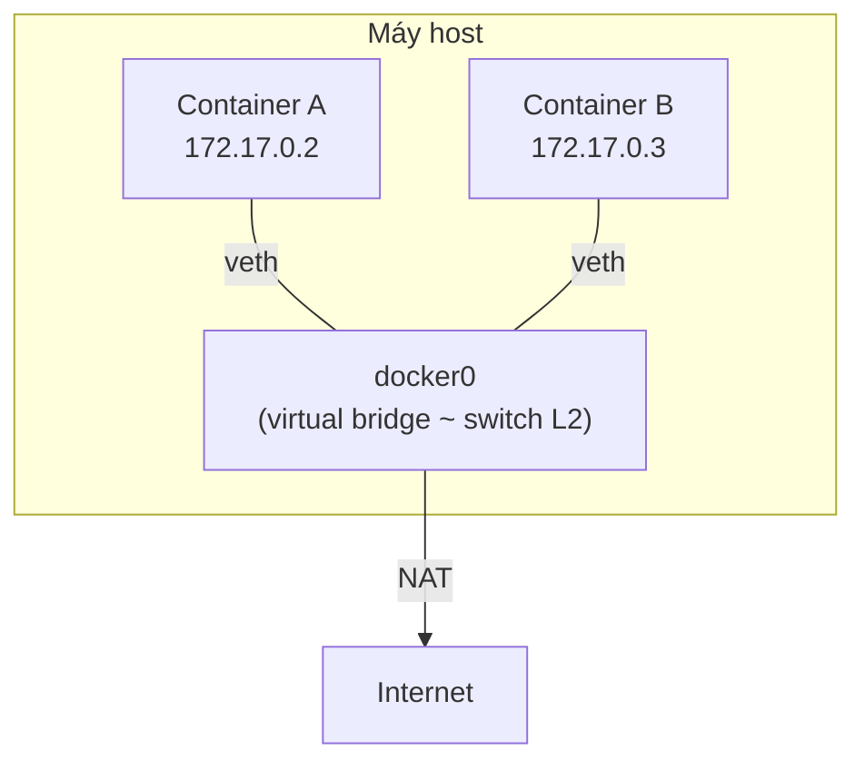
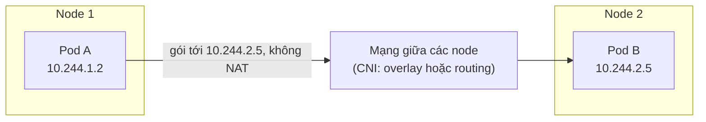

import { Callout } from "nextra/components";

# Container Networking

Một container chia sẻ kernel với máy host nhưng cần "ảo tưởng" rằng nó có mạng riêng. Làm sao hàng chục container trên cùng một máy — và sau đó hàng nghìn container trên nhiều máy — nói chuyện được với nhau mà không đụng địa chỉ? Bài học này trả lời theo hai cấp: các **Docker network mode** (bridge, host, none, overlay) cho một máy, rồi **mô hình mạng Kubernetes** (Pod-to-Pod và Service) cho cả cluster.

## Docker network modes

Khi chạy một container, Docker gắn nó vào một mạng theo một trong các mode sau. Lệnh `docker network ls` cho thấy các mạng mặc định:

```bash
$ docker network ls
NETWORK ID     NAME       DRIVER    SCOPE
b8c2f0a1d3e4   bridge     bridge    local
1a2b3c4d5e6f   host       host      local
7f8e9d0c1b2a   none       null      local
3c4d5e6f7a8b   my-overlay overlay   swarm
```

- **bridge mode** (mode mặc định — mỗi container được cấp IP riêng trên một mạng ảo nội bộ, nối với host qua một virtual bridge). Đây là lựa chọn mặc định cho container đơn lẻ.
- **host mode** (container dùng chung trực tiếp network stack của host — không có cô lập mạng, container thấy đúng các interface của host). Nhanh nhất nhưng không cô lập, dễ đụng port.
- **none mode** (container không có interface mạng nào ngoài loopback — hoàn toàn cô lập). Dùng khi container không cần mạng.
- **overlay mode** (mạng trải trên **nhiều** host, cho container ở các máy khác nhau giao tiếp như cùng một LAN). Đây là mode cho cluster; cơ chế bên dưới là VXLAN, sẽ học kỹ ở bài **"Network Virtualization & Overlay"** ngay sau.

## Bridge mode hoạt động như một switch ảo

Trong bridge mode, Docker tạo một **virtual bridge** tên `docker0` trên host. Mỗi container nối vào bridge này qua một **veth pair** (cặp interface ảo nối container với bridge). Bản chất, `docker0` hành xử **y hệt một switch Layer 2** mà bạn đã học ở **Chương 3 — bài "Switching & VLAN"**: nó học MAC address của từng container và chuyển frame giữa các cổng ảo.



Hai container cùng bridge nói chuyện trực tiếp ở Layer 2 qua `docker0`. Để container ra Internet, Docker dùng **NAT** (đúng PAT của **Chương 4 — bài "NAT"**): địa chỉ private `172.17.0.x` được dịch sang IP của host khi đi ra ngoài. Vậy bridge mode không phải công nghệ mới — nó là switch (Chương 3) cộng NAT (Chương 4) triển khai bằng phần mềm.

## Mô hình mạng Kubernetes

Khi lên tới Kubernetes (nền tảng điều phối container trên nhiều máy), đơn vị nhỏ nhất không phải container mà là **Pod** (một nhóm gồm một hoặc vài container chia sẻ chung một network namespace, tức chung một IP). Kubernetes đặt ra một mô hình mạng với vài quy tắc bắt buộc:

1. Mỗi **Pod** có một **IP riêng, duy nhất** trong toàn cluster.
2. Mọi Pod giao tiếp được với mọi Pod khác **không cần NAT**, dù ở khác node.
3. Container trong cùng một Pod chia sẻ IP và nói chuyện qua `localhost`.

Đây là một "mạng phẳng" (flat network) cho Pod, khác hẳn mô hình NAT chồng nhiều lớp của Docker đơn lẻ.

### Pod-to-Pod networking

Vì mỗi Pod có IP riêng và không dùng NAT, một Pod ở node 1 gửi gói thẳng tới IP của Pod ở node 2. Phần "ghép" mạng của các node lại để IP Pod định tuyến được xuyên node do một **CNI plugin** (Container Network Interface — chuẩn cắm ghép để cấp mạng cho Pod, ví dụ Calico, Flannel) đảm nhận, thường bằng overlay (VXLAN) hoặc bằng routing thuần.



Liên hệ Chương trước: nếu CNI dùng routing thuần thì đây chính là **Layer 3 forwarding** của **Chương 4**; nếu dùng overlay thì là encapsulation của **Chương 1** áp lên frame của Pod. Dù cách nào, Pod-to-Pod vẫn giữ nguyên ngữ nghĩa "IP nguồn tới IP đích" mà bạn đã quen.

### Service networking và ClusterIP

Pod là phù du: chúng bị xóa và tạo lại liên tục, IP đổi theo. Không ai muốn gọi thẳng IP Pod. **Service** (một địa chỉ ảo ổn định đại diện cho một nhóm Pod, tự động chia tải tới các Pod còn sống) giải quyết điều đó. Kiểu Service mặc định là **ClusterIP** (một IP ảo chỉ truy cập được **bên trong** cluster).

Khai báo một Service bằng YAML:

```yaml
apiVersion: v1
kind: Service
metadata:
  name: web-service
spec:
  selector:
    app: web
  ports:
    - protocol: TCP
      port: 80
      targetPort: 8080
  type: ClusterIP
```

Sau khi tạo, Service nhận một ClusterIP cố định:

```bash
$ kubectl get svc web-service
NAME          TYPE        CLUSTER-IP     EXTERNAL-IP   PORT(S)   AGE
web-service   ClusterIP   10.96.0.42     <none>        80/TCP    5m
```

Mọi Pod khác chỉ cần gọi `10.96.0.42:80` (hoặc tên DNS `web-service`); thành phần **kube-proxy** trên mỗi node sẽ chuyển tiếp tới một Pod backend đang khớp `selector: app=web`. Về bản chất, ClusterIP là một **load balancer Layer 4** nội bộ — chính khái niệm load balancer của bài **"Cloud Networking"**, nay nằm bên trong cluster và đứng trước một nhóm Pod.

<Callout type="info">
  ClusterIP chỉ dùng được trong cluster. Muốn lộ Service ra ngoài, Kubernetes có
  thêm kiểu **NodePort** và **LoadBalancer** — kiểu sau gọi thẳng tới load
  balancer của cloud provider ở bài trước.
</Callout>

## So sánh với mạng truyền thống

| Khái niệm hiện đại        | Kế thừa/khác với truyền thống                                              |
| ------------------------- | -------------------------------------------------------------------------- |
| Docker `docker0` bridge   | Là **switch L2** (Chương 3) bằng phần mềm + **NAT** (Chương 4) để ra ngoài |
| Pod-to-Pod không NAT      | Giữ ngữ nghĩa **L3 forwarding** (Chương 4); CNI có thể dùng overlay         |
| Service / ClusterIP       | Là **load balancer L4** (bài Cloud Networking) đặt trước nhóm Pod           |
| Container trong cùng Pod  | Chung namespace, nói chuyện qua `localhost` như cùng một máy                |

## Tóm tắt nhanh

- Docker có bốn mode: **bridge** (mặc định, IP riêng qua `docker0`), **host** (dùng chung stack host), **none** (không mạng), **overlay** (nhiều host).
- `docker0` là **switch L2** ảo (Chương 3) cộng **NAT** (Chương 4) để container ra Internet.
- Kubernetes bắt mỗi **Pod** có IP riêng và mọi Pod giao tiếp **không NAT** (mạng phẳng).
- **Pod-to-Pod** do CNI plugin ghép (overlay hoặc routing thuần), giữ ngữ nghĩa IP-tới-IP.
- **Service/ClusterIP** là IP ảo ổn định, hoạt động như **load balancer L4** nội bộ trỏ tới các Pod theo selector.

## Bài tập

### Câu hỏi lý thuyết

1. Vì sao Kubernetes cần khái niệm **Service** thay vì để các Pod gọi thẳng IP của nhau? Liên hệ tới tính phù du của Pod.
2. Giải thích Docker `docker0` bridge tái sử dụng những khái niệm nào của Chương 3 và Chương 4.

### Bài tập áp dụng

3. Cho Service YAML ở phần ví dụ. Một Pod gọi tới `web-service:80`. Mô tả đường đi của gói: ClusterIP, vai trò kube-proxy, và cổng `targetPort` mà Pod backend thực sự nhận.
4. Bạn chạy hai container web cùng nghe port 80 trên một host và muốn cả hai cùng dùng được. Mode `host` có gặp vấn đề gì không? Mode `bridge` xử lý ra sao? Giải thích bằng khái niệm port/NAT.

<details>
  <summary>Đáp án & gợi ý</summary>

1. Vì Pod bị tạo/xóa liên tục nên IP của chúng thay đổi; gọi thẳng IP Pod sẽ hỏng ngay khi Pod được thay. **Service** cấp một **ClusterIP ổn định** đại diện cho cả nhóm và tự chia tải tới các Pod còn sống, nên client không phụ thuộc vào IP Pod cụ thể.
2. `docker0` hoạt động như một **switch Layer 2** (Chương 3 — học MAC, chuyển frame giữa các cổng ảo của container) và dùng **NAT/PAT** (Chương 4) để dịch địa chỉ private `172.17.0.x` sang IP host khi container ra Internet.
3. Pod gọi `web-service` → phân giải thành ClusterIP `10.96.0.42:80`. **kube-proxy** trên node bắt lưu lượng tới ClusterIP và chuyển tiếp (DNAT) tới một Pod backend khớp `app=web`, nhắm tới `targetPort: 8080` của Pod đó. Vậy client thấy port 80, còn ứng dụng trong Pod thực sự nghe ở 8080.
4. Mode **host**: cả hai container đều dùng trực tiếp network stack của host nên **đụng port** — chỉ một container chiếm được port 80, container kia lỗi "address already in use". Mode **bridge**: mỗi container có IP riêng nên cả hai cùng nghe port 80 trên IP riêng của mình; để lộ ra host ta map port khác nhau (ví dụ `-p 8081:80` và `-p 8082:80`), Docker dùng NAT để phân biệt — đúng tinh thần PAT của Chương 4.

</details>

## Nguồn tham khảo

- The Kubernetes Authors, _Kubernetes Documentation_, mục "Cluster Networking" và "Service" (mô hình Pod-to-Pod và ClusterIP).
- Docker Inc., _Docker Documentation_, mục "Networking overview" (bridge, host, none, overlay drivers).
