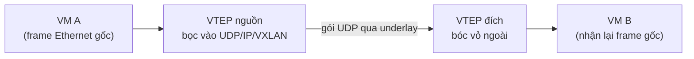

import { Callout } from "nextra/components";

# Network Virtualization & Overlay

Cloud và container đặt ra một bài toán: làm sao cho hàng nghìn mạng ảo của nhiều khách hàng cùng chạy trên một hạ tầng vật lý, mà mỗi mạng tưởng như mình sở hữu cả một LAN riêng? Câu trả lời là **network virtualization** (ảo hóa mạng — dựng các mạng logic độc lập trên cùng một hạ tầng vật lý dùng chung). Bài học này giải thích **overlay network**, hai tunneling protocol **VXLAN** và **GRE**, và **virtual switch** — tất cả đều là biến tấu của một ý tưởng cũ: **encapsulation**.

## Overlay và underlay

Hãy tách hai lớp. **underlay** (mạng nền — hạ tầng vật lý thật: switch, router, cáp, với địa chỉ IP thật, chính là mọi thứ từ Chương 1 đến Chương 4). **overlay** (mạng phủ — mạng ảo dựng **bên trên** underlay bằng cách bọc gói của mạng ảo vào trong gói của mạng thật).

Phép so sánh: underlay là hệ thống đường bộ thật; overlay là các tuyến xe buýt vẽ trên bản đồ — nhiều tuyến logic khác nhau cùng chạy trên một mặt đường. Gói của overlay "đi nhờ" trên underlay mà không cần underlay hiểu gì về mạng ảo bên trong.

## Tunneling chính là encapsulation lần nữa

Cơ chế dựng overlay là **tunneling** (đường hầm — bọc nguyên một gói của giao thức này vào trong gói của một giao thức khác để truyền qua mạng trung gian). Nếu thấy quen, đúng vậy: đây chính là **encapsulation** ở **Chương 1 — bài "Đóng gói & tháo gói dữ liệu"**, chỉ khác là ta bọc thêm **một lớp nữa** ngoài lớp đã có.

Khác biệt với encapsulation thông thường: bình thường mỗi tầng bọc đúng một header của tầng đó. Trong tunneling, ta lấy **trọn** một gói đã hoàn chỉnh (cả header lẫn payload) và nhét nó làm payload của một gói mới ở ngoài. Bên kia đường hầm sẽ "bóc vỏ ngoài" để lấy lại gói gốc nguyên vẹn.

## VXLAN: mở rộng VLAN cho quy mô cloud

Ở **Chương 3 — bài "Switching & VLAN"**, bạn đã thấy VLAN tag 802.1Q có trường VID dài 12 bit, tối đa **4094** VLAN dùng được. Với một data center cloud phục vụ hàng chục nghìn khách hàng, 4094 là quá ít. **VXLAN** (Virtual eXtensible LAN — bọc nguyên một frame Ethernet vào trong gói UDP/IP để mở rộng số mạng ảo, định nghĩa trong RFC 7348) ra đời để vượt giới hạn đó.

VXLAN dùng trường **VNI** (VXLAN Network Identifier) dài **24 bit**, cho `2^24 ≈ 16,7 triệu` mạng ảo — gấp hàng nghìn lần VLAN. Cách làm: lấy nguyên frame Ethernet của máy ảo (kèm cả MAC nguồn/đích) rồi bọc vào UDP, rồi IP, rồi Ethernet của mạng thật. Đây là kiểu **MAC-in-UDP**:

```text
[ Outer Ethernet | Outer IP | Outer UDP (dst 4789) | VXLAN (VNI 24-bit) | Frame Ethernet GỐC (inner) | FCS ]
                                                                          \__ chính là frame của VLAN cũ __/
```

Phần thực hiện bọc/mở gói gọi là **VTEP** (VXLAN Tunnel Endpoint — điểm đầu/cuối đường hầm, thường nằm trên host hoặc virtual switch). VTEP nguồn bọc frame lại, gửi qua underlay như một gói UDP bình thường; VTEP đích bóc vỏ ngoài và giao lại frame gốc cho máy ảo đích.

Bố cục các bit của VXLAN header (theo RFC 7348):

```text
0                   1                   2                   3
0 1 2 3 4 5 6 7 8 9 0 1 2 3 4 5 6 7 8 9 0 1 2 3 4 5 6 7 8 9 0 1
+-+-+-+-+-+-+-+-+-+-+-+-+-+-+-+-+-+-+-+-+-+-+-+-+-+-+-+-+-+-+-+-+
|R|R|R|R|I|R|R|R|            Reserved                           |
+-+-+-+-+-+-+-+-+-+-+-+-+-+-+-+-+-+-+-+-+-+-+-+-+-+-+-+-+-+-+-+-+
|                VXLAN Network Identifier (VNI)  |   Reserved   |
+-+-+-+-+-+-+-+-+-+-+-+-+-+-+-+-+-+-+-+-+-+-+-+-+-+-+-+-+-+-+-+-+
  - Bit I = 1 báo trường VNI hợp lệ
  - VNI: 24 bit -> tối đa ~16,7 triệu mạng ảo (so với 4094 của VLAN)
```



<Callout type="info">
  VXLAN không thay thế hẳn VLAN — nó **mở rộng** ý tưởng VLAN (Chương 3) lên quy
  mô cloud và cho phép mạng ảo trải qua nhiều subnet IP của underlay, điều mà
  VLAN 802.1Q không làm được vì nó chỉ là tag trong một mạng L2.
</Callout>

## GRE: đường hầm cho gói Layer 3 bất kỳ

Trong khi VXLAN chuyên bọc frame Ethernet (L2), **GRE** (Generic Routing Encapsulation — giao thức tunneling tổng quát bọc một gói L3 bất kỳ vào trong IP, định nghĩa trong RFC 2784) tổng quát hơn: nó có thể đóng gói nhiều loại giao thức tầng Network khác nhau, không chỉ IP. GRE thêm một header gọn nhẹ giữa IP ngoài và gói gốc:

```text
[ Outer IP (protocol = 47) | GRE header | Gói gốc (vd: IP nội bộ) ]
```

```text
0                   1                   2                   3
0 1 2 3 4 5 6 7 8 9 0 1 2 3 4 5 6 7 8 9 0 1 2 3 4 5 6 7 8 9 0 1
+-+-+-+-+-+-+-+-+-+-+-+-+-+-+-+-+-+-+-+-+-+-+-+-+-+-+-+-+-+-+-+-+
|C| Reserved0       | Ver |         Protocol Type               |
+-+-+-+-+-+-+-+-+-+-+-+-+-+-+-+-+-+-+-+-+-+-+-+-+-+-+-+-+-+-+-+-+
  - Protocol Type: loại gói được bọc bên trong (vd 0x0800 = IPv4)
  - Outer IP dùng protocol number 47 để báo "payload là GRE"
```

So với routing thuần của **Chương 4** (router chỉ nhìn IP đích rồi forward), GRE tạo một liên kết ảo điểm-điểm xuyên qua mạng trung gian: hai đầu hầm thấy nhau như hàng xóm trực tiếp dù thực tế cách nhau nhiều hop. GRE thường dùng làm nền cho VPN site-to-site (kết hợp với mã hóa của **Chương 7**).

## Virtual switch (vSwitch)

**virtual switch** (vSwitch — một switch chạy bằng phần mềm bên trong host/hypervisor, nối các VM và container vào mạng). Một vSwitch như **Open vSwitch (OVS)** làm đúng những việc của switch vật lý ở **Chương 3**: học MAC address, chuyển frame giữa các cổng ảo, gắn VLAN tag. Khác biệt là cổng của nó là cổng ảo nối tới VM, và nó thường kiêm luôn vai trò **VTEP** để bọc/mở VXLAN.

Điểm liên hệ quan trọng: vSwitch cũng là nơi SDN (bài đầu chương) ra tay — controller có thể cài flow entry xuống Open vSwitch y như xuống switch phần cứng, vì OVS hỗ trợ OpenFlow. Vậy vSwitch là giao điểm của ba ý tưởng: switching (Chương 3), overlay/VXLAN (bài này), và SDN.

## So sánh truyền thống và ảo hóa

| Khái niệm hiện đại | Kế thừa/khác với truyền thống                                                   |
| ------------------ | ------------------------------------------------------------------------------- |
| Overlay network    | Là **encapsulation** (Chương 1) thêm một lớp ngoài, chạy trên underlay vật lý   |
| VXLAN              | **Mở rộng VLAN** (Chương 3): VNI 24-bit thay VID 12-bit; bọc frame trong UDP/IP |
| GRE                | Tạo liên kết ảo điểm-điểm thay vì **L3 forwarding** từng hop của Chương 4       |
| vSwitch            | Là **switch L2** (Chương 3) bằng phần mềm, kiêm VTEP và hỗ trợ OpenFlow (SDN)   |

## Tóm tắt nhanh

- **overlay** là mạng ảo dựng trên **underlay** vật lý bằng **tunneling** — chính là **encapsulation** (Chương 1) bọc thêm một lớp.
- **VXLAN** mở rộng **VLAN** (Chương 3): **VNI 24-bit** cho ~16,7 triệu mạng ảo, bọc frame Ethernet vào UDP (port 4789) kiểu MAC-in-UDP; hai đầu là **VTEP**.
- **GRE** (RFC 2784) bọc gói L3 bất kỳ vào IP (protocol 47), tạo đường hầm điểm-điểm xuyên mạng.
- **vSwitch** là switch phần mềm (Chương 3) trong host, thường kiêm VTEP và nhận điều khiển từ SDN controller qua OpenFlow.

## Bài tập

### Câu hỏi lý thuyết

1. Giải thích vì sao VXLAN được xem là phần mở rộng của VLAN (Chương 3) chứ không phải một ý tưởng hoàn toàn mới. Nêu hai khác biệt cụ thể.
2. Tunneling khác với encapsulation thông thường (Chương 1) ở điểm nào? Mô tả "vỏ ngoài" và "gói gốc".

### Bài tập tính toán

3. VLAN dùng VID 12 bit, VXLAN dùng VNI 24 bit. Tính số mạng ảo tối đa mỗi loại biểu diễn được và cho biết VXLAN gấp khoảng bao nhiêu lần VLAN.

### Bài tập áp dụng

4. Một VM ở host 1 (VNI 5000) gửi frame tới một VM ở host 2 cùng VNI. Mô tả VTEP nguồn bọc gì quanh frame gốc, gói đi qua underlay dưới dạng gì, và VTEP đích làm gì khi nhận. Liên hệ tới encapsulation của Chương 1.

<details>
  <summary>Đáp án & gợi ý</summary>

1. Vì VXLAN giải đúng bài toán của VLAN — phân tách nhiều mạng L2 logic — và vẫn bọc một **frame Ethernet** bên trong. Hai khác biệt: (a) định danh dùng **VNI 24-bit** thay vì **VID 12-bit**, nên nhiều mạng hơn rất nhiều; (b) VXLAN bọc frame trong **UDP/IP** nên mạng ảo trải được qua nhiều subnet của underlay, còn VLAN chỉ là tag trong một mạng L2.
2. Encapsulation thông thường: mỗi tầng thêm **đúng header của tầng đó**. Tunneling: lấy **trọn một gói đã hoàn chỉnh** (cả header lẫn payload) làm payload cho một gói mới ở ngoài. "Vỏ ngoài" là Outer Ethernet/IP/UDP(+VXLAN); "gói gốc" là frame của VM được giữ nguyên bên trong.
3. VLAN: `2^12 = 4096` (dùng được 4094). VXLAN: `2^24 = 16.777.216`. Tỉ lệ `2^24 / 2^12 = 2^12 = 4096` lần — VXLAN biểu diễn được nhiều hơn khoảng **4096 lần**.
4. VTEP nguồn bọc frame gốc lần lượt bằng **VXLAN header (VNI=5000) → UDP (dst 4789) → Outer IP (IP host1→host2) → Outer Ethernet**. Trên underlay nó đi như một **gói UDP/IP bình thường** giữa hai host. VTEP đích **bóc** các lớp ngoài, đọc VNI=5000 để biết thuộc mạng ảo nào, rồi giao **frame gốc** cho VM đích. Đây đúng là encapsulation của Chương 1, chỉ thêm một lớp ngoài và được "bóc" ở đầu kia.

</details>

## Nguồn tham khảo

- M. Mahalingam et al., _Virtual eXtensible Local Area Network (VXLAN)_, RFC 7348, mục 5 (VXLAN frame format) và mục 4 (VTEP, encapsulation).
- D. Farinacci et al., _Generic Routing Encapsulation (GRE)_, RFC 2784, mục 2 (GRE header format).
