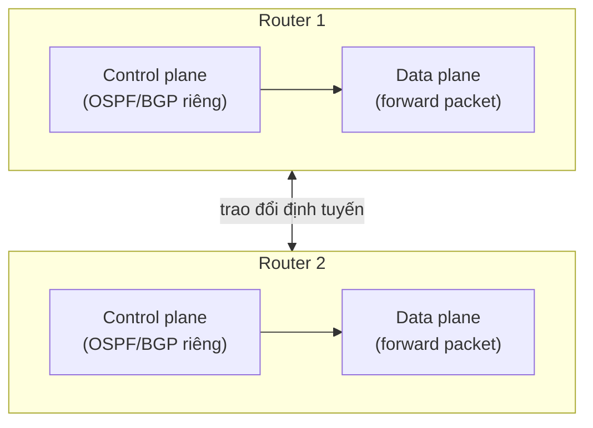
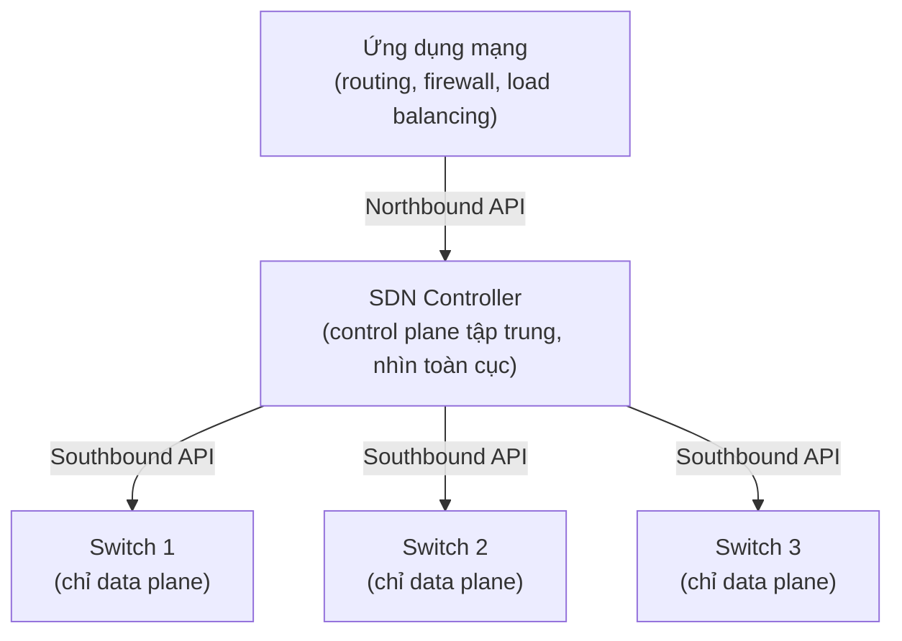

import { Callout } from "nextra/components";

# Software-Defined Networking

Trong mạng truyền thống, mỗi router và switch là một "hộp đen" tự ra quyết định: nó vừa tính đường đi, vừa chuyển từng packet. Khi mạng lớn lên hàng nghìn thiết bị, việc cấu hình tay từng hộp trở nên chậm và dễ sai. **SDN** (Software-Defined Networking — kiến trúc tách phần ra quyết định ra khỏi thiết bị chuyển tiếp và tập trung nó vào một controller lập trình được) ra đời để giải quyết đúng vấn đề đó. Bài học này giải thích sự tách rời **control plane** và **data plane**, vai trò của **SDN controller**, và các **programmable interface** như OpenFlow.

## Control plane và data plane

Mọi thiết bị mạng đều có hai "mặt phẳng" chức năng. **control plane** (mặt phẳng điều khiển — phần "bộ não" quyết định lưu lượng nên đi đường nào, ví dụ chạy routing protocol để xây **routing table**). **data plane** (mặt phẳng dữ liệu, còn gọi forwarding plane — phần "cơ bắp" thực sự chuyển tiếp từng packet ra cổng nào, dựa trên bảng mà control plane đã lập).

Một phép so sánh: control plane giống người lập kế hoạch tuyến đường và vẽ bản đồ, còn data plane giống người tài xế cứ theo bản đồ đó mà chạy. Hai việc khác bản chất: lập kế hoạch cần nhìn toàn cục và đổi chậm, còn chuyển tiếp phải nhanh ở mức từng packet.

<Callout type="info">
  Ở **Chương 4 — Network Layer, bài "Cơ bản về Routing"**, các protocol như RIP,
  OSPF, BGP chính là control plane: chúng tính ra routing table. Việc router tra
  bảng đó rồi đẩy packet ra cổng kế tiếp chính là data plane.
</Callout>

## Mạng truyền thống: hai plane nằm chung trong mỗi thiết bị

Điểm mấu chốt mà SDN muốn thay đổi: trong mạng truyền thống, control plane và data plane **nằm chung** bên trong từng thiết bị, và mỗi thiết bị tự chạy control plane của riêng nó. Đây là mô hình **distributed control plane** (control plane phân tán — mỗi router tự tính đường dựa trên thông tin trao đổi với hàng xóm).

Như đã học ở **Chương 4**, mỗi router tự chạy OSPF hoặc BGP, tự xây routing table cho riêng mình. Không có ai nhìn thấy toàn bộ mạng cùng lúc; mỗi thiết bị chỉ có "góc nhìn cục bộ" rồi hội tụ dần. Muốn đổi chính sách định tuyến cho cả mạng, quản trị viên phải đăng nhập và cấu hình **từng** thiết bị một.



## SDN: tách control plane khỏi data plane

SDN gỡ control plane ra khỏi từng thiết bị và **tập trung** nó vào một phần mềm chạy ngoài, gọi là **SDN controller** (bộ điều khiển SDN — phần mềm giữ control plane tập trung, có cái nhìn toàn cục và cài đặt quyết định chuyển tiếp xuống các thiết bị). Khi đó các switch bên dưới chỉ còn giữ data plane: chúng trở thành thiết bị chuyển tiếp "ngốc" (dumb forwarder), làm theo bảng mà controller cài xuống.



Nhờ tập trung, một thay đổi chính sách chỉ cần khai báo **một lần** ở controller, rồi controller tự đẩy xuống mọi switch liên quan. Đây là khác biệt lớn nhất so với việc cấu hình tay từng thiết bị ở mạng truyền thống.

## SDN controller và hai loại interface

Controller giao tiếp theo hai hướng, đặt tên theo vị trí trên/dưới trong sơ đồ:

- **Southbound interface** (giao diện hướng xuống — kênh controller dùng để cài đặt luật chuyển tiếp xuống switch/data plane). Ví dụ tiêu biểu là **OpenFlow**.
- **Northbound interface** (giao diện hướng lên — API để các ứng dụng mạng ra lệnh cho controller "tôi muốn mạng hành xử thế này"). Thường là **REST API**.

Nhờ northbound API, lập trình viên có thể viết một ứng dụng (ví dụ "chặn mọi lưu lượng từ dải X" hay "cân bằng tải giữa hai server") mà không cần biết phần cứng switch là hãng nào — đây là ý nghĩa "software-defined".

## Programmable interface: OpenFlow

**OpenFlow** (một southbound protocol chuẩn cho phép controller đọc/ghi **flow table** trên switch) là giao thức kinh điển của SDN. Thay vì MAC address table tự học như switch truyền thống (đã gặp ở **Chương 3**), switch OpenFlow chuyển tiếp dựa trên **flow entry** do controller cài: mỗi entry gồm phần **match** (điều kiện so khớp các trường của packet) và phần **action** (hành động khi khớp).

Một flow table quan sát được trên switch có thể trông như sau:

```text
Priority  Match (các trường packet)                   Action
--------  ------------------------------------------  -------------
200       in_port=1, eth_dst=00:1a:2b:3c:4d:5e        output:2
150       eth_type=0x0800, ipv4_dst=10.0.0.0/24       output:3
100       eth_type=0x0800, ipv4_dst=10.0.1.0/24       output:4
0         *  (table-miss, không khớp gì)              CONTROLLER
```

Đọc bảng trên: packet vào cổng 1 có MAC đích cụ thể thì đẩy ra cổng 2; packet IPv4 tới `10.0.0.0/24` đẩy ra cổng 3; còn packet không khớp luật nào (table-miss, priority 0) được gửi **lên controller** để controller quyết định và có thể cài thêm flow entry mới. Toàn bộ logic này do phần mềm điều khiển, không phải thuật toán cứng trong firmware.

## So sánh SDN với mạng truyền thống

Bảng dưới tóm tắt SDN **mở rộng/thay thế** mô hình truyền thống ở **Chương 1** và **Chương 4** ra sao:

| Khía cạnh             | Mạng truyền thống (Ch.1, Ch.4)              | SDN                                           |
| --------------------- | ------------------------------------------- | --------------------------------------------- |
| Control plane         | Phân tán, nằm trong **mỗi** thiết bị        | Tập trung tại controller                       |
| Cách tính đường       | OSPF/BGP tự chạy trên từng router           | Controller nhìn toàn cục rồi cài flow xuống    |
| Data plane            | Gắn chặt với control plane cùng một hộp      | Tách rời, switch chỉ forward theo flow table   |
| Thay đổi chính sách   | Cấu hình tay **từng** thiết bị              | Khai báo **một lần** qua northbound API        |
| Khả năng lập trình    | Hạn chế, phụ thuộc CLI từng hãng            | Lập trình được qua API chuẩn                   |

Điểm cần nhớ: SDN không xóa bỏ control plane hay data plane — hai khái niệm này vẫn nguyên như **Chương 4**. Nó chỉ **di chuyển** control plane ra khỏi thiết bị và tập trung lại, biến mạng thành thứ điều khiển được bằng phần mềm.

## Tóm tắt nhanh

- **control plane** quyết định đường đi (xây bảng), **data plane** chuyển tiếp packet theo bảng đó.
- Mạng truyền thống gộp hai plane trong mỗi thiết bị với control plane **phân tán** (OSPF/BGP của Chương 4).
- **SDN** tách control plane ra và tập trung vào **SDN controller** có cái nhìn toàn cục.
- Controller dùng **southbound interface** (OpenFlow) để cài flow xuống switch, và **northbound interface** (REST API) để nhận lệnh từ ứng dụng.
- **OpenFlow flow entry** gồm **match** + **action**; switch trở thành thiết bị forward theo bảng do controller cài.

## Bài tập

### Câu hỏi lý thuyết

1. Định nghĩa control plane và data plane. Trong một router OSPF truyền thống (Chương 4), mỗi phần đảm nhận việc gì?
2. Giải thích vì sao việc tập trung control plane vào controller giúp thay đổi chính sách toàn mạng nhanh hơn so với mô hình phân tán.

### Bài tập áp dụng

3. Cho flow table OpenFlow ở phần ví dụ. Một packet IPv4 có `ipv4_dst=10.0.1.5` đi vào cổng 2. Switch sẽ khớp entry nào và đẩy ra cổng nào? Nếu một packet không khớp entry nào thì điều gì xảy ra?
4. Phân loại các thành phần sau là **northbound** hay **southbound**: (a) một REST API để ứng dụng yêu cầu cân bằng tải; (b) OpenFlow cài flow entry xuống switch.

<details>
  <summary>Đáp án & gợi ý</summary>

1. **control plane** quyết định lưu lượng đi đường nào (chạy OSPF để tính và xây routing table); **data plane** thực sự chuyển tiếp từng packet ra cổng kế tiếp dựa trên routing table đó. Trong router OSPF, OSPF + bảng định tuyến là control plane, còn thao tác tra bảng và forward là data plane.
2. Vì controller có **cái nhìn toàn cục** và là điểm khai báo duy nhất: đổi chính sách chỉ cần sửa ở controller rồi nó tự đẩy flow xuống mọi switch. Mô hình phân tán phải cấu hình tay từng thiết bị và chờ các thiết bị hội tụ, vừa chậm vừa dễ sai lệch giữa các hộp.
3. Khớp entry priority 100 (`ipv4_dst=10.0.1.0/24`) vì `10.0.1.5` thuộc dải đó, nên đẩy ra **cổng 4** (cổng vào là 2 không ảnh hưởng vì entry này không ràng buộc `in_port`). Packet không khớp gì sẽ trúng table-miss (priority 0) và được gửi **lên controller**.
4. (a) **northbound** (ứng dụng nói chuyện với controller); (b) **southbound** (controller nói chuyện với switch/data plane).

</details>

## Nguồn tham khảo

- E. Haleplidis et al., _Software-Defined Networking (SDN): Layers and Architecture Terminology_, RFC 7426, mục 3 (mô hình các plane và interface).
- Open Networking Foundation, _OpenFlow Switch Specification_, phần "Flow Table" và "Match Fields".
- J. F. Kurose & K. W. Ross, _Computer Networking: A Top-Down Approach_, 8th ed., mục 5.5 (The SDN Control Plane).
