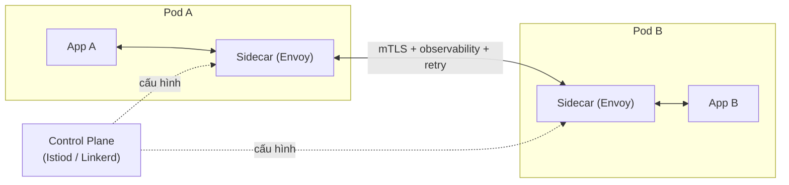

import { Callout } from "nextra/components";

# Service Mesh & mTLS

Trong microservices, mỗi dịch vụ gọi nhiều dịch vụ khác qua HTTP/gRPC. Ai kiểm chứng bên gọi là ai? Ai retry khi lỗi thoáng qua? Ai đo latency giữa các cặp service? Ai chặn traffic từ một service sang service khác? Nếu mỗi team tự cài các thư viện khách nhau (Hystrix, resilience4j, custom middleware), bạn sẽ có hàng chục cách làm khác nhau, khó vận hành nhất quán. **Service mesh** giải bài toán đó: **rút phần logic mạng ra khỏi application code**, đưa vào một hạ tầng chung.

## Ý tưởng cốt lõi: sidecar proxy

**Service mesh** đặt một **sidecar proxy** (proxy chạy bên cạnh mỗi service như một tiến trình phụ) cạnh mọi instance service của bạn. Mọi traffic đi vào và ra khỏi service đều đi qua proxy này. Vì proxy ở giữa, nó thấy tất cả traffic và làm được rất nhiều việc: mã hóa, cấp phép, retry, load balancing, đo lường, kiểm soát chính sách.



App vẫn viết code như thường: gọi `http://user-service/api/users` bình thường. Nhưng traffic thực sự đi qua sidecar → mạng → sidecar → app đích. App không biết (và không cần biết) đường đi có mã hóa, có retry, có đo hay không.

<Callout type="info">
  **Tại sao gọi là "mesh"**: mỗi service có một sidecar, và các sidecar tạo thành
  một lưới (mesh) giao tiếp giữa các service. Điều khiển tập trung ở control plane
  giống ý tưởng SDN (bài **Software-Defined Networking**): tách control plane
  khỏi data plane, một lần nữa.
</Callout>

## Kiến trúc: data plane và control plane

Service mesh có hai tầng logic:

**Data plane** = các sidecar proxy (thường là **Envoy** — proxy hiệu năng cao viết bằng C++, do Lyft phát triển). Nó xử lý mọi packet: bọc TLS, decrypt, route, retry, ghi metric. Trong Kubernetes, sidecar thường được **inject tự động** — bạn thêm annotation vào namespace, Kubernetes tự thêm container Envoy vào mỗi Pod khi tạo.

**Control plane** = phần mềm quản lý điều khiển các sidecar. Nó nhận cấu hình (YAML), phát hiện service, và đẩy cấu hình xuống mọi sidecar. Ví dụ **Istio** dùng control plane tên `istiod`; **Linkerd** dùng control plane nhẹ hơn viết bằng Rust.

Ba mesh phổ biến với dev: **Istio** (mạnh nhất, nhưng phức tạp), **Linkerd** (nhẹ, đơn giản), **Consul Connect** (từ HashiCorp, gắn với Consul cho service discovery).

## mTLS: xác thực hai chiều tự động

**mTLS** (Mutual TLS — TLS trong đó cả client và server đều trình certificate và xác thực lẫn nhau) là một trong những tính năng "ăn tiền" nhất của service mesh. TLS thường (Chương 7) chỉ client xác thực server; mTLS thêm chiều ngược lại — server cũng xác thực client là ai.

Trong service mesh, mTLS bật **tự động cho mọi cuộc gọi giữa các service**:

- Mesh sinh cert riêng cho mỗi service (thường gắn với **service identity** dạng `spiffe://cluster.local/ns/prod/sa/user-service`).
- Khi service A gọi service B, sidecar của A trình cert của A; sidecar của B kiểm và trình cert của B.
- Cả hai bên xác nhận danh tính rồi mới cho traffic đi qua, mã hóa hoàn toàn.

Kết quả: **traffic đông-tây trong cluster tự động được mã hóa và xác thực**, không cần app code làm gì. Chính sách "chỉ service A được gọi service B" trở thành một dòng YAML thay vì phải sửa code.

```yaml
# AuthorizationPolicy trong Istio — chỉ service A được gọi service B
apiVersion: security.istio.io/v1
kind: AuthorizationPolicy
metadata:
  name: allow-a-to-b
  namespace: prod
spec:
  selector:
    matchLabels:
      app: service-b
  rules:
    - from:
        - source:
            principals: ["cluster.local/ns/prod/sa/service-a"]
      to:
        - operation:
            methods: ["GET", "POST"]
            paths: ["/api/*"]
```

Chính sách này áp cấp **identity** (dựa trên cert của mTLS) — không phải IP. Đúng tinh thần **zero trust** đã học ở Chương 7: "never trust, always verify", verify từng call một dù đã ở trong mạng nội bộ.

## Traffic management: retry, timeout, circuit breaker

Ngoài bảo mật, sidecar còn nhận phần lớn "logic mạng" mà trước đây phải nhét vào app code. Cấu hình một cách khai báo:

```yaml
# DestinationRule của Istio — outlier detection và circuit breaker
apiVersion: networking.istio.io/v1
kind: DestinationRule
metadata:
  name: user-service-cb
spec:
  host: user-service
  trafficPolicy:
    connectionPool:
      tcp:
        maxConnections: 100
      http:
        http2MaxRequests: 1000
    outlierDetection:
      consecutive5xxErrors: 5
      interval: 30s
      baseEjectionTime: 30s
```

Ý nghĩa: nếu một instance của `user-service` trả 5 lỗi 5xx liên tiếp trong 30s, sidecar tạm loại nó ra khỏi pool trong 30s — đúng ý tưởng **circuit breaker**. Retry, timeout, load balancing weight cũng khai bằng YAML tương tự. App không phải import thư viện resilience.

## Traffic shifting: canary và blue-green

Đây là feature dev hay dùng nhất: chia traffic giữa các phiên bản service để deploy an toàn.

```yaml
# VirtualService của Istio — 90% v1, 10% v2 (canary)
apiVersion: networking.istio.io/v1
kind: VirtualService
metadata:
  name: user-service
spec:
  hosts: ["user-service"]
  http:
    - route:
        - destination:
            host: user-service
            subset: v1
          weight: 90
        - destination:
            host: user-service
            subset: v2
          weight: 10
```

Deploy v2, cho 10% traffic vào để test; nếu metric ổn thì tăng dần lên 100%. Không cần code hay CI/CD custom — chỉ đổi weight.

## Observability: metrics, tracing, logs miễn phí

Vì mọi request đi qua sidecar, mesh tự sinh **golden metrics** (bốn số liệu vàng: request rate, error rate, latency, saturation) cho mọi cặp service-to-service, thường xuất ra Prometheus. Cùng với đó là **distributed tracing header** (thêm `x-b3-traceid`, `traceparent` để Jaeger/Zipkin/Tempo nối các span lại).

Nghĩa là: bật mesh xong, bạn có ngay một service graph với latency P50/P99 và error rate cho từng cạnh — không phải instrument code.

<Callout type="info">
  Đây là điều đáng nhớ khi có ai bàn "có nên bật mesh không". Ba lợi ích cụ thể:
  **mTLS mọi call**, **traffic shifting bằng YAML**, và **golden metrics miễn phí**.
  Nếu team nhỏ và ít service, các lợi ích này có thể chưa bù chi phí vận hành
  mesh. Nếu team lớn với hàng chục service, mesh gần như là bắt buộc.
</Callout>

## Chi phí và bẫy

Service mesh mạnh nhưng không miễn phí:

- **Latency mỗi hop**: mỗi sidecar thêm ~1-3 ms cho mỗi request. Với API ngắn hạn (< 10 ms), overhead có thể đáng kể.
- **Resource overhead**: mỗi Pod thêm ~50-200 MB RAM và ~0.05-0.1 CPU cho sidecar. Cluster lớn có 10 000 Pod = 500 GB RAM chỉ cho sidecar.
- **Complexity**: mesh là một lớp mới với concept riêng (VirtualService, DestinationRule, AuthorizationPolicy...). Team cần thời gian để thành thạo và debug.
- **Debugging khó hơn**: khi traffic đi qua nhiều lớp, tìm lỗi khó hơn. Bạn cần biết đọc log Envoy và dùng công cụ như `istioctl proxy-config`.

Có phong trào **"sidecarless mesh"** (Cilium, Ambient Mesh của Istio) dùng eBPF trong kernel thay sidecar để giảm overhead. Vẫn đang phát triển, đáng theo dõi.

## Ví dụ thực tế: cài Istio và bật mTLS

```bash
# Cài Istio với profile demo (đơn giản)
$ istioctl install --set profile=demo -y

# Bật injection tự động cho namespace prod
$ kubectl label namespace prod istio-injection=enabled

# Deploy lại pod trong namespace này để sidecar được inject
$ kubectl rollout restart deployment -n prod

# Bật mTLS strict cho namespace prod
$ kubectl apply -f - <<EOF
apiVersion: security.istio.io/v1
kind: PeerAuthentication
metadata:
  name: default
  namespace: prod
spec:
  mtls:
    mode: STRICT
EOF
```

Sau bước cuối, mọi call giữa các service trong `prod` phải qua mTLS; call plaintext bị từ chối. Kiểm bằng:

```bash
$ istioctl proxy-config secret <pod-name>.prod
# Xem cert của sidecar; SPIFFE URI dạng spiffe://cluster.local/ns/prod/sa/<serviceaccount>
```

## Tóm tắt nhanh

- **Service mesh** rút logic mạng ra khỏi app: **sidecar proxy** (data plane) cạnh mỗi service, được điều khiển bởi **control plane** trung tâm.
- **mTLS tự động** cho mọi call giữa service; chính sách theo **identity** (SPIFFE URI) chứ không phải IP — đúng tinh thần zero trust.
- **Traffic management** khai báo: retry, timeout, circuit breaker, **canary deployment** bằng YAML.
- **Observability miễn phí**: golden metrics (rate, errors, latency) và distributed tracing header cho mọi cặp service.
- Đánh đổi: latency +1-3 ms/hop, RAM/CPU overhead, complexity, khó debug. Phong trào **sidecarless mesh** (eBPF-based) đang phát triển.

## Bài tập

### Câu hỏi lý thuyết

1. Giải thích ba lợi ích cụ thể mà service mesh mang lại **mà không cần đổi app code**. Với team có 3 service nhỏ và team có 30 service lớn, tình huống nào phù hợp bật mesh, tình huống nào không?
2. mTLS trong service mesh áp chính sách theo **identity** (SPIFFE URI) chứ không theo IP. Vì sao điều này quan trọng trong môi trường Kubernetes, nơi Pod (và IP của Pod) sinh/xóa liên tục? Liên hệ tới nguyên tắc **zero trust** ở Chương 7.

### Bài tập tình huống

3. Bạn muốn deploy v2 của service `checkout` với **canary 10%**, nhưng đội ngũ chưa dùng mesh. Bạn sẽ phải làm gì ở tầng ứng dụng/Kubernetes gốc (Service, Deployment) để chia 10/90 giữa v1 và v2? So với việc chỉ đổi weight trong `VirtualService` của Istio, đâu là khác biệt về công sức và độ chính xác của tỉ lệ chia?

### Phân tích

4. Một dev đề xuất bật service mesh cho một hệ thống có 3 service, mỗi service < 5 request/giây, tất cả nằm trong một VPC private. Bạn có ủng hộ không? Cân nhắc chi phí (latency + resource + complexity) so với lợi ích (mTLS, observability, traffic management) và đưa ra đề nghị thay thế nếu thấy chưa phù hợp.

<details>
  <summary>Đáp án & gợi ý</summary>

1. Ba lợi ích: (a) **mTLS mọi call** giữa các service — bảo mật ngang bằng zero-trust mà không cần thêm dòng code nào. (b) **Traffic shifting bằng YAML** — canary/blue-green deploy chỉ đổi số weight, không cần logic phân chia trong app hay ingress. (c) **Golden metrics + distributed tracing** cho mọi cặp service — không phải instrument code. Với **3 service nhỏ**: mesh có thể là overkill; chi phí vận hành và độ trễ thêm không bù được lợi ích. Với **30 service lớn**: mesh gần như bắt buộc; tự quản lý mTLS và retry cho 30 service dễ lệch giữa các team, mesh cho tính nhất quán.

2. Trong Kubernetes, IP của Pod thay đổi mỗi khi Pod restart, scale out, hoặc dời node. Chính sách theo IP sẽ vô nghĩa vì IP không có ý nghĩa lâu dài. **Identity SPIFFE** gắn với ServiceAccount (danh tính logic của workload, không đổi khi Pod tái tạo), nên chính sách "chỉ service A gọi được service B" ổn định qua các lần deploy và scale. Đây là **zero trust** đúng nghĩa: verify identity mọi call, không tin ai chỉ vì "cùng ở trong cluster".

3. Không có mesh: có thể chia bằng cách thay đổi **số replica** của mỗi Deployment (v1: 9 pods, v2: 1 pod) — cùng Service round-robin sẽ chia gần đúng 90/10. Vấn đề: (i) tỉ lệ **không chính xác** vì round-robin đơn giản; (ii) mỗi lần đổi tỉ lệ phải sửa Deployment và chờ Kubernetes scale; (iii) khó rollback nhanh. Với mesh: chỉ đổi `weight: 10` thành `weight: 5` trong VirtualService, mesh chia đúng theo tỉ lệ ở proxy level, có thể canary dựa trên header (chỉ user beta thấy v2) — nhiều power hơn với ít công sức.

4. **Không ủng hộ**. Chi phí: sidecar cho 3 service (mỗi service ~200 MB RAM) = ~600 MB thêm, latency +1-3 ms/hop khi request rate rất thấp không có nghĩa vì không tận dụng, complexity thêm một hệ (Istio/Linkerd với concept riêng) mà team nhỏ khó vận hành. Lợi ích: mTLS trong VPC private đã giảm nhu cầu (đường truyền không public); observability có thể đạt bằng OpenTelemetry direct trong app; traffic management chưa cần vì ít service. **Đề nghị thay thế**: (i) mã hóa TLS bình thường ở ingress + không mã hóa trong VPC (chấp nhận trade-off), hoặc mTLS thủ công giữa 3 service nếu cần; (ii) OpenTelemetry SDK trong mỗi service cho tracing và metric; (iii) blue-green deploy đơn giản qua Kubernetes Deployment strategy. Khi team đến ~10 service, đánh giá lại mesh.

</details>

## Nguồn tham khảo

- Istio Authors, _Istio Documentation_, sections "Traffic Management" (VirtualService, DestinationRule) và "Security" (mTLS, AuthorizationPolicy).
- Linkerd Authors, _Linkerd Documentation_, "Architecture" và "Automatic mTLS".
- W. Morgan, _The Service Mesh: What Every Software Engineer Needs to Know about the World's Most Over-Hyped Technology_ (mô tả tổng quan mesh).
- SPIFFE Project, _SPIFFE and SPIRE_ specification — service identity model dùng bởi Istio và các mesh khác.
