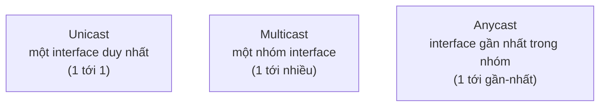
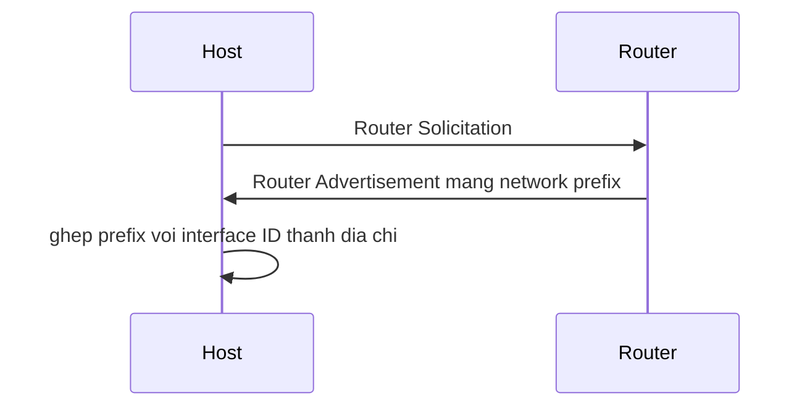

import { Callout } from "nextra/components";

# Địa chỉ IPv6

Không gian `2^32` địa chỉ của IPv4 đã cạn kiệt trên thực tế, và đó là lý do **IPv6** (Internet Protocol version 6 — phiên bản giao thức Internet dùng địa chỉ 128-bit, định nghĩa trong RFC 8200) ra đời. Bài học này giải thích định dạng 128-bit của một địa chỉ IPv6, các quy tắc rút gọn bằng `::`, ba kiểu địa chỉ unicast/multicast/anycast, và một bảng so sánh trực tiếp với IPv4 về không gian địa chỉ, header và khả năng tự cấu hình.

## Một địa chỉ IPv6 là 128 bit

Trong khi IPv4 dùng 32 bit, IPv6 dùng tới **128 bit**, tức không gian địa chỉ `2^128` ≈ 3.4 × 10^38 — đủ lớn để mỗi hạt cát trên Trái Đất có vô số địa chỉ. Để viết 128 bit cho gọn, người ta chia thành 8 nhóm 16 bit, mỗi nhóm viết bằng 4 chữ số **hexadecimal** (hệ thập lục phân, các chữ số `0`–`9` và `a`–`f`), ngăn cách bằng dấu hai chấm.

```text
2001:0db8:0000:0000:0000:ff00:0042:8329
\__/ \__/ \__/ \__/ \__/ \__/ \__/ \__/
 16   16   16   16   16   16   16   16   bit  -> tổng 128 bit
```

Một địa chỉ đầy đủ như trên khá dài, nên IPv6 định nghĩa hai quy tắc rút gọn để con người dễ đọc và gõ.

## Hai quy tắc rút gọn

**Quy tắc 1 — bỏ số `0` ở đầu mỗi nhóm.** Trong từng nhóm 16 bit, các chữ số `0` đứng đầu được bỏ đi (nhưng mỗi nhóm phải còn ít nhất một chữ số). Ví dụ `0db8` thành `db8`, `0000` thành `0`, `0042` thành `42`.

**Quy tắc 2 — thay một chuỗi nhóm `0` liên tiếp bằng `::`.** Một dãy gồm nhiều nhóm toàn `0` liên tiếp có thể thay bằng dấu `::`. Quan trọng: chỉ được dùng `::` **đúng một lần** trong cả địa chỉ, nếu không máy sẽ không biết phải bù lại bao nhiêu nhóm `0`.

## Ví dụ thực tế: rút gọn before/after

Áp dụng lần lượt hai quy tắc cho địa chỉ ở trên:

```text
Gốc:            2001:0db8:0000:0000:0000:ff00:0042:8329
Sau quy tắc 1:  2001:db8:0:0:0:ff00:42:8329          (bỏ leading zero)
Sau quy tắc 2:  2001:db8::ff00:42:8329               (3 nhóm 0 -> ::)
```

Quá trình mở rộng (expand) thì làm ngược lại — rất hữu ích khi kiểm tra một địa chỉ rút gọn:

```text
Rút gọn:   2001:db8::ff00:42:8329
Bước 1:    2001:db8: [?] :ff00:42:8329   (:: phải bù đủ 8 nhóm)
           đang có 5 nhóm -> :: = 3 nhóm 0000
Đầy đủ:    2001:0db8:0000:0000:0000:ff00:0042:8329
```

Một vài địa chỉ đặc biệt sau khi rút gọn trông rất ngắn:

```text
0000:0000:0000:0000:0000:0000:0000:0001  ->  ::1     (loopback, tương đương 127.0.0.1)
0000:0000:0000:0000:0000:0000:0000:0000  ->  ::      (unspecified, tương đương 0.0.0.0)
```

<Callout type="warning">
  Không được dùng `::` hai lần. Ví dụ `2001::25de::cade` là **không hợp lệ** vì
  máy không thể suy ra mỗi `::` đại diện cho bao nhiêu nhóm `0`.
</Callout>

## Ba kiểu địa chỉ IPv6

IPv6 phân loại địa chỉ theo cách packet được phát đi. Đáng chú ý: IPv6 **không có broadcast** — vai trò đó được thay bằng multicast.



**Unicast** (đơn hướng — địa chỉ định danh một interface duy nhất; packet gửi tới đó đến đúng một thiết bị). Đây là kiểu phổ biến nhất, gồm nhiều loại con:

```text
Global unicast    2000::/3      định tuyến công cộng trên Internet
Link-local        fe80::/10     chỉ dùng trong một link, tự sinh, không định tuyến
Unique local      fc00::/7      địa chỉ riêng nội bộ (tương tự RFC 1918 của IPv4)
Loopback          ::1           tự gửi cho chính mình
```

**Multicast** (đa hướng — địa chỉ đại diện một nhóm interface; packet được nhân bản tới mọi thành viên của nhóm), nhận diện bằng tiền tố `ff00::/8`. IPv6 dùng multicast cho các việc mà IPv4 dùng broadcast, ví dụ tìm router trong cùng link.

**Anycast** (địa chỉ chung được gán cho **nhiều** interface; packet chỉ đến interface "gần nhất" theo metric định tuyến). Anycast thường dùng cho dịch vụ phân tán như DNS root server, giúp người dùng tới được node gần nhất.

## So sánh IPv6 với IPv4

IPv6 không chỉ là "IPv4 với nhiều bit hơn"; nó còn đơn giản hóa header và hỗ trợ tự cấu hình. Bảng dưới đây so sánh ba khía cạnh quan trọng cùng vài điểm liên quan:

| Khía cạnh           | IPv4                              | IPv6                                     |
| ------------------- | --------------------------------- | ---------------------------------------- |
| Độ dài địa chỉ      | 32 bit                            | 128 bit                                  |
| Không gian địa chỉ  | `2^32` ≈ 4.3 × 10^9               | `2^128` ≈ 3.4 × 10^38                    |
| Kích thước header   | 20–60 byte (biến đổi, có options) | 40 byte **cố định** (+ extension header) |
| Header checksum     | Có                                | Không (để router xử lý nhanh hơn)        |
| Fragmentation       | Router hoặc host nguồn            | Chỉ host nguồn                           |
| Broadcast           | Có                                | Không (thay bằng multicast)              |
| Tự cấu hình địa chỉ | Chủ yếu cần DHCP                  | **SLAAC** (không cần server) hoặc DHCPv6 |
| Biểu diễn           | Dotted decimal                    | Hex, 8 nhóm 16-bit, rút gọn bằng `::`    |

Ba điểm cần nhấn mạnh:

**Không gian địa chỉ.** 128 bit cho số địa chỉ lớn gấp khoảng `7.9 × 10^28` lần IPv4, đủ để không bao giờ phải dùng NAT vì thiếu địa chỉ nữa.

**Header đơn giản hơn.** Header IPv6 cố định 40 byte với ít trường hơn và **bỏ checksum**, nên router chuyển tiếp packet nhanh hơn (router không phải tính lại checksum ở mỗi chặng); các tính năng phụ được đẩy sang extension header chỉ thêm vào khi cần.

**Autoconfiguration.** Với **SLAAC** (Stateless Address Autoconfiguration — tự cấu hình địa chỉ không trạng thái, định nghĩa trong RFC 4862), host tự sinh địa chỉ bằng cách ghép tiền tố mạng học được từ **Router Advertisement** với một interface identifier, mà không cần một DHCP server.



## Tóm tắt nhanh

- Địa chỉ IPv6 dài **128 bit**, viết bằng 8 nhóm 16-bit hex, ngăn cách bằng `:`.
- Rút gọn: bỏ leading zero trong mỗi nhóm, và thay một chuỗi nhóm `0` liên tiếp bằng `::` (chỉ **một lần**).
- Ba kiểu địa chỉ: **unicast** (1–1), **multicast** (1–nhiều, `ff00::/8`), **anycast** (tới interface gần nhất); IPv6 **không có broadcast**.
- So với IPv4: không gian khổng lồ (`2^128`), header 40 byte cố định không checksum, và tự cấu hình bằng **SLAAC**.

## Bài tập

### Câu hỏi lý thuyết

1. Vì sao quy tắc cho phép dùng `::` đúng **một lần** trong một địa chỉ IPv6? Điều gì sẽ mơ hồ nếu dùng hai lần?
2. Nêu hai lý do cụ thể khiến header IPv6 giúp router chuyển tiếp packet nhanh hơn header IPv4.

### Bài tập tính toán

3. Rút gọn địa chỉ `2001:0db8:0000:0000:0000:0000:1428:57ab` theo từng bước (áp dụng lần lượt hai quy tắc), và viết lại dạng đầy đủ của `fe80::1` để kiểm tra chiều ngược lại.

### Bài tập áp dụng

4. Một dịch vụ DNS toàn cầu muốn người dùng ở mỗi khu vực tự động truy cập máy chủ gần nhất mà chỉ cần cấu hình **một** địa chỉ đích. Nên dùng kiểu địa chỉ IPv6 nào? Giải thích.

<details>
  <summary>Đáp án & gợi ý</summary>

1. `::` đại diện cho "một hoặc nhiều nhóm `0000` liên tiếp" nhưng **không nói rõ bao nhiêu nhóm**. Máy suy ra số nhóm bị thiếu bằng cách lấy `8` trừ đi số nhóm còn hiện. Nếu có hai `::`, sẽ có nhiều cách bù khác nhau (ví dụ 2+1 hay 1+2 nhóm), gây mơ hồ — nên chỉ cho phép một lần.

2. (i) Header IPv6 **bỏ checksum**, nên router không phải tính lại checksum ở mỗi hop (IPv4 phải tính lại vì TTL thay đổi). (ii) Header IPv6 có **kích thước cố định 40 byte** và ít trường hơn, không có options biến đổi, nên việc phân tích header đơn giản và nhanh hơn.

3. Rút gọn:

   ```text
   Gốc:           2001:0db8:0000:0000:0000:0000:1428:57ab
   Sau quy tắc 1: 2001:db8:0:0:0:0:1428:57ab
   Sau quy tắc 2: 2001:db8::1428:57ab            (4 nhóm 0 -> ::)
   ```

   Mở rộng `fe80::1`: có 2 nhóm hiện (`fe80` và `1`), nên `::` bù `8 - 2 = 6` nhóm `0`:
   `fe80:0000:0000:0000:0000:0000:0000:0001`.

4. Dùng **anycast**: cùng một địa chỉ được gán cho nhiều máy chủ DNS ở các khu vực; hệ thống định tuyến tự đưa request của mỗi người dùng tới interface **gần nhất** theo metric. Nhờ vậy chỉ cần cấu hình một địa chỉ đích mà vẫn tối ưu khoảng cách.

</details>

## Nguồn tham khảo

- S. Deering & R. Hinden, _Internet Protocol, Version 6 (IPv6) Specification_, RFC 8200, mục 3 (IPv6 Header Format).
- R. Hinden & S. Deering, _IP Version 6 Addressing Architecture_, RFC 4291, mục 2.2 (text representation), 2.4–2.7 (unicast/multicast/anycast).
- S. Thomson và cộng sự, _IPv6 Stateless Address Autoconfiguration_, RFC 4862, mục 4 (SLAAC).
- J. F. Kurose & K. W. Ross, _Computer Networking: A Top-Down Approach_, 8th ed., mục 4.3.4 (IPv6).
