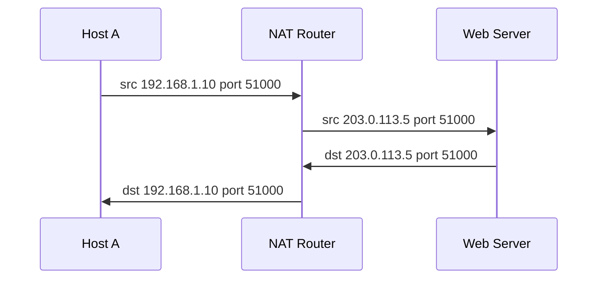

import { Callout } from "nextra/components";

# NAT

Phần lớn thiết bị trong nhà và công ty dùng **private address** (đã gặp ở bài IPv4) vốn không định tuyến được trên Internet công cộng. Cầu nối giúp chúng vẫn ra Internet được chính là **NAT** (Network Address Translation — kỹ thuật router viết lại địa chỉ IP trong header packet khi packet đi qua, để ánh xạ giữa địa chỉ private bên trong và địa chỉ public bên ngoài, mô tả trong RFC 2663 và RFC 3022). Bài học này phân biệt ba dạng NAT — Static, Dynamic và PAT — kèm bảng translation quan sát được và use case của từng dạng.

## Vấn đề mà NAT giải quyết

Một nhà chỉ được ISP cấp **một** địa chỉ public, nhưng trong nhà có hàng chục thiết bị dùng dải private `192.168.1.0/24`. Nếu gửi packet với địa chỉ nguồn `192.168.1.10` thẳng ra Internet, không router công cộng nào biết đường trả lời, vì private address không định tuyến được.

NAT đứng ở router biên: khi packet đi ra, nó **thay** địa chỉ nguồn private bằng địa chỉ public; khi gói trả lời quay về, nó **đổi ngược** lại đúng máy bên trong. Để làm được điều đó, router duy trì một **translation table** (bảng dịch — bảng ghi lại ánh xạ giữa địa chỉ/port bên trong và bên ngoài).

<Callout type="info">
  Thuật ngữ NAT: **inside local** là địa chỉ private của máy bên trong; **inside
  global** là địa chỉ public mà thế giới bên ngoài nhìn thấy. NAT chính là việc
  ánh xạ qua lại giữa hai loại địa chỉ này.
</Callout>

## Static NAT — ánh xạ 1–1 cố định

**Static NAT** (NAT tĩnh — mỗi địa chỉ private được gán cứng với đúng một địa chỉ public, ánh xạ không đổi theo thời gian). Quản trị viên khai báo sẵn từng cặp, và ánh xạ tồn tại mãi dù có lưu lượng hay không.

```text
Translation table (Static NAT)
Inside Local        Inside Global
192.168.1.100  <->  203.0.113.10        (cố định, 1-1)
192.168.1.101  <->  203.0.113.11        (cố định, 1-1)
```

Use case: một **server bên trong cần được truy cập từ ngoài tại một địa chỉ public cố định** — ví dụ web server hay mail server. Nhờ ánh xạ cố định, người ngoài luôn gõ đúng `203.0.113.10` là tới được máy `192.168.1.100`, và DNS có thể trỏ tới địa chỉ public ổn định đó.

## Dynamic NAT — ánh xạ từ một pool

**Dynamic NAT** (NAT động — địa chỉ private được gán **tạm thời** một địa chỉ public lấy từ một **pool**, theo nguyên tắc ai cần trước cấp trước). Ánh xạ chỉ được tạo khi máy bên trong bắt đầu một phiên ra ngoài, và được trả lại pool khi phiên kết thúc.

```text
Pool public: 203.0.113.20 – 203.0.113.29  (10 địa chỉ)

Translation table (Dynamic NAT) — tại một thời điểm
Inside Local        Inside Global
192.168.1.50   ->   203.0.113.20         (cấp động khi có lưu lượng)
192.168.1.51   ->   203.0.113.21
192.168.1.52   ->   203.0.113.22
```

Use case: tổ chức có **một nhóm địa chỉ public ít hơn số host**, và muốn mỗi phiên ra ngoài được dùng một địa chỉ public riêng. Vì là 1–1 tại mỗi thời điểm, nếu pool cạn (đủ 10 máy đang dùng) thì máy thứ 11 phải **chờ** một địa chỉ được trả lại.

## PAT — nhiều máy chung một địa chỉ public

**PAT** (Port Address Translation — còn gọi là NAT overload, cho **nhiều** địa chỉ private dùng chung **một** địa chỉ public, phân biệt nhau bằng số **port** nguồn). Đây là dạng phổ biến nhất, chính là thứ chạy trong mọi router gia đình.

Vì nhiều máy dùng chung một địa chỉ public, router không thể phân biệt chúng chỉ bằng IP, nên nó còn ghi lại cả cặp `IP:port`:

```text
Translation table (PAT — overload trên 203.0.113.5)
Inside Local          Inside Global         Outside (đích)         Proto
192.168.1.10:51000    203.0.113.5:51000     93.184.216.34:443      TCP
192.168.1.11:51000    203.0.113.5:51001     93.184.216.34:443      TCP
192.168.1.12:49500    203.0.113.5:49500     142.250.72.14:80       TCP
```

Hãy để ý dòng 1 và dòng 2: cả hai máy bên trong tình cờ dùng cùng port nguồn `51000`. PAT giải quyết bằng cách **đổi port** của máy thứ hai thành `51001`, nhờ đó bộ ba `(địa chỉ public, port, đích)` vẫn là duy nhất và router biết đường trả lời về đúng máy.



Use case: **router gia đình hoặc văn phòng nhỏ** nơi hàng chục thiết bị chia sẻ đúng một địa chỉ public của ISP. Với `2^16` port khả dụng, một địa chỉ public có thể phục vụ rất nhiều phiên đồng thời.

<Callout type="warning">
  Vì máy bên trong PAT không có địa chỉ public cố định, người ngoài **không** tự
  khởi tạo kết nối vào được (chỉ phản hồi được phiên do bên trong mở ra). Muốn
  mở dịch vụ ra ngoài qua PAT cần cấu hình **port forwarding** thủ công.
</Callout>

## So sánh ba dạng NAT

| Dạng        | Ánh xạ                 | Số địa chỉ public cần | Use case tiêu biểu                          |
| ----------- | ---------------------- | --------------------- | ------------------------------------------- |
| Static NAT  | 1–1 cố định            | bằng số máy cần lộ ra | server cần địa chỉ public ổn định           |
| Dynamic NAT | 1–1 tạm từ pool        | một pool (ít hơn host)| nhiều máy ra ngoài, dùng pool địa chỉ public |
| PAT         | nhiều–1 qua `IP:port`  | chỉ **một**           | router gia đình/văn phòng chia sẻ 1 IP       |

## Tóm tắt nhanh

- **NAT** viết lại địa chỉ trong header để private address ra được Internet, dùng một **translation table** để đổi xuôi rồi đổi ngược.
- **Static NAT**: 1–1 cố định, hợp với server cần địa chỉ public ổn định.
- **Dynamic NAT**: 1–1 tạm thời lấy từ một **pool**; pool cạn thì phải chờ.
- **PAT** (overload): nhiều máy chung một địa chỉ public, phân biệt bằng **port** nguồn; phổ biến nhất, dùng ở router gia đình.

## Bài tập

### Câu hỏi lý thuyết

1. Giải thích vì sao PAT cần ghi thêm số **port** vào translation table trong khi Static NAT chỉ cần ánh xạ địa chỉ với địa chỉ.
2. Vì sao một máy bên trong PAT không thể được người ngoài chủ động kết nối tới, và cần cấu hình gì để khắc phục?

### Bài tập áp dụng

3. Một văn phòng có 1 địa chỉ public và 30 nhân viên cần truy cập web. Nên dùng dạng NAT nào? Nếu thay vào đó họ cần đưa một web server nội bộ ra Internet tại một địa chỉ public cố định thì nên dùng dạng nào? Giải thích từng lựa chọn.
4. Cho dòng translation `192.168.1.20:52000 -> 203.0.113.5:52000` (PAT). Một máy khác cũng mở phiên với port nguồn `52000`. Router sẽ ghi dòng mới ra sao, và vì sao phải làm vậy?

<details>
  <summary>Đáp án & gợi ý</summary>

1. Static NAT ánh xạ 1–1 nên mỗi địa chỉ public chỉ tương ứng một máy, địa chỉ là đủ để phân biệt. PAT cho **nhiều** máy dùng chung một địa chỉ public, nên chỉ riêng IP không phân biệt được; router phải dùng thêm **port** để bộ ba `(IP public, port, đích)` là duy nhất và biết đường trả lời về đúng máy.

2. Trong PAT, máy bên trong không có địa chỉ public riêng và chỉ xuất hiện trong translation table **sau khi nó mở phiên ra ngoài**. Người ngoài không có ánh xạ nào để nhắm tới nên không khởi tạo kết nối vào được. Khắc phục bằng **port forwarding**: cấu hình tay để một port trên địa chỉ public luôn chuyển tới một `IP:port` bên trong.

3. Cho 30 nhân viên với 1 địa chỉ public: dùng **PAT**, vì nó cho nhiều máy chia sẻ một địa chỉ public nhờ phân biệt bằng port. Để đưa web server ra ngoài tại địa chỉ public cố định: dùng **Static NAT**, vì cần ánh xạ 1–1 ổn định để DNS trỏ tới và người ngoài luôn truy cập đúng máy.

4. Router phải **đổi port** của phiên mới, ví dụ ghi `192.168.1.21:52000 -> 203.0.113.5:52001`. Vì địa chỉ public và đích có thể trùng, nếu giữ nguyên port `52000` thì hai phiên sẽ có cùng bộ ba và router không biết trả lời về máy nào; đổi port giữ cho mỗi ánh xạ là duy nhất.

</details>

## Nguồn tham khảo

- P. Srisuresh & M. Holdrege, _IP Network Address Translator (NAT) Terminology and Considerations_, RFC 2663, mục 3 (Static/Dynamic NAT, NAPT).
- P. Srisuresh & K. Egevang, _Traditional IP Network Address Translator (Traditional NAT)_, RFC 3022, mục 2.2 (NAPT/PAT).
- J. F. Kurose & K. W. Ross, _Computer Networking: A Top-Down Approach_, 8th ed., mục 4.3.4 (NAT).
