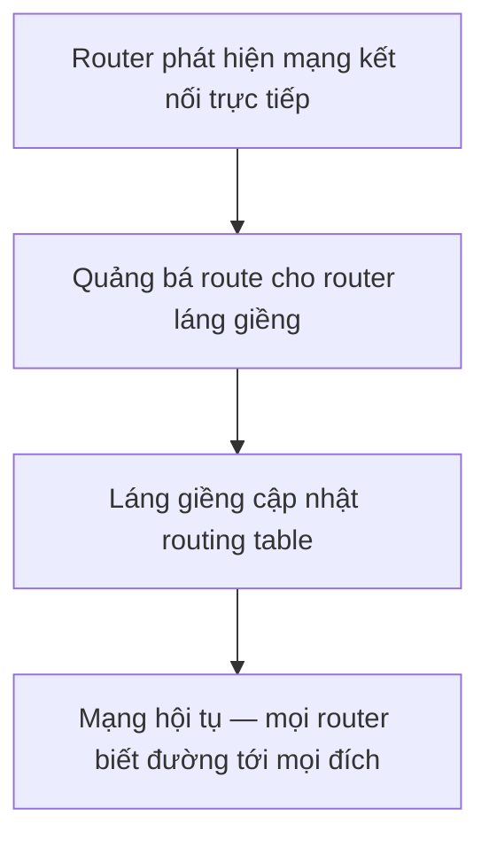

import { Callout } from "nextra/components";

# Cơ bản về Routing

Địa chỉ IP cho biết một packet cần đi **đâu**, nhưng chính **routing** (định tuyến — quá trình router chọn đường đi cho packet đi xuyên các mạng để tới đích) mới quyết định nó đi **bằng cách nào**. Bài học này phân biệt hai cách nạp đường đi vào router — static và dynamic — rồi giới thiệu ba dynamic routing protocol tiêu biểu là RIP, OSPF và BGP, và quan trọng nhất là khi nào nên dùng cái nào.

## Routing table — trái tim của router

Mọi quyết định định tuyến đều dựa trên **routing table** (bảng định tuyến — bảng liệt kê mạng đích kèm next hop và interface để chuyển packet ra ngoài). Với mỗi packet, router tra địa chỉ đích trong bảng, chọn dòng khớp dài nhất (longest prefix match), rồi đẩy packet tới **next hop** (chặng kế tiếp — địa chỉ router liền kề trên đường tới đích).

Đây là một routing table quan sát được trên một host Linux:

```bash
$ ip route
default via 192.168.1.1 dev eth0
10.0.0.0/8 via 192.168.1.254 dev eth0
192.168.1.0/24 dev eth0 proto kernel scope link src 192.168.1.50
```

Dòng `default` (tức `0.0.0.0/0`) là **default route** — nơi gửi mọi packet không khớp dòng nào khác, thường trỏ ra Internet. Hai dòng còn lại nói: muốn tới mạng `10.0.0.0/8` thì qua next hop `192.168.1.254`, còn mạng `192.168.1.0/24` thì nối trực tiếp trên `eth0`.

## Static routing

**Static routing** (định tuyến tĩnh — quản trị viên tự tay khai báo từng tuyến đường vào router) nghĩa là con người nhập sẵn các dòng trong routing table.

```bash
# Thêm tuyến tĩnh: muốn tới 10.0.0.0/8 thì đi qua 192.168.1.254
$ ip route add 10.0.0.0/8 via 192.168.1.254
```

Ưu điểm: đơn giản, không tốn băng thông hay CPU cho việc trao đổi thông tin, dễ đoán và an toàn (không bị router lạ "quảng bá" đường sai). Nhược điểm: không tự thích nghi — nếu một liên kết hỏng, router vẫn cố đẩy packet theo đường cũ cho tới khi có người sửa bằng tay; và không mở rộng nổi cho mạng lớn có hàng nghìn tuyến.

<Callout type="info">
  Static routing hợp với mạng nhỏ, mạng **stub** (mạng chỉ có một lối ra duy
  nhất), hoặc để khai báo một **default route** trỏ ra ISP. Khi số router và số
  tuyến tăng lên, việc cấu hình tay trở nên bất khả thi.
</Callout>

## Dynamic routing

**Dynamic routing** (định tuyến động — các router tự trao đổi thông tin qua một routing protocol và tự xây dựng routing table) để các router tự "nói chuyện" và cập nhật đường đi khi topology thay đổi.



Ưu điểm: tự thích nghi khi liên kết hỏng (tự tìm đường vòng) và mở rộng tốt cho mạng lớn. Nhược điểm: tốn thêm CPU, bộ nhớ và băng thông cho việc trao đổi, đồng thời cấu hình phức tạp hơn. Một khái niệm quan trọng là **convergence** (hội tụ — thời gian để mọi router thống nhất lại routing table sau khi topology đổi); protocol hội tụ càng nhanh thì mạng càng ít gián đoạn.

## Ba dynamic routing protocol tiêu biểu

Ba protocol dưới đây đại diện cho ba cách tiếp cận khác nhau và ba phạm vi sử dụng khác nhau.

**RIP** (Routing Information Protocol — protocol kiểu **distance-vector**, mỗi router chỉ báo cho hàng xóm "tôi cách mạng X bao nhiêu hop"). RIP dùng **metric** (thước đo chọn đường) là **hop count** (số router phải đi qua), tối đa 15 hop, và gửi cập nhật định kỳ mỗi 30 giây. Đơn giản nhưng hội tụ chậm và không hợp mạng lớn.

**OSPF** (Open Shortest Path First — protocol kiểu **link-state**, mỗi router nắm bản đồ đầy đủ của vùng mạng rồi tự tính đường ngắn nhất bằng thuật toán Dijkstra). Metric của OSPF là **cost** suy từ bandwidth, hội tụ nhanh và chia mạng thành **area** để mở rộng. OSPF là lựa chọn phổ biến cho mạng nội bộ doanh nghiệp lớn.

**BGP** (Border Gateway Protocol — protocol kiểu **path-vector**, trao đổi đường đi giữa các **autonomous system** và mang theo cả danh sách AS mà tuyến đã đi qua). BGP là protocol định tuyến **giữa các tổ chức**, tức xương sống của Internet; nó chọn đường dựa trên AS-path và chính sách (policy) chứ không thuần theo khoảng cách.

<Callout type="info">
  **Autonomous System (AS)** là một tập mạng dưới quyền quản trị của một tổ chức
  (ví dụ một ISP). RIP và OSPF là **IGP** (Interior Gateway Protocol — chạy *bên
  trong* một AS); BGP là **EGP** (Exterior Gateway Protocol — chạy *giữa* các
  AS).
</Callout>

## So sánh: khi nào dùng cái nào

```text
Destination      Next Hop        Metric   Interface   Nguồn route
0.0.0.0/0        203.0.113.1     -        eth0        Static (default)
10.1.0.0/16      10.0.0.2        20       eth1        OSPF
172.16.0.0/12    10.0.0.6        3        eth1        RIP
198.51.100.0/24  10.0.0.10       AS-path  eth2        BGP
```

Bảng trên cho thấy một routing table thực tế có thể gồm tuyến từ nhiều nguồn. Bảng so sánh dưới đây tóm tắt khi nào mỗi loại phù hợp:

| Loại   | Kiểu            | Metric           | Phạm vi | Hội tụ         | Khi nào dùng                           |
| ------ | --------------- | ---------------- | ------- | -------------- | -------------------------------------- |
| Static | (thủ công)      | (không có)       | tùy ý   | tức thì khi gõ | mạng nhỏ, stub, default route          |
| RIP    | distance-vector | hop count (≤ 15) | IGP     | chậm           | mạng nhỏ, đơn giản, ít router          |
| OSPF   | link-state      | cost (bandwidth) | IGP     | nhanh          | mạng doanh nghiệp lớn, nhiều area      |
| BGP    | path-vector     | AS-path + policy | EGP     | chậm nhưng ổn  | giữa các AS / định tuyến trên Internet |

Nguyên tắc chọn nhanh: mạng nhỏ và tĩnh thì dùng **static**; mạng nội bộ vừa và lớn cần tự thích nghi thì dùng **OSPF** (hoặc RIP nếu rất nhỏ và muốn đơn giản); còn để kết nối tổ chức của bạn với phần còn lại của Internet thì bắt buộc dùng **BGP**.

## Tóm tắt nhanh

- Router chọn đường dựa trên **routing table**, khớp **longest prefix match** rồi chuyển packet tới **next hop**; `0.0.0.0/0` là **default route**.
- **Static routing**: khai báo tay — đơn giản, an toàn, nhưng không tự thích nghi; hợp mạng nhỏ và stub.
- **Dynamic routing**: router tự trao đổi và cập nhật — thích nghi và mở rộng tốt, đổi lại tốn tài nguyên.
- **RIP** = distance-vector (hop count, ≤ 15); **OSPF** = link-state (cost, hội tụ nhanh, IGP); **BGP** = path-vector (AS-path, EGP, xương sống Internet).

## Bài tập

### Câu hỏi lý thuyết

1. Phân biệt static routing và dynamic routing theo ba tiêu chí: khả năng thích nghi khi liên kết hỏng, chi phí tài nguyên, và khả năng mở rộng.
2. Vì sao BGP được xếp là EGP còn OSPF và RIP là IGP? Hãy gắn khái niệm autonomous system vào câu trả lời.

### Bài tập áp dụng

3. Một mạng nội bộ doanh nghiệp có khoảng 200 router, nhiều đường dự phòng, và cần hội tụ nhanh khi một liên kết hỏng. Nên chọn RIP hay OSPF? Giải thích dựa trên metric và tốc độ hội tụ.
4. Đọc dòng routing table sau và diễn giải: `10.1.0.0/16 via 10.0.0.2 dev eth1`. Cho biết mạng đích, next hop và interface ra.

<details>
  <summary>Đáp án & gợi ý</summary>

1. **Thích nghi**: static không tự đổi đường khi liên kết hỏng (phải sửa tay), dynamic tự tìm đường vòng. **Tài nguyên**: static không tốn CPU/băng thông trao đổi, dynamic tốn cho việc cập nhật định kỳ và tính toán. **Mở rộng**: static bất khả thi khi số tuyến lớn, dynamic mở rộng tốt nhờ tự động hóa.

2. **Autonomous system (AS)** là tập mạng dưới một quyền quản trị. RIP và OSPF chạy **bên trong** một AS để định tuyến nội bộ nên là IGP; BGP trao đổi tuyến **giữa** các AS khác nhau (ví dụ giữa hai ISP) nên là EGP.

3. Chọn **OSPF**. Với 200 router và yêu cầu hội tụ nhanh, RIP không phù hợp vì giới hạn 15 hop và hội tụ chậm. OSPF dùng metric **cost** theo bandwidth (chọn đường thực sự nhanh, không chỉ ít hop), hội tụ nhanh nhờ thuật toán link-state, và chia **area** để mở rộng cho mạng lớn.

4. Mạng đích là `10.1.0.0/16`; **next hop** là `10.0.0.2` (router kế tiếp cần chuyển packet tới); **interface ra** là `eth1`. Nghĩa là: mọi packet có đích thuộc `10.1.0.0/16` sẽ được gửi qua `eth1` tới router `10.0.0.2`.

</details>

## Nguồn tham khảo

- G. Malkin, _RIP Version 2_, RFC 2453, mục 3 (distance-vector và hop count).
- J. Moy, _OSPF Version 2_, RFC 2328, mục 1–2 (link-state, SPF).
- Y. Rekhter, T. Li & S. Hares (eds.), _A Border Gateway Protocol 4 (BGP-4)_, RFC 4271, mục 1 (path-vector giữa các AS).
- J. F. Kurose & K. W. Ross, _Computer Networking: A Top-Down Approach_, 8th ed., mục 5.2–5.4 (Routing Algorithms, OSPF, BGP).
