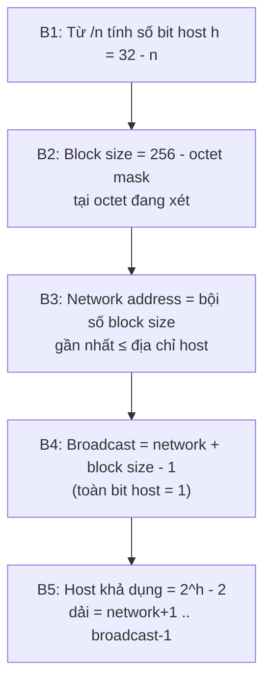

import { Callout } from "nextra/components";

# Chia mạng con (Subnetting)

**Subnetting** (chia mạng con — kỹ thuật mượn bớt bit từ phần host để tách một mạng lớn thành nhiều mạng nhỏ hơn) là kỹ năng tính toán quan trọng nhất của tầng Network. Bài học này xây dựng một quy trình tính tay rõ ràng, rồi đi qua bốn ví dụ tính toán đầy đủ từng bước — giống như cách bài CRC chia nhị phân từng dòng. Với mỗi mạng, ta luôn xác định ba thứ: **network address**, **broadcast address** và **số host khả dụng** cùng dải địa chỉ host.

## Vì sao phải chia mạng con

Một tổ chức được cấp mạng `192.168.1.0/24` (256 địa chỉ) nhưng có 4 phòng ban, mỗi phòng cần một mạng riêng để cô lập lưu lượng và bảo mật. Thay vì xin thêm địa chỉ, ta **mượn** vài bit đầu của phần host để tạo ra số hiệu mạng con, biến một `/24` thành bốn `/26`. Đó chính là subnetting.

Cái giá phải trả: mỗi mạng con vẫn mất 2 địa chỉ cho network address và broadcast address, nên chia càng nhỏ thì tổng số host khả dụng càng giảm.

## Bốn đại lượng cần nhớ

Mọi bài subnetting đều xoay quanh bốn đại lượng, suy ra từ **prefix length** `/n`:

```text
Số bit host         h = 32 - n
Tổng số địa chỉ     = 2^h
Số host khả dụng    = 2^h - 2        (trừ network + broadcast)
Block size          = 2^(số bit host trong octet đang xét)
                      = 256 - (giá trị octet tương ứng của mask)
```

**Block size** (kích thước khối — khoảng cách giữa hai network address liên tiếp trong octet đang xét) là chìa khóa tính nhanh: các network address luôn là bội số của block size, và broadcast address của một mạng con là địa chỉ ngay trước network address kế tiếp.

## Quy trình 5 bước



Bây giờ áp dụng quy trình này vào từng ví dụ.

## Ví dụ 1 — `192.168.10.0/24` (khởi động)

Đây là trường hợp đơn giản nhất: ranh giới rơi đúng vào octet thứ tư.

```text
Bước 1: n = 24  ->  h = 32 - 24 = 8 bit host
Bước 2: mask = 255.255.255.0 ; octet xét = octet 4 ; block size = 256 - 0 = 256
Bước 3: network address = 192.168.10.0
Bước 4: broadcast = network + 256 - 1 = 192.168.10.255
Bước 5: host khả dụng = 2^8 - 2 = 254 ; dải = 192.168.10.1 .. 192.168.10.254
```

Kết quả:

```text
Network address : 192.168.10.0
Host khả dụng   : 192.168.10.1  ->  192.168.10.254   (254 host)
Broadcast       : 192.168.10.255
```

## Ví dụ 2 — host `192.168.1.100/26`

Lần này ta mượn 2 bit của octet thứ tư (`/24` thành `/26`), nên octet thứ tư bị chia nhỏ. Câu hỏi: host `192.168.1.100` nằm trong mạng con nào?

```text
Bước 1: n = 26  ->  h = 32 - 26 = 6 bit host
Bước 2: mask = 255.255.255.192 (vì 11000000 = 192) ; block size = 256 - 192 = 64
        => các network address: .0, .64, .128, .192
Bước 3: 100 nằm giữa 64 và 128, nên network = 192.168.1.64
```

Xác nhận bằng phép `AND` ở octet thứ tư:

```text
IP:        192.168.1.100  = 11000000.10101000.00000001.01100100
Mask /26:                   11111111.11111111.11111111.11000000
AND        -------------------------------------------------------
Network:   192.168.1.64   = 11000000.10101000.00000001.01000000
```

Tiếp tục tính broadcast và dải host:

```text
Bước 4: broadcast = 64 + 64 - 1 = 127  ->  192.168.1.127
        (kiểm tra: bit host toàn 1 = 01111111 = 127, đúng)
Bước 5: host khả dụng = 2^6 - 2 = 62 ; dải = 192.168.1.65 .. 192.168.1.126
```

Kết quả:

```text
Network address : 192.168.1.64
Host khả dụng   : 192.168.1.65  ->  192.168.1.126   (62 host)
Broadcast       : 192.168.1.127
```

## Ví dụ 3 — host `172.16.20.10/20` (ranh giới qua octet thứ ba)

Khi prefix nhỏ hơn 24, ranh giới network/host rơi vào octet thứ ba. Đây là trường hợp khiến nhiều người nhầm, nên ta làm thật chậm.

```text
Bước 1: n = 20  ->  h = 32 - 20 = 12 bit host
Bước 2: /20 = 11111111.11111111.11110000.00000000 = 255.255.240.0
        octet xét = octet 3 ; block size = 256 - 240 = 16
        => network address (octet 3): 0, 16, 32, 48, ...
Bước 3: octet 3 của host = 20, nằm giữa 16 và 32, nên block = 16
        => network = 172.16.16.0
```

Xác nhận bằng phép `AND` ở octet thứ ba:

```text
IP:        172.16.20.10  = 10101100.00010000.00010100.00001010
Mask /20:                  11111111.11111111.11110000.00000000
AND        ------------------------------------------------------
Network:   172.16.16.0   = 10101100.00010000.00010000.00000000
```

Broadcast nằm ngay trước network kế tiếp (`172.16.32.0`), nên octet 3 là `31` và octet 4 là `255`:

```text
Bước 4: broadcast = 172.16.(16+16-1).255 = 172.16.31.255
Bước 5: host khả dụng = 2^12 - 2 = 4094
        dải = 172.16.16.1 .. 172.16.31.254
```

Kết quả:

```text
Network address : 172.16.16.0
Host khả dụng   : 172.16.16.1  ->  172.16.31.254   (4094 host)
Broadcast       : 172.16.31.255
```

## Ví dụ 4 — thiết kế: chia `192.168.5.0/24` cho các mạng ≥ 50 host

Ba ví dụ trên đi từ địa chỉ ra mạng con. Ví dụ này đi ngược: từ **yêu cầu** chọn prefix. Đề bài: chia `192.168.5.0/24` thành các mạng con bằng nhau, mỗi mạng chứa được **ít nhất 50 host**.

```text
Bước 1: cần 2^h - 2 ≥ 50  ->  thử h = 5: 2^5 - 2 = 30 (thiếu)
                              thử h = 6: 2^6 - 2 = 62 (đủ)
        => chọn h = 6 bit host  ->  prefix = 32 - 6 = /26
Bước 2: /26  ->  block size = 64  ->  chia /24 thành 2^(26-24) = 4 mạng con
```

Bốn mạng con thu được, mỗi mạng 62 host khả dụng (đủ cho 50):

```text
Mạng con          Network        Host khả dụng                Broadcast
192.168.5.0/26    192.168.5.0    192.168.5.1   .. .62         192.168.5.63
192.168.5.64/26   192.168.5.64   192.168.5.65  .. .126        192.168.5.127
192.168.5.128/26  192.168.5.128  192.168.5.129 .. .190        192.168.5.191
192.168.5.192/26  192.168.5.192  192.168.5.193 .. .254        192.168.5.255
```

<Callout type="warning">
  Đừng chọn prefix vừa khít số host yêu cầu mà quên trừ 2. Mạng cần 50 host
  **không** dùng được `/27` (chỉ 30 host khả dụng); phải lên `/26` (62 host).
  Luôn áp dụng `2^h - 2` rồi mới kết luận.
</Callout>

<Callout type="info">
  Hai ngoại lệ đáng nhớ: `/31` (RFC 3021) dùng cho link point-to-point và có
  **2** địa chỉ đều dùng được (không có network/broadcast riêng); `/32` là một
  địa chỉ host đơn lẻ, thường dùng cho loopback hoặc route tới một máy cụ thể.
</Callout>

## Tóm tắt nhanh

- Subnetting **mượn bit host** để tạo mạng con; mỗi mạng con vẫn mất 2 địa chỉ cho network + broadcast.
- **Block size** = `256 - octet_mask`; network address là bội số của block size, broadcast là địa chỉ ngay trước network kế tiếp.
- **Network address**: toàn bit host = `0` (lấy `IP AND mask`). **Broadcast**: toàn bit host = `1`.
- **Host khả dụng** = `2^(32-n) - 2`; dải host = `network + 1` đến `broadcast - 1`.
- Thiết kế từ yêu cầu: chọn `h` nhỏ nhất sao cho `2^h - 2 ≥ số host cần`, rồi suy ra prefix.

## Bài tập

### Câu hỏi lý thuyết

1. Vì sao mỗi mạng con luôn mất đúng 2 địa chỉ không gán được cho host? Hai địa chỉ đó tên là gì và đặc điểm bit host của chúng ra sao?
2. Một đồng nghiệp nói "mạng `/27` chứa được 32 host". Hãy chỉ ra chỗ sai và sửa lại cho đúng.

### Bài tập tính toán

3. Cho host `192.168.100.130/27`. Hãy tính từng bước: (a) block size; (b) network address; (c) broadcast address; (d) số host khả dụng và dải host.
4. Bạn cần chia mạng `10.0.0.0/24` thành các mạng con, mỗi mạng phục vụ **đúng 12 host**. Hãy chọn prefix length nhỏ nhất phù hợp, cho biết mỗi mạng con có bao nhiêu host khả dụng và tổng cộng tạo được bao nhiêu mạng con.

<details>
  <summary>Đáp án & gợi ý</summary>

1. Mỗi mạng con dành riêng **network address** (toàn bit host = `0`, dùng để định danh chính mạng đó) và **broadcast address** (toàn bit host = `1`, dùng để gửi tới mọi host trong mạng). Vì hai địa chỉ này không gán cho thiết bị nên số host khả dụng là `2^h - 2`.

2. `/27` có `h = 32 - 27 = 5` bit host, nên **tổng** địa chỉ là `2^5 = 32`, nhưng **host khả dụng** chỉ là `2^5 - 2 = 30`. Đồng nghiệp đã quên trừ network address và broadcast address.

3. Với `/27`:

   ```text
   (a) mask octet 4 = 11100000 = 224 ; block size = 256 - 224 = 32
       => các network: .0, .32, .64, .96, .128, .160, .192, .224
   (b) 130 nằm giữa 128 và 160  ->  network = 192.168.100.128
   (c) broadcast = 128 + 32 - 1 = 159  ->  192.168.100.159
   (d) host khả dụng = 2^5 - 2 = 30 ; dải = 192.168.100.129 .. 192.168.100.158
   ```

4. Cần `2^h - 2 ≥ 12`: thử `h = 3` ⇒ `2^3 - 2 = 6` (thiếu); thử `h = 4` ⇒ `2^4 - 2 = 14` (đủ). Vậy `h = 4` ⇒ prefix `/28`. Mỗi `/28` có **14 host khả dụng** (đủ cho 12). Số mạng con từ `/24` xuống `/28` = `2^(28-24) = 16` mạng con.

</details>

## Nguồn tham khảo

- V. Fuller & T. Li, _Classless Inter-domain Routing (CIDR): The Internet Address Assignment and Aggregation Plan_, RFC 4632, mục 3.1–3.2 (prefix và phép gộp/chia).
- P. Mogul & J. Postel, _Internet Standard Subnetting Procedure_, RFC 950 (thủ tục subnetting gốc).
- A. Retana và cộng sự, _Using 31-Bit Prefixes on IPv4 Point-to-Point Links_, RFC 3021 (ngoại lệ `/31`).
- J. F. Kurose & K. W. Ross, _Computer Networking: A Top-Down Approach_, 8th ed., mục 4.3.3 (Subnets và CIDR).
