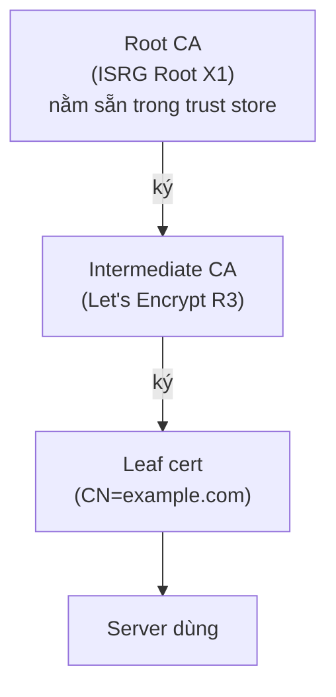
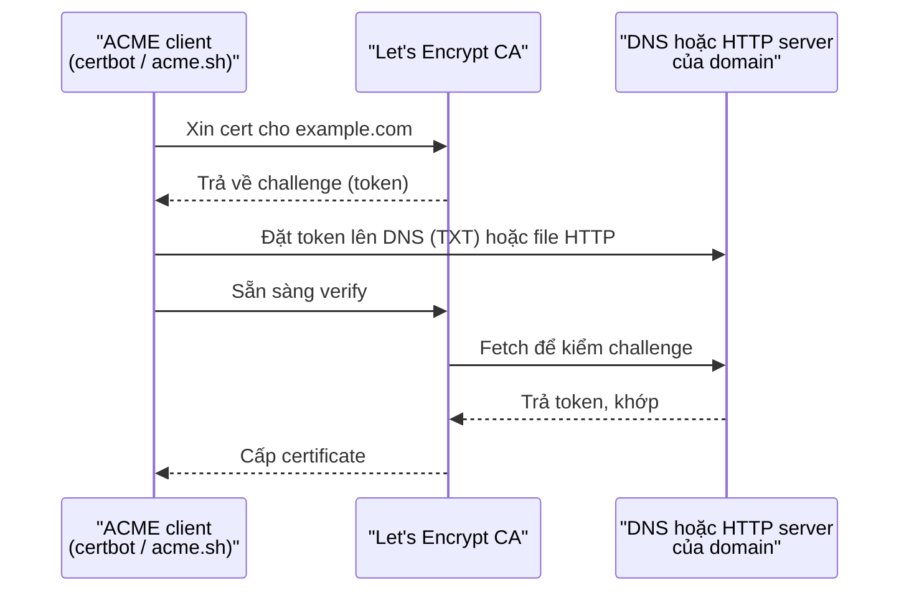

import { Callout } from "nextra/components";

# Certificate trong thực tế

Bài **Mã hóa** đã giải thích **certificate** là gì và vai trò của **CA** trong TLS handshake. Bài này đi tiếp một bước: **thực tế** một developer làm gì với certificate — xin ở đâu, cài thế nào, quay vòng ra sao, và khi nào cert bị vấn đề thì đọc log kiểu gì. Ngày nay, ai cũng dùng được HTTPS miễn phí nhờ **Let's Encrypt** và **ACME protocol**, nhưng vẫn có nhiều bẫy cấu hình mà một dev nên tránh.

## Cấu trúc một certificate

Một certificate là một tài liệu **X.509** (chuẩn định dạng, mã hóa DER hoặc PEM) chứa vài trường quan trọng. Xem một cert cụ thể bằng `openssl`:

```bash
$ openssl x509 -in cert.pem -noout -text | head -30
Certificate:
    Data:
        Version: 3 (0x2)
        Serial Number: a3:f2:c8:91:e0:d5:12:34:56:78:9a:bc:de:f0:12:34
        Signature Algorithm: sha256WithRSAEncryption
        Issuer: C=US, O=Let's Encrypt, CN=R3
        Validity
            Not Before: Nov 15 10:30:00 2024 GMT
            Not After : Feb 13 10:30:00 2025 GMT
        Subject: CN=example.com
        Subject Public Key Info:
            Public Key Algorithm: rsaEncryption
                Public-Key: (2048 bit)
                ...
        X509v3 extensions:
            X509v3 Subject Alternative Name:
                DNS:example.com, DNS:www.example.com
```

Các trường dev thường đọc:

- **Subject** (`CN=example.com`) — tên "chính" của cert. Historically browser dùng trường này để match hostname.
- **Subject Alternative Name (SAN)** — danh sách tên miền mà cert phục vụ. **Đây mới là trường browser hiện đại thực sự dùng để match**; CN đã lỗi thời. Một cert SAN có thể chứa nhiều domain: `example.com`, `www.example.com`, `api.example.com`.
- **Issuer** (`CN=R3`) — ai ký cert này (một CA của Let's Encrypt).
- **Validity** — cert chỉ hợp lệ trong khoảng thời gian này. Let's Encrypt cấp 90 ngày; cert thương mại thường 1 năm (đang giảm xuống 398 ngày và có thể ngắn hơn).
- **Public Key** — khóa công khai của server. Server giữ private key tương ứng, không bao giờ chia sẻ.

<Callout type="warning">
  Nếu cert liệt kê SAN `example.com` mà browser truy cập `www.example.com`,
  browser sẽ **báo lỗi cert dù cert vẫn còn hạn và do CA hợp lệ ký**. Cần thêm
  `www.example.com` vào SAN, hoặc dùng **wildcard cert** `*.example.com` phủ mọi
  subdomain.
</Callout>

## Chuỗi certificate và trust store

Browser không tin trực tiếp cert của server bạn. Nó tin cert đó vì cert được **ký** bởi một **intermediate CA**, mà intermediate CA đó lại được ký bởi một **root CA** đã có sẵn trong **trust store** (kho CA tin cậy — danh sách các root cert được nhúng sẵn trong browser/OS).



Server phải gửi **cả chuỗi** (leaf + intermediate) khi handshake để browser xác thực ngược tới root. Nếu server thiếu intermediate, một số client vẫn xác thực được (fetch bổ sung qua AIA), nhưng nhiều client sẽ báo lỗi. Đây là bug cấu hình cực kỳ phổ biến — quên đưa intermediate vào file cert.

Kiểm tra chuỗi thực tế:

```bash
$ openssl s_client -connect example.com:443 -showcerts </dev/null 2>/dev/null | grep -E "s:|i:"
depth=2 C = US, O = Internet Security Research Group, CN = ISRG Root X1
depth=1 C = US, O = Let's Encrypt, CN = R3
depth=0 CN = example.com
```

Ba dòng cho biết chuỗi có 3 cấp: leaf → intermediate → root. Nếu chỉ thấy 1 dòng (leaf), server đang gửi thiếu — cần fix cấu hình.

## Let's Encrypt và ACME

**Let's Encrypt** là CA công cộng, miễn phí, cấp cert 90 ngày cho hàng trăm triệu website. Nó thay đổi Internet một cách âm thầm: HTTPS từ chỗ đắt và khó thành mặc định.

**ACME** (Automatic Certificate Management Environment — RFC 8555, protocol tự động hóa việc xin và quay vòng cert) là cơ chế đứng sau. Thay vì gọi điện cho CA và mail giấy tờ, client ACME nói chuyện với CA bằng API và tự chứng minh sở hữu domain qua "challenge":



Hai loại challenge phổ biến:

- **HTTP-01**: client đặt một file tại `/.well-known/acme-challenge/<token>` trên web server; CA fetch qua HTTP để xác nhận. Đơn giản, hoạt động cho domain có web server đang chạy port 80.
- **DNS-01**: client tạo một TXT record `_acme-challenge.example.com` với nội dung token; CA query DNS để xác nhận. Duy nhất hỗ trợ **wildcard cert** (`*.example.com`) và không cần server public.

Trong thực tế:

```bash
# Cách đơn giản nhất với certbot trên nginx
$ sudo certbot --nginx -d example.com -d www.example.com

# Với wildcard (bắt buộc DNS-01)
$ sudo certbot certonly --dns-cloudflare -d "*.example.com" -d example.com
```

Certbot tự động: xin cert, cài vào nginx, thiết lập cron job **quay vòng** trước khi hết hạn 30 ngày. Nếu bạn dùng Caddy, Traefik, hoặc HAProxy phiên bản mới, chúng có ACME client tích hợp — chỉ cần khai domain, tất cả tự động.

<Callout type="info">
  **Nhớ nguyên tắc**: private key **không bao giờ rời** server (không commit lên
  git, không gửi qua chat). Public key nằm trong cert, ai cũng đọc được. Nếu
  private key bị lộ, phải **revoke cert** và cấp lại ngay — đợi hết hạn là quá
  muộn.
</Callout>

## Quay vòng (rotation) và tự động hóa

Cert 90 ngày ép chúng ta **tự động hóa** hoàn toàn việc quay vòng. Đây là chuyển đổi mà cert 1-2 năm không buộc phải làm. Ba nguyên tắc:

**Renew sớm, không đợi hết hạn**. Certbot mặc định renew khi cert còn dưới 30 ngày; sai lệch nhỏ hay bug tạm thời không làm cert hết hạn thật sự. Nếu renew fail thì có 30 ngày để dev fix trước khi user thấy lỗi.

**Reload service sau khi renew**. Cert mới cấp trên đĩa không tự nạp vào nginx/HAProxy đang chạy — cần `nginx -s reload` hoặc `systemctl reload nginx`. Certbot có hook `--deploy-hook` để chạy lệnh này tự động.

**Monitor thời hạn**. Dù đã tự động hóa, vẫn set alert (Prometheus, Datadog, Uptime Robot) cảnh báo trước 7-14 ngày nếu cert sắp hết hạn — phòng khi cron job im lặng bị hỏng. Kiểm tra bằng script:

```bash
$ echo | openssl s_client -connect example.com:443 -servername example.com 2>/dev/null \
    | openssl x509 -noout -dates
notBefore=Nov 15 10:30:00 2024 GMT
notAfter=Feb 13 10:30:00 2025 GMT
```

## Certificate Transparency

**Certificate Transparency (CT)** — RFC 9162, cơ chế mọi CA công cộng phải công bố cert đã cấp vào các **log công khai**. Mục đích: nếu một CA bị xâm nhập và cấp cert lậu cho `google.com`, cert đó xuất hiện trong CT log và bị phát hiện.

Với developer, CT log là công cụ điều tra:

```bash
# Search cert cấp cho một domain (qua site crt.sh)
# https://crt.sh/?q=example.com
```

Nếu thấy cert được cấp cho domain của bạn mà bạn không xin, đó là dấu hiệu tài khoản ACME hoặc DNS bị xâm nhập. Cũng dùng để phát hiện subdomain lộ (dev đăng ký cert cho `staging.example.com` và quên xóa thì attacker thấy được).

## Ba lỗi cert thường gặp và cách đọc

Học đọc lỗi giúp bạn debug nhanh:

**`NET::ERR_CERT_DATE_INVALID`** — cert hết hạn hoặc chưa hiệu lực. Kiểm bằng `openssl` xem `notAfter` đã qua chưa; cron ACME renew có bị lỗi không.

**`NET::ERR_CERT_COMMON_NAME_INVALID`** — hostname truy cập không nằm trong SAN của cert. Thêm hostname vào lần xin cert kế tiếp, hoặc dùng wildcard.

**`NET::ERR_CERT_AUTHORITY_INVALID`** — không xác thực được chuỗi tới root tin cậy. Thường là server thiếu intermediate cert (fix: gộp `chain.pem` vào `fullchain.pem`), hoặc CA nội bộ tự ký nhưng không cài vào trust store của client.

Xem thẳng handshake để chẩn đoán:

```bash
$ curl -v https://example.com/ 2>&1 | grep -E "SSL|TLS|certificate"
* SSL connection using TLSv1.3 / TLS_AES_256_GCM_SHA384
* Server certificate:
*  subject: CN=example.com
*  start date: Nov 15 10:30:00 2024 GMT
*  expire date: Feb 13 10:30:00 2025 GMT
*  issuer: CN=R3
*  SSL certificate verify ok.
```

`SSL certificate verify ok` là dòng bạn muốn thấy. Nếu thay bằng `SSL certificate problem:` thì đọc dòng kế để biết loại lỗi.

## Tóm tắt nhanh

- Cert X.509 chứa **Subject/SAN** (domain phục vụ), **Issuer** (CA ký), **Validity** (thời hạn), và **Public Key**. Browser hiện đại match hostname với **SAN**, không phải CN.
- Server phải gửi **chuỗi đầy đủ** (leaf + intermediate); root nằm sẵn trong **trust store** của client.
- **Let's Encrypt** cấp cert 90 ngày miễn phí qua **ACME protocol**; challenge phổ biến là **HTTP-01** và **DNS-01** (DNS-01 hỗ trợ wildcard).
- Cert ngắn hạn ép tự động hóa: renew sớm, reload service sau khi renew, monitor thời hạn.
- **Certificate Transparency** log công khai giúp phát hiện cert bất thường; công cụ điều tra là **crt.sh**.
- Ba lỗi cert phổ biến: hết hạn (`DATE_INVALID`), hostname không khớp (`COMMON_NAME_INVALID`), thiếu chuỗi (`AUTHORITY_INVALID`).

## Bài tập

### Câu hỏi lý thuyết

1. Vì sao browser hiện đại match hostname với **SAN** thay vì **CN**? Điều gì xảy ra nếu cert có `CN=example.com` nhưng SAN chỉ chứa `www.example.com` và bạn truy cập `https://example.com`?
2. So sánh **HTTP-01** với **DNS-01** challenge của ACME. Với domain của một service nội bộ không có web server public (chỉ truy cập từ trong VPN), bạn nên dùng challenge nào? Tại sao?

### Bài tập tình huống

3. Bạn triển khai cert mới lên nginx bằng certbot. Bằng curl, mọi thứ ổn; nhưng một Go client tự viết báo lỗi "x509: certificate signed by unknown authority", trong khi Go client đó vẫn gọi được các HTTPS site khác. Chẩn đoán nguyên nhân có thể nhất và cách sửa (gợi ý: liên hệ tới "chuỗi certificate").

### Thực hành

4. Với một domain của bạn, chạy `echo | openssl s_client -connect <domain>:443 -servername <domain> 2>/dev/null | openssl x509 -noout -text` và tìm các trường: (a) Subject và Subject Alternative Name; (b) Issuer; (c) Not After. Cert còn bao nhiêu ngày, và Issuer là ai (Let's Encrypt? DigiCert? một CA nội bộ)?

<details>
  <summary>Đáp án & gợi ý</summary>

1. Historically CN là "tên chính" của cert, nhưng nó chỉ mang **một** hostname và không có format chuẩn (browser phải parse chuỗi text). SAN là extension chuẩn hóa mang **nhiều** hostname và có type rõ ràng (DNS, IP, email). Từ 2000s trở đi, các RFC và trình duyệt di chuyển sang chỉ dùng SAN. Nếu cert có `CN=example.com` nhưng SAN chỉ `www.example.com`, browser truy cập `https://example.com` sẽ **báo lỗi hostname mismatch** — CN không được nhìn tới; SAN là nguồn duy nhất và không chứa `example.com`.

2. **HTTP-01**: CA fetch một file trên web server domain của bạn qua HTTP port 80; đơn giản, nhưng cần web server public accessible. **DNS-01**: bạn tạo TXT record trong DNS của domain; CA query DNS để verify; **duy nhất hỗ trợ wildcard** (`*.example.com`) và **không cần web server public** — chỉ cần DNS resolve được từ Internet. Với service nội bộ không có web public, **DNS-01** là lựa chọn duy nhất khả thi: bạn có DNS record trong zone của mình (kể cả cho tên nội bộ nếu zone đó resolve công khai), CA verify được mà không cần chạm server.

3. Nguyên nhân có thể nhất: **server thiếu intermediate certificate** trong bundle. Curl và browser thường có cơ chế fetch bổ sung intermediate qua AIA, nhưng Go's TLS library **không** làm điều đó — nó yêu cầu server gửi chuỗi đầy đủ. Fix: đảm bảo dùng `fullchain.pem` (do certbot sinh) thay vì chỉ `cert.pem` trong nginx. Kiểm bằng `openssl s_client -connect ... -showcerts` — phải thấy ít nhất 2 cert (leaf + intermediate).

4. Đáp án tùy domain. Điểm cần thấy: (a) Subject có `CN`, SAN liệt kê một hoặc nhiều `DNS:...`; (b) Issuer thường là "Let's Encrypt R3/R10/E1" hoặc "DigiCert", "Sectigo"; (c) Not After là ngày hết hạn — tính khoảng cách tới hôm nay để biết còn bao nhiêu ngày. Nếu còn dưới 30 ngày mà ACME chưa renew, kiểm cron/systemd timer.

</details>

## Nguồn tham khảo

- R. Barnes et al., _Automatic Certificate Management Environment (ACME)_, RFC 8555, mục 7 (challenge types) và mục 8 (identifier validation).
- D. Cooper et al., _Internet X.509 Public Key Infrastructure Certificate and CRL Profile_, RFC 5280, mục 4 (Certificate profile).
- Let's Encrypt, _How It Works_ documentation và _Chain of Trust_ page — mô tả chuỗi cert và Root CA.
- B. Laurie et al., _Certificate Transparency Version 2.0_, RFC 9162.
