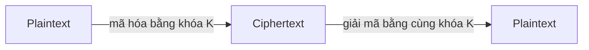
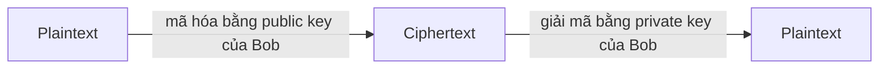
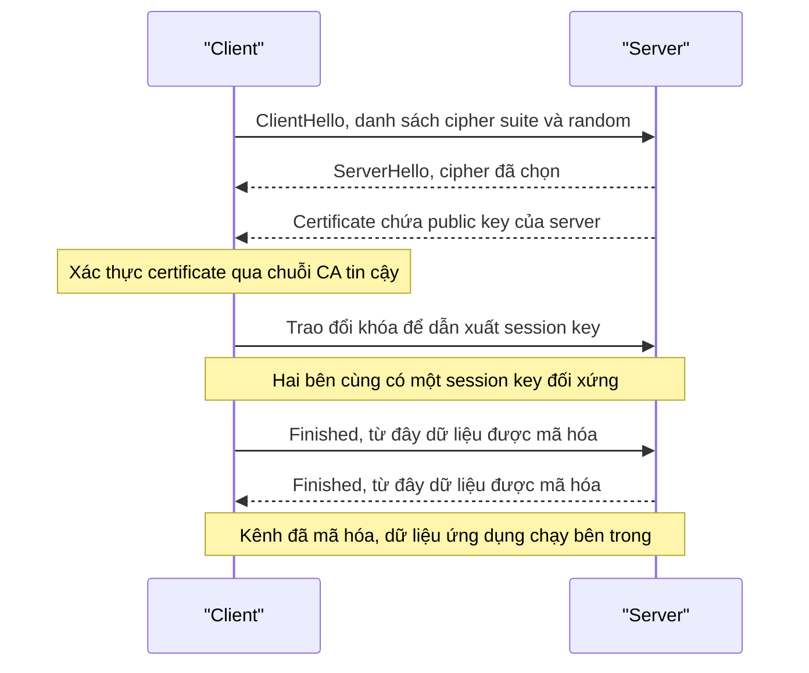

import { Callout } from "nextra/components";

# Mã hóa

**Encryption** (mã hóa — biến đổi dữ liệu gốc thành dạng không đọc được nếu không có khóa, nhằm bảo vệ bí mật và toàn vẹn) là công cụ trung tâm chống lại nghe lén và sửa đổi trên đường truyền. Ở bài **Mối đe dọa mạng** ta thấy MITM chỉ vô hại khi kênh được mã hóa và đối tác được xác thực; bài này giải thích cơ chế đứng sau điều đó. Ta đi qua ba trụ cột: **symmetric encryption**, **asymmetric encryption**, và **TLS/SSL handshake** — nơi hai loại trên kết hợp để tạo nên HTTPS mà bạn đã gặp ở Chương 6.

Trước hết cần phân biệt hai khái niệm nền. **Plaintext** (bản rõ — dữ liệu gốc đọc được) được biến thành **ciphertext** (bản mã — dữ liệu đã mã hóa, vô nghĩa nếu không có khóa) nhờ một thuật toán và một **key** (khóa — chuỗi bí mật điều khiển quá trình mã hóa/giải mã). Sức mạnh của hệ thống nằm ở việc giữ bí mật **khóa**, chứ không phải giữ bí mật thuật toán; các thuật toán tốt đều công khai và được kiểm định rộng rãi.

## Symmetric encryption

**Symmetric encryption** (mã hóa đối xứng — dùng **cùng một khóa** để mã hóa và giải mã) là dạng trực giác nhất: hai bên chia sẻ một khóa bí mật, ai có khóa thì đọc được. Thuật toán tiêu biểu là **AES** (Advanced Encryption Standard — chuẩn mã hóa khối được dùng phổ biến nhất hiện nay), thường ở các độ dài khóa 128 hoặc 256 bit.



Ưu điểm lớn nhất của mã hóa đối xứng là **tốc độ**: nó nhanh hơn mã hóa bất đối xứng nhiều lần và phù hợp để mã hóa khối lượng dữ liệu lớn. Vì vậy trong thực tế, gần như toàn bộ dữ liệu ứng dụng (nội dung web, file, video) đều được bảo vệ bằng khóa đối xứng.

Nhược điểm cốt lõi là **key distribution** (phân phối khóa — làm sao để hai bên cùng có chung khóa bí mật mà không bị lộ trên đường truyền). Nếu gửi khóa qua mạng dưới dạng plaintext thì kẻ nghe lén lấy được ngay. Đây chính là bài toán mà mã hóa bất đối xứng sinh ra để giải. Ví dụ quan sát được với `openssl`:

```bash
$ echo "so tai khoan: 12345" | openssl enc -aes-256-cbc -pbkdf2 -base64
enter aes-256-cbc encryption password:
U2FsdGVkX1+ab3Kk9mC7r2t0Yw8Qm5p1nN7sJ0c2dXo=

# Giải mã lại bằng ĐÚNG khóa đó:
$ echo "U2FsdGVkX1+ab3Kk9mC7r2t0Yw8Qm5p1nN7sJ0c2dXo=" | openssl enc -d -aes-256-cbc -pbkdf2 -base64
enter aes-256-cbc decryption password:
so tai khoan: 12345
```

## Asymmetric encryption

**Asymmetric encryption** (mã hóa bất đối xứng — dùng một **cặp khóa** gồm public key công khai và private key giữ bí mật) lật ngược vấn đề. Hai khóa có quan hệ toán học: dữ liệu mã hóa bằng public key chỉ giải được bằng private key tương ứng, và ngược lại. Thuật toán tiêu biểu là **RSA** và các hệ dựa trên đường cong elliptic (**ECC**).



Tính chất này giải quyết bài toán phân phối khóa: bất kỳ ai cũng có thể lấy public key của Bob để gửi cho Bob thứ chỉ Bob giải được, mà không cần trao đổi bí mật trước. Cặp khóa còn dùng cho **digital signature** (chữ ký số — ký bằng private key, ai cũng kiểm chứng được bằng public key) để chứng minh danh tính và tính toàn vẹn — nền tảng của certificate trong TLS.

Đánh đổi là **tốc độ**: mã hóa bất đối xứng chậm hơn đối xứng nhiều, nên không ai dùng nó để mã hóa cả luồng dữ liệu lớn. Ví dụ tạo một cặp khóa RSA và tách public key:

```bash
# Tạo private key RSA 2048-bit
$ openssl genpkey -algorithm RSA -pkeyopt rsa_keygen_bits:2048 -out private.pem

# Tách public key để chia sẻ công khai
$ openssl pkey -in private.pem -pubout -out public.pem
$ head -1 public.pem
-----BEGIN PUBLIC KEY-----
```

<Callout type="info">
  Quy tắc vàng: **private key không bao giờ rời khỏi chủ của nó**. Chỉ có public
  key được chia sẻ. Nếu private key bị lộ, kẻ tấn công có thể mạo danh chủ sở
  hữu và giải mã mọi thứ gửi cho họ.
</Callout>

## TLS/SSL handshake

**TLS** (Transport Layer Security — protocol tạo kênh truyền bí mật, toàn vẹn và được xác thực; SSL là tên cũ đã lỗi thời) kết hợp khéo léo hai loại mã hóa trên. Ý tưởng chìa khóa: dùng **asymmetric** chỉ để **xác thực server và thỏa thuận an toàn một khóa đối xứng**, rồi dùng **symmetric** với khóa đó cho toàn bộ dữ liệu sau này. Như vậy hệ thống vừa an toàn khi thiết lập, vừa nhanh khi truyền dữ liệu lớn.

Quá trình thiết lập gọi là **handshake** (bắt tay — chuỗi thông điệp mở đầu để thỏa thuận tham số và dựng khóa phiên). Sơ đồ dưới tóm tắt các bước chính:



Hai khái niệm cần nắm trong handshake. **Certificate** (chứng chỉ — tài liệu số gắn một domain với public key, do một bên thứ ba tin cậy ký) cho phép client xác thực server thật sự là nó tuyên bố; bên ký là **CA** (Certificate Authority — tổ chức cấp và bảo chứng certificate). **Cipher suite** (bộ thuật toán — tổ hợp các thuật toán trao đổi khóa, mã hóa và băm dùng cho phiên) được hai bên thống nhất ngay ở bước Hello.

Một điểm quan trọng của TLS hiện đại là **forward secrecy** (bí mật chuyển tiếp — dùng khóa phiên tạm thời sao cho dù private key của server bị lộ sau này, các phiên cũ đã ghi lại vẫn không giải mã được). TLS 1.3 đạt điều này bằng trao đổi khóa kiểu Diffie-Hellman tạm thời, đồng thời rút gọn handshake xuống chỉ còn một vòng đi-về để nhanh hơn. Ta có thể quan sát phiên bản và cipher suite thực tế:

```bash
$ openssl s_client -connect example.com:443 -tls1_3 </dev/null 2>/dev/null | grep -E "Protocol|Cipher"
    Protocol  : TLSv1.3
    Cipher    : TLS_AES_256_GCM_SHA384
```

Đọc output: kênh dùng `TLSv1.3` với cipher suite `TLS_AES_256_GCM_SHA384` — nghĩa là dữ liệu được mã hóa đối xứng bằng AES-256-GCM, còn khóa thì vừa được thỏa thuận an toàn nhờ phần bất đối xứng của handshake.

## Tóm tắt nhanh

- **Symmetric encryption** dùng **cùng một khóa**, rất **nhanh**, nhưng vướng bài toán **key distribution**; tiêu biểu là **AES**.
- **Asymmetric encryption** dùng **cặp public/private key**, giải được key distribution và cho phép **digital signature**, nhưng **chậm**; tiêu biểu là **RSA/ECC**.
- **TLS handshake** kết hợp cả hai: **asymmetric** để xác thực qua **certificate** (do **CA** ký) và thỏa thuận **session key**, sau đó **symmetric** cho toàn bộ dữ liệu.
- TLS 1.3 cung cấp **forward secrecy** và handshake nhanh hơn; output `openssl`/`curl` cho thấy phiên bản TLS và cipher suite thực tế.

## Bài tập

### Câu hỏi lý thuyết

1. So sánh symmetric và asymmetric encryption theo ba tiêu chí: số lượng khóa, tốc độ, và bài toán mà mỗi loại giải quyết tốt. Vì sao TLS dùng cả hai thay vì chỉ một?
2. Giải thích vai trò của **certificate** và **CA** trong việc chống lại tấn công MITM (đã học ở bài trước). Nếu một CA bị xâm nhập thì hệ quả an ninh là gì?

### Tình huống

3. Một dịch vụ nội bộ chỉ dùng mã hóa đối xứng và phân phối khóa bằng cách gửi khóa qua email. Hãy chỉ ra điểm yếu chí mạng của cách làm này và đề xuất dùng mã hóa bất đối xứng để khắc phục bước trao khóa.

### Thực hành

4. Dùng `openssl s_client` (hoặc `curl -v`) kết nối tới một trang HTTPS bất kỳ và xác định: (a) phiên bản TLS đang dùng, (b) cipher suite, và (c) tổ chức CA đã cấp certificate cho server.

<details>
  <summary>Đáp án & gợi ý</summary>

1. **Symmetric**: một khóa chung, rất nhanh, giỏi mã hóa khối lượng lớn, nhưng khó phân phối khóa an toàn. **Asymmetric**: cặp khóa public/private, chậm, nhưng giải được key distribution và cho phép chữ ký số. TLS dùng cả hai để lấy **ưu của từng loại**: bất đối xứng cho việc thiết lập an toàn (xác thực + trao khóa), đối xứng cho việc truyền dữ liệu nhanh.
2. **Certificate** chứng minh public key thực sự thuộc về domain đang kết nối, và **CA** là bên tin cậy ký bảo chứng điều đó; nhờ vậy kẻ MITM không thể trình một public key giả mà client chấp nhận. Nếu một **CA bị xâm nhập**, kẻ tấn công có thể phát hành certificate giả cho bất kỳ domain nào và thực hiện MITM mà trình duyệt không cảnh báo — đó là lý do có cơ chế thu hồi (CRL/OCSP) và Certificate Transparency.
3. Gửi khóa qua email là gửi **khóa đối xứng dưới dạng dễ bị lộ**; bất kỳ ai đọc được email (hoặc nghe lén) đều có khóa và giải mã được mọi thứ. Khắc phục: bên nhận tạo **cặp khóa bất đối xứng**, công bố **public key**; bên gửi mã hóa khóa đối xứng bằng public key đó rồi mới gửi — chỉ bên giữ **private key** mới mở được (đây đúng là mô hình TLS dùng).
4. Gợi ý lệnh: `openssl s_client -connect host:443` hoặc `curl -v https://host`. (a) Dòng `Protocol : TLSv1.x`. (b) Dòng `Cipher : ...`. (c) Trong khối `Server certificate`, trường `issuer` cho biết CA đã cấp.

</details>

## Nguồn tham khảo

- E. Rescorla, _The Transport Layer Security (TLS) Protocol Version 1.3_, RFC 8446, mục 2 ("Protocol Overview" — handshake) và mục 1.2 (forward secrecy).
- J. F. Kurose & K. W. Ross, _Computer Networking: A Top-Down Approach_, 8th ed., mục 8.2 (symmetric key cryptography) và mục 8.3 (public key encryption).
- NIST, _Advanced Encryption Standard (AES)_, FIPS PUB 197.
