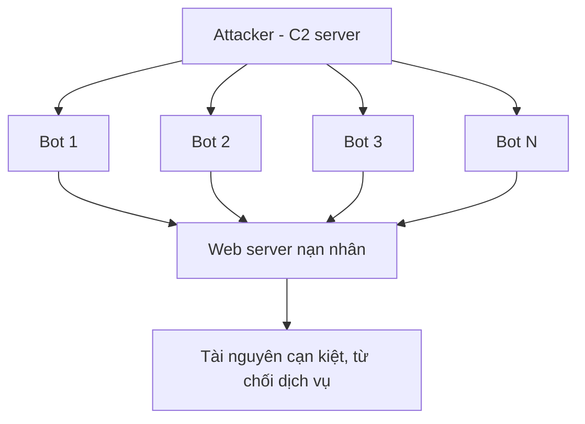
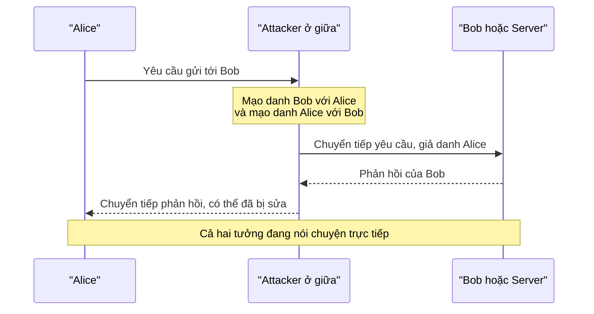

import { Callout } from "nextra/components";

# Mối đe dọa mạng

Trước khi học cách phòng thủ, ta cần hiểu kẻ tấn công nhắm vào điều gì. Mọi biện pháp an ninh đều xoay quanh **CIA triad** (bộ ba C-I-A — ba mục tiêu cốt lõi gồm confidentiality là bí mật, integrity là toàn vẹn, và availability là sẵn sàng). Một cuộc tấn công thực chất là nỗ lực phá vỡ một hoặc nhiều trong ba mục tiêu này: nghe lén làm mất confidentiality, sửa dữ liệu làm mất integrity, và làm sập dịch vụ thì phá availability. Bài học này phân tích ba loại tấn công tiêu biểu — **DDoS**, **man-in-the-middle (MITM)** và **spoofing** — với cùng một khung gồm ba phần: cách hoạt động, tác động, và mitigation.

Điểm chung của cả ba là chúng lợi dụng những đặc tính "tin tưởng mặc định" của các protocol đã học ở chương trước. IP không kiểm chứng địa chỉ nguồn, TCP phải giữ trạng thái cho mỗi kết nối nửa mở, còn ARP và DNS tin vào câu trả lời đầu tiên nhận được. Hiểu cơ chế này giúp bạn thấy vì sao biện pháp phòng thủ lại được đặt đúng ở những điểm đó.

<Callout type="info">
  **Threat actor** (tác nhân đe dọa — cá nhân hoặc nhóm thực hiện tấn công) và
  **attack surface** (bề mặt tấn công — tập hợp mọi điểm mà kẻ tấn công có thể
  nhắm vào) là hai thuật ngữ ta dùng xuyên suốt. Thu hẹp attack surface là một
  trong những cách phòng thủ rẻ và hiệu quả nhất.
</Callout>

## DDoS — Distributed Denial-of-Service

**DDoS** (Distributed Denial-of-Service — tấn công từ chối dịch vụ phân tán, dùng nhiều nguồn cùng lúc để làm cạn kiệt tài nguyên của mục tiêu) nhắm thẳng vào **availability**. Thay vì một máy, kẻ tấn công điều khiển một **botnet** (mạng botnet — tập hợp nhiều máy bị nhiễm mã độc, chịu sự điều khiển từ xa) để đồng loạt gửi lưu lượng tới nạn nhân. Vì lưu lượng đến từ hàng nghìn địa chỉ IP khác nhau, việc chỉ chặn một nguồn là vô ích.

### Cách hoạt động

Kẻ tấn công trước hết xây dựng botnet bằng cách lây nhiễm các thiết bị (máy tính, camera IP, router gia đình) rồi điều khiển chúng qua một **C2 server** (command-and-control — máy chủ ra lệnh cho botnet). Khi có hiệu lệnh, mọi bot cùng bắn lưu lượng tới nạn nhân, làm cạn một tài nguyên hữu hạn nào đó: băng thông đường truyền, bảng kết nối của TCP, hay CPU xử lý request.



Một biến thể kinh điển ở tầng Transport là **SYN flood**: dựa trên three-way handshake của TCP (Chương 5), kẻ tấn công gửi liên tục segment `SYN` với địa chỉ nguồn giả nhưng không bao giờ gửi `ACK` cuối. Mỗi `SYN` buộc server cấp phát một mục trong bảng kết nối và chờ; hàng nghìn kết nối "half-open" như vậy sẽ lấp đầy bảng, khiến client thật không còn chỗ để kết nối.

```text
# Bình thường: handshake hoàn tất, kết nối ESTABLISHED
Client -> Server : SYN
Server -> Client : SYN-ACK
Client -> Server : ACK          (kết nối sẵn sàng)

# SYN flood: nguồn giả, không bao giờ gửi ACK cuối
Attacker -> Server : SYN (src=1.1.1.1, spoofed)
Attacker -> Server : SYN (src=2.2.2.2, spoofed)
Attacker -> Server : SYN (src=3.3.3.3, spoofed)
...
Server: hàng nghìn kết nối half-open lấp đầy bảng -> client thật bị từ chối
```

### Tác động

Hậu quả trực tiếp là dịch vụ ngừng phản hồi với người dùng hợp lệ, kéo theo mất doanh thu, mất uy tín và chi phí ứng cứu. Một đợt DDoS lớn còn có thể làm nghẽn cả đường truyền của nhà cung cấp, ảnh hưởng tới các dịch vụ lân cận chứ không chỉ riêng mục tiêu.

### Mitigation

| Biện pháp                         | Cách nó giúp                                                            |
| --------------------------------- | ----------------------------------------------------------------------- |
| **Rate limiting**                 | Giới hạn số request mỗi nguồn trong một khoảng thời gian                 |
| **SYN cookies**                   | Server không cấp phát trạng thái cho tới khi handshake hoàn tất         |
| **Scrubbing center / Anycast**    | Phân tán và lọc lưu lượng tấn công trước khi tới hạ tầng gốc            |
| **CDN / upstream filtering**      | Hấp thụ lưu lượng ở quy mô lớn, chặn gần nguồn                          |

<Callout type="warning">
  DDoS rất khó "chặn sạch" vì lưu lượng tấn công trông gần giống lưu lượng thật
  và đến từ vô số nguồn. Mục tiêu thực tế của mitigation là **hấp thụ và lọc**
  để dịch vụ vẫn sống, chứ không phải loại bỏ hoàn toàn từng gói xấu.
</Callout>

## Man-in-the-middle (MITM)

**MITM** (man-in-the-middle — tấn công xen giữa, kẻ tấn công lén đứng giữa hai bên và chuyển tiếp thông điệp trong khi hai bên tưởng đang nói chuyện trực tiếp) tấn công vào **confidentiality** và **integrity**. Khi đã ở giữa, kẻ tấn công có thể đọc trộm toàn bộ dữ liệu và thậm chí sửa nội dung trước khi chuyển tiếp.

### Cách hoạt động

Để chen vào giữa, kẻ tấn công phải khiến lưu lượng đi qua máy mình. Một kỹ thuật phổ biến trong mạng LAN là **ARP spoofing** (giả mạo ARP — gửi bản tin ARP sai để gán địa chỉ MAC của kẻ tấn công cho IP của gateway). Sau đó nạn nhân tưởng máy của kẻ tấn công là router và gửi mọi gói qua đó. Sơ đồ dưới mô tả luồng thông điệp khi đã bị xen giữa:



Trên một mạng Wi-Fi công cộng không mã hóa, kẻ tấn công thậm chí không cần ARP spoofing — chỉ cần bắt gói trong không khí. Đây là lý do một kết nối HTTP thuần (Chương 6) tại quán cà phê là cực kỳ rủi ro: mọi cookie và mật khẩu đi qua đều ở dạng plaintext.

### Tác động

Kẻ tấn công đọc được dữ liệu nhạy cảm (mật khẩu, cookie phiên, nội dung email) và có thể chỉnh sửa dữ liệu hai chiều: chèn mã độc vào trang web, đổi số tài khoản trong một giao dịch, hay hạ cấp kết nối an toàn xuống không an toàn (**SSL stripping**).

### Mitigation

Phòng thủ cốt lõi là **encryption + authentication**: nếu kênh được mã hóa và server được xác thực bằng certificate, kẻ ở giữa không giải mã được và cũng không mạo danh được. Cụ thể:

- **TLS/HTTPS ở khắp nơi** cùng **HSTS** để trình duyệt từ chối hạ cấp xuống HTTP.
- **Certificate validation** nghiêm ngặt; cảnh báo chứng chỉ tuyệt đối không bỏ qua.
- **Dynamic ARP Inspection** và **DHCP snooping** trên switch để chặn ARP/DHCP giả trong LAN.
- Tránh thao tác nhạy cảm trên Wi-Fi công cộng, hoặc bọc bằng VPN (xem bài **Phòng thủ vành đai**).

## Spoofing

**Spoofing** (giả mạo — làm giả một trường định danh như địa chỉ IP, MAC, email hay DNS để mạo nhận là một bên khác) lợi dụng việc nhiều protocol không xác thực nguồn gốc thông điệp. Nó có thể phá cả ba mục tiêu CIA tùy mục đích cụ thể.

### Cách hoạt động

Trong **IP spoofing**, kẻ tấn công đặt một địa chỉ nguồn giả vào IP header trước khi gửi. Vì IP không kiểm chứng trường source address, gói vẫn được chuyển đi bình thường. Đây chính là nền của SYN flood ở trên và của các đòn **reflection/amplification**, nơi phản hồi bị "dội" về địa chỉ nạn nhân bị giả. Một gói UDP bị giả nguồn có thể trông như sau:

```text
+-------------------------------------------------------+
| IP header                                             |
|   Source IP : 198.51.100.20   <- ĐỊA CHỈ GIẢ (nạn nhân)|
|   Dest IP   : 203.0.113.53     (máy chủ DNS mở)        |
|   Protocol  : 17  (UDP)                                |
| UDP header                                            |
|   Src port  : 40000                                    |
|   Dest port : 53   (DNS)                               |
| Payload                                                |
|   Truy vấn DNS nhỏ, yêu cầu phản hồi lớn               |
+-------------------------------------------------------+
   Kết quả: phản hồi DNS lớn bị dội về 198.51.100.20
```

Ngoài IP, còn có nhiều biến thể: **MAC spoofing** đổi địa chỉ MAC để vượt lọc theo MAC; **DNS spoofing** chèn bản ghi sai để đưa nạn nhân tới IP của kẻ tấn công; và **email spoofing** giả trường `From` để lừa người nhận. Cùng một ý tưởng: làm giả một trường định danh mà bên nhận vốn tin tưởng.

### Tác động

Spoofing cho phép vượt qua các bộ lọc dựa trên danh tính, ẩn danh kẻ tấn công, khuếch đại lưu lượng DDoS, hoặc dẫn dụ nạn nhân tới hạ tầng giả để đánh cắp thông tin. Vì địa chỉ nguồn bị giả, việc truy vết và quy trách nhiệm cũng khó hơn nhiều.

### Mitigation

| Loại spoofing | Biện pháp giảm thiểu                                                       |
| ------------- | -------------------------------------------------------------------------- |
| IP spoofing   | **Ingress/egress filtering (BCP 38)** chặn gói có địa chỉ nguồn bất hợp lệ |
| DNS spoofing  | **DNSSEC** ký số bản ghi để bên nhận kiểm chứng tính xác thực              |
| ARP/MAC       | **Dynamic ARP Inspection**, **port security**, **802.1X**                  |
| Email         | **SPF**, **DKIM**, **DMARC** để xác thực nguồn gửi                         |

<Callout type="info">
  Mẫu chung của mọi mitigation chống spoofing là **xác thực nguồn gốc**: thêm
  một lớp kiểm chứng (chữ ký số, danh sách hợp lệ, hay lọc tại biên) để bên nhận
  không còn tin tưởng mù quáng vào trường định danh dễ làm giả.
</Callout>

## Tóm tắt nhanh

- Mọi tấn công đều nhắm vào **CIA triad**: confidentiality, integrity, availability.
- **DDoS** dùng **botnet** làm cạn tài nguyên (ví dụ **SYN flood** với địa chỉ nguồn giả) để phá **availability**; mitigation: rate limiting, SYN cookies, scrubbing/CDN.
- **MITM** lén đứng giữa hai bên (ví dụ **ARP spoofing**) để đọc/sửa dữ liệu; mitigation cốt lõi là **encryption + authentication** (TLS, HSTS, DAI).
- **Spoofing** làm giả trường định danh (IP/MAC/DNS/email); mitigation chung là **xác thực nguồn gốc** (BCP 38, DNSSEC, SPF/DKIM/DMARC).

## Bài tập

### Câu hỏi lý thuyết

1. Với mỗi tấn công DDoS, MITM và spoofing, cho biết nó chủ yếu phá vỡ mục tiêu nào trong **CIA triad** và giải thích ngắn gọn vì sao.
2. SYN flood lợi dụng bước nào của TCP three-way handshake (Chương 5)? Vì sao **SYN cookies** giúp giảm thiểu mà không cần từ chối toàn bộ kết nối mới?

### Tình huống

3. Một nhân viên báo rằng khi vào ngân hàng qua Wi-Fi quán cà phê, trình duyệt hiện cảnh báo "chứng chỉ không hợp lệ" nhưng họ vẫn bấm bỏ qua. Hãy chỉ ra đây có thể là dấu hiệu của tấn công nào, kẻ tấn công có thể đã làm gì để xen vào, và hai biện pháp giúp tránh tình huống này.

### Phân tích

4. Giải thích vì sao **ingress filtering (BCP 38)** lại làm giảm hiệu quả của cả SYN flood lẫn tấn công reflection/amplification dựa trên IP spoofing.

<details>
  <summary>Đáp án & gợi ý</summary>

1. **DDoS** phá **availability** vì làm dịch vụ ngừng phục vụ người dùng hợp lệ. **MITM** phá **confidentiality** (đọc trộm) và **integrity** (sửa dữ liệu). **Spoofing** tùy mục đích: thường hỗ trợ phá **integrity/confidentiality** (DNS/email spoofing dẫn dụ nạn nhân) hoặc **availability** (IP spoofing trong DDoS).
2. SYN flood lợi dụng **bước 1** (gửi `SYN`) và bỏ dở **bước 3** (`ACK`), khiến server giữ nhiều kết nối half-open. **SYN cookies** cho phép server **không cấp phát trạng thái** ngay khi nhận `SYN`; nó mã hóa thông tin cần thiết vào sequence number của `SYN-ACK` và chỉ dựng kết nối thật khi `ACK` hợp lệ quay lại, nên client thật vẫn kết nối được.
3. Đây là dấu hiệu của **MITM** (kèm khả năng **SSL stripping**). Trên Wi-Fi công cộng, kẻ tấn công có thể bắt gói trực tiếp hoặc dùng **ARP spoofing** để mọi lưu lượng đi qua máy mình, rồi trình một certificate giả. Hai biện pháp: (a) **không bao giờ bỏ qua cảnh báo certificate**; (b) dùng **VPN** hoặc mạng tin cậy, và đảm bảo trang dùng **HTTPS + HSTS**.
4. **Ingress filtering** loại bỏ các gói có **địa chỉ nguồn không hợp lệ** ngay tại biên mạng. SYN flood và reflection đều dựa trên **địa chỉ nguồn giả** (để ẩn danh hoặc dội phản hồi về nạn nhân); khi gói giả nguồn bị chặn từ gần nơi phát, kẻ tấn công mất công cụ chính, nên cả hai đòn đều suy yếu.

</details>

## Nguồn tham khảo

- J. F. Kurose & K. W. Ross, _Computer Networking: A Top-Down Approach_, 8th ed., mục 1.6 ("Networks Under Attack") và Ch. 8.
- W. Eddy, _TCP SYN Flooding Attacks and Common Mitigations_, RFC 4987, mục 3 (cơ chế) và mục 4 (mitigation).
- P. Ferguson & D. Senie, _Network Ingress Filtering_, BCP 38 / RFC 2827.
- NIST, _Computer Security Incident Handling Guide_, SP 800-61 Rev. 2, mục 2 (phân loại sự cố).
