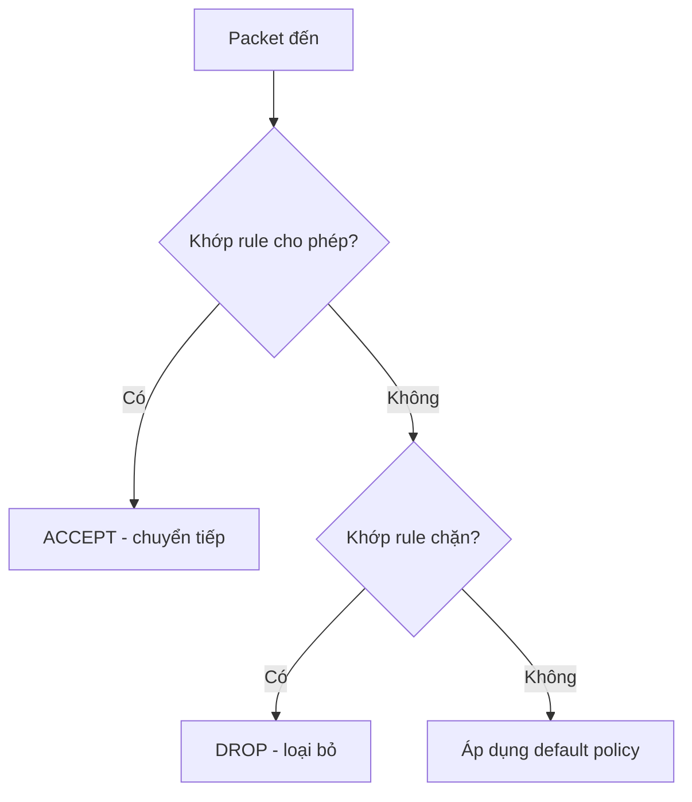
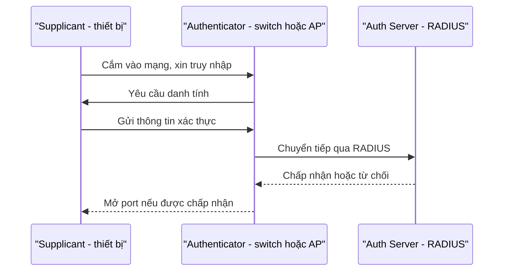

import { Callout } from "nextra/components";

# Phòng thủ vành đai

**Perimeter defense** (phòng thủ vành đai — đặt các lớp kiểm soát ở ranh giới giữa mạng tin cậy và mạng không tin cậy để lọc và bảo vệ lưu lượng ra/vào) là tuyến phòng thủ cổ điển nhất. Nếu bài **Mã hóa** lo bảo vệ *nội dung* gói tin, thì bài này lo *kiểm soát ai được đi qua* và *đường đi đó có an toàn không*. Ta xét ba thành phần: **firewall** quyết định gói nào được qua, **VPN** tạo đường hầm an toàn xuyên qua mạng công cộng, và **network access control (NAC)** quyết định thiết bị nào được phép tham gia mạng ngay từ cổng vào.

Ba thành phần này hoạt động ở những điểm khác nhau nhưng bổ trợ cho nhau. Firewall lọc theo địa chỉ và port (kiến thức từ Chương 4 và 5); VPN bọc lưu lượng bằng encryption (kiến thức từ bài trước); còn NAC kiểm tra danh tính thiết bị trước cả khi nó nhận được địa chỉ IP. Hiểu mục đích riêng của từng cái giúp bạn không nhầm vai trò của chúng.

## Firewall

**Firewall** (tường lửa — thiết bị hoặc phần mềm lọc lưu lượng mạng dựa trên một tập rule, cho phép hoặc chặn từng gói) là điểm kiểm soát đặt giữa các vùng mạng. Mục đích của nó là thực thi chính sách "ai được nói chuyện với ai, qua port nào". Mỗi gói đến được so khớp lần lượt với danh sách rule cho tới khi trúng một rule, và nếu không trúng rule nào thì **default policy** quyết định số phận của nó.



### Stateless firewall

**Stateless firewall** (tường lửa phi trạng thái — xét mỗi gói **độc lập**, chỉ dựa trên các trường trong header như IP nguồn/đích, port, protocol) không nhớ gì về các gói trước đó. Nó nhanh và đơn giản, thường được hiện thực dưới dạng **ACL** (Access Control List — danh sách quy tắc lọc trên router/switch). Use case điển hình: lọc thô ở biên với khối lượng lớn, hoặc trên thiết bị mạng không đủ tài nguyên giữ trạng thái.

```text
# Stateless ACL: xét từng packet độc lập, không nhớ kết nối
permit tcp any host 198.51.100.10 eq 443
permit tcp any host 198.51.100.10 eq 80
deny   ip  any any
```

Hạn chế là vì không nhớ trạng thái, để cho phép lưu lượng trả về bạn phải mở rule cả hai chiều một cách thủ công, dễ tạo lỗ hổng. Stateless firewall không phân biệt được một gói "trả lời cho kết nối hợp lệ" với một gói "tự dưng gửi tới".

### Stateful firewall

**Stateful firewall** (tường lửa trạng thái — theo dõi trạng thái của từng kết nối trong một **connection table** và quyết định dựa trên ngữ cảnh đó) hiểu được một gói thuộc kết nối nào. Khi một kết nối ra ngoài được mở hợp lệ, firewall tự động cho phép lưu lượng trả về tương ứng mà không cần rule riêng. Đây là kiểu firewall mặc định trên hầu hết hệ thống ngày nay. Ví dụ với `iptables`:

```bash
# Mặc định chặn mọi lưu lượng vào
iptables -P INPUT DROP

# Cho phép gói thuộc kết nối ĐÃ thiết lập đi vào (nhờ theo dõi trạng thái)
iptables -A INPUT -m conntrack --ctstate ESTABLISHED,RELATED -j ACCEPT

# Chỉ mở thêm SSH (22) và HTTPS (443) cho kết nối mới
iptables -A INPUT -p tcp --dport 22 -m conntrack --ctstate NEW -j ACCEPT
iptables -A INPUT -p tcp --dport 443 -m conntrack --ctstate NEW -j ACCEPT
```

<Callout type="info">
  Khác biệt then chốt: stateless hỏi "gói này khớp rule nào?", còn stateful hỏi
  "gói này có thuộc một kết nối hợp lệ mà tôi đang theo dõi không?". Nhờ
  `ESTABLISHED,RELATED`, stateful firewall mở đúng lưu lượng trả về mà không phải
  nới lỏng rule cho chiều vào.
</Callout>

## VPN

**VPN** (Virtual Private Network — mạng riêng ảo, tạo một đường truyền an toàn qua hạ tầng công cộng như Internet) phục vụ một mục đích khác với firewall: nó không lọc, mà **bảo vệ đường đi**. VPN làm hai việc song song: **tunneling** (đóng gói — bọc gói gốc vào trong một gói mới để truyền qua mạng trung gian) và **encryption** (mã hóa nội dung để bên ngoài không đọc được).


Kết quả là hai đầu cảm thấy như đang ở cùng một mạng riêng, dù thực tế lưu lượng băng qua Internet công cộng. Người ngoài chỉ thấy các gói đã mã hóa chạy giữa hai gateway, không đọc được nội dung bên trong. Các công nghệ phổ biến gồm **IPsec** (bộ protocol mã hóa và xác thực ở tầng Network) và **WireGuard/OpenVPN**.

Có hai use case chính. **Remote-access VPN** cho nhân viên làm việc từ xa kết nối an toàn vào mạng công ty như thể đang ngồi tại văn phòng. **Site-to-site VPN** nối hai chi nhánh ở hai địa điểm thành một mạng logic duy nhất. Một cấu hình WireGuard tối giản cho thấy các thành phần quan sát được:

```text
[Interface]
Address = 10.8.0.2/24          # IP trong mạng riêng ảo
PrivateKey = <private-key-cua-client>

[Peer]
PublicKey = <public-key-cua-gateway>
Endpoint = vpn.example.com:51820  # gateway thật trên Internet
AllowedIPs = 10.0.0.0/8          # dải mạng nội bộ được định tuyến qua tunnel
```

<Callout type="warning">
  VPN bảo vệ **đường đi**, không tự động làm sạch những gì chạy bên trong. Một
  máy đã nhiễm mã độc khi kết nối VPN có thể mang mối nguy thẳng vào mạng nội bộ
  — nên VPN thường đi kèm NAC và kiểm tra "posture" của thiết bị.
</Callout>

## Network Access Control (NAC) và 802.1X

**NAC** (Network Access Control — kiểm soát truy nhập mạng, quyết định thiết bị nào được phép kết nối và với quyền gì, ngay tại cổng vào) đẩy điểm phòng thủ ra sớm nhất có thể: trước khi một thiết bị nhận IP. Mục đích là đảm bảo chỉ những thiết bị **được xác thực và đủ điều kiện** mới tham gia mạng, ngăn chặn ngay một laptop lạ vừa cắm dây vào ổ mạng trong tòa nhà.

Chuẩn nền tảng là **802.1X** (chuẩn IEEE cho xác thực truy nhập theo từng port), với ba vai trò: **supplicant** (thiết bị xin vào mạng), **authenticator** (switch hoặc access point giữ cổng), và **authentication server** (máy chủ xác thực, thường chạy **RADIUS**). Cổng mạng bị khóa cho tới khi xác thực thành công.



Use case điển hình là mạng doanh nghiệp có nhiều người và thiết bị ra vào: NAC/802.1X đảm bảo chỉ thiết bị của nhân viên (có chứng chỉ hoặc tài khoản hợp lệ) mới vào được mạng nội bộ, còn khách thì bị đẩy sang một VLAN cách ly chỉ có Internet. Nhiều hệ NAC còn kiểm tra "posture" — bản vá, antivirus — trước khi cho vào.

## Tóm tắt nhanh

- **Firewall** lọc lưu lượng theo rule: **stateless** xét từng gói độc lập (nhanh, dùng ACL); **stateful** theo dõi connection table và tự cho lưu lượng trả về của kết nối hợp lệ.
- **VPN** kết hợp **tunneling + encryption** để tạo đường an toàn qua Internet; hai use case là **remote-access** và **site-to-site**.
- **NAC/802.1X** kiểm soát thiết bị **ngay tại cổng vào** với ba vai trò supplicant – authenticator – authentication server (RADIUS).
- Ba lớp bổ trợ nhau: firewall lọc gói, VPN bảo vệ đường đi, NAC chặn thiết bị không hợp lệ trước cả khi cấp IP.

## Bài tập

### Câu hỏi lý thuyết

1. Phân biệt stateless và stateful firewall. Vì sao một stateful firewall chỉ cần rule `ESTABLISHED,RELATED` là đủ cho lưu lượng trả về, trong khi stateless thì không?
2. VPN cung cấp hai thứ là tunneling và encryption. Giải thích vai trò của từng thứ, và vì sao chỉ tunneling mà thiếu encryption thì không đủ an toàn trên Internet công cộng.

### Tình huống

3. Một công ty muốn: (a) nhân viên làm việc từ xa truy cập hệ thống nội bộ an toàn, (b) chỉ cho laptop của công ty cắm vào ổ mạng văn phòng được dùng mạng, và (c) chỉ mở cổng 443 từ Internet vào web server. Hãy chọn firewall, VPN hay NAC cho từng yêu cầu và giải thích.

### Thực hành

4. Viết một tập rule `iptables` theo nguyên tắc default-deny cho một web server: chặn mọi thứ vào, nhưng cho phép (a) lưu lượng trả về của kết nối đã thiết lập, (b) HTTPS (443) từ mọi nơi, và (c) SSH (22) chỉ từ dải quản trị `203.0.113.0/24`.

<details>
  <summary>Đáp án & gợi ý</summary>

1. **Stateless** xét mỗi gói độc lập theo header, không nhớ kết nối; **stateful** theo dõi trạng thái từng kết nối trong connection table. Stateful biết gói trả về thuộc một kết nối ra ngoài hợp lệ nên chỉ cần `ESTABLISHED,RELATED`; stateless không có ký ức đó nên phải mở rule thủ công cho chiều ngược lại, dễ tạo lỗ hổng.
2. **Tunneling** đóng gói để gói gốc đi xuyên qua mạng trung gian (và định tuyến tới mạng riêng); **encryption** làm nội dung không đọc được. Thiếu encryption thì dù có tunnel, kẻ nghe lén trên Internet vẫn đọc/sửa được nội dung — đúng kịch bản MITM ở bài trước.
3. (a) **VPN** (remote-access) cho truy cập từ xa an toàn. (b) **NAC/802.1X** để chỉ thiết bị hợp lệ được vào mạng tại cổng switch. (c) **Firewall** với rule chỉ cho phép `tcp dport 443` từ Internet, mặc định chặn phần còn lại.
4. Ví dụ:

   ```bash
   iptables -P INPUT DROP
   iptables -A INPUT -m conntrack --ctstate ESTABLISHED,RELATED -j ACCEPT
   iptables -A INPUT -p tcp --dport 443 -j ACCEPT
   iptables -A INPUT -p tcp -s 203.0.113.0/24 --dport 22 -j ACCEPT
   ```

</details>

## Nguồn tham khảo

- K. Scarfone & P. Hoffman, _Guidelines on Firewalls and Firewall Policy_, NIST SP 800-41 Rev. 1, mục 2 (loại firewall) và mục 4 (chính sách).
- IEEE, _Port-Based Network Access Control_, IEEE Std 802.1X-2020, mục 1 (tổng quan kiến trúc supplicant/authenticator/authentication server).
- S. Kent & K. Seo, _Security Architecture for the Internet Protocol_, RFC 4301 (IPsec).
- J. F. Kurose & K. W. Ross, _Computer Networking: A Top-Down Approach_, 8th ed., mục 8.9 (firewalls and intrusion detection systems).
