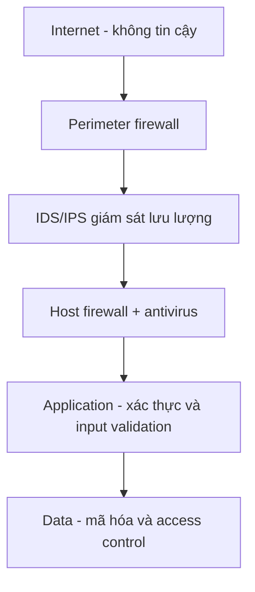
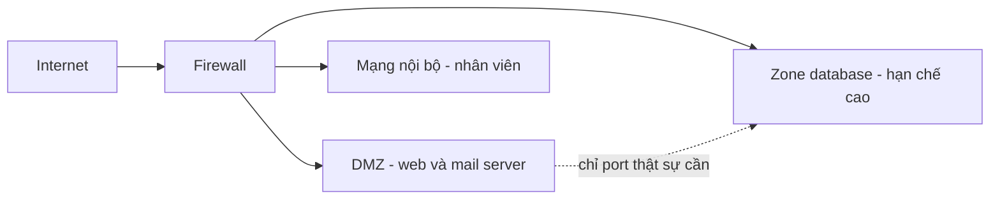

import { Callout } from "nextra/components";

# Thiết kế mạng an toàn

Các bài trước trang bị từng công cụ riêng lẻ: nhận diện mối đe dọa, mã hóa dữ liệu, dựng firewall và VPN. Bài này lùi lại một bước để hỏi câu lớn hơn: làm sao **sắp xếp** các công cụ đó thành một kiến trúc vững chắc? Đáp án nằm ở một số **security design principle** (nguyên tắc thiết kế an toàn — quy tắc nền tảng định hướng cách bố trí hệ thống để giảm rủi ro). Ta sẽ đi qua bốn nguyên tắc cốt lõi: **defense in depth**, **least privilege**, **network segmentation** và **zero trust**.

Điểm chung của các nguyên tắc này là giả định bi quan nhưng thực tế: **một lớp phòng thủ rồi sẽ thất bại**. Một firewall có thể bị cấu hình sai, một mật khẩu có thể bị lộ, một phần mềm có thể có lỗ hổng chưa vá. Thay vì tin vào một hàng rào duy nhất, thiết kế an toàn giả định mỗi lớp đều có thể bị xuyên thủng và bố trí sao cho hệ thống vẫn đứng vững khi điều đó xảy ra.

## Defense in depth

**Defense in depth** (phòng thủ theo chiều sâu — xếp nhiều lớp kiểm soát độc lập sao cho khi một lớp thất bại, các lớp khác vẫn còn) là nguyên tắc bao trùm. Ý tưởng mượn từ thành lũy thời trung cổ: có hào nước, tường ngoài, tường trong, rồi mới tới tháp canh — kẻ địch phải vượt qua từng lớp một. Trong mạng, các lớp trải từ biên vào tận dữ liệu.



Giá trị của cách xếp lớp này là không một điểm thất bại đơn lẻ nào đủ để hạ toàn bộ hệ thống. Ví dụ cụ thể: nếu kẻ tấn công vượt qua được perimeter firewall, chúng vẫn vấp phải IDS/IPS, rồi host firewall, rồi cơ chế xác thực ứng dụng, và cuối cùng dữ liệu vẫn được mã hóa nên dù lấy được file cũng không đọc nổi. Mỗi lớp mua thêm thời gian phát hiện và phản ứng.

## Least privilege

**Least privilege** (đặc quyền tối thiểu — mỗi người dùng, dịch vụ hay thiết bị chỉ được cấp đúng quyền tối thiểu cần để làm việc của nó, không hơn) thu hẹp thiệt hại khi một tài khoản bị chiếm. Nếu một dịch vụ chỉ cần đọc một database thì đừng cấp quyền ghi; nếu một nhân viên chỉ cần truy cập một subnet thì đừng mở cả mạng cho họ.

Nguyên tắc này trực tiếp thu hẹp **attack surface** (bề mặt tấn công — đã định nghĩa ở bài Mối đe dọa mạng) và giới hạn "blast radius" khi sự cố xảy ra. Một ví dụ quen thuộc với lập trình viên là **security group** trên cloud: thay vì mở mọi port, ta chỉ mở đúng cổng mà từng tầng cần.

```text
# Least privilege bằng security group: web chỉ nhận 443 từ Internet,
# database chỉ nhận 5432 TỪ web, không mở ra Internet.

sg-web:  ALLOW tcp 443  FROM 0.0.0.0/0
sg-db:   ALLOW tcp 5432 FROM sg-web        # chỉ web mới gọi được DB
sg-db:   DENY  all      FROM 0.0.0.0/0
```

<Callout type="info">
  Least privilege áp dụng cho cả con người (qua **RBAC** — role-based access
  control, gán quyền theo vai trò) lẫn máy móc (qua security group, IAM role).
  Câu hỏi cần đặt cho mọi quyền là "thực thể này có **thật sự cần** quyền này
  không?" — nếu không chắc, mặc định là không cấp.
</Callout>

## Network segmentation

**Network segmentation** (phân đoạn mạng — chia mạng thành các vùng nhỏ tách biệt để giới hạn phạm vi lan rộng của một cuộc tấn công) ngăn kẻ tấn công "đi ngang" tự do sau khi đã vào được một máy. Công cụ thực hiện chính là **VLAN** (Chương 3) và **subnet** (Chương 4), kết hợp với firewall đặt giữa các vùng để kiểm soát lưu lượng đông-tây.



Một mô hình kinh điển là **DMZ** (demilitarized zone — vùng đệm đặt các dịch vụ hướng ra Internet, tách khỏi mạng nội bộ). Web server đặt trong DMZ: nếu nó bị chiếm, kẻ tấn công vẫn bị firewall chặn không cho nhảy thẳng vào zone database hay mạng nhân viên, vì giữa các zone chỉ mở đúng vài port cần thiết. Đây chính là **least privilege áp dụng cho luồng mạng** giữa các vùng.

## Zero trust

**Zero trust** (không tin tưởng mặc định — không thiết bị hay người dùng nào được tin chỉ vì đang ở "bên trong" mạng; mọi truy cập đều phải được xác thực và cấp quyền lại) là bước tiến hóa hiện đại của các nguyên tắc trên. Mô hình vành đai cổ điển giả định "trong là an toàn, ngoài là nguy hiểm"; zero trust bác bỏ giả định đó, vì một khi kẻ tấn công đã lọt vào trong (qua phishing chẳng hạn) thì mạng phẳng truyền thống cho phép chúng đi khắp nơi.

Khẩu hiệu của zero trust là "never trust, always verify". Mỗi yêu cầu truy cập đều được kiểm tra danh tính, trạng thái thiết bị và quyền hạn — bất kể nó đến từ trong hay ngoài. Kỹ thuật đi kèm là **micro-segmentation** (vi phân đoạn — phân đoạn xuống tới từng workload thay vì từng subnet lớn), đẩy ý tưởng segmentation và least privilege tới mức chi tiết nhất.

Ví dụ cụ thể về khác biệt khi một service gọi sang một service khác trong cùng mạng nội bộ:

```text
# Mô hình vành đai cổ điển: tin tưởng vì "cùng ở trong mạng"
service-A  ->  service-B   : cho qua, không kiểm tra (đã ở trong LAN)

# Zero trust: xác thực và cấp quyền cho TỪNG request, dù ở trong mạng
service-A  ->  service-B   : kèm token danh tính + mTLS
service-B  : kiểm tra token, kiểm tra quyền, ghi log -> mới cho qua
```

<Callout type="warning">
  Zero trust không phải một sản phẩm mua về cắm vào, mà là một **chiến lược**
  kết hợp identity mạnh (MFA), kiểm tra thiết bị, micro-segmentation và giám sát
  liên tục. Nó **mở rộng** chứ không xóa bỏ defense in depth và least privilege.
</Callout>

## Tóm tắt nhanh

- **Defense in depth**: nhiều lớp kiểm soát độc lập, không một điểm thất bại đơn lẻ nào hạ được cả hệ thống.
- **Least privilege**: chỉ cấp quyền tối thiểu cần thiết (RBAC, security group) để thu hẹp attack surface và blast radius.
- **Network segmentation**: chia mạng thành vùng (VLAN/subnet, DMZ) để chặn di chuyển ngang sau khi bị xâm nhập.
- **Zero trust**: không tin mặc định theo vị trí trong/ngoài; xác thực mọi truy cập, dùng micro-segmentation; mở rộng các nguyên tắc trên.

## Bài tập

### Câu hỏi lý thuyết

1. Giải thích defense in depth bằng một ví dụ có ít nhất ba lớp, và chỉ ra điều gì xảy ra khi lớp ngoài cùng bị xuyên thủng.
2. Vì sao zero trust được xem là phản ứng trước điểm yếu của mô hình vành đai cổ điển? Nêu mối liên hệ giữa zero trust với least privilege và segmentation.

### Tình huống

3. Một công ty có web server công khai, một database chứa dữ liệu khách hàng, và máy trạm nhân viên, tất cả đang nằm chung một mạng phẳng. Hãy đề xuất một thiết kế áp dụng **segmentation** (kể cả DMZ) và **least privilege** để giảm thiểu thiệt hại nếu web server bị chiếm. Chỉ rõ vùng nào chứa gì và luồng nào được phép.

### Phân tích

4. Một dịch vụ backend được cấp quyền admin trên toàn bộ database "cho tiện". Hãy phân tích rủi ro theo nguyên tắc least privilege và đề xuất cách sửa.

<details>
  <summary>Đáp án & gợi ý</summary>

1. Ví dụ ba lớp: **perimeter firewall** → **host firewall + xác thực ứng dụng** → **mã hóa dữ liệu**. Khi lớp ngoài (firewall biên) bị xuyên thủng, kẻ tấn công vẫn phải vượt host firewall và cơ chế xác thực; nếu tới được dữ liệu thì dữ liệu đã mã hóa nên vẫn vô dụng. Không lớp đơn lẻ nào thất bại mà làm sập toàn bộ.
2. Mô hình vành đai giả định "bên trong là an toàn", nên khi kẻ tấn công lọt vào trong, mạng phẳng cho phép đi ngang tự do. **Zero trust** loại bỏ giả định đó: mọi truy cập đều được xác thực và cấp quyền lại. Nó chính là **least privilege** áp cho từng yêu cầu và **segmentation** đẩy tới mức **micro-segmentation**.
3. Đề xuất: đặt **web server trong DMZ**; **database ở một zone riêng hạn chế cao**, chỉ nhận kết nối từ web server đúng port DB (least privilege); **máy trạm nhân viên ở VLAN/subnet riêng**. Firewall giữa các zone chỉ mở: Internet → DMZ port 443; DMZ → DB đúng port DB; chặn mọi luồng khác. Nếu web server bị chiếm, kẻ tấn công không nhảy thẳng được vào database hay máy nhân viên.
4. Rủi ro: nếu dịch vụ bị chiếm hoặc có lỗ hổng SQL injection, kẻ tấn công có **toàn quyền** (đọc, sửa, xóa, tạo user) trên toàn bộ database — blast radius cực lớn. Sửa theo least privilege: tạo một tài khoản DB riêng cho dịch vụ, chỉ cấp quyền trên đúng các bảng/thao tác nó cần (ví dụ `SELECT`, `INSERT` trên vài bảng), bỏ hoàn toàn quyền admin.

</details>

## Nguồn tham khảo

- S. Rose và cộng sự, _Zero Trust Architecture_, NIST SP 800-207, mục 2 (định nghĩa và nguyên lý) và mục 3 (các thành phần logic).
- K. Scarfone & P. Hoffman, _Guidelines on Firewalls and Firewall Policy_, NIST SP 800-41 Rev. 1, mục 3 (network architecture, DMZ và segmentation).
- J. H. Saltzer & M. D. Schroeder, _The Protection of Information in Computer Systems_, Proc. IEEE 63(9), 1975 (nguồn gốc nguyên tắc least privilege).
- J. F. Kurose & K. W. Ross, _Computer Networking: A Top-Down Approach_, 8th ed., Ch. 8 (network security).
