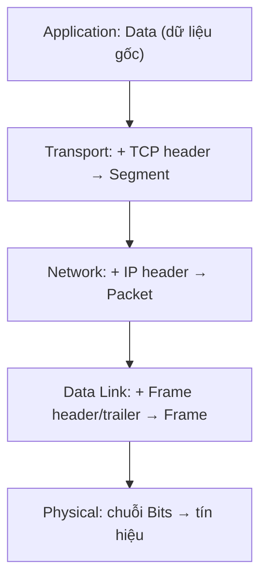

import { Callout } from "nextra/components";

# Đóng gói & tháo gói dữ liệu

**Encapsulation** (đóng gói — quá trình mỗi tầng thêm phần thông tin điều khiển của mình vào dữ liệu trước khi chuyển xuống tầng dưới) và **de-encapsulation** (tháo gói — quá trình ngược lại ở máy nhận) là cơ chế giúp mô hình phân lớp hoạt động trong thực tế. Bài học này giải thích quá trình đó và cho thấy tên đơn vị dữ liệu thay đổi qua từng tầng như thế nào.

## Header và payload

Mỗi tầng khi nhận dữ liệu từ tầng trên sẽ bọc nó bằng một **header** (phần đầu — chứa thông tin điều khiển của tầng đó như địa chỉ, số thứ tự, mã kiểm lỗi). Dữ liệu nhận từ tầng trên trở thành **payload** (tải trọng — phần dữ liệu thực được mang đi) của tầng hiện tại. Riêng tầng Data Link còn thêm cả **trailer** (phần đuôi) chứa trường kiểm lỗi.

Ý tưởng then chốt: một tầng **không cần hiểu** nội dung payload của nó. Tầng Network chỉ quan tâm tới header IP của mình; phần segment TCP bên trong với nó chỉ là dữ liệu cần chuyển đi. Đây chính là điều khiến các tầng độc lập với nhau.

## Encapsulation ở máy gửi

Khi dữ liệu đi **xuống** ngăn xếp ở máy gửi, mỗi tầng thêm header của mình:



Hình dung dữ liệu như một lá thư được lồng nhiều phong bì: tầng Transport bỏ thư vào phong bì ghi "gửi tới ứng dụng nào" (port), tầng Network lồng tiếp phong bì ghi "gửi tới máy nào" (IP), tầng Data Link lồng thêm phong bì ghi "chặng kế tiếp là card mạng nào" (MAC).

## Tên đơn vị dữ liệu đổi theo tầng

Đây là phần dễ nhầm nhất và thường được hỏi: **Protocol Data Unit** (PDU — tên gọi đơn vị dữ liệu tại mỗi tầng) đổi tên khi đi qua các tầng.

| Tầng (OSI)     | Tên đơn vị dữ liệu (PDU) | Thông tin tiêu biểu được thêm |
| -------------- | ------------------------ | ----------------------------- |
| Application    | **Data** (message)       | Nội dung ứng dụng             |
| Transport      | **Segment** (TCP) / Datagram (UDP) | Port nguồn/đích, seq number |
| Network        | **Packet** (datagram)    | IP nguồn/đích, TTL            |
| Data Link      | **Frame**                | MAC nguồn/đích, FCS (kiểm lỗi) |
| Physical       | **Bits**                 | Tín hiệu điện/quang/sóng      |

<Callout type="info">
  Mẹo nhớ thứ tự đơn vị từ trên xuống: **D**ata → **S**egment → **P**acket →
  **F**rame → **B**its ("Do Sergeants Pay For Beer?"). Đây là câu hỏi phỏng vấn
  rất phổ biến.
</Callout>

## De-encapsulation ở máy nhận

Ở máy nhận, quá trình diễn ra **ngược lại**, đi từ Physical lên Application. Mỗi tầng đọc header của mình, dùng thông tin trong đó, gỡ header ra, rồi chuyển payload còn lại lên tầng trên:

```text
Physical   : nhận bits → ráp lại thành Frame
Data Link  : kiểm FCS, đọc MAC, gỡ frame header/trailer → Packet
Network    : đọc IP đích, gỡ IP header → Segment
Transport  : đọc port, ráp các segment theo seq → Data
Application: trả Data cho đúng ứng dụng (vd: trình duyệt)
```

Mỗi header được tầng tương ứng ở máy nhận "đọc và gỡ". Ví dụ frame header do Data Link máy gửi tạo ra sẽ được Data Link máy nhận xử lý — đây là minh họa cụ thể cho ý "mỗi tầng nói chuyện với tầng đối ứng".

## Ví dụ thực tế: kích thước tăng dần khi đóng gói

Giả sử ứng dụng gửi 100 byte dữ liệu. Quan sát kích thước observable qua từng tầng (giá trị header điển hình):

```text
Data            : 100 byte
+ TCP header 20 : 120 byte  → Segment
+ IP header 20  : 140 byte  → Packet
+ Eth header 14 + trailer 4 : 158 byte → Frame
```

Chính các header này là "chi phí" (overhead) của việc phân lớp. Đổi lại, ta có được tính module hóa và khả năng định tuyến xuyên mạng.

## Tóm tắt nhanh

- **Encapsulation**: mỗi tầng ở máy gửi thêm header (Data Link thêm cả trailer) khi dữ liệu đi xuống.
- **De-encapsulation**: mỗi tầng ở máy nhận đọc và gỡ header tương ứng khi dữ liệu đi lên.
- Tên PDU đổi theo tầng: **Data → Segment → Packet → Frame → Bits**.
- Một tầng không cần hiểu payload của nó; nó chỉ xử lý header của chính mình.

## Bài tập

### Câu hỏi lý thuyết

1. Sắp xếp đúng thứ tự các tên đơn vị dữ liệu khi đi từ tầng Application xuống tầng Physical, và cho biết tầng nào gắn với mỗi tên.
2. Giải thích vì sao tầng Network không cần "đọc hiểu" segment TCP nằm bên trong packet của nó.

### Bài tập áp dụng

3. Một ứng dụng gửi 200 byte dữ liệu. Dùng các kích thước header điển hình (TCP 20 byte, IP 20 byte, Ethernet header 14 byte + trailer 4 byte), tính kích thước frame cuối cùng đặt lên dây.

<details>
  <summary>Đáp án & gợi ý</summary>

1. Data (Application) → Segment (Transport) → Packet (Network) → Frame (Data Link) → Bits (Physical).
2. Vì payload của tầng Network với nó chỉ là "dữ liệu cần chuyển". Network chỉ dùng IP header (địa chỉ, TTL) để định tuyến; việc diễn giải segment là nhiệm vụ của tầng Transport ở máy nhận. Đây là nguyên tắc độc lập giữa các tầng.
3. 200 + 20 (TCP) + 20 (IP) + 14 + 4 (Ethernet) = **258 byte**.

</details>

## Nguồn tham khảo

- J. F. Kurose & K. W. Ross, _Computer Networking: A Top-Down Approach_, 8th ed., mục 1.5.2 ("Encapsulation").
- RFC 1122, _Requirements for Internet Hosts_, mục 1.1.3 (mô hình tầng và xử lý dữ liệu).
