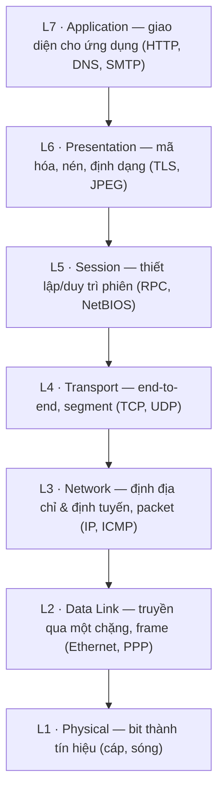

import { Callout } from "nextra/components";

# Mô hình OSI 7 tầng

Mô hình **OSI** (Open Systems Interconnection — mô hình tham chiếu chuẩn hóa truyền thông mạng thành 7 tầng, do ISO ban hành) là bộ khung khái niệm giúp ta hiểu mỗi phần của quá trình truyền thông thuộc về đâu. Bài học này đi qua cả 7 tầng: với mỗi tầng, ta xét **tên**, **mục đích**, **trách nhiệm chính**, **protocol ví dụ**, và **quan hệ với tầng liền kề**.

## Vì sao cần một mô hình tham chiếu?

OSI không phải là phần mềm bạn cài đặt; nó là một **reference model** (mô hình tham chiếu — khung lý thuyết để mô tả và so sánh các hệ thống, không phải bản cài đặt cụ thể). Giá trị của nó là cho ta một bộ từ vựng chung: khi ai đó nói "đây là vấn đề ở Layer 3", mọi kỹ sư đều hiểu là vấn đề định địa chỉ/định tuyến IP.

Bảy tầng được đánh số từ dưới lên: Layer 1 (Physical) ở đáy, Layer 7 (Application) ở đỉnh. Dữ liệu của người dùng đi từ trên xuống ở máy gửi và đi từ dưới lên ở máy nhận.

## Sơ đồ ngăn xếp 7 tầng



<Callout type="info">
  Mẹo nhớ thứ tự từ L7 xuống L1: "**A**ll **P**eople **S**eem **T**o **N**eed
  **D**ata **P**rocessing" (Application, Presentation, Session, Transport,
  Network, Data Link, Physical).
</Callout>

## Bảy tầng OSI chi tiết

| # | Tầng         | Mục đích chính                              | Trách nhiệm tiêu biểu                                   | Protocol/ví dụ        | Đơn vị dữ liệu |
| - | ------------ | ------------------------------------------- | ------------------------------------------------------- | --------------------- | -------------- |
| 7 | Application  | Cung cấp giao diện mạng cho ứng dụng        | Truy cập dịch vụ web, mail, tên miền                    | HTTP, DNS, SMTP, FTP  | data/message   |
| 6 | Presentation | Biểu diễn dữ liệu thống nhất                | Mã hóa (encryption), nén (compression), đổi định dạng   | TLS, JPEG, ASCII      | data           |
| 5 | Session      | Quản lý phiên giao tiếp                     | Mở/duy trì/đóng session, đồng bộ, checkpoint            | RPC, NetBIOS          | data           |
| 4 | Transport    | Truyền end-to-end giữa hai tiến trình       | Phân đoạn, đánh số, độ tin cậy, flow & congestion control | TCP, UDP            | segment        |
| 3 | Network      | Định địa chỉ logic & định tuyến liên mạng   | Gán IP, chọn đường (routing), chuyển tiếp packet        | IP, ICMP, OSPF        | packet         |
| 2 | Data Link    | Truyền dữ liệu qua một chặng vật lý         | Đóng frame, địa chỉ MAC, phát hiện lỗi (CRC)            | Ethernet, PPP, ARP    | frame          |
| 1 | Physical     | Truyền bit dưới dạng tín hiệu vật lý        | Mức điện áp, mã hóa đường truyền, đầu nối, tốc độ        | Ethernet PHY, RS-232  | bit            |

### Layer 1 — Physical

**Mục đích**: chuyển các bit (0 và 1) thành tín hiệu vật lý (điện, ánh sáng, sóng) để truyền trên medium. **Trách nhiệm**: định nghĩa mức điện áp, sơ đồ chân đầu nối, tốc độ truyền. **Quan hệ tầng liền kề**: nhận frame từ Data Link (L2) ở trên và đặt từng bit lên dây; nó không hiểu ý nghĩa của bit, chỉ truyền tín hiệu.

### Layer 2 — Data Link

**Mục đích**: truyền dữ liệu đáng tin cậy qua **một** liên kết vật lý giữa hai node kề nhau. **Trách nhiệm**: đóng gói thành **frame** (khung — đơn vị dữ liệu tầng 2 có địa chỉ MAC và trường kiểm lỗi), định địa chỉ bằng **MAC address** (địa chỉ vật lý 48-bit của card mạng), và phát hiện lỗi bằng CRC. **Quan hệ**: nhận packet từ Network (L3), bọc thành frame rồi đẩy xuống Physical (L1).

### Layer 3 — Network

**Mục đích**: đưa dữ liệu đi **xuyên nhiều mạng** từ nguồn tới đích. **Trách nhiệm**: gán địa chỉ logic (IP address), chọn đường đi tốt nhất (**routing**) và chuyển tiếp **packet**. **Quan hệ**: nhận segment từ Transport (L4), thêm địa chỉ IP nguồn/đích, đẩy packet xuống Data Link (L2) của chặng kế tiếp.

### Layer 4 — Transport

**Mục đích**: truyền thông **end-to-end** (đầu cuối tới đầu cuối) giữa hai tiến trình ứng dụng, không chỉ giữa hai máy. **Trách nhiệm**: chia dữ liệu thành **segment**, đánh số thứ tự, dùng **port** để định danh ứng dụng, và (với TCP) đảm bảo độ tin cậy, flow control, congestion control. **Quan hệ**: nhận dữ liệu từ Session (L5) trở lên, đẩy segment xuống Network (L3).

### Layer 5 — Session

**Mục đích**: thiết lập, duy trì và kết thúc các **session** (phiên — một mạch hội thoại logic giữa hai bên). **Trách nhiệm**: đồng bộ, đặt checkpoint để khôi phục khi gián đoạn, quản lý ai được nói khi nào. **Quan hệ**: cung cấp "khung hội thoại" cho Presentation (L6) phía trên, dựa trên kênh truyền của Transport (L4).

### Layer 6 — Presentation

**Mục đích**: đảm bảo dữ liệu được biểu diễn theo cách cả hai bên hiểu. **Trách nhiệm**: mã hóa/giải mã (encryption như TLS), nén (compression), chuyển đổi định dạng (ví dụ ký tự, ảnh JPEG). **Quan hệ**: nhận dữ liệu từ Application (L7), chuẩn hóa rồi chuyển xuống Session (L5).

### Layer 7 — Application

**Mục đích**: cung cấp giao diện để **ứng dụng** của người dùng truy cập dịch vụ mạng. **Trách nhiệm**: định nghĩa các protocol mà phần mềm dùng trực tiếp như HTTP (web), SMTP (email), DNS (phân giải tên). **Quan hệ**: là tầng cao nhất, nhận yêu cầu từ ứng dụng và giao dữ liệu xuống Presentation (L6).

<Callout type="warning">
  Layer 5, 6, 7 thường được gộp lại trong thực tế (xem bài **Mô hình TCP/IP**).
  Nhiều protocol hiện đại không tách bạch session/presentation thành tầng riêng.
</Callout>

## Ví dụ thực tế: gửi một email đi qua các tầng

Khi bạn nhấn "Gửi" trong ứng dụng mail:

```text
L7 Application : SMTP tạo message "From/To/Subject/Body"
L6 Presentation: nội dung được mã hóa qua TLS
L5 Session     : mở một phiên với mail server
L4 Transport   : TCP chia thành segment, thêm port 587
L3 Network     : thêm IP nguồn/đích, tạo packet
L2 Data Link   : đóng frame Ethernet, thêm MAC nguồn/đích
L1 Physical    : phát các bit thành tín hiệu điện trên cáp
```

Ở phía nhận, quá trình diễn ra ngược lại từ L1 lên L7: mỗi tầng "bóc" phần thông tin tầng đối ứng đã thêm vào và chuyển phần còn lại lên trên.

## Tóm tắt nhanh

- OSI là **mô hình tham chiếu** 7 tầng, đánh số từ Physical (L1) đến Application (L7).
- Mỗi tầng có mục đích riêng và chỉ phục vụ tầng trên + dùng dịch vụ tầng dưới.
- Đơn vị dữ liệu đổi tên theo tầng: bit → frame → packet → segment → data.
- Tầng càng thấp càng gần phần cứng; tầng càng cao càng gần ứng dụng.

## Bài tập

### Câu hỏi lý thuyết

1. Với mỗi tầng L2, L3, L4: nêu mục đích chính, một protocol ví dụ và tên đơn vị dữ liệu tại tầng đó.
2. Vì sao Transport (L4) được gọi là tầng "end-to-end" trong khi Data Link (L2) chỉ là "chặng tới chặng" (hop-to-hop)?

### Bài tập áp dụng

3. Một website không tải được. Bạn xác định được rằng cáp tốt, máy có IP hợp lệ và ping tới server thành công, nhưng trình duyệt báo lỗi chứng chỉ. Lỗi này thuộc tầng OSI nào? Giải thích.

<details>
  <summary>Đáp án & gợi ý</summary>

1. **L2 Data Link**: truyền qua một chặng vật lý; ví dụ Ethernet; đơn vị là **frame**. **L3 Network**: định địa chỉ & định tuyến liên mạng; ví dụ IP; đơn vị là **packet**. **L4 Transport**: truyền end-to-end giữa hai tiến trình; ví dụ TCP; đơn vị là **segment**.
2. L4 quản lý kết nối giữa hai **tiến trình ứng dụng** ở hai đầu cuối (qua port), bất kể có bao nhiêu router ở giữa. L2 chỉ lo việc truyền frame giữa hai thiết bị **kề nhau** trên cùng một liên kết; mỗi chặng có một phiên L2 riêng.
3. Thuộc **L6 Presentation** (hoặc ranh giới L6/L7): chứng chỉ liên quan đến TLS — mã hóa và xác thực biểu diễn dữ liệu. Ping thành công cho thấy L1–L3 ổn, nên lỗi nằm cao hơn ở phần mã hóa/biểu diễn.

</details>

## Nguồn tham khảo

- ISO/IEC 7498-1, _Information technology — Open Systems Interconnection — Basic Reference Model_, mục 6 (mô tả 7 tầng).
- J. F. Kurose & K. W. Ross, _Computer Networking: A Top-Down Approach_, 8th ed., mục 1.5.2 (so sánh mô hình OSI và Internet stack).
