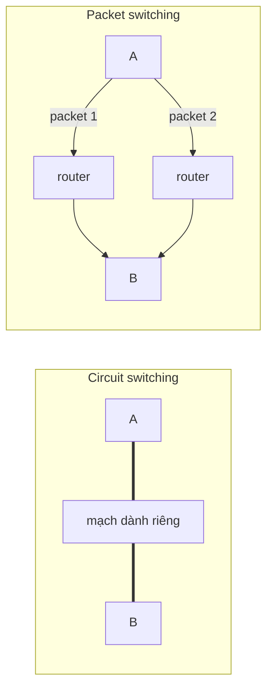
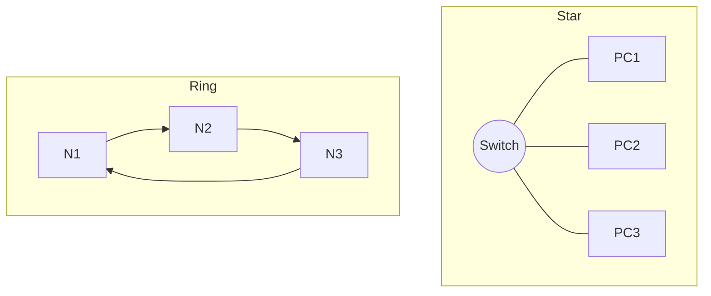

import { Callout } from "nextra/components";

# Chuyển mạch & Topology

Bài học này giới thiệu ba nhóm khái niệm nền tảng về cách mạng được tổ chức: hai kỹ thuật **switching** (chuyển mạch — cách dữ liệu được chuyển qua mạng), các **topology** (cấu trúc liên kết vật lý/logic giữa các node), và các loại mạng theo phạm vi địa lý (LAN, WAN, MAN). Mỗi khái niệm đi kèm định nghĩa và ít nhất một use case.

## Circuit switching và packet switching

**Circuit switching** (chuyển mạch kênh — thiết lập một đường truyền riêng, dành riêng giữa hai bên trong suốt phiên) hoạt động như mạng điện thoại truyền thống: trước khi truyền, hệ thống dành sẵn một "mạch" với băng thông cố định. Ưu điểm là chất lượng ổn định; nhược điểm là lãng phí khi không có dữ liệu vì mạch vẫn bị giữ. **Use case**: mạng điện thoại analog (PSTN), nơi cuộc gọi cần độ trễ thấp và ổn định.

**Packet switching** (chuyển mạch gói — chia dữ liệu thành các packet độc lập, mỗi packet tự tìm đường qua mạng dùng chung) là nền tảng của Internet. Không có đường dành riêng; các packet chia sẻ liên kết và được router chuyển tiếp theo từng chặng. Ưu điểm là dùng băng thông hiệu quả và chịu lỗi tốt; nhược điểm là độ trễ biến thiên. **Use case**: Internet và mọi mạng IP hiện đại.



<Callout type="info">
  Phép so sánh: circuit switching giống thuê nguyên một làn đường cao tốc cho
  riêng bạn; packet switching giống đi chung đường với mọi xe khác — hiệu quả
  hơn nhưng thời gian tới nơi có thể thay đổi.
</Callout>

## Các topology phổ biến

**Topology** mô tả cách các node được nối với nhau. Bốn dạng cơ bản:

| Topology | Mô tả ngắn                                   | Ưu điểm chính           | Nhược điểm chính                | Use case                  |
| -------- | -------------------------------------------- | ----------------------- | ------------------------------- | ------------------------- |
| Bus      | Mọi node nối vào một đường trục chung         | Đơn giản, ít cáp        | Trục hỏng là sập cả mạng        | Mạng LAN cũ (10BASE2)     |
| Star     | Mọi node nối vào một thiết bị trung tâm       | Dễ quản lý, một node hỏng không ảnh hưởng node khác | Trung tâm hỏng là sập mạng | LAN hiện đại (qua switch) |
| Ring     | Các node nối thành vòng, dữ liệu đi một chiều | Hiệu năng ổn định       | Một node/đứt vòng gây gián đoạn | Token Ring, FDDI, SONET   |
| Mesh     | Nhiều node nối trực tiếp với nhau             | Dự phòng cao, nhiều đường | Tốn cáp, phức tạp             | Mạng lõi của ISP, backbone |



Trong thực tế ngày nay, **star topology** quanh một switch là phổ biến nhất cho mạng nội bộ, còn **mesh** (đặc biệt là partial mesh) được dùng ở lõi mạng nơi cần nhiều đường dự phòng.

## Phân loại mạng theo phạm vi

Mạng cũng được phân loại theo phạm vi địa lý:

- **LAN** (Local Area Network — mạng cục bộ trong phạm vi nhỏ như một tòa nhà, văn phòng). **Use case**: mạng văn phòng nối các máy tính và máy in qua switch và Wi-Fi.
- **MAN** (Metropolitan Area Network — mạng đô thị bao phủ một thành phố hoặc khu vực lớn). **Use case**: kết nối nhiều chi nhánh của một trường đại học hoặc doanh nghiệp trong cùng thành phố.
- **WAN** (Wide Area Network — mạng diện rộng nối các vị trí cách xa nhau, có thể xuyên quốc gia). **Use case**: Internet, hoặc mạng riêng nối văn phòng ở Hà Nội với văn phòng ở TP.HCM.

```text
Phạm vi tăng dần:  LAN  ⊂  MAN  ⊂  WAN
                   (tòa nhà) (thành phố) (quốc gia/toàn cầu)
```

## Ví dụ thực tế: dữ liệu rời LAN ra WAN

Khi máy tính trong **LAN** văn phòng truy cập một server ở nước ngoài, dữ liệu được đóng thành packet (**packet switching**), đi qua switch trung tâm (**star topology**), tới router biên, rồi vượt **WAN** (Internet) qua nhiều router của các ISP — phần lõi giữa các ISP thường là **mesh** để có đường dự phòng. Có thể quan sát hành trình này bằng:

```bash
$ traceroute example.com
 1  192.168.1.1      1.2 ms      # router trong LAN
 2  10.0.0.1         8.4 ms      # router của ISP
 3  72.14.x.x       20.1 ms      # đi vào WAN
```

## Tóm tắt nhanh

- **Circuit switching** dành đường riêng (điện thoại); **packet switching** chia sẻ đường bằng các packet độc lập (Internet).
- Bốn topology cơ bản: **bus, star, ring, mesh** — mỗi loại có đánh đổi riêng về chi phí và độ tin cậy.
- Theo phạm vi: **LAN** (tòa nhà) ⊂ **MAN** (thành phố) ⊂ **WAN** (diện rộng).

## Bài tập

### Câu hỏi lý thuyết

1. Nêu một ưu điểm và một nhược điểm của packet switching so với circuit switching.
2. Trong star topology, vì sao một máy trạm hỏng không làm sập cả mạng, trong khi thiết bị trung tâm hỏng thì có?

### Bài tập áp dụng

3. Một doanh nghiệp có 3 văn phòng ở 3 thành phố, mỗi văn phòng có mạng nội bộ riêng. Hãy phân loại: mạng trong một văn phòng thuộc loại nào, và mạng nối ba văn phòng thuộc loại nào? Đề xuất topology cho phần lõi nối ba văn phòng và giải thích.

<details>
  <summary>Đáp án & gợi ý</summary>

1. Ưu điểm: dùng băng thông hiệu quả hơn vì nhiều bên chia sẻ liên kết, và chịu lỗi tốt (packet có thể đổi đường). Nhược điểm: độ trễ biến thiên, không đảm bảo băng thông cố định như mạch dành riêng.
2. Vì mỗi máy trạm có một liên kết **riêng** tới thiết bị trung tâm; mất một liên kết chỉ ảnh hưởng máy đó. Thiết bị trung tâm là điểm mọi liên kết hội tụ (single point of failure), nên nó hỏng là toàn mạng mất kết nối.
3. Mạng trong một văn phòng là **LAN**; mạng nối ba văn phòng ở ba thành phố là **WAN**. Phần lõi nên dùng **mesh** (hoặc partial mesh) để mỗi văn phòng có nhiều đường tới các văn phòng khác, tăng dự phòng khi một liên kết hỏng.

</details>

## Nguồn tham khảo

- J. F. Kurose & K. W. Ross, _Computer Networking: A Top-Down Approach_, 8th ed., mục 1.3 ("The Network Core" — so sánh packet switching và circuit switching).
- A. S. Tanenbaum & D. J. Wetherall, _Computer Networks_, 5th ed., mục 1.2 ("Network Hardware" — topology và phân loại LAN/MAN/WAN).
