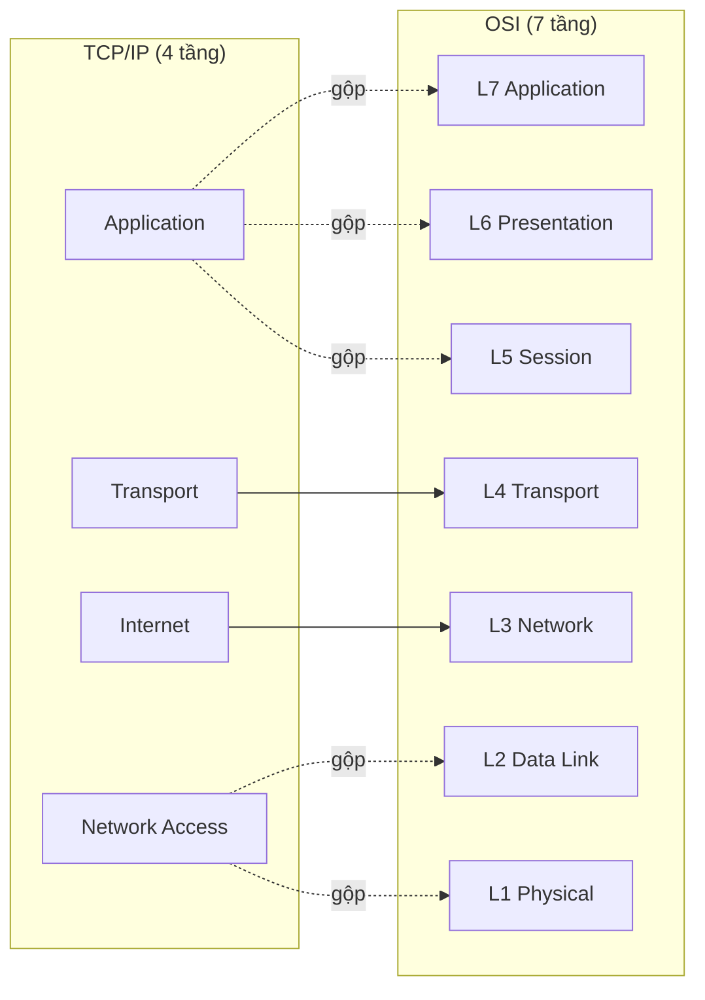

import { Callout } from "nextra/components";

# Mô hình TCP/IP 4 tầng

Mô hình **TCP/IP** (còn gọi là **Internet protocol suite** — bộ protocol thực tế vận hành Internet) là mô hình được triển khai thật, khác với OSI mang tính lý thuyết. Bài học này trình bày 4 tầng của TCP/IP, ánh xạ từng tầng sang OSI, và giải thích vì sao TCP/IP gộp một số tầng của OSI lại.

## Bốn tầng của TCP/IP

TCP/IP chia truyền thông thành 4 tầng thay vì 7. Từ trên xuống: **Application**, **Transport**, **Internet**, và **Network Access** (một số tài liệu gọi là **Link**). Mô hình này ra đời cùng Internet và phản ánh cách phần mềm thực tế được xây dựng.

| Tầng TCP/IP    | Mục đích                                            | Protocol tiêu biểu        |
| -------------- | --------------------------------------------------- | ------------------------- |
| Application    | Giao tiếp ứng dụng đầu cuối                          | HTTP, DNS, SMTP, FTP, SSH |
| Transport      | Truyền end-to-end giữa hai tiến trình               | TCP, UDP                  |
| Internet       | Định địa chỉ logic & định tuyến liên mạng           | IP, ICMP, ARP             |
| Network Access | Truyền khung trên một liên kết vật lý               | Ethernet, Wi-Fi (802.11)  |

## Ánh xạ TCP/IP sang OSI

Đây là điểm cốt lõi của bài: mỗi tầng TCP/IP tương ứng với một hoặc nhiều tầng OSI.



Ánh xạ cụ thể:

- **Application (TCP/IP)** = **L5 + L6 + L7 (OSI)**: gộp Session, Presentation, Application.
- **Transport (TCP/IP)** = **L4 (OSI)**: tương ứng 1-1.
- **Internet (TCP/IP)** = **L3 (OSI)**: tương ứng 1-1.
- **Network Access (TCP/IP)** = **L1 + L2 (OSI)**: gộp Physical và Data Link.

<Callout type="info">
  Hai tầng giữa — **Transport** và **Internet** — ánh xạ 1-1 với OSI. Chính ở
  hai tầng này nằm hai protocol đặt tên cho cả mô hình: **TCP** (Transport) và
  **IP** (Internet).
</Callout>

## Vì sao TCP/IP gộp tầng?

TCP/IP gộp **L5/L6/L7** thành một tầng Application vì trong thực tế, ranh giới giữa session, presentation và application rất mờ. Một protocol như HTTP tự lo việc quản lý phiên (qua header `Connection`, cookie) và biểu diễn dữ liệu (qua `Content-Type`, nén `gzip`) ngay trong chính nó. Tách chúng thành ba tầng riêng tạo thêm phức tạp mà không mang lại lợi ích triển khai.

Tương tự, TCP/IP gộp **L1/L2** thành Network Access vì việc truyền bit (Physical) và đóng frame (Data Link) luôn đi cùng nhau trong một công nghệ liên kết cụ thể như Ethernet hay Wi-Fi. Chuẩn Ethernet đã định nghĩa cả phần tín hiệu lẫn phần frame, nên gộp lại phản ánh đúng cách phần cứng được chuẩn hóa.

Triết lý thiết kế của TCP/IP là **"narrow waist"** (thắt lưng hẹp): tầng Internet chỉ có một protocol chủ đạo là **IP**, còn phía trên (nhiều protocol ứng dụng) và phía dưới (nhiều công nghệ liên kết) thì đa dạng. IP là điểm hội tụ giúp mọi thứ tương tác được với nhau.

## Ví dụ thực tế: phân giải tên và tải trang

Khi bạn truy cập `https://example.com`, các tầng TCP/IP phối hợp với những protocol cụ thể:

```text
Application    : DNS hỏi IP của example.com; HTTP gửi GET /
Transport      : TCP mở kết nối tới cổng 443, chia segment
Internet       : IP định tuyến packet tới IP đích của server
Network Access : Ethernet/Wi-Fi đóng frame và truyền tín hiệu
```

Quan sát được: lệnh `dig example.com` cho thấy hoạt động của tầng Application (DNS), còn `traceroute example.com` cho thấy hoạt động của tầng Internet (các hop IP trung gian).

```bash
$ dig +short example.com
93.184.216.34
```

## Tóm tắt nhanh

- TCP/IP có **4 tầng**: Application, Transport, Internet, Network Access.
- Ánh xạ sang OSI: Application = L5–L7, Transport = L4, Internet = L3, Network Access = L1–L2.
- TCP/IP gộp tầng vì trong thực tế các chức năng đó luôn đi cùng nhau (HTTP tự lo session/presentation; Ethernet tự lo cả physical lẫn framing).
- Thiết kế "narrow waist" đặt **IP** làm điểm hội tụ chung.

## Bài tập

### Câu hỏi lý thuyết

1. Liệt kê 4 tầng TCP/IP và ánh xạ mỗi tầng sang (các) tầng OSI tương ứng.
2. Giải thích vì sao tầng Application của TCP/IP lại gộp ba tầng OSI. Cho một ví dụ protocol minh họa việc gộp này.

### Bài tập áp dụng

3. Với mỗi protocol sau, cho biết nó hoạt động ở tầng TCP/IP nào: `ARP`, `TCP`, `HTTP`, `IP`.

<details>
  <summary>Đáp án & gợi ý</summary>

1. Application = L7+L6+L5; Transport = L4; Internet = L3; Network Access = L2+L1.
2. Vì session, presentation và application trong thực tế khó tách bạch: HTTP tự quản lý phiên (cookie, header `Connection`) và biểu diễn dữ liệu (`Content-Type`, nén `gzip`) ngay trong protocol, nên không cần ba tầng riêng.
3. `ARP` → Network Access (ranh giới Internet/Link, ánh xạ địa chỉ IP↔MAC); `TCP` → Transport; `HTTP` → Application; `IP` → Internet.

</details>

## Nguồn tham khảo

- RFC 1122, _Requirements for Internet Hosts — Communication Layers_, mục 1.1.3 (mô tả các tầng của Internet protocol suite).
- J. F. Kurose & K. W. Ross, _Computer Networking: A Top-Down Approach_, 8th ed., mục 1.5.1–1.5.2.
