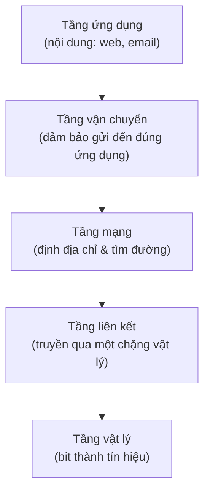

import { Callout } from "nextra/components";

# Mạng máy tính là gì?

Bài học này trả lời ba câu hỏi nền tảng: một **computer network** là gì, một **protocol** là gì, và vì sao chúng ta lại mô tả việc truyền thông trên mạng bằng các mô hình phân lớp (layered model). Đây là ba khái niệm sẽ xuất hiện liên tục trong toàn bộ khóa học.

## Computer network là gì?

Một **computer network** (mạng máy tính — tập hợp các thiết bị được kết nối để trao đổi dữ liệu và chia sẻ tài nguyên) hình thành ngay khi có từ hai thiết bị trở lên có thể gửi dữ liệu cho nhau. Các thiết bị này — gọi chung là **host** (máy chủ/máy trạm tham gia mạng) hoặc **node** (một điểm nút trên mạng) — có thể là máy tính, điện thoại, máy chủ, hoặc thiết bị IoT.

Một mạng cần ba thành phần để hoạt động. Thứ nhất là các **end system** (thiết bị đầu cuối nơi dữ liệu được tạo ra hoặc tiêu thụ), ví dụ laptop của bạn và web server. Thứ hai là **medium** (môi trường truyền dẫn) như cáp đồng, cáp quang hoặc sóng vô tuyến. Thứ ba là các thiết bị trung gian như **switch** và **router** giúp chuyển dữ liệu đi đúng hướng.

Mạng tồn tại để chia sẻ: chia sẻ dữ liệu (gửi file, xem web), chia sẻ tài nguyên (máy in, ổ đĩa mạng) và chia sẻ dịch vụ (đăng nhập, thanh toán). Mọi giá trị của mạng đều quy về việc cho phép một thiết bị này dùng được thứ nằm ở thiết bị khác.

## Protocol là gì?

Một **protocol** (giao thức — tập hợp quy tắc quy định định dạng và thứ tự các thông điệp được trao đổi giữa hai bên, cùng hành động tương ứng) là "ngôn ngữ chung" giúp hai thiết bị hiểu nhau. Nếu không có protocol, một máy gửi các bit nhưng máy kia không biết bit nào là địa chỉ, bit nào là dữ liệu, hay khi nào thì được phép trả lời.

Một protocol định nghĩa ba thứ: **syntax** (cú pháp — định dạng và thứ tự các trường trong thông điệp), **semantics** (ngữ nghĩa — ý nghĩa của từng trường và hành động cần làm), và **timing** (thời điểm — khi nào được gửi và tốc độ gửi). Ví dụ, protocol `HTTP` quy định rằng client gửi dòng `GET /index.html HTTP/1.1` trước, rồi server mới trả về trạng thái và nội dung.

<Callout type="info">
  Một phép so sánh: protocol giống như nghi thức chào hỏi giữa hai người. Người
  A chìa tay ra (yêu cầu), người B bắt tay đáp lại (phản hồi). Nếu một bên không
  theo nghi thức, cuộc giao tiếp thất bại — đúng như khi hai thiết bị dùng
  protocol khác nhau.
</Callout>

## Ví dụ thực tế: một lượt trao đổi HTTP

Khi bạn mở một trang web, trình duyệt (client) và web server trao đổi thông điệp theo protocol `HTTP`. Đây là một ví dụ có input và output quan sát được:

```http
GET /index.html HTTP/1.1
Host: example.com

HTTP/1.1 200 OK
Content-Type: text/html
Content-Length: 1256

<!doctype html> ...
```

Client gửi một **request** với phương thức `GET` và đường dẫn `/index.html`. Server trả về một **response** bắt đầu bằng mã trạng thái `200 OK`, nghĩa là "tìm thấy và trả về thành công". Cả hai bên tuân theo cùng một protocol nên hiểu chính xác từng dòng nghĩa là gì.

## Vì sao dùng mô hình phân lớp?

Truyền thông mạng là một bài toán phức tạp: phải xử lý tín hiệu điện, phát hiện lỗi, định địa chỉ, tìm đường, rồi mới đến nội dung ứng dụng. Mô hình phân lớp (layered model) chia bài toán lớn này thành các **layer** (tầng — một nhóm chức năng liên quan, mỗi tầng chỉ phục vụ tầng trên và dùng dịch vụ của tầng dưới) độc lập, mỗi tầng giải quyết một phần.

Phân lớp mang lại ba lợi ích. Một là **tính module hóa**: có thể thay đổi cách hoạt động bên trong một tầng (ví dụ đổi từ Wi-Fi sang cáp) mà không ảnh hưởng các tầng khác. Hai là **khả năng tương tác**: các nhà sản xuất khác nhau chỉ cần tuân theo "hợp đồng" giữa các tầng. Ba là **dễ học và dễ gỡ lỗi**: khi có sự cố, bạn khoanh vùng được vấn đề thuộc tầng nào.



Ý tưởng then chốt: mỗi tầng "nói chuyện" với tầng tương ứng ở thiết bị bên kia như thể có một đường truyền trực tiếp, dù thực tế dữ liệu phải đi xuống hết các tầng dưới rồi mới truyền đi. Chương sau sẽ cụ thể hóa ý tưởng này bằng mô hình **OSI**.

## Tóm tắt nhanh

- **Computer network** là tập hợp thiết bị kết nối để trao đổi dữ liệu và chia sẻ tài nguyên.
- **Protocol** là tập quy tắc về syntax, semantics và timing để các thiết bị hiểu nhau.
- Mô hình phân lớp chia bài toán truyền thông thành các tầng độc lập, giúp module hóa, tương tác và gỡ lỗi dễ hơn.

## Bài tập

### Câu hỏi lý thuyết

1. Giải thích bằng lời của bạn ba thành phần tối thiểu mà một computer network cần có để hoạt động.
2. Một protocol định nghĩa những khía cạnh nào của việc truyền thông? Cho ví dụ một khía cạnh trong protocol HTTP.

### Bài tập phân tích

3. Hãy nêu một lợi ích cụ thể của mô hình phân lớp và đưa ra một tình huống thực tế minh họa lợi ích đó (ví dụ khi nâng cấp phần cứng mạng).

<details>
  <summary>Đáp án & gợi ý</summary>

1. Ba thành phần: (a) **end system** tạo/tiêu thụ dữ liệu (laptop, server), (b) **medium** truyền dẫn (cáp đồng, cáp quang, sóng vô tuyến), (c) thiết bị trung gian như switch/router để chuyển dữ liệu đúng hướng.
2. Protocol định nghĩa **syntax** (định dạng/thứ tự thông điệp), **semantics** (ý nghĩa và hành động), và **timing** (thời điểm, tốc độ). Ví dụ trong HTTP: cú pháp dòng `GET /index.html HTTP/1.1` là một quy định về syntax.
3. Ví dụ lợi ích **module hóa**: khi đổi kết nối từ Wi-Fi sang cáp Ethernet, chỉ tầng vật lý và tầng liên kết thay đổi; ứng dụng web phía trên vẫn chạy nguyên vẹn vì "hợp đồng" giữa các tầng không đổi.

</details>

## Nguồn tham khảo

- J. F. Kurose & K. W. Ross, _Computer Networking: A Top-Down Approach_, 8th ed., Chương 1 (mục 1.1 "What Is the Internet?" và 1.5 "Protocol Layers and Their Service Models").
