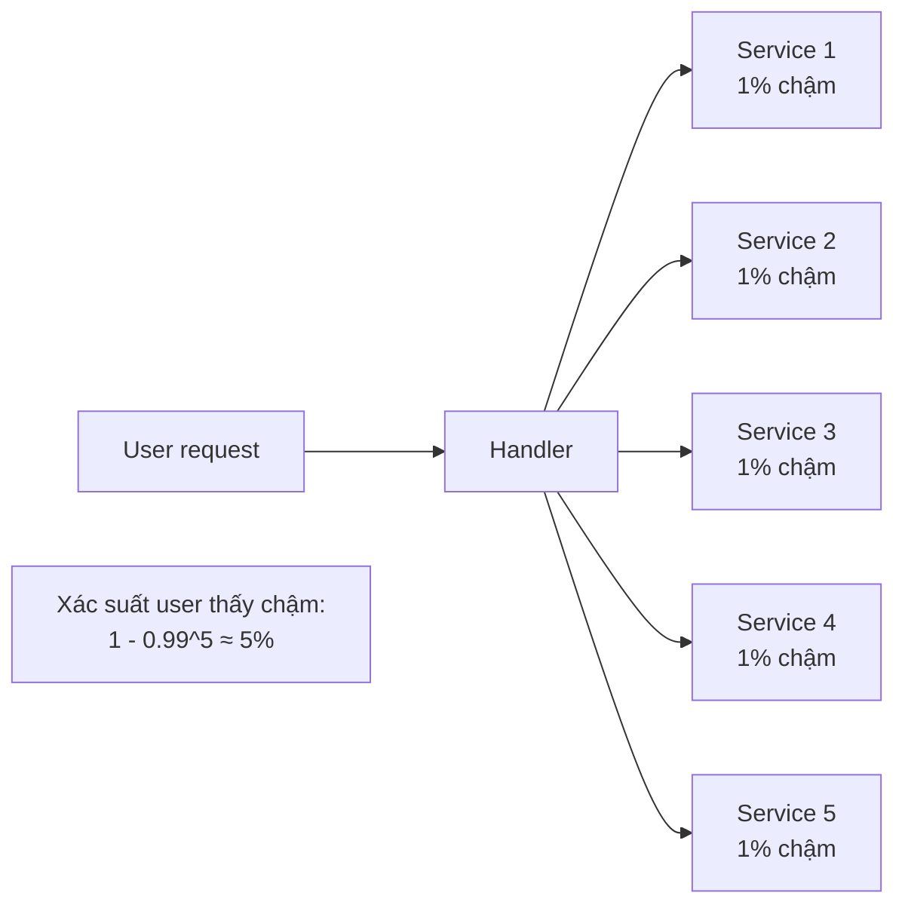
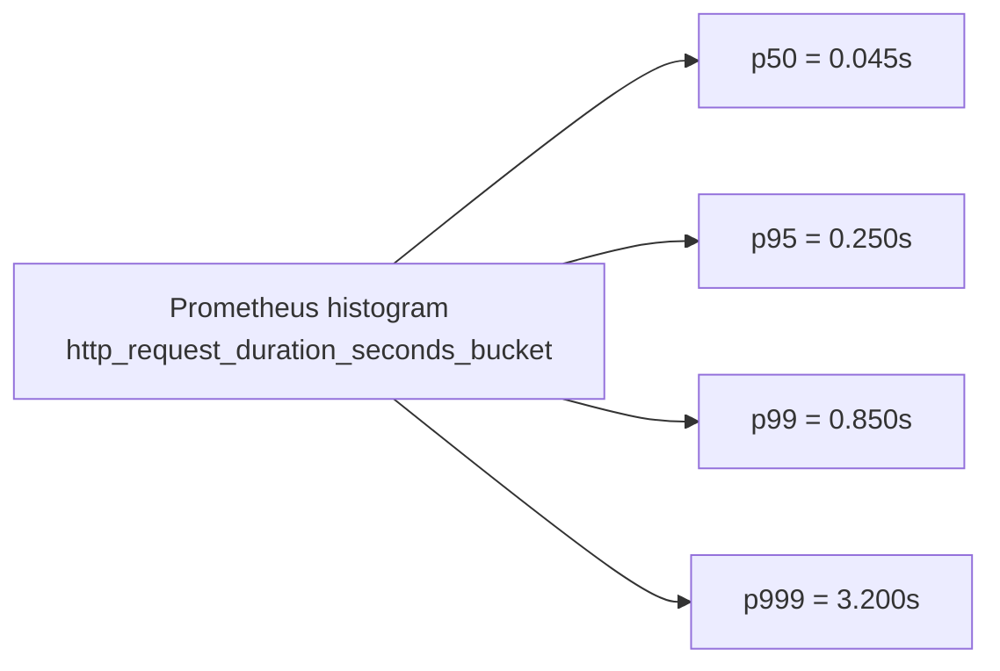

import { Callout } from "nextra/components";

# Latency & Tail Latency

Câu hỏi "API có nhanh không?" nghe đơn giản nhưng thường trả lời sai. Nếu dùng **trung bình** (average), bạn có thể nói "150ms" trong khi 1% user đang chờ 5 giây. Nếu dùng **median**, con số đẹp hơn nhưng vẫn giấu đi phần đuôi. Ở scale lớn, đúng là phần đuôi đó — **tail latency** — quyết định trải nghiệm và độ tin cậy. Bài này giải thích các khái niệm phân vị, tại sao tail latency quan trọng hơn ta tưởng, và cách tính **latency budget** cho một API.

## Latency không phải một con số, mà là phân phối

Đo latency của một API là thu được **phân phối** — một tập hàng nghìn/triệu giá trị. Từ phân phối này, ta rút ra các con số tổng hợp:

- **Average (trung bình)**: bị outlier kéo lệch. Một request 30 giây trong 1000 request bình thường làm trung bình sai lệch nghiêm trọng.
- **Median (P50)**: giá trị mà 50% request nhanh hơn. Robust hơn average, nhưng bỏ qua nửa còn lại.
- **P95, P99, P999**: giá trị mà **95% / 99% / 99.9%** request nhanh hơn (hoặc bằng). Đây là **percentile**.

Ví dụ output từ Prometheus/Grafana cho một API:

```text
p50 : 45 ms
p90 : 120 ms
p95 : 250 ms
p99 : 850 ms
p999: 3200 ms
```

Đọc dòng cuối: 1 trong 1000 request mất > 3.2 giây. Nếu API phục vụ 10 triệu request/ngày, đó là **10 000 request/ngày quá 3.2 giây** — không phải "hiếm khi xảy ra".

<Callout type="info">
  Quy ước viết: **P50**, **P95**, **P99**, **P99.9** (hoặc **P999** không dấu chấm).
  Đọc là "phân vị thứ 99" hoặc "99th percentile". Google SRE Book gọi chúng là
  **"tail latency"** và dành hẳn một chương cho vấn đề này.
</Callout>

## Tại sao P99 quan trọng hơn P50

Bạn có thể nghĩ P50 quan trọng hơn vì "hầu hết user đều ở đó". Nhưng thực tế mỗi user không chỉ gửi một request. Trang web thông thường tải hàng chục tài nguyên; API nội bộ có khi gọi 10 service khác trong một handler. Khi mỗi request có một xác suất nhỏ rơi vào tail, xác suất tổng lại rất lớn.

Toán học đơn giản: mỗi request có xác suất **1%** vượt P99 = 0.85s. Một page load gọi 20 API endpoint. Xác suất **ít nhất một** trong 20 rơi vào tail:

```text
P(có ít nhất 1 request chậm) = 1 - (0.99)^20 ≈ 1 - 0.818 = 18.2%
```

**18% user thấy trang chậm** — dù mỗi request chỉ có 1% xác suất chậm. Đây là hiện tượng **tail amplification**: càng nhiều dependency, tail càng lớn.



Bài học: khi hệ có nhiều lớp gọi lẫn nhau, **tối ưu P99 hoặc P999 quan trọng hơn P50**. Cải thiện P50 từ 50ms xuống 45ms ít có ý nghĩa nếu P99 vẫn 850ms.

## Nguồn gây tail latency

Vì sao một số request lại chậm hơn nhiều lần median? Sáu nguyên nhân phổ biến:

- **GC pause hoặc process pause**: Java/Go/Node có garbage collector; đôi khi pause 50-500ms không thể tránh.
- **Contention trong DB**: một query cụ thể đụng lock, hoặc chờ connection trong pool đã cạn.
- **Cache miss**: 99% request hit cache < 10ms, 1% miss phải query DB 200ms.
- **Kernel scheduling và context switch**: OS quyết định cho process khác chạy, request của bạn chờ.
- **Network congestion và retransmit**: TCP mất gói thoáng qua, retransmit thêm 100-500ms.
- **Cold path**: code path ít khi chạy, không được JIT compile, không có cache warmed up.

Trong mọi hệ thống production tôi từng gặp, **cache miss** và **DB contention** chiếm phần lớn tail. Hai chỗ đầu tiên nên nhìn vào khi thấy P99 xấu.

## Latency budget: chia ngân sách cho từng chặng

Trước khi tối ưu, phải biết bạn có bao nhiêu **latency budget** cho endpoint đó. Nguyên tắc: nếu SLO là "P99 < 500ms cho GET /api/order/:id", đó là **giới hạn cứng**, và mọi thành phần phải chia sẻ 500ms này.

Ví dụ tính budget cho một API gọi từ mobile user Việt Nam tới server Singapore:

```text
Ngân sách tổng: 500 ms cho P99

Chia thành phần:
  Propagation Vietnam <-> Singapore     ~30 ms  x2 chiều = 60 ms
  TCP + TLS handshake (cold connect)    ~90 ms (0 nếu Keep-Alive)
  DNS resolve (thường cached)           ~5 ms
  Server processing budget              ??? ms  <- phần còn lại
  Response body transfer (~10KB)        ~10 ms

Bỏ handshake nếu keep-alive:
  500 - 60 - 5 - 10 = 425 ms cho server + DB
```

425ms cho server + DB nghe rộng rãi, nhưng nếu handler gọi 5 API nội bộ, mỗi API ~50ms, đã hết 250ms — còn 175ms cho DB + logic. Đây là cách bạn phát hiện thiết kế nào không khả thi ngay từ trên giấy.

Trên khoảng cách xa hơn (Vietnam → US East), propagation một mình đã ~180ms một chiều, 360ms round-trip — vượt hầu như mọi budget SLO 500ms cho request cần bay xa. Đây là lý do **CDN và region gần user** không phải nice-to-have mà là **bắt buộc** cho hệ toàn cầu.

## Đo tail đúng cách

Đo P99 chính xác không đơn giản như tính trung bình. Ba lưu ý:

**Phải dùng histogram, không phải summary point**. Prometheus có hai loại metric cho latency: `Summary` (tính quantile ở client) và `Histogram` (đếm số request rơi vào từng bucket, quantile tính ở server). Với hệ phân tán, **luôn dùng Histogram** vì bạn có thể tổng hợp qua nhiều instance; Summary không aggregate được đúng.

**Đo qua đủ dữ liệu**. Với P999, bạn cần ít nhất 1000 request để giá trị có nghĩa; với P99999 cần 100 000 request. Đo P99 với 100 request là vô nghĩa toán học.

**Đo end-to-end, không chỉ server-side**. Server có thể trả 20ms nhưng user thấy 300ms vì mạng chậm. Đo cả hai đầu.

Trên Grafana/Datadog, plot P50/P95/P99 cùng lúc để thấy tail:



## Coordinated omission — bẫy đo lường phổ biến

Một bẫy đo lường ít ai nói tới: khi hệ **quá tải**, request chờ trong queue và mãi mới được xử lý. Nếu bạn đo latency **chỉ từ lúc bắt đầu xử lý**, bạn bỏ qua thời gian chờ queue — con số P99 giả nhỏ hơn thực tế nhiều. Đây gọi là **coordinated omission**.

Ví dụ: server bình thường xử lý 10ms/request. Đột nhiên tải lên và request phải chờ 500ms trong queue trước khi được xử lý. Tổng thời gian user thấy = 500 + 10 = 510ms. Nếu bạn đo latency = "start_processing → end_processing" = 10ms, bạn báo cáo "P99 vẫn 10ms" — user thì đang chờ 510ms.

Cách tránh: **đo từ lúc request tới server (accept từ TCP)**, không phải từ lúc handler bắt đầu chạy. Nhiều framework hiện đại đo đúng, nhưng luôn kiểm.

<Callout type="warning">
  Tool benchmark như `wrk` và `ab` có thể mắc coordinated omission khi rate limit
  ép request phải đợi. Dùng **wrk2** hoặc **k6** — chúng thiết kế để tránh vấn đề
  này bằng cách gửi request theo lịch cố định thay vì "đợi trả lời rồi gửi tiếp".
</Callout>

## Cải thiện tail: pattern thực tế

Sau khi đo và biết P99 đâu chậm, ba pattern kinh điển:

**Hedged requests**: gửi cùng request tới 2-3 replica, dùng response nhanh nhất, hủy các cái còn lại. Đánh đổi bandwidth để giảm tail. Google dùng pattern này rộng rãi.

**Timeout + retry với budget**: đặt timeout ngắn hơn P99 hiện tại (ví dụ nếu P99 = 500ms, timeout = 400ms), retry request bị timeout. Nếu retry thành công < 100ms, user thấy 500ms thay vì đợi 5s cho request "bị treo". Bài kế tiếp đào sâu.

**Warm caches và pre-connect**: cold path là nguồn tail lớn. Warm cache khi start service, pre-connect tới các dependency, dùng connection pool để không tốn handshake.

## Ví dụ thực tế: quan sát P99 với curl

```bash
$ for i in $(seq 1 100); do
    curl -w "%{time_total}\n" -o /dev/null -s https://api.example.com/health
  done | sort -n > /tmp/lat.txt

# P50 = dòng 50, P95 = dòng 95, P99 = dòng 99
$ awk 'NR==50{p50=$1} NR==95{p95=$1} NR==99{p99=$1} END{print "p50:"p50, "p95:"p95, "p99:"p99}' /tmp/lat.txt
p50:0.045 p95:0.187 p99:0.612
```

100 request đủ để có ý tưởng về P50 và P95, nhưng P99 vẫn cần nhiều hơn — chạy 1000 để có con số tin cậy.

## Tóm tắt nhanh

- Latency là **phân phối**, không phải một số; **P95/P99/P999** cho biết trải nghiệm của **tail** user, thường mới là điểm cần tối ưu.
- **Tail amplification**: request có nhiều dependency thì xác suất chậm tăng phi tuyến (`1 - (1-p)^N`).
- **Latency budget** chia SLO cho các thành phần: propagation, handshake, server, DB, response transfer.
- Nguồn tail phổ biến: **GC pause**, **DB contention**, **cache miss**, kernel scheduling, retransmit, cold path.
- Đo: **Histogram** thay vì Summary; **đủ dữ liệu** cho P99+; tránh **coordinated omission** (đo từ lúc request tới, không từ lúc handler chạy).
- Cải thiện tail: **hedged requests**, **timeout + retry**, **warm caches + pre-connect**.

## Bài tập

### Câu hỏi lý thuyết

1. Giải thích **tail amplification**: một request gọi 10 service, mỗi service có P99 = 1s. Tính xác suất **ít nhất một** service chạm P99 (giả sử độc lập). Con số này nói gì về việc nhìn P50 để đánh giá hệ thống?

### Bài tập tính toán

2. SLO của endpoint `GET /api/order/:id`: P99 < 400ms cho user Việt Nam gọi tới server Singapore. Cho biết: propagation VN↔SG là 30ms một chiều, TLS handshake (khi cold connect) là 90ms, DNS thường cached (~5ms), response body ~5KB (bỏ qua transfer time). Tính **latency budget còn lại cho server processing** trong hai tình huống: (a) kết nối cold; (b) Keep-Alive (bỏ handshake).

### Tình huống

3. Sếp yêu cầu bạn giảm P99 từ 800ms xuống 400ms cho một API. Bạn chạy profiler và thấy: `Average = 120ms`, `P50 = 90ms`, `P99 = 800ms`. Đội DBA bảo "average là 120ms nên OK". Hãy giải thích vì sao average không phản ánh vấn đề, và đề xuất một chuỗi bước điều tra để tìm nguồn gây tail.

### Phân tích

4. Bạn đo API bằng `wrk` với 1000 request/s và thấy P99 = 50ms — quá đẹp. Nhưng user thật báo lỗi latency cao. Nghi ngờ **coordinated omission**. Giải thích khả năng gì đang xảy ra và cách dùng `wrk2` hoặc `k6` để đo lại cho đúng.

<details>
  <summary>Đáp án & gợi ý</summary>

1. `P(ít nhất 1 chậm) = 1 - (0.99)^10 ≈ 1 - 0.9044 = 9.56%`. Gần 10% request tổng chạm ít nhất một dependency chậm. Con số này cho thấy **P50 không phản ánh đúng trải nghiệm** khi hệ có nhiều dependency: mỗi service có P50 rất tốt vẫn có thể tạo ra một hệ P99 tổng rất xấu. Tối ưu phải nhắm vào P99 của các dependency, không phải trung bình.

2. (a) **Cold connect**: `500 - (30*2) - 90 - 5 = 500 - 60 - 90 - 5 = 345ms`. Tức chỉ còn 345ms cho server, không phải 400. (b) **Keep-Alive**: `500 - 60 - 5 = 435ms` cho server. Sai khác 90ms giữa hai kịch bản chính là handshake — lý do phải tận dụng Keep-Alive và HTTP/2/3 (giảm handshake nữa) cho hệ có traffic đều.

3. **Average bị lệch** vì P50 = 90ms nhưng P99 = 800ms. Nếu chia phân phối: hầu hết request ở gần 90ms; một số ít ở tail rất xa. Average = trung bình lẫn tail vào, cho ra số trung bình che giấu tail. **Bước điều tra**: (i) Xem histogram latency, xác định "vai" của phân phối — có phải bimodal (hai đỉnh) không, gợi ý một số request đi qua path khác. (ii) Correlate P99 request với: cache miss (đo hit rate), DB slow query (bật slow query log), GC pause (kiểm GC log). (iii) Dùng distributed tracing để xem một P99 request cụ thể đi qua chặng nào chậm nhất — thường một service downstream chậm bất ngờ.

4. **Coordinated omission** khả năng cao: `wrk` mặc định gửi request theo mô hình "gửi → chờ trả lời → gửi tiếp"; nếu server chậm, wrk cũng chậm gửi, nên nó không đo được thời gian request **thực sự phải chờ** trong tải cao. User thật gửi theo lịch tự nhiên, request bị queue lâu — thời gian đó không xuất hiện trong đo lường của `wrk`. **Fix**: dùng `wrk2 -R 1000` hoặc k6 với `constant-arrival-rate` executor — gửi request theo tốc độ cố định bất kể server có kịp trả lời hay không. Kết quả sẽ cho P99 thực bao gồm cả thời gian chờ queue.

</details>

## Nguồn tham khảo

- J. Dean, L. Barroso, _The Tail at Scale_, Communications of the ACM, 2013 — bài kinh điển giới thiệu vấn đề tail latency ở scale Google.
- B. Beyer et al., _Site Reliability Engineering_, O'Reilly, chapters on SLOs and monitoring — cách Google định nghĩa và đo tail.
- G. Tene, _Understanding Latency and Application Responsiveness_, các bài nói về **coordinated omission** và cách đo đúng.
- Prometheus Documentation, "Histograms and Summaries" — sự khác biệt và khi nào dùng cái nào.
