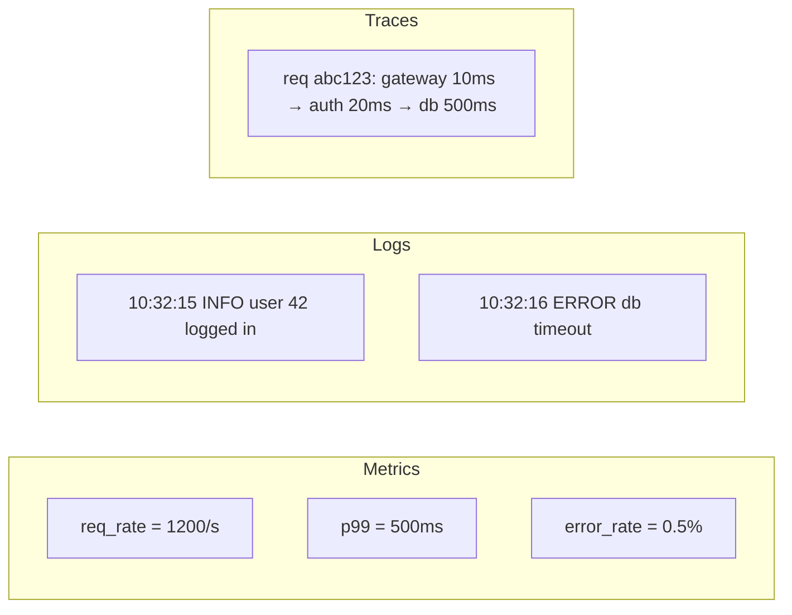

import { Callout } from "nextra/components";

# Observability & Tracing

Bài trước dạy bạn **thiết kế** hệ chịu được lỗi. Bài này dạy bạn **nhìn thấy** khi có lỗi thật xảy ra. Trong hệ thống có 20 service gọi lẫn nhau, câu hỏi "vì sao request này chậm?" không thể trả lời bằng log đơn thuần — bạn cần **observability**, và trong đó **distributed tracing** là mảnh ghép quan trọng nhất. Bài này giải thích ba trụ cột (metrics, logs, traces), pattern **RED/USE**, chuẩn **OpenTelemetry**, và giới thiệu **eBPF** — công nghệ đang thay đổi cách quan sát mạng.

## Ba trụ cột của observability

Observability thường được mô tả bằng ba loại tín hiệu:

- **Metrics** (số liệu) — con số đo được (count, gauge, histogram), thu thập đều đặn qua thời gian. Rẻ để lưu, dễ agregate, tốt cho alerting. Ví dụ: request rate, error rate, CPU%.
- **Logs** (nhật ký) — sự kiện dạng text hoặc structured, thường chi tiết đến từng request. Đắt để lưu ở scale, tốt để debug một sự cố cụ thể sau khi xảy ra. Ví dụ: "request abc123 failed with SQL error".
- **Traces** (dấu vết) — hành trình của **một request** đi qua nhiều service, mỗi chặng là một **span**. Tốt để hiểu tại sao request cụ thể chậm hoặc lỗi.



Metrics trả lời "**có** vấn đề không?", traces trả lời "**ở đâu** trong hệ có vấn đề?", logs trả lời "**tại sao** cụ thể".

## RED và USE: bốn "golden signals"

Với vô số metric có thể đo, dev mới hay tê liệt "đo cái gì?". Hai framework nhỏ giải quyết:

**RED** (Rate, Errors, Duration) — cho **service** hoặc endpoint:

- **Rate**: số request/giây.
- **Errors**: số request lỗi/giây (hoặc %).
- **Duration**: distribution latency (P50, P95, P99).

Chỉ ba metric này cho mỗi service đã đủ để phát hiện phần lớn sự cố.

**USE** (Utilization, Saturation, Errors) — cho **resource** (CPU, memory, disk, network):

- **Utilization**: % thời gian resource bận (CPU 80%, disk IO 60%).
- **Saturation**: mức queue chờ (load average, disk queue depth).
- **Errors**: số lỗi (disk error, packet drop).

Google SRE gọi bốn signal tổng hợp là **"golden signals"**: **latency, traffic, errors, saturation**. Dùng chúng làm bộ dashboard mặc định cho mọi service.

<Callout type="info">
  Bắt đầu với RED cho mọi service, USE cho mọi node/pod. Đó là **20% metric mang
  80% giá trị**. Khi cần đi sâu vào một sự cố cụ thể, thêm metric chuyên biệt
  (cache hit rate, queue depth, custom business metric).
</Callout>

## Distributed tracing: nối các mảnh lại

Khi request đi qua nhiều service, mỗi service có log riêng, metric riêng. Nhưng làm sao biết một request cụ thể — cái đang mất 3 giây — đi qua chặng nào chậm nhất? **Distributed tracing** trả lời đúng câu này.

Ý tưởng: mỗi request được gắn một **trace ID** duy nhất. Mỗi lần request qua một service, service tạo một **span** ghi thời gian bắt đầu/kết thúc + metadata (endpoint, DB query, error). Các span được liên kết bằng **parent-child** để tái tạo cây gọi. Cuối cùng, hệ tracing (Jaeger, Tempo, Zipkin, Datadog APM) hiển thị dạng "waterfall":

```text
trace: abc123
├─ gateway               [==========================================] 2500ms
│  ├─ auth-service       [====]                                        50ms
│  ├─ user-service       [========================================]   2200ms
│  │  ├─ db.query users  [==================================]         1800ms  <-- CHẬM
│  │  └─ cache.get       [=]                                            10ms
│  └─ audit-log          [==]                                          100ms
```

Nhìn vào đây, bạn thấy ngay `db.query` mất 1.8s là thủ phạm. Không có tracing, bạn phải nhảy giữa log của 5 service để ghép câu chuyện lại — mất hàng giờ.

### Context propagation qua header

Trace ID và span ID được truyền giữa các service qua **HTTP header**. Chuẩn W3C **Trace Context** (đã stable) định nghĩa hai header:

```http
GET /api/users/42 HTTP/1.1
traceparent: 00-4bf92f3577b34da6a3ce929d0e0e4736-00f067aa0ba902b7-01
tracestate: rojo=00f067aa0ba902b7,congo=t61rcWkgMzE
```

Đọc `traceparent`: `00` (version), `4bf9...4736` (trace ID 128-bit), `00f0...02b7` (span ID 64-bit của caller), `01` (flags). Service nhận header này biết "tôi là span con của cha đó" và tạo span mới với cùng trace ID.

Nếu client không gắn header, service đầu tiên nhận request là **root span** — tự sinh trace ID mới.

<Callout type="info">
  Nhớ **propagate header** khi gọi service nội bộ. Nếu quên (đặc biệt khi gọi
  gián tiếp qua message queue), trace bị đứt — bạn thấy nửa cây rồi nửa cây khác
  không nối. Framework tracing tự động (Node's `@opentelemetry/instrumentation-http`,
  Go's `otelhttp`) làm việc này giúp.
</Callout>

## OpenTelemetry: chuẩn thống nhất

Trước đây mỗi hệ tracing (Jaeger, Zipkin, Datadog, New Relic) có SDK riêng — đổi vendor là viết lại instrumentation. **OpenTelemetry (OTel)** là chuẩn (do CNCF host) thống nhất SDK và protocol; code instrument một lần, export sang backend nào cũng được.

OTel gồm ba phần:

- **SDK/API**: viết theo chuẩn OTel trong code của bạn.
- **Collector**: agent trung gian nhận dữ liệu từ SDK, xử lý (sampling, enrichment), rồi gửi tới backend.
- **Backend**: Jaeger, Tempo, Datadog, Honeycomb, whatever.

Code instrument đơn giản với auto-instrumentation:

```javascript
// Node.js — auto-instrument HTTP client và server
const { NodeSDK } = require("@opentelemetry/sdk-node");
const { getNodeAutoInstrumentations } = require("@opentelemetry/auto-instrumentations-node");
const { OTLPTraceExporter } = require("@opentelemetry/exporter-trace-otlp-http");

const sdk = new NodeSDK({
  traceExporter: new OTLPTraceExporter({
    url: "http://otel-collector:4318/v1/traces",
  }),
  instrumentations: [getNodeAutoInstrumentations()],
});

sdk.start();
```

Sau vài dòng này, mọi request HTTP incoming và outgoing đều được trace tự động. Muốn thêm span cho code riêng:

```javascript
const { trace } = require("@opentelemetry/api");
const tracer = trace.getTracer("my-service");

async function processOrder(orderId) {
  return tracer.startActiveSpan("process-order", async (span) => {
    span.setAttribute("order.id", orderId);
    try {
      const result = await doWork(orderId);
      span.setStatus({ code: 1 });  // OK
      return result;
    } catch (err) {
      span.recordException(err);
      span.setStatus({ code: 2, message: err.message });  // ERROR
      throw err;
    } finally {
      span.end();
    }
  });
}
```

## Sampling: đừng trace 100%

Với 1 triệu request/ngày, trace tất cả tốn tiền lưu trữ và làm chậm hệ. **Sampling** quyết định trace nào giữ lại:

- **Head sampling**: quyết định ngay lúc request bắt đầu (ví dụ giữ 1% ngẫu nhiên). Nhanh, đơn giản, nhưng có thể miss các sự cố hiếm.
- **Tail sampling**: giữ hết span trong bộ nhớ tạm, cuối cùng quyết định "giữ hay không" dựa vào tiêu chí (ví dụ giữ 100% request lỗi, 100% request > 1s, và 1% request bình thường). Chính xác hơn nhưng tốn RAM ở collector.

Nguyên tắc: **luôn giữ hết trace bất thường** (lỗi, slow), sample ít với happy path. OTel Collector cấu hình được tail sampling.

## Kết nối metrics, logs, traces: exemplars

Khi thấy P99 latency tăng trong Grafana, bước tiếp theo tự nhiên là "cho tôi xem trace của một request P99 cụ thể". **Exemplars** là cầu nối: mỗi bucket histogram được kèm một trace ID mẫu. Bạn click vào một điểm cao trên Grafana → nhảy thẳng tới trace tương ứng trong Jaeger/Tempo.

Tương tự với log: mỗi log line có kèm trace ID → click log để nhảy tới trace. Đây là **correlation** — điều làm ba trụ cột thật sự hữu ích, không chỉ tồn tại riêng lẻ.

## eBPF: quan sát ở tầng kernel

**eBPF** (extended Berkeley Packet Filter — công nghệ cho phép nạp chương trình nhỏ vào kernel Linux, chạy an toàn khi có sự kiện) đang thay đổi observability. Trước đây, muốn đo latency HTTP giữa các service, bạn phải sửa code app hoặc chèn sidecar proxy. Với eBPF, bạn có thể **hook vào TCP/HTTP ngay trong kernel** — thấy mọi traffic mà không cần đụng vào app.

Cụ thể eBPF làm được gì cho observability:

- **Auto-instrument HTTP call** không cần thư viện: đo latency, extract method/path/status từ TCP payload.
- **Network flow monitoring**: xem service nào gọi service nào, băng thông bao nhiêu.
- **Security observability**: phát hiện call syscall đáng ngờ, kết nối tới IP lạ.
- **Profiling**: capture stack trace của process khi CPU cao mà không dừng process.

Công cụ dựa trên eBPF phổ biến: **Cilium Hubble** (network observability trong Kubernetes), **Pixie** (observability không cần instrument), **Parca/Pyroscope** (continuous profiling), **Falco** (security).

<Callout type="info">
  **Đối với dev**: bạn không phải viết eBPF code (đó là việc của platform team).
  Nhưng biết eBPF tồn tại giúp hiểu vì sao các công cụ như Pixie hay Cilium
  "biết" nhiều về hệ mà không cần bạn instrument gì cả — chúng hook vào kernel.
  Đây cũng là hướng đi của **sidecarless service mesh** (Ambient Mesh) — dùng
  eBPF thay sidecar để giảm overhead.
</Callout>

## Ví dụ thực tế: kịch bản debug với ba trụ cột

Kịch bản: user báo "checkout chậm lắm, mất 10 giây". Bạn có metrics + logs + traces:

1. **Metrics (RED)**: mở dashboard `checkout-service`. Thấy P99 tăng đột biến từ 500ms lên 8s trong 1 giờ qua. Rate và error rate vẫn bình thường.
2. **Traces**: dashboard có exemplar cho P99. Click vào một điểm cao → nhảy sang Jaeger, thấy waterfall:
   ```text
   checkout-handler   [========================================] 8000ms
   ├─ auth.verify      [==]                                       80ms
   ├─ inventory.check  [====]                                    250ms
   ├─ payment.charge   [====================================]   7000ms  <-- CHẬM
   │  └─ stripe.api    [===================================]    6900ms
   └─ email.send       [==]                                     100ms
   ```
   Payment service chậm — cụ thể call sang Stripe API.
3. **Logs của payment-service**: filter theo trace ID `abc123`. Thấy: `WARN Stripe API responded in 6.9s; retried 2 times`.
4. **Kết luận**: Stripe đang chậm hoặc rate-limit; retry logic của bạn đang chờ. Fix: giảm số retry, thêm timeout ngắn hơn, hoặc queue payment async để user không đợi.

Ba trụ cột **cùng nhau** cho bạn đi từ "user báo chậm" tới nguyên nhân cụ thể trong 5 phút — thay vì hàng giờ log-diving.

## Tóm tắt nhanh

- Ba trụ cột: **metrics** (có vấn đề không?), **traces** (ở đâu?), **logs** (tại sao?).
- **Golden signals**: **RED** (Rate, Errors, Duration) cho service; **USE** (Utilization, Saturation, Errors) cho resource.
- **Distributed tracing** với **W3C Trace Context** (`traceparent` header) nối span qua nhiều service; **OpenTelemetry** là chuẩn thống nhất SDK.
- **Sampling**: head (nhanh) hoặc tail (thông minh, giữ hết bất thường); luôn giữ trace lỗi/slow.
- **Exemplars** nối metric với trace cụ thể; **trace ID trong log** cho correlation logs ↔ traces.
- **eBPF** cho phép observability ở tầng kernel không cần instrument app; nền tảng cho Cilium Hubble, Pixie, sidecarless mesh.

## Bài tập

### Câu hỏi lý thuyết

1. Ba trụ cột metrics/logs/traces giải quyết câu hỏi gì? Với sự cố "P99 latency đột nhiên tăng gấp đôi", trụ cột nào bạn nhìn đầu tiên và tại sao?
2. Vì sao **tail sampling** thường được ưa hơn head sampling trong hệ production lớn? Nêu một kịch bản cụ thể head sampling sẽ miss sự cố.

### Bài tập tình huống

3. Bạn có service Node.js chưa có observability. Áp dụng RED: liệt kê ít nhất 3 metric cụ thể (tên + loại + label) bạn sẽ expose qua Prometheus cho endpoint `POST /api/checkout`. Với mỗi metric, giải thích nó giúp phát hiện loại sự cố nào.

### Phân tích

4. Bạn thấy trace waterfall của một request 3 giây, với 4 span song song mỗi cái ~500ms và một span "parent" tổng 3 giây. Điều gì bất thường ở đây, và nó gợi ý gì về code (gợi ý: song song vs. tuần tự)?

### Thực hành

5. Trong DevTools của browser, tab Network, mở một trang bất kỳ. Xem cột "Timing" của một request — bạn sẽ thấy waterfall giai đoạn (Queueing, Stalled, DNS, Initial connection, SSL, TTFB, Content Download). Đây là một dạng tracing browser-side. Với một request cụ thể, cho biết giai đoạn nào chiếm nhiều nhất và liên hệ tới bài **Latency & Tail Latency**.

<details>
  <summary>Đáp án & gợi ý</summary>

1. **Metrics** trả lời "có" vấn đề (aggregated, dễ alert). **Traces** trả lời "ở đâu" (một request đi qua chặng nào chậm/lỗi). **Logs** trả lời "tại sao cụ thể" (chi tiết event). Với P99 đột nhiên tăng, **nhìn traces đầu tiên**: chọn một trace P99 (qua exemplar hoặc filter latency > threshold), xem waterfall để định vị span nào chậm — chỉ 30 giây là biết service/DB/API nào là thủ phạm. Metrics chỉ nói "chậm", không nói ở đâu; log lẻ tẻ không cho picture toàn cảnh.

2. Head sampling giữ **X% ngẫu nhiên** từ đầu — nếu bạn giữ 1%, sự cố xảy ra ở 0.1% request (P999) có thể không được sample. **Kịch bản**: hệ có 10 000 req/s, 10 req/s bị lỗi (0.1%). Head sample 1% → giữ 100 req/s, kỳ vọng ~0.1 req/s là lỗi được lưu — quá ít để phân tích pattern. **Tail sampling** giữ 100% request lỗi (hoặc slow) + 1% happy path → có đủ mẫu để debug lỗi mà tổng lượng lưu vẫn tương đương.

3. Ví dụ metrics cho `POST /api/checkout`:
   - `http_requests_total{path="/api/checkout", method="POST", status="200|4xx|5xx"}` (Counter) — **Rate** và **Errors** từ đây.
   - `http_request_duration_seconds{path="/api/checkout", method="POST"}` (Histogram với buckets 5ms, 25ms, 100ms, 500ms, 1s, 5s, 10s) — **Duration**, P50/P95/P99 rút được từ histogram.
   - `checkout_step_duration_seconds{step="inventory|payment|email"}` (Histogram) — thấy được bước nào của checkout chậm mà không cần đọc trace.
   - Metric #1 phát hiện lỗi tăng đột biến hoặc traffic drop; #2 phát hiện latency tăng; #3 định vị bước nào chậm trong checkout mà không phải mở trace từng cái.

4. **Bất thường**: parent span 3s trong khi mọi span con chỉ 500ms — có 1.5s không được cover bởi span nào. **Gợi ý**: (i) code có phần **chạy tuần tự** giữa các call song song, hoặc chờ Promise/goroutine (join) — chưa được instrument thành span; (ii) hoặc có logic đang chạy trong parent (parse JSON lớn, tính toán) chưa được đưa vào span riêng. **Fix**: thêm span cho các đoạn code trong parent, hoặc dùng auto-instrumentation cho parallelism library (Promise.all trong Node, sync.WaitGroup trong Go).

5. Đáp án tùy trang. Phổ biến: TTFB (time to first byte) chiếm phần lớn cho request động (server phải tính); Content Download lớn cho ảnh/video; Initial Connection + SSL cho request đầu tiên tới một host mới. Liên hệ: waterfall browser là "tracing một request" — cùng ý tưởng distributed tracing nhưng chỉ trong browser. Nếu bạn có server tracing đầy đủ, có thể nối "Initial Connection ở browser" với "request tới server" và "server processing" thành một trace end-to-end xuyên client-server.

</details>

## Nguồn tham khảo

- W3C, _Trace Context_ specification (traceparent, tracestate headers).
- OpenTelemetry Authors, _OpenTelemetry Documentation_, "Concepts" và "Instrumentation".
- B. Beyer et al., _Site Reliability Engineering_, chapter "Monitoring Distributed Systems" — golden signals.
- T. Wilkie, "The RED Method" — bài gốc mô tả pattern RED cho service metrics.
- B. Gregg, _BPF Performance Tools_, Addison-Wesley — tài liệu tham khảo về eBPF cho observability.
- L. Novik, "Observability: A 3-Year Retrospective" — góc nhìn thực tế về pattern này ở production.
