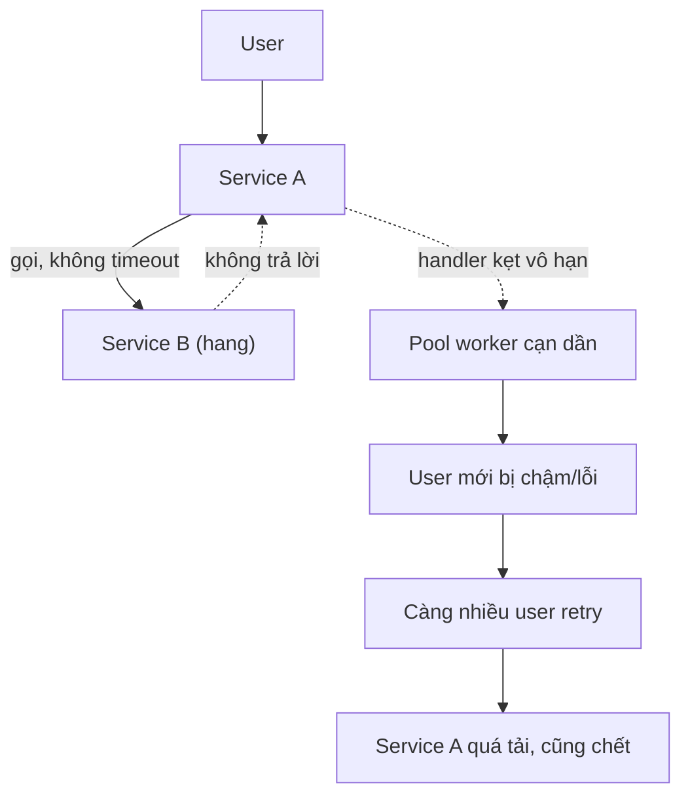
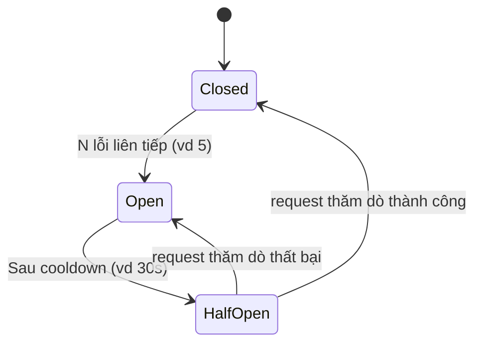
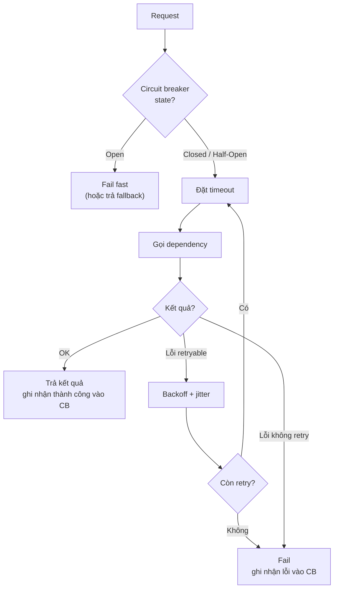

import { Callout } from "nextra/components";

# Timeouts, Retries & Circuit Breakers

Bài **Latency & Tail Latency** cho thấy vì sao tail luôn tồn tại. Câu hỏi tiếp theo: **hệ của bạn xử lý ra sao khi một dependency chậm hoặc chết**? Câu trả lời sai là "chờ mãi". Câu trả lời đúng gồm ba pattern lồng vào nhau: **timeout** để không chờ vô hạn, **retry với backoff + jitter** để vượt lỗi thoáng qua, và **circuit breaker** để bảo vệ hệ khỏi tự đâm mình xuống vực khi dependency thực sự down. Bài này dạy bạn kết hợp cả ba đúng cách.

## Vì sao mặc định "chờ mãi" là bug production kinh điển

Mặc định trong hầu hết thư viện HTTP client — Node `fetch`, Python `requests` không có timeout, Go `http.DefaultClient` — là **chờ vô hạn**. Với một service khỏe, bạn không thấy vấn đề. Nhưng khi dependency đi xa:



Đây là **cascading failure**: một service hang, kéo theo mọi service phụ thuộc chết theo. Timeout là **lớp bảo vệ đầu tiên** ngăn kịch bản này.

## Timeout: nhiều loại, đặt riêng

"Timeout 5 giây" nghe đơn giản nhưng thực ra có **nhiều loại timeout**, mỗi loại kiểm soát một giai đoạn khác nhau. Bài **Networking từ code** đã giới thiệu; ở đây xếp thứ tự cần đặt và giá trị hợp lý:

| Loại timeout            | Kiểm soát cái gì                                | Giá trị điển hình     |
| ----------------------- | ---------------------------------------------- | --------------------- |
| DNS lookup              | Thời gian resolve tên miền                     | 500 ms - 2 s          |
| TCP connect             | TCP handshake                                  | 1 - 3 s               |
| TLS handshake           | TLS bắt tay sau khi TCP OK                     | 1 - 3 s               |
| Response header         | Server bắt đầu trả header (thường ~ server processing) | 3 - 10 s      |
| Total / Request         | Toàn bộ, bao gồm nhận body                     | 5 - 30 s              |
| Idle connection         | Bỏ kết nối idle trong pool                     | 30 - 120 s            |

Nguyên tắc: **connect timeout ngắn** (nếu chưa nối được thì mạng có vấn đề, chờ lâu vô nghĩa); **read timeout dài hơn** (server có thể chậm nhưng đang xử lý). Total timeout đóng vai trò "an toàn cuối" trong trường hợp một trong các timeout con không phản ứng.

<Callout type="warning">
  Đừng dùng **cùng một timeout** cho mọi loại call. Health check nội bộ có thể
  timeout 500ms; download file có thể timeout 5 phút. Timeout duy nhất kiểu
  "10 giây cho mọi thứ" hoặc chậm cho health check, hoặc cắt sớm cho tác vụ dài.
</Callout>

## Retry: khi nào có ý nghĩa, khi nào có hại

Retry là con dao hai lưỡi. Đúng cách nó vượt qua glitches; sai cách nó biến hỏng thoáng qua thành sự cố kéo dài (retry storm khi mọi client cùng retry đồng loạt làm dependency quá tải).

### Quy tắc: chỉ retry cái an toàn

Không phải mọi lỗi đều nên retry. **Idempotent operations** (lũy đẳng — gọi nhiều lần cho cùng kết quả như gọi một lần, đã học Chương 6) an toàn để retry:

- `GET`, `HEAD`, `PUT`, `DELETE` (theo HTTP spec) là idempotent.
- `POST` **không** idempotent trừ khi bạn thiết kế nó thành như vậy (bằng cách dùng idempotency key).

Không retry `POST /orders` một cách mù quáng — user có thể bị trừ tiền hai lần. Nếu cần retry POST, thêm **idempotency key** vào header và để server dedup:

```http
POST /orders HTTP/1.1
Content-Type: application/json
Idempotency-Key: 550e8400-e29b-41d4-a716-446655440000

{"item": "abc", "qty": 2}
```

Server thấy cùng key đã xử lý → trả lại kết quả cũ, không tạo order mới. Stripe API là ví dụ nổi tiếng dùng pattern này.

### Quy tắc: chỉ retry lỗi thoáng qua

Phân loại theo status code:

- **5xx** (server error): thường **có** thể retry — có thể do server tạm quá tải hay lỗi thoáng qua.
- **4xx** (client error): **không** retry — request sai, retry vẫn sai. Ngoại lệ: `408 Request Timeout`, `425 Too Early`, `429 Too Many Requests`, `503 Service Unavailable` có thể retry sau khi chờ.
- **429 và 503**: đọc header `Retry-After` nếu có, chờ đúng khoảng đó.

Ngoài HTTP code, lỗi mạng (connection refused, timeout, RST) thường thoáng qua → retry hợp lý cho request idempotent.

### Exponential backoff với jitter

Retry ngay lập tức là ý tưởng tệ: bạn add tải khi dependency đang khó thở. **Exponential backoff** tăng khoảng chờ theo hàm mũ: `base * 2^attempt`. Ví dụ base = 100ms, tối đa 5 lần:

```text
Attempt 1: chờ 100ms   -> gọi
Attempt 2: chờ 200ms   -> gọi
Attempt 3: chờ 400ms   -> gọi
Attempt 4: chờ 800ms   -> gọi
Attempt 5: chờ 1600ms  -> gọi (bỏ nếu vẫn thất bại)
```

Vấn đề: nếu 1000 client cùng bắt đầu retry sau khi dependency chết, tất cả sẽ retry đồng loạt ở các mốc 100ms, 200ms, 400ms... tạo **thundering herd**. Giải quyết bằng **jitter** — thêm ngẫu nhiên vào khoảng chờ:

```javascript
// Node.js — exponential backoff with jitter
async function retryWithBackoff(fn, maxAttempts = 5) {
  const base = 100; // ms
  for (let attempt = 0; attempt < maxAttempts; attempt++) {
    try {
      return await fn();
    } catch (err) {
      if (attempt === maxAttempts - 1) throw err;
      if (!isRetryable(err)) throw err;

      // Full jitter: khoảng chờ = random(0, cap)
      const cap = base * Math.pow(2, attempt);
      const delay = Math.random() * cap;
      await new Promise(r => setTimeout(r, delay));
    }
  }
}

function isRetryable(err) {
  // 5xx status hoặc lỗi mạng
  return err.status >= 500 || err.code === "ECONNRESET" || err.name === "AbortError";
}
```

Với **full jitter** (delay ngẫu nhiên trong khoảng `[0, cap]`), các client phân tán đồng đều theo thời gian thay vì đâm đầu vào cùng một mốc. AWS Architecture Blog có bài phân tích chi tiết các biến thể jitter.

<Callout type="info">
  **Cap** (giới hạn trên) rất quan trọng: sau attempt 10, `base * 2^10 = 102400ms`
  ~ 100 giây — quá lâu. Đặt cap khoảng 30-60s và giới hạn số lần retry (thường 3-5).
</Callout>

## Circuit breaker: đừng đâm đầu vào tường

Retry hoạt động tốt khi lỗi là **thoáng qua**. Nhưng nếu dependency thực sự down và cần vài phút để hồi phục, mọi request retry của bạn là **thêm tải** cho service đang chết — làm nó khó hồi phục hơn.

**Circuit breaker** giải quyết: sau khi thấy đủ lỗi liên tiếp, "**mở mạch**" và trong một khoảng thời gian sau đó, **fail nhanh mọi request** mà không gọi dependency. Sau timeout, thử lại một request "thăm dò"; nếu thành công, đóng mạch trở lại.

Ba trạng thái:



- **Closed**: bình thường, mọi request đi qua. Đếm lỗi, đếm thành công.
- **Open**: fail nhanh (throw error hoặc return default) mà **không** gọi dependency.
- **Half-Open**: cho một request đi thử; thành công → về Closed; thất bại → về Open, reset cooldown.

Trong code (Go với `sony/gobreaker`):

```go
import "github.com/sony/gobreaker"

var cb = gobreaker.NewCircuitBreaker(gobreaker.Settings{
    Name:    "user-service",
    MaxRequests: 1,                    // trong Half-Open cho 1 request thử
    Interval:    time.Minute,          // reset đếm mỗi phút
    Timeout:     30 * time.Second,     // sau bao lâu ở Open thì chuyển Half-Open
    ReadyToTrip: func(counts gobreaker.Counts) bool {
        return counts.ConsecutiveFailures >= 5
    },
})

func getUser(id string) (User, error) {
    result, err := cb.Execute(func() (any, error) {
        return httpGetUser(id)
    })
    if err != nil {
        // Có thể fallback: trả cached data hoặc default response
        return User{}, err
    }
    return result.(User), nil
}
```

**Fallback** thường đi cùng circuit breaker: khi mạch mở, trả dữ liệu cache cũ, giá trị mặc định, hoặc dịch vụ suy giảm (ví dụ trang chủ không show recommendation nếu recommendation service chết).

## Kết hợp cả ba: pattern chuẩn

Ba pattern trên **chồng lớp** với nhau, thứ tự trong request là:



Đọc từ ngoài vào: **circuit breaker** quyết định có gọi hay không; nếu có, **timeout** bảo vệ chống hang; nếu lỗi và retryable, **retry với backoff** thử lại; nếu vượt số lần retry hoặc lỗi non-retryable, fail và cập nhật state của circuit breaker.

<Callout type="warning">
  Đừng để retry và circuit breaker "đánh nhau". Nếu retry rất tích cực (10 lần)
  và mỗi lần thất bại đếm vào circuit breaker, một request tệ có thể tự mình
  làm mở mạch. Thường: đếm **request** (không đếm attempt) vào circuit breaker,
  hoặc chỉ đếm request có tất cả retry đều fail.
</Callout>

## Sanity check cho hệ thống của bạn

Sau khi cài xong pattern, thử vài kịch bản:

- **Dependency slow**: dependency delay 10s trong khi timeout của bạn là 3s. Request có fail sau 3s không? Retry có ngừng sau đủ số lần không?
- **Dependency down**: dependency trả 5xx liên tục. Sau bao nhiêu lần lỗi thì circuit breaker mở? Trong lúc mở, request có fail nhanh không (không chờ)?
- **Dependency hồi phục**: dependency chết 1 phút, rồi khỏe lại. Hệ có tự phục hồi qua Half-Open không, hay phải restart?

Nếu không test được ba kịch bản này, pattern chỉ đang tồn tại trên giấy. Công cụ như **Chaos Monkey**, **Litmus**, **toxiproxy** giúp inject lỗi có kiểm soát để test.

## Tóm tắt nhanh

- **Timeout** ngăn hang; đặt riêng cho DNS/connect/TLS/read; **connect ngắn, read dài**.
- **Retry** chỉ cho **idempotent + retryable errors** (5xx, lỗi mạng). POST cần idempotency key.
- **Exponential backoff + jitter** tránh thundering herd; cap thời gian; giới hạn số lần retry.
- **Circuit breaker** ba trạng thái (Closed/Open/Half-Open) bảo vệ hệ khi dependency thật down; kết hợp với **fallback** để suy giảm dịch vụ thay vì sập.
- Kết hợp thứ tự: **CB → timeout → gọi → nếu lỗi retryable thì backoff + retry**; test bằng chaos injection.

## Bài tập

### Câu hỏi lý thuyết

1. Vì sao `POST /transfer` **không nên** retry mù quáng, còn `GET /account/:id` thì được? Đề xuất cách làm `POST /transfer` retry an toàn.
2. Trong exponential backoff, tại sao **jitter** lại quan trọng khi có nhiều client cùng gặp lỗi? Nêu một kịch bản thundering herd cụ thể.

### Bài tập tính toán

3. Với exponential backoff base = 200ms, tối đa 5 lần retry, jitter kiểu full (random trong `[0, cap]`), tính **worst case** thời gian tổng chờ và **expected** (trung bình) thời gian chờ. So sánh với backoff cố định 500ms mỗi lần.

### Tình huống

4. Service A gọi Service B qua HTTP. B đôi lúc quá tải và trả 503 trong ~30 giây rồi khỏe lại. Hiện tại A không có gì đặc biệt và mỗi lần B quá tải, A cũng chậm theo và cascade tới user. Thiết kế: (a) timeout A→B nên đặt bao nhiêu (biết B khỏe P99 = 300ms); (b) chính sách retry (số lần, kiểu backoff); (c) cấu hình circuit breaker (ngưỡng mở, cooldown); (d) fallback khi mạch mở.

### Phân tích

5. Một dev bàn: "Tôi retry 10 lần với backoff 100ms mỗi lần, timeout tổng 1 giây. Có gì sai?" Hãy chỉ ra vấn đề (gợi ý: nghĩ về thời gian tổng của 10 retry so với timeout).

<details>
  <summary>Đáp án & gợi ý</summary>

1. `POST /transfer` **không** idempotent: mỗi lần gọi tạo một giao dịch chuyển tiền mới. Nếu retry sau khi request đầu tiên thực sự **đã** thực hiện (chỉ mất response), user bị trừ 2 lần. `GET /account/:id` idempotent: gọi bao nhiêu lần cũng trả cùng dữ liệu (hoặc dữ liệu mới hơn), không có side effect. **Cách safe cho POST**: thêm **`Idempotency-Key`** header với UUID tạo phía client; server dedup dựa trên key này — thấy key đã xử lý thì trả lại kết quả cũ. Client retry với cùng key = an toàn.

2. Không có jitter, mọi client gặp lỗi cùng lúc sẽ retry đồng loạt ở các mốc thời gian giống hệt (100ms, 200ms, 400ms...) — tạo đợt spike thứ hai đúng vào lúc dependency đang cố hồi phục, đẩy nó chết trở lại. **Kịch bản**: dependency crash lúc 10:00:00. 5000 client trong hệ đồng loạt thấy lỗi, đồng loạt retry ở 10:00:00.1 → burst 5000 req/s → dependency vừa restart lại lại quá tải. Với **jitter**, client phân tán ngẫu nhiên qua khoảng thời gian, mật độ request giảm và dependency có thời gian ổn định.

3. Backoff base = 200ms, 5 lần retry (không tính lần đầu):
   - Cap từng lần: `200, 400, 800, 1600, 3200 ms`
   - **Worst case** (mỗi lần chờ full cap): `200 + 400 + 800 + 1600 + 3200 = 6200ms = 6.2s`
   - **Expected** (mỗi lần trung bình cap/2 do full jitter random `[0, cap]`): `100 + 200 + 400 + 800 + 1600 = 3100ms = 3.1s`
   - Backoff cố định 500ms × 5 = **2.5s** worst và expected.
   Exponential + jitter có worst case cao hơn (6.2s vs 2.5s) — bạn phải trade off giữa "vượt qua lỗi kéo dài" và "user không chờ quá lâu". Trong nhiều hệ, cap 30s và full jitter chỉ trong khoảng nhỏ hơn (ví dụ min(cap, 1000)) cân bằng tốt hơn.

4. (a) **Timeout A→B**: khoảng 1-2s (đủ rộng cho P99 = 300ms + biên độ, nhưng không quá dài để tránh treo pool khi B thật sự chậm). (b) **Retry**: 2-3 lần với exponential backoff base 100ms + full jitter; chỉ retry với 5xx/lỗi mạng, không retry 4xx. (c) **Circuit breaker**: mở sau 5-10 lỗi liên tiếp (hoặc > 50% error rate trong 30s), cooldown 30s ở Open, Half-Open cho 1 request thử. (d) **Fallback**: cache response cũ (nếu có), hoặc trả về "recommendation not available" và tiếp tục render phần khác của trang — suy giảm dịch vụ nhưng không sập toàn bộ.

5. **Vấn đề**: 10 lần retry × ~100ms mỗi lần = ít nhất 1s riêng cho chờ giữa các retry, chưa kể thời gian gọi mỗi request. Nhưng **timeout tổng là 1s** — request timeout xảy ra trước khi 10 retry hoàn thành. Kết quả: chỉ ~2-3 retry đầu tiên có cơ hội chạy, sau đó timeout đá cả context. Cần: (i) tăng timeout tổng cho phù hợp số retry (ví dụ 5-10s cho 10 retry với backoff), hoặc (ii) giảm số retry (3-5 lần đủ tốt cho hầu hết case). Nguyên tắc: **retry budget** — tổng thời gian retry phải nằm gọn trong timeout tổng, hoặc tách timeout riêng cho từng attempt.

</details>

## Nguồn tham khảo

- M. Nygard, _Release It!_, 2nd ed., chapters on stability patterns — Timeout, Circuit Breaker, Bulkhead, Fail Fast.
- AWS Architecture Blog, "Exponential Backoff And Jitter" — phân tích các biến thể full jitter, decorrelated jitter.
- M. Fowler, _CircuitBreaker_ (martinfowler.com/bliki/CircuitBreaker.html) — mô tả pattern gốc.
- Stripe API Documentation, "Idempotent Requests" — ví dụ thực tế về idempotency-key trong production.
- B. Beyer et al., _Site Reliability Engineering_, chapter "Handling Overload" — retry budgets và các pattern giữ hệ ổn định.
