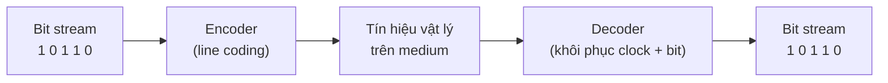

import { Callout } from "nextra/components";

# Mã hóa & tín hiệu

Môi trường truyền dẫn chỉ biết mang **tín hiệu** (signal — đại lượng vật lý thay đổi theo thời gian, như mức điện áp hay cường độ ánh sáng), chứ không biết "số 0" hay "số 1" là gì. Vì vậy trước khi đặt bit lên dây, Physical Layer phải quyết định: một bit `1` trông như thế nào trên đường truyền, và một bit `0` trông ra sao? Bài học này trả lời câu hỏi đó qua hai chủ đề: **encoding** (cách ánh xạ bit thành dạng tín hiệu) và **signaling** (cách tín hiệu được truyền trên môi trường).

## Vì sao phải encode bit?

**Encoding** (mã hóa đường truyền, hay line coding — quy tắc biến chuỗi bit thành mẫu tín hiệu vật lý để truyền đi) không chỉ là "1 thì điện cao, 0 thì điện thấp". Một sơ đồ encoding tốt phải giải quyết thêm hai bài toán.

Thứ nhất là **clock recovery** (khôi phục xung nhịp — đầu thu phải biết chính xác thời điểm mỗi bit bắt đầu và kết thúc để đọc đúng). Nếu tín hiệu nằm yên quá lâu (ví dụ một chuỗi dài toàn `0`), đầu thu mất mốc thời gian và có thể đếm sai số bit. Thứ hai là **DC balance** (cân bằng thành phần một chiều — giữ cho mức trung bình của tín hiệu quanh 0 để truyền tốt qua biến áp và cáp), tránh tín hiệu bị "trôi" về một phía.



## Các sơ đồ encoding tiêu biểu

**NRZ** (Non-Return-to-Zero — giữ một mức tín hiệu ổn định suốt mỗi bit, không trở về 0 giữa bit) là sơ đồ đơn giản nhất. Biến thể **NRZ-L** (NRZ-Level) ánh xạ trực tiếp: mức cao là `1`, mức thấp là `0`. Biến thể **NRZ-I** (NRZ-Inverted) thì mã hóa theo sự thay đổi: gặp bit `1` thì đảo mức, gặp bit `0` thì giữ nguyên. NRZ tiết kiệm băng thông nhưng kém ở clock recovery: một chuỗi dài cùng giá trị làm tín hiệu phẳng lì, đầu thu dễ mất đồng bộ.

**Manchester** giải bài toán đồng bộ bằng cách bắt buộc **mỗi bit có một lần chuyển mức ở giữa bit**. Theo quy ước IEEE 802.3: bit `1` là chuyển thấp→cao, bit `0` là chuyển cao→thấp. Vì luôn có chuyển mức giữa mỗi bit, đầu thu tự khôi phục clock được kể cả khi dữ liệu toàn `0` hay toàn `1`; cái giá phải trả là cần gấp đôi số lần đổi mức, tức tốn gấp đôi **bandwidth** (ở đây hiểu là khả năng đổi mức nhanh của đường truyền; chi tiết ở bài _Băng thông & hiệu năng_).

**4B/5B** đi theo hướng khác: cứ mỗi nhóm 4 bit dữ liệu được tra bảng và thay bằng một nhóm 5 bit đã chọn sao cho không bao giờ có quá nhiều `0` liên tiếp. Chuỗi 5-bit này sau đó được truyền bằng NRZ-I. Nhờ vậy 4B/5B vừa đảm bảo đủ chuyển mức để đồng bộ, vừa chỉ tốn thêm 25% băng thông (5/4) thay vì 100% như Manchester — đây là sơ đồ dùng trong Fast Ethernet 100BASE-TX và FDDI.

## Ví dụ thực tế: mã hóa chuỗi bit 1 0 1 1 0

Đây là phần quan sát được rõ nhất của bài: cùng một chuỗi bit đầu vào, mỗi sơ đồ tạo ra một mẫu tín hiệu đầu ra khác nhau. Bảng dưới cho biết mức tín hiệu của từng bit (giả sử NRZ-I bắt đầu ở mức thấp):

| Bit        | 1        | 0        | 1        | 1        | 0        |
| ---------- | -------- | -------- | -------- | -------- | -------- |
| NRZ-L      | cao      | thấp     | cao      | cao      | thấp     |
| NRZ-I      | cao      | cao      | thấp     | cao      | cao      |
| Manchester | thấp→cao | cao→thấp | thấp→cao | thấp→cao | cao→thấp |

Và đây là dạng sóng tương ứng của NRZ-L so với Manchester trên cùng một thước bit (`_` = mức thấp, đường trên = mức cao):

```text
  1     0     1     1     0     <- mỗi bit = 6 cột
(dòng trên = mức cao, dòng dưới = mức thấp)

NRZ-L:
______      ____________
      |     |           |
      ______            ______

Manchester (IEEE 802.3):
   ______      ___   ______
   |     |     |  |  |     |
___      ______   ___      ___
```

Quan sát: trong NRZ-L, hai bit `1` liên tiếp (bit 3 và 4) tạo một đoạn phẳng dài — nếu có hàng trăm bit `1` liên tiếp, đầu thu sẽ khó đếm đúng. Trong Manchester, **mỗi** bit đều có một lần đổi mức ở giữa, nên không bao giờ có đoạn phẳng quá nửa bit; đó là lý do Manchester tự đồng bộ tốt.

## Signaling: baseband vs broadband, analog vs digital

**Signaling** là cách tín hiệu chiếm dụng môi trường. **Baseband** (truyền dải cơ sở — toàn bộ băng thông của môi trường dành cho một tín hiệu số duy nhất) là kiểu Ethernet dùng: chữ `BASE` trong `1000BASE-T` chính là baseband. Ngược lại, **broadband** (truyền dải rộng — chia môi trường thành nhiều kênh tần số, mỗi kênh mang một tín hiệu riêng) cho phép nhiều luồng cùng chạy trên một cáp, như truyền hình cáp dồn nhiều kênh trên một sợi coaxial.

Một trục phân biệt khác là dạng tín hiệu. **Digital signaling** (tín hiệu số — tín hiệu nhảy giữa một số mức rời rạc) là cái mà NRZ và Manchester ở trên tạo ra. **Analog signaling** (tín hiệu tương tự — tín hiệu biến thiên liên tục) dùng khi phải mang bit qua môi trường vốn dành cho sóng liên tục; khi đó ta **modulate** (điều chế — thay đổi biên độ, tần số hoặc pha của một sóng mang để chở thông tin số), như modem hay Wi-Fi vẫn làm.

## Baud rate và bit rate

Hai đại lượng này hay bị nhầm. **Baud rate** (tốc độ symbol — số lần tín hiệu thay đổi trạng thái, tức số **symbol**, truyền đi trong một giây) đếm số "ký hiệu" trên đường truyền. **Bit rate** (tốc độ bit — số bit dữ liệu truyền trong một giây, đơn vị bps) đếm số bit. Chúng chỉ bằng nhau khi mỗi symbol mang đúng 1 bit.

Quan hệ tổng quát: nếu mỗi symbol có thể nhận một trong `M` trạng thái thì nó mang `log2(M)` bit, nên:

```text
bit rate = baud rate × log2(M)
```

<Callout type="info">
  Nhiều mức hơn cho mỗi symbol giúp tăng bit rate mà không tăng baud rate (đỡ
  đòi hỏi đường truyền đổi mức nhanh hơn), nhưng các mức sát nhau hơn nên dễ bị
  nhiễu đọc sai. Đây là một đánh đổi cốt lõi của truyền dẫn vật lý.
</Callout>

## Tóm tắt nhanh

- **Encoding** biến bit thành mẫu tín hiệu; ngoài việc phân biệt 0/1 còn phải lo **clock recovery** và **DC balance**.
- **NRZ** đơn giản, tiết kiệm băng thông nhưng kém đồng bộ khi có chuỗi bit giống nhau dài.
- **Manchester** luôn đổi mức giữa mỗi bit nên tự đồng bộ tốt, đổi lại tốn gấp đôi băng thông.
- **4B/5B** chèn bit để đảm bảo đủ chuyển mức, chỉ tốn thêm 25% — dùng trong 100BASE-TX.
- **Baseband** dùng cả băng thông cho một tín hiệu số; **broadband** chia thành nhiều kênh tần số.
- **bit rate = baud rate × log2(M)**; baud đếm symbol, bit rate đếm bit.

## Bài tập

### Câu hỏi lý thuyết

1. Vì sao một chuỗi dài toàn bit `0` lại gây vấn đề cho NRZ-L, trong khi Manchester thì không? Liên hệ tới khái niệm **clock recovery**.
2. Phân biệt **baseband** và **broadband**. Chuẩn `1000BASE-T` thuộc loại nào, và bạn suy ra điều đó từ đâu trong tên chuẩn?

### Bài tập tính toán

3. Một đường truyền chạy ở **2400 baud**, mỗi symbol mã hóa được 4 mức điện áp khác nhau. Tính **bit rate**.
4. Fast Ethernet 100BASE-TX dùng **4B/5B** rồi truyền chuỗi 5-bit ở tốc độ đường truyền **125 Mbaud** (1 bit/symbol với NRZ-I). Tính **bit rate dữ liệu hữu ích** mà người dùng thực sự nhận được, và giải thích phần băng thông "mất đi" đi đâu.

<details>
  <summary>Đáp án & gợi ý</summary>

1. NRZ-L giữ một mức phẳng suốt mỗi bit, nên chuỗi `0` dài tạo một đoạn tín hiệu không đổi rất dài; đầu thu không có mốc chuyển mức nào để căn thời điểm bit, dễ đếm thừa/thiếu bit (mất **clock recovery**). Manchester bắt buộc đổi mức ở **giữa mỗi bit**, nên luôn có mốc đồng bộ bất kể dữ liệu là gì.
2. **Baseband** dùng toàn bộ băng thông môi trường cho **một** tín hiệu số duy nhất; **broadband** chia môi trường thành nhiều kênh tần số chạy song song. `1000BASE-T` là **baseband** — chữ `BASE` trong tên chuẩn cho biết điều đó.
3. 4 mức ⇒ mỗi symbol mang `log2(4) = 2` bit. `bit rate = 2400 × 2 = 4800 bps`.
4. Đường truyền tải 125 Mbit mã/giây, nhưng cứ 5 bit đường truyền chỉ có 4 bit là dữ liệu thật: `125 × 4/5 = 100 Mbps`. Đúng 100 Mbps của Fast Ethernet. Phần 25% còn lại "mất đi" được dùng làm bit thừa của 4B/5B để đảm bảo đủ chuyển mức cho đồng bộ.

</details>

## Nguồn tham khảo

- A. S. Tanenbaum & D. J. Wetherall, _Computer Networks_, 5th ed., §2.5 (Digital Modulation and Multiplexing).
- B. A. Forouzan, _Data Communications and Networking_, 5th ed., Ch. 4 (Digital Transmission — Line Coding Schemes).
- IEEE Std 802.3, _Ethernet_, clause mô tả Manchester encoding và 4B/5B trong 100BASE-TX.
