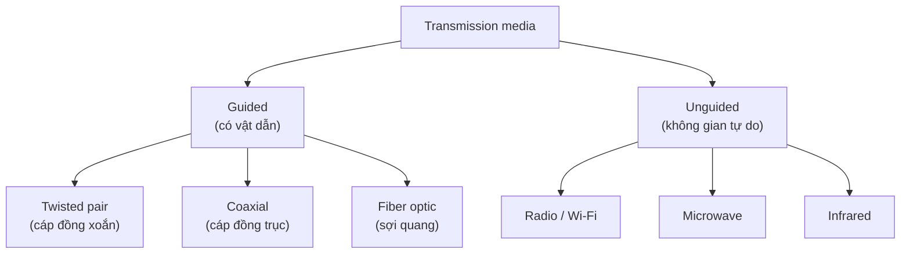

import { Callout } from "nextra/components";

# Môi trường truyền dẫn

Mọi bit rời khỏi Data Link (L2) cuối cùng đều phải đi qua một thứ vật lý nào đó: một sợi dây, một sợi thủy tinh, hay khoảng không. Thứ vật lý đó gọi là **transmission medium** (môi trường truyền dẫn — vật chất hoặc không gian mà tín hiệu lan truyền qua để mang bit từ điểm này tới điểm khác). Bài học này so sánh ba nhóm môi trường phổ biến — copper, fiber optic và wireless — theo những đặc tính mà kỹ sư mạng thực sự quan tâm khi chọn cáp cho một liên kết.

## Phân loại: guided và unguided

Người ta chia môi trường truyền dẫn thành hai nhóm lớn. **Guided media** (môi trường có định hướng — tín hiệu bị giam và dẫn dọc theo một vật dẫn cụ thể như dây đồng hay sợi quang) buộc tín hiệu đi theo đường vật lý đã đặt sẵn. **Unguided media** (môi trường không định hướng — tín hiệu lan tỏa tự do trong không gian, ví dụ sóng vô tuyến) không có vật dẫn; tín hiệu phát ra và lan đi mọi hướng.

Cách phân loại này quan trọng vì nó quyết định bản chất của các vấn đề ta phải xử lý: với guided media ta lo về suy hao dọc dây và nhiễu xuyên âm giữa các cặp; với unguided media ta lo về vật cản, can nhiễu và bảo mật do tín hiệu ai cũng "nghe" được.



## Copper (cáp đồng)

Cáp đồng mang bit dưới dạng **tín hiệu điện** (mức điện áp hoặc dòng điện thay đổi theo thời gian). Đây là môi trường lâu đời, rẻ và dễ thi công nhất, nên vẫn thống trị trong mạng nội bộ và đoạn cáp tới máy người dùng.

Loại copper phổ biến nhất là **twisted pair** (cáp đôi xoắn — gồm các cặp dây đồng xoắn vào nhau để giảm nhiễu). Việc xoắn rất quan trọng: hai dây trong một cặp xoắn đều nhau sẽ thu nhiễu gần như giống hệt, nên ở đầu thu phần nhiễu bị triệt tiêu khi lấy hiệu điện thế giữa hai dây. Twisted pair có hai biến thể: **UTP** (Unshielded Twisted Pair — không có lớp chống nhiễu kim loại) rẻ và mềm, còn **STP** (Shielded Twisted Pair — có lớp lá kim loại bọc chống nhiễu) đắt hơn nhưng chịu nhiễu tốt hơn.

Một loại copper khác là **coaxial** (cáp đồng trục — một lõi đồng ở giữa, bọc bởi lớp cách điện rồi tới lưới kim loại nối đất đồng tâm). Cấu trúc đồng tâm giúp coaxial chịu nhiễu và mang băng thông tốt hơn twisted pair trên khoảng cách dài hơn; ngày nay nó còn phổ biến trong truyền hình cáp và đoạn mạng truy cập của ISP.

<Callout type="warning">
  Mọi cáp đồng đều nhạy với **EMI** (Electromagnetic Interference — nhiễu điện
  từ từ động cơ, đèn huỳnh quang, cáp điện gần đó) và bị nghe lén dễ hơn vì tín
  hiệu điện rò ra ngoài. Đây là lý do chính khiến fiber được ưu tiên ở môi
  trường nhiễu mạnh hoặc cần bảo mật cao.
</Callout>

## Fiber optic (sợi quang)

**Fiber optic** (sợi quang — sợi thủy tinh hoặc nhựa cực mảnh truyền bit bằng các xung ánh sáng thay vì điện) hoạt động trên một nguyên lý khác hẳn: bit `1` và `0` được biểu diễn bằng có/không có xung ánh sáng. Ánh sáng đi trong lõi (core) và bị giữ lại nhờ hiện tượng **total internal reflection** (phản xạ toàn phần — ánh sáng gặp ranh giới giữa lõi và lớp vỏ chiết suất thấp hơn thì phản xạ hoàn toàn trở lại lõi thay vì thoát ra).

Vì mang tín hiệu bằng ánh sáng chứ không phải điện, fiber **miễn nhiễm với EMI** và gần như không rò tín hiệu ra ngoài, nên rất khó nghe lén. Nó cũng suy hao rất ít theo khoảng cách, cho phép truyền xa hàng km mà không cần bộ lặp.

Fiber có hai loại chính. **Multi-mode fiber** (sợi đa mode — lõi lớn, cho nhiều "tia" ánh sáng đi theo nhiều đường) rẻ hơn, dùng đèn LED hoặc laser giá thấp, nhưng các tia tới đích lệch thời điểm nhau (modal dispersion) nên chỉ tối ưu cho khoảng cách ngắn trong tòa nhà. **Single-mode fiber** (sợi đơn mode — lõi rất nhỏ, chỉ cho một đường ánh sáng duy nhất) dùng laser, đắt hơn nhưng truyền xa hàng chục tới hàng trăm km, là xương sống của mạng đường dài và ISP.

## Wireless (không dây)

**Wireless** mang bit bằng sóng điện từ lan trong không gian (unguided). Ưu điểm lớn nhất là tính cơ động: thiết bị không cần cắm dây, và ta phủ sóng được nơi khó kéo cáp. Đổi lại, đây là môi trường khó kiểm soát nhất.

Wireless chịu nhiều vấn đề mà guided media không có: tín hiệu yếu dần rất nhanh theo khoảng cách, bị vật cản (tường, kim loại) chặn hoặc phản xạ gây **multipath**, và bị chia sẻ chung dải tần nên nhiều thiết bị phải tranh nhau. Quan trọng với developer: vì sóng lan tỏa tự do nên bất kỳ ai trong vùng phủ đều có thể bắt được tín hiệu, khiến **mã hóa** (như WPA2/WPA3 ở Wi-Fi) trở thành bắt buộc chứ không phải tùy chọn.

## Bảng so sánh đặc tính các môi trường

Đây là bảng tham chiếu trung tâm của bài. Cột **Bandwidth** là dung lượng truyền tối đa của liên kết, đo bằng bit mỗi giây (bps) và sẽ được bàn kỹ ở bài _Băng thông & hiệu năng_. Cột **EMI immunity** nghĩa là mức miễn nhiễm với nhiễu điện từ (càng cao càng tốt); các con số là khoảng điển hình cho mục đích so sánh tương đối, không phải giới hạn tuyệt đối.

| Môi trường        | Bandwidth điển hình | Khoảng cách / segment   | Chi phí         | EMI immunity         | Use case tiêu biểu                        |
| ----------------- | ------------------- | ----------------------- | --------------- | -------------------- | ----------------------------------------- |
| UTP (Cat5e/Cat6)  | 1–10 Gbps           | tới 100 m               | Thấp            | Thấp                 | Cáp tới máy bàn, văn phòng, LAN trong nhà |
| Coaxial           | tới ~1 Gbps         | hàng trăm m             | Trung bình      | Trung bình           | Truyền hình cáp, mạng truy cập ISP        |
| Multi-mode fiber  | 10–100 Gbps         | tới ~550 m              | Cao             | Rất cao (miễn nhiễm) | Backbone trong tòa nhà, data center ngắn  |
| Single-mode fiber | 100 Gbps trở lên    | hàng chục–trăm km       | Rất cao         | Rất cao (miễn nhiễm) | WAN, đường trục ISP, liên kết đường dài   |
| Wireless (Wi-Fi)  | tới vài Gbps        | hàng chục m (trong nhà) | Thấp–Trung bình | Thấp (dễ bị nhiễu)   | Thiết bị di động, nơi khó kéo cáp         |

<Callout type="info">
  Quy luật rút gọn: **copper rẻ và tiện cho đoạn ngắn**, **fiber nhanh và đi xa
  nhưng đắt**, **wireless linh hoạt nhưng kém ổn định và cần mã hóa**. Chọn môi
  trường là bài toán đánh đổi giữa bandwidth, khoảng cách, chi phí và môi trường
  nhiễu.
</Callout>

## Ví dụ thực tế: đọc thông số một chuẩn cáp

Khi mua thiết bị hoặc thiết kế liên kết, bạn sẽ gặp các tên chuẩn mã hóa sẵn môi trường, tốc độ và khoảng cách. Đây là dữ liệu quan sát được — đầu vào là tên chuẩn, đầu ra là đặc tính vật lý:

```text
1000BASE-T   → copper, twisted pair Cat5e, 1 Gbps, tối đa 100 m
10GBASE-SR   → multi-mode fiber, 10 Gbps, ~300 m (bước sóng 850 nm)
10GBASE-LR   → single-mode fiber, 10 Gbps, tối đa 10 km (bước sóng 1310 nm)
```

Cách đọc tên: số đầu là tốc độ (`1000` = 1000 Mbps), `BASE` nghĩa là baseband, ký tự cuối gợi ý môi trường/khoảng cách (`T` = twisted pair, `S` = short-range multi-mode, `L` = long-range single-mode). Chỉ từ một dòng `10GBASE-LR`, bạn đã suy ra ngay liên kết này dùng single-mode fiber và đi được tới 10 km — đúng như bảng so sánh ở trên dự đoán.

## Tóm tắt nhanh

- Môi trường truyền dẫn chia làm **guided** (copper, fiber) và **unguided** (wireless).
- **Copper** rẻ, dễ thi công, nhưng nhạy **EMI** và giới hạn ~100 m với twisted pair.
- **Fiber optic** dùng ánh sáng, miễn nhiễm EMI, băng thông rất cao và đi rất xa, nhưng đắt; single-mode đi xa hơn multi-mode.
- **Wireless** linh hoạt nhất nhưng kém ổn định, dùng chung dải tần và bắt buộc mã hóa.
- Chọn môi trường là đánh đổi giữa **bandwidth, khoảng cách, chi phí và khả năng chịu nhiễu** (xem bảng so sánh).

## Bài tập

### Câu hỏi lý thuyết

1. Giải thích vì sao **fiber optic** miễn nhiễm với EMI còn **copper** thì không, dựa trên bản chất tín hiệu mà mỗi loại mang.
2. Twisted pair "xoắn" các cặp dây để làm gì? Nêu ngắn gọn cơ chế giúp việc xoắn giảm nhiễu.

### Bài tập áp dụng

3. Một công ty cần nối hai tòa nhà cách nhau 2 km và muốn liên kết 10 Gbps ổn định, ít bị ảnh hưởng bởi sét/nhiễu điện. Dựa vào bảng so sánh, hãy chọn môi trường phù hợp và giải thích vì sao loại bỏ các lựa chọn còn lại.

<details>
  <summary>Đáp án & gợi ý</summary>

1. Fiber mang bit bằng **xung ánh sáng** trong sợi thủy tinh, mà ánh sáng không bị tác động bởi trường điện từ bên ngoài, nên không thu nhiễu EMI và gần như không rò ra ngoài. Copper mang bit bằng **tín hiệu điện**; dây dẫn điện vừa thu nhiễu điện từ xung quanh vừa bức xạ tín hiệu ra ngoài, nên vừa dễ nhiễu vừa dễ bị nghe lén.
2. Xoắn để **giảm nhiễu** (gồm cả nhiễu từ bên ngoài lẫn xuyên âm giữa các cặp). Cơ chế: hai dây xoắn đều nhau thu lượng nhiễu gần như bằng nhau; đầu thu đo hiệu điện thế giữa hai dây nên phần nhiễu chung bị triệt tiêu, chỉ còn lại tín hiệu hữu ích.
3. Chọn **single-mode fiber**. Khoảng cách 2 km vượt giới hạn ~100 m của UTP và vượt tầm multi-mode (~550 m), nên loại copper và multi-mode. Wireless 10 Gbps ổn định giữa hai tòa nhà ngoài trời rất khó đảm bảo và dễ nhiễu/bị chặn. Single-mode fiber đạt 10 Gbps, đi được hàng chục km và miễn nhiễm EMI nên là lựa chọn đúng.

</details>

## Nguồn tham khảo

- A. S. Tanenbaum & D. J. Wetherall, _Computer Networks_, 5th ed., §2.2–2.3 (Guided Transmission Media; Wireless Transmission).
- J. F. Kurose & K. W. Ross, _Computer Networking: A Top-Down Approach_, 8th ed., §1.2.2 (Physical Media).
