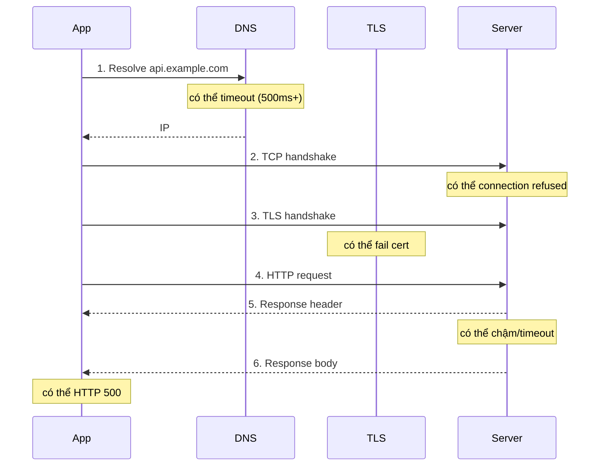

import { Callout } from "nextra/components";

# Networking từ code

Các bài trước dạy bạn quan sát mạng bằng tcpdump, ping, ss. Nhưng khi viết ứng dụng, bạn không chỉ quan sát — bạn **tạo ra** những kết nối đó. Bài này gom lại những đoạn code ngắn mà dev cần thuộc: mở TCP socket, gọi HTTP có timeout đúng cách, gửi UDP, đọc SSE, và xử lý các lỗi mạng thường gặp. Ba ngôn ngữ được minh họa song song — **Node.js**, **Go**, **Python** — để bạn thấy pattern chung dù ngôn ngữ khác.

## Nguyên tắc chung: mọi lời gọi mạng đều có thể fail

Trước khi vào code, ghi nhớ: **mỗi call qua mạng có thể fail theo nhiều cách**, và mặc định thư viện thường im lặng chờ. Ba loại lỗi bạn phải xử lý:

- **Không kết nối được**: DNS không resolve, connection refused, timeout khi handshake TCP/TLS.
- **Kết nối được nhưng chậm**: response tới nhưng quá lâu (đọc timeout).
- **Kết nối và response đến, nhưng nội dung sai**: status code lỗi, JSON hỏng, TLS certificate không hợp lệ.

Mọi client sinh ra cho production phải có **timeout tường minh** cho từng giai đoạn. Bài **Timeouts, retries & circuit breakers** ở Chương 10 sẽ đào sâu; ở đây tập trung vào cú pháp.

## Mở TCP socket thô

TCP socket cấp thấp hữu ích khi bạn viết protocol tự chế, làm health check, hoặc debug. Ba ngôn ngữ:

```javascript
// Node.js — TCP client
const net = require("node:net");

const client = net.createConnection({ host: "example.com", port: 80 }, () => {
  console.log("connected");
  client.write("GET / HTTP/1.1\r\nHost: example.com\r\nConnection: close\r\n\r\n");
});
client.on("data", (chunk) => process.stdout.write(chunk));
client.on("error", (err) => console.error("connect error:", err.code));
client.setTimeout(5000, () => client.destroy(new Error("timeout")));
```

```go
// Go — TCP client
package main

import (
    "fmt"
    "net"
    "time"
)

func main() {
    conn, err := net.DialTimeout("tcp", "example.com:80", 5*time.Second)
    if err != nil {
        fmt.Println("connect error:", err)
        return
    }
    defer conn.Close()

    conn.SetDeadline(time.Now().Add(5 * time.Second))
    fmt.Fprintf(conn, "GET / HTTP/1.1\r\nHost: example.com\r\nConnection: close\r\n\r\n")

    buf := make([]byte, 4096)
    n, err := conn.Read(buf)
    if err != nil {
        fmt.Println("read error:", err)
        return
    }
    fmt.Println(string(buf[:n]))
}
```

```python
# Python — TCP client
import socket

with socket.create_connection(("example.com", 80), timeout=5) as s:
    s.sendall(b"GET / HTTP/1.1\r\nHost: example.com\r\nConnection: close\r\n\r\n")
    while True:
        chunk = s.recv(4096)
        if not chunk:
            break
        print(chunk.decode(errors="replace"), end="")
```

Điểm chung: đều có **timeout tường minh**, đều bọc `Connection: close` để server chủ động đóng khi trả xong. Nếu bỏ timeout, connection có thể treo mãi khi server hang.

## HTTP client với timeout đúng cách

Đây là đoạn code dev viết nhiều nhất. Nhưng gần như mọi thư viện có **timeout mặc định là vô hạn** — điều này gây bug production nghiêm trọng: server đích hang, client cũng hang, kéo theo toàn bộ pool kết nối.

```javascript
// Node.js 18+ — fetch với timeout qua AbortController
async function fetchWithTimeout(url, ms = 5000) {
  const controller = new AbortController();
  const id = setTimeout(() => controller.abort(), ms);
  try {
    const res = await fetch(url, { signal: controller.signal });
    if (!res.ok) throw new Error(`HTTP ${res.status}`);
    return await res.json();
  } finally {
    clearTimeout(id);
  }
}

// Dùng
try {
  const data = await fetchWithTimeout("https://api.example.com/users/42", 3000);
  console.log(data);
} catch (err) {
  if (err.name === "AbortError") console.error("timeout");
  else console.error("error:", err.message);
}
```

```go
// Go — http.Client với timeout tổng và timeout từng giai đoạn
package main

import (
    "context"
    "encoding/json"
    "fmt"
    "net"
    "net/http"
    "time"
)

// Client cấu hình đầy đủ cho production
var httpClient = &http.Client{
    Timeout: 5 * time.Second,               // timeout TOÀN BỘ request
    Transport: &http.Transport{
        DialContext: (&net.Dialer{
            Timeout:   2 * time.Second,      // TCP dial timeout
            KeepAlive: 30 * time.Second,
        }).DialContext,
        TLSHandshakeTimeout:   2 * time.Second,
        ResponseHeaderTimeout: 3 * time.Second,
        IdleConnTimeout:       90 * time.Second,
        MaxIdleConnsPerHost:   20,
    },
}

func getUser(ctx context.Context, id string) (map[string]any, error) {
    req, err := http.NewRequestWithContext(ctx, "GET",
        "https://api.example.com/users/"+id, nil)
    if err != nil {
        return nil, err
    }
    resp, err := httpClient.Do(req)
    if err != nil {
        return nil, err
    }
    defer resp.Body.Close()
    if resp.StatusCode >= 400 {
        return nil, fmt.Errorf("HTTP %d", resp.StatusCode)
    }
    var out map[string]any
    return out, json.NewDecoder(resp.Body).Decode(&out)
}
```

```python
# Python — requests với timeout tường minh
import requests

# Tuple: (connect timeout, read timeout)
try:
    r = requests.get(
        "https://api.example.com/users/42",
        timeout=(2, 5),  # 2s để nối, 5s để nhận response
    )
    r.raise_for_status()  # ném lỗi nếu 4xx/5xx
    data = r.json()
except requests.exceptions.ConnectTimeout:
    print("không nối được trong 2s")
except requests.exceptions.ReadTimeout:
    print("server không trả trong 5s")
except requests.exceptions.HTTPError as e:
    print("HTTP error:", e.response.status_code)
```

<Callout type="warning">
  Trong Node.js **không** set timeout mặc định cho `fetch`; bạn phải tự `AbortController`.
  Trong Python `requests`, quên tham số `timeout` = timeout **vô hạn** — mọi request
  có thể treo mãi mãi. Trong Go, `http.DefaultClient.Timeout = 0` — cũng vô hạn.
  Ba bug production kinh điển đến từ đúng ba mặc định này.
</Callout>

## Connection pool và keep-alive

Mỗi request HTTP mới có thể mở kết nối TCP mới, tốn ít nhất một RTT + handshake TLS. Với client gọi cùng một service liên tục, **tái sử dụng kết nối** qua `Keep-Alive` cắt độ trễ đáng kể.

Các thư viện HTTP hiện đại (`fetch` browser, `axios`, Go `http.Client`, Python `requests.Session`) đều có connection pool tự động — miễn bạn **tái dùng một instance client**:

```javascript
// Node.js — undici tự pool cho fetch, hoặc dùng http.Agent tường minh
const { Agent } = require("undici");
const agent = new Agent({
  keepAliveTimeout: 60_000,
  keepAliveMaxTimeout: 300_000,
  connections: 20,  // pool 20 kết nối / host
});

for (let i = 0; i < 100; i++) {
  await fetch("https://api.example.com/ping", { dispatcher: agent });
}
```

```python
# Python — dùng Session để pool kết nối
import requests
session = requests.Session()

for _ in range(100):
    r = session.get("https://api.example.com/ping", timeout=(2, 5))
    r.raise_for_status()
```

Điểm dev hay sai: tạo mới `requests.get(...)` (không có Session) hoặc `new HttpClient()` (Node/C#) trong mỗi call. Điều đó phá pool — mỗi request handshake lại từ đầu. **Tạo client một lần, tái dùng khắp app**.

## UDP: gửi datagram không kết nối

UDP đơn giản hơn TCP nhiều vì không có handshake — chỉ gửi và quên. Hữu ích cho DNS custom, gửi metric, hoặc protocol tự chế:

```go
// Go — UDP client
conn, err := net.Dial("udp", "8.8.8.8:53")
if err != nil { panic(err) }
defer conn.Close()

conn.Write([]byte{ /* raw DNS query */ })

conn.SetReadDeadline(time.Now().Add(2 * time.Second))
buf := make([]byte, 512)
n, err := conn.Read(buf)
```

```python
# Python — UDP client
import socket
s = socket.socket(socket.AF_INET, socket.SOCK_DGRAM)
s.settimeout(2)
s.sendto(b"ping", ("192.168.1.100", 9999))
try:
    data, addr = s.recvfrom(4096)
    print(f"got {len(data)} bytes from {addr}")
except socket.timeout:
    print("không nhận được reply trong 2s")
```

Nhớ: UDP **không đảm bảo tới nơi** (đã học Chương 5). App phải tự retry nếu cần.

## Đọc Server-Sent Events

Bài **WebSocket, SSE & gRPC** đã giới thiệu SSE. Đọc SSE trong browser dễ (dùng `EventSource`), nhưng backend gọi SSE cần một chút cẩn thận vì response giữ mở lâu:

```javascript
// Node.js — đọc SSE
const res = await fetch("https://api.example.com/events");
const reader = res.body.pipeThrough(new TextDecoderStream()).getReader();

let buffer = "";
while (true) {
  const { value, done } = await reader.read();
  if (done) break;
  buffer += value;
  const events = buffer.split("\n\n");
  buffer = events.pop();  // giữ lại phần chưa đủ event
  for (const raw of events) {
    const dataLine = raw.split("\n").find(l => l.startsWith("data:"));
    if (dataLine) {
      const payload = JSON.parse(dataLine.slice(5).trim());
      console.log("event:", payload);
    }
  }
}
```

```python
# Python — đọc SSE bằng requests với stream=True
import json, requests

with requests.get("https://api.example.com/events", stream=True, timeout=(2, None)) as r:
    r.raise_for_status()
    for raw_line in r.iter_lines(decode_unicode=True):
        if raw_line.startswith("data:"):
            print("event:", json.loads(raw_line[5:].strip()))
```

Chú ý `timeout=(2, None)`: connect timeout 2s, read timeout **None** — SSE giữ kết nối vô hạn.

## Xử lý DNS chậm

DNS resolve nằm im lặng trước mọi HTTP call. Nếu DNS chậm hoặc treo, request có thể "im lặng chờ" nhiều giây trước khi timeout HTTP kịp bung ra. Với call chịu độ trễ cao, hai kỹ thuật:

**Resolve trước và pin IP** (dùng cho các endpoint biết trước):

```go
// Go — resolve DNS với deadline riêng
resolver := &net.Resolver{PreferGo: true}
ctx, cancel := context.WithTimeout(context.Background(), 500*time.Millisecond)
defer cancel()
ips, err := resolver.LookupHost(ctx, "api.example.com")
if err != nil { /* fallback IP hoặc lỗi */ }
```

**Cache DNS trong app** với TTL ngắn để không resolve mỗi call.

Trong browser thì bạn không kiểm soát DNS — mà là hệ điều hành lo. Cũng vì thế `dns-prefetch` HTML meta có ích:

```html
<link rel="dns-prefetch" href="//api.example.com" />
```

## Ví dụ: full-stack một request qua HTTPS

Đây là bức tranh dev cần thấy — request đi qua nhiều tầng, mỗi tầng có thể fail:



Với timeout tổng 5s: nếu DNS chiếm 3s, TLS 1s, thì chỉ còn 1s cho HTTP thực sự — request có thể timeout dù server không có gì bất thường. Đây là lý do timeout từng giai đoạn (như Go `http.Transport` cho ta) chi tiết hơn giá trị.

## Tóm tắt nhanh

- **Mọi call mạng có thể fail** ở nhiều tầng: DNS, TCP, TLS, HTTP, nội dung.
- **Timeout mặc định thường vô hạn** trong `fetch` (Node), `requests` (Python), Go `DefaultClient` — luôn set tường minh.
- **Timeout tổng vs. timeout từng giai đoạn**: Go `http.Transport` cho phép chia nhỏ (dial, TLS, response header) — chính xác hơn.
- **Tái dùng client instance** để tận dụng connection pool và Keep-Alive; đừng tạo client mới trong mỗi call.
- **UDP** đơn giản, không handshake, không đảm bảo — app phải tự retry nếu cần.
- **SSE**: `stream=True` (Python) hoặc reader stream (Node); read timeout = vô hạn, connect timeout ngắn.

## Bài tập

### Câu hỏi lý thuyết

1. Vì sao `fetch("...")` trong Node.js không có timeout mặc định lại nguy hiểm trong code production? Nêu một kịch bản cụ thể có thể làm sập ứng dụng.
2. Phân biệt **connect timeout** với **read timeout**. Với API bên ngoài, giá trị nào bạn nên đặt ngắn hơn và vì sao?

### Bài tập tình huống

3. Bạn viết một service gọi service khác qua HTTP 1000 lần/phút. Đo thấy latency P99 = 300ms, trong đó ~50ms là handshake TCP + TLS. Bạn nghi ngờ đang mở kết nối mới cho mỗi call. Chẩn đoán và đề xuất fix bằng cách nào (viết ý tưởng cho Python và Go).

### Thực hành

4. Viết một script (bất kỳ ngôn ngữ nào bạn quen) gửi 5 request tới `https://httpbin.org/delay/2` với timeout tổng 3 giây. Endpoint này cố tình delay 2 giây — request nên thành công. Sau đó đổi URL sang `https://httpbin.org/delay/4` — request nên **fail** vì server delay 4s > timeout 3s. Quan sát loại exception/error bạn nhận được và so với bảng lý thuyết ở đầu bài.

<details>
  <summary>Đáp án & gợi ý</summary>

1. Không có timeout mặc định = request **có thể treo vô hạn** nếu server đối tác hang. Kịch bản: API service của bạn gọi một API bên ngoài trong một handler HTTP; API đó bị chậm/hang. Mỗi request đến từ user chiếm một handler, mà handler bị kẹt chờ fetch. Rất nhanh, mọi worker của service bạn cũng bị kẹt → server không nhận request mới → user thấy 5xx hoặc timeout → cascading failure. Đây là ví dụ điển hình của "silent hang" phá cả pool.

2. **Connect timeout** = thời gian tối đa để **hoàn tất TCP handshake** với server; **read timeout** = thời gian tối đa **chờ server gửi dữ liệu tiếp theo** sau khi đã kết nối. Với API bên ngoài, **connect timeout** thường đặt ngắn hơn (1-2s) vì nếu chưa nối được thì gần như chắc server không sống hoặc mạng có vấn đề, retry ngay tốt hơn chờ; **read timeout** đặt dài hơn (5-30s) tùy tính chất API vì server đôi khi cần thời gian xử lý.

3. Nghi ngờ đúng: mỗi call tạo instance client mới, không tận dụng Keep-Alive. Fix: (Python) tạo `session = requests.Session()` một lần, tái dùng suốt vòng đời process. (Go) tạo `var httpClient = &http.Client{Timeout: ..., Transport: &http.Transport{MaxIdleConnsPerHost: 20, ...}}` ở scope module, không tạo mới trong hàm. Với 20+ connection persistent trong pool, chỉ request đầu tiên tốn 50ms handshake, các call sau tái dùng — P99 nên giảm đáng kể (mỗi call còn ~250ms).

4. Đáp án tùy code. Với `delay/2` (2s < 3s): request thành công, return `200 OK`. Với `delay/4` (4s > 3s): request fail, exception loại **ReadTimeout** trong Python / **AbortError** hoặc timeout error trong Node fetch / `context deadline exceeded` trong Go — vì server nhận được kết nối (connect OK) rồi mới delay ở phía đọc. Chưa phải ConnectTimeout vì server có phản hồi TCP handshake bình thường; nó chỉ delay ở tầng ứng dụng. Bài học: loại timeout error cho biết ở đâu chậm — dùng đúng loại giúp debug.

</details>

## Nguồn tham khảo

- Node.js Documentation, `net` module (TCP), Undici documentation (HTTP client, connection pool).
- Go Documentation, `net/http` package (`Transport` fields và timeout).
- Python Requests Documentation, "Advanced Usage" — timeouts và Session.
