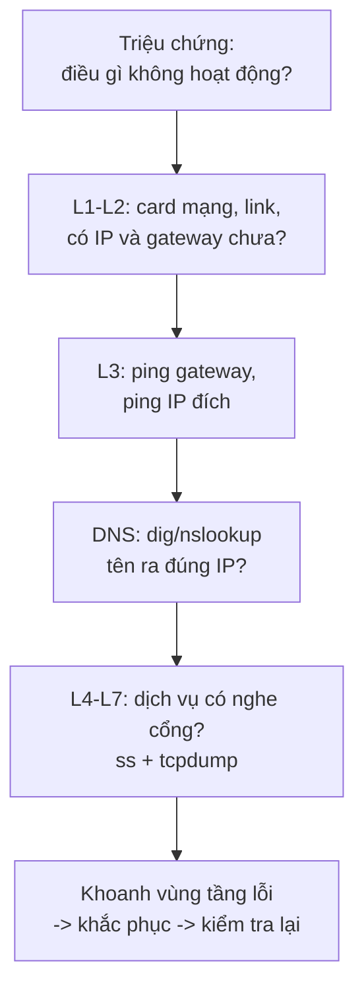

import { Callout } from "nextra/components";

# Phương pháp troubleshooting

Biết từng công cụ là chưa đủ; điều phân biệt một kỹ sư giỏi là **trình tự** dùng chúng. **Troubleshooting** (gỡ lỗi mạng — quá trình có hệ thống để đi từ một triệu chứng tới nguyên nhân gốc rồi tới cách khắc phục) không phải đoán mò mà là thu hẹp dần phạm vi. Bài học này trình bày một phương pháp có hệ thống, rồi áp dụng nó vào ba tình huống thật, mỗi tình huống dùng ít nhất hai công cụ từ bài trước để khoanh vùng và sửa lỗi.

## Một phương pháp có hệ thống

Cách hiệu quả nhất là dựa vào mô hình phân lớp đã học ở Chương 1: kiểm tra theo thứ tự từ tầng thấp lên tầng cao (**bottom-up**), vì một tầng chỉ chạy đúng khi tầng dưới nó đã ổn. Nếu Physical/Link hỏng thì không cần soi HTTP làm gì. Quy trình rút gọn:



Một nguyên tắc bổ trợ là **divide and conquer** (chia để trị — kiểm tra ở giữa đường để loại nhanh một nửa khả năng). Ví dụ, nếu ping tới IP đích thành công nhưng mở tên miền thất bại, ta đã loại được toàn bộ tầng dưới và chỉ còn nghi DNS hoặc tầng ứng dụng.

<Callout type="info">
  Luôn ghi lại bạn đã thử gì và kết quả ra sao. Một phép thử cho kết quả "tốt"
  cũng có giá trị: nó *loại bỏ* một nhánh nguyên nhân, giúp thu hẹp phạm vi nhanh
  như một phép thử cho kết quả "xấu".
</Callout>

## Scenario 1: "Một website không mở được, nhưng mạng vẫn chạy"

**Triệu chứng**: người dùng báo `example.com` không vào được và trình duyệt hiện lỗi "server not found", trong khi các ứng dụng khác (đã mở sẵn) vẫn online. Đây là gợi ý điển hình của lỗi phân giải tên.

Bước 1 — dùng **ping** để tách tầng tên khỏi tầng mạng. Ta ping thẳng *địa chỉ IP* (bỏ qua DNS) và ping *tên miền*:

```bash
$ ping -c 2 93.184.216.34
64 bytes from 93.184.216.34: icmp_seq=1 ttl=56 time=11.2 ms
64 bytes from 93.184.216.34: icmp_seq=2 ttl=56 time=11.0 ms

$ ping -c 2 example.com
ping: example.com: Name or service not known
```

Ping tới IP *thành công* nhưng ping tới tên *thất bại ngay ở bước phân giải* — kết nối IP tới đích hoàn toàn ổn, vấn đề nằm ở DNS. Đây chính là bước "divide and conquer": ta vừa loại sạch L1–L3.

Bước 2 — dùng **dig** (hoặc **nslookup**) để xác nhận và định vị lỗi DNS:

```bash
$ dig example.com A

;; ->>HEADER<<- opcode: QUERY, status: SERVFAIL, id: 6011
;; flags: qr rd ra; QUERY: 1, ANSWER: 0, AUTHORITY: 0, ADDITIONAL: 1

;; SERVER: 192.168.1.1#53(192.168.1.1)
```

Cờ `status: SERVFAIL` và `ANSWER: 0` cho thấy resolver được cấu hình (`192.168.1.1`) không trả lời được. Thử một resolver công cộng để khẳng định bản thân tên miền vẫn tốt:

```bash
$ dig @1.1.1.1 example.com A +short
93.184.216.34
```

Hỏi `1.1.1.1` thì ra IP bình thường ⇒ tên miền không hỏng; chỉ resolver mặc định bị lỗi.

**Khắc phục**: đổi resolver của máy sang một server hoạt động (ví dụ sửa `/etc/resolv.conf` thành `nameserver 1.1.1.1`, hoặc đổi DNS trong cấu hình mạng), rồi kiểm tra lại bằng `ping example.com`. Hai công cụ đã dùng: **ping** (khoanh vùng) và **dig/nslookup** (xác nhận nguyên nhân).

## Scenario 2: "Mạng chập chờn, lúc được lúc không"

**Triệu chứng**: kết nối thỉnh thoảng "khựng", tải trang giật cục, cuộc gọi video vỡ tiếng. Không hỏng hẳn nhưng không ổn định — dấu hiệu của mất gói trên đường truyền.

Bước 1 — dùng **ping** chạy dài để đo tỉ lệ mất gói thay vì chỉ 4 gói:

```bash
$ ping -c 100 8.8.8.8
...
--- 8.8.8.8 ping statistics ---
100 packets transmitted, 87 received, 13% packet loss, time 101430ms
rtt min/avg/max/mdev = 12.1/48.7/210.3/41.2 ms
```

`13% packet loss` và `rtt` dao động dữ dội (từ `12 ms` tới `210 ms`) xác nhận đường truyền mất gói và jitter cao. Nhưng ping chưa cho biết *chặng nào* gây ra.

Bước 2 — dùng **traceroute** (hoặc **mtr** để theo dõi liên tục) để định vị chặng có vấn đề:

```bash
$ traceroute -n 8.8.8.8
traceroute to 8.8.8.8 (8.8.8.8), 30 hops max, 60 byte packets
 1  192.168.1.1     1.1 ms    1.0 ms    1.2 ms       # gateway nội bộ, ổn định
 2  100.64.0.1      9.0 ms    8.8 ms    9.1 ms        # router ISP, ổn định
 3  203.0.113.1    48.0 ms   190.2 ms  12.5 ms        # độ trễ nhảy loạn ở đây
 4  203.0.113.9   180.4 ms    * *                     # bắt đầu mất gói
 5  8.8.8.8        52.0 ms    51.8 ms   52.3 ms
```

Hop 1–2 ổn định, nhưng từ hop 3 (`203.0.113.1`, thuộc mạng ISP) độ trễ nhảy loạn và hop 4 bắt đầu rớt gói. Vì lỗi xuất hiện *sau* gateway nội bộ, mạng LAN của bạn ổn — điểm nghẽn nằm trong hạ tầng ISP.

**Khắc phục**: vì điểm lỗi nằm ngoài tầm kiểm soát (mạng ISP), giải pháp là báo cáo cho ISP kèm output traceroute/mtr làm bằng chứng. Trường hợp hop 1 mới là thủ phạm, ta xử lý nội bộ (đổi cáp, kiểm tra Wi-Fi nhiễu, thay router). Hai công cụ đã dùng: **ping** (định lượng mất gói) và **traceroute/mtr** (định vị chặng lỗi).

## Scenario 3: "Client báo Connection refused tới dịch vụ"

**Triệu chứng**: một ứng dụng web vừa triển khai, nhưng client kết nối tới `port 8080` thì nhận `Connection refused`. Máy chủ vẫn ping được bình thường.

Bước 1 — dùng **ss** (hoặc **netstat**) *ngay trên máy chủ* để xem dịch vụ có thật sự lắng nghe đúng nơi không:

```bash
$ ss -tuln
Netid State  Recv-Q Send-Q  Local Address:Port  Peer Address:Port
tcp   LISTEN 0      128         127.0.0.1:8080      0.0.0.0:*
tcp   LISTEN 0      128           0.0.0.0:22        0.0.0.0:*
```

Dịch vụ *có* nghe port 8080, nhưng chỉ trên `127.0.0.1` (loopback) — nghĩa là chỉ tiến trình *trên cùng máy* mới nối được, mọi client từ ngoài đều bị từ chối. Đây là nguyên nhân gốc rất phổ biến.

Bước 2 — dùng **tcpdump** *trên máy chủ* để xác nhận gói của client có tới và máy chủ phản ứng ra sao:

```bash
$ sudo tcpdump -i any -n 'tcp port 8080'
14:02:11.337 IP 192.168.1.50.55012 > 192.168.1.10.8080: Flags [S], seq 700, win 64240
14:02:11.337 IP 192.168.1.10.8080 > 192.168.1.50.55012: Flags [R.], seq 0, ack 701, win 0
```

Gói SYN của client (`[S]`) *có* tới máy chủ — nên không phải lỗi firewall chặn im lặng hay routing. Máy chủ đáp lại `[R.]` (RST), tức kernel chủ động từ chối vì không có dịch vụ nào lắng nghe trên *địa chỉ mà client gọi tới*. Hai bằng chứng (ss cho thấy bind nhầm loopback, tcpdump cho thấy RST) khớp nhau và chỉ thẳng vào nguyên nhân.

<Callout type="warning">
  Phân biệt hai triệu chứng dễ nhầm: `Connection refused` (nhận RST — gói *tới*
  nơi nhưng không ai nghe) khác hẳn `Connection timed out` (không hồi đáp gì —
  thường do firewall chặn im lặng hoặc routing sai). tcpdump giúp tách hai khả
  năng này ngay lập tức.
</Callout>

**Khắc phục**: cấu hình dịch vụ bind vào `0.0.0.0:8080` (mọi địa chỉ) hoặc đúng IP LAN thay vì `127.0.0.1`, khởi động lại dịch vụ, rồi kiểm tra lại bằng `ss -tuln` (phải thấy `0.0.0.0:8080`) và thử kết nối lại từ client. Nếu sau đó chuyển sang `Connection timed out`, bước tiếp theo là soi firewall. Hai công cụ đã dùng: **ss/netstat** (kiểm tra trạng thái lắng nghe) và **tcpdump** (xác nhận gói tới và phản ứng RST).

## Tóm tắt nhanh

- Troubleshooting là **thu hẹp có hệ thống**, không phải đoán mò: kiểm tra **bottom-up** theo tầng và **divide-and-conquer** để loại nhanh một nửa khả năng.
- Một phép thử cho kết quả "tốt" cũng quý vì nó loại bỏ một nhánh nguyên nhân.
- Lỗi DNS: **ping IP thành công nhưng ping tên thất bại**, xác nhận bằng `dig`/`nslookup` (chú ý `SERVFAIL`/`NXDOMAIN`).
- Lỗi đường truyền: **ping** định lượng mất gói, **traceroute/mtr** định vị chặng lỗi (trong LAN hay ở ISP).
- Lỗi dịch vụ: **ss/netstat** xem dịch vụ nghe ở đâu (loopback vs `0.0.0.0`), **tcpdump** phân biệt `Connection refused` (RST) với `timed out` (im lặng).

## Bài tập

### Câu hỏi lý thuyết

1. Giải thích vì sao cách kiểm tra **bottom-up** (từ tầng thấp lên cao) lại hiệu quả hơn là nhảy thẳng vào nghi ngờ tầng ứng dụng. Cho một ví dụ cụ thể về một phép thử "thành công" giúp loại bỏ cả một nhóm nguyên nhân.
2. Một client nhận `Connection refused`, một client khác (tới dịch vụ khác) nhận `Connection timed out`. Dựa trên Scenario 3, hãy phân biệt nguyên nhân gốc của hai thông báo này và cho biết tcpdump giúp tách chúng ra sao.

### Bài tập tình huống

3. Triệu chứng: `ping 8.8.8.8` cho `0% packet loss`, nhưng `ping google.com` báo `Name or service not known`. Hãy xác định tầng nào đang lỗi, nêu công cụ tiếp theo bạn dùng và kết quả bạn mong đợi nếu chẩn đoán đúng.

### Thực hành (chạy công cụ thật)

4. Tự tạo một lỗi DNS có kiểm soát để luyện chẩn đoán: chạy `dig @127.0.0.1 example.com` (giả định máy bạn không chạy DNS server cục bộ). Quan sát cờ `status` trong output, rồi chạy lại `dig @1.1.1.1 example.com +short`. Giải thích sự khác nhau và nó tương ứng với bước nào trong Scenario 1.
5. Trên máy của bạn, chạy `ss -tuln` để xem các cổng đang `LISTEN`. Chọn một dịch vụ chỉ nghe trên `127.0.0.1` (nếu có) và lập luận: một máy khác trong LAN có kết nối được tới nó không, và cần đổi gì để kết nối được?

<details>
  <summary>Đáp án & gợi ý</summary>

1. Bottom-up hiệu quả vì một tầng chỉ hoạt động khi tầng dưới đã ổn; soi HTTP khi cáp đứt là vô ích. Một phép thử "thành công" ví dụ: `ping` tới IP đích thành công loại bỏ toàn bộ nghi ngờ về L1–L3 (card mạng, link, IP, gateway, routing tới đích đều ổn), giúp dồn sự chú ý vào DNS hoặc tầng ứng dụng.
2. `Connection refused` nghĩa là gói SYN **tới được** máy chủ nhưng không có dịch vụ lắng nghe trên địa chỉ đó, nên kernel trả về **RST** (như Scenario 3). `Connection timed out` nghĩa là **không có hồi đáp nào** — thường do firewall chặn im lặng hoặc routing sai khiến gói không tới. tcpdump phân biệt bằng cách cho thấy: thấy SYN rồi thấy `[R.]` (RST) ⇒ refused; thấy SYN gửi đi mà không có gì đáp lại ⇒ timed out.
3. Lỗi nằm ở **DNS** (tầng phân giải tên), vì kết nối IP tới `8.8.8.8` thành công nhưng tên miền không phân giải được. Công cụ tiếp theo: `dig` hoặc `nslookup`. Nếu chẩn đoán đúng, `dig @1.1.1.1 google.com +short` sẽ trả về IP bình thường (tên miền tốt), trong khi `dig google.com` qua resolver mặc định báo lỗi (`SERVFAIL` hoặc không có ANSWER) — đúng kiểu Scenario 1.
4. `dig @127.0.0.1 example.com` thường báo lỗi không kết nối được resolver (ví dụ "connection refused" tới `127.0.0.1#53`) vì không có DNS server chạy cục bộ — tương tự bước resolver hỏng trong Scenario 1. `dig @1.1.1.1 example.com +short` lại trả về IP, chứng tỏ tên miền tốt và chỉ resolver bị lỗi. Đây chính là kỹ thuật "đổi resolver để khẳng định lỗi nằm ở resolver chứ không ở tên miền".
5. Dịch vụ chỉ nghe trên `127.0.0.1` **không** thể kết nối từ máy khác trong LAN, vì loopback chỉ truy cập được nội bộ máy đó. Muốn client ngoài nối được, phải cấu hình dịch vụ bind vào `0.0.0.0` (mọi địa chỉ) hoặc IP LAN cụ thể của máy chủ, rồi mở firewall cho cổng đó nếu cần.

</details>

## Nguồn tham khảo

- C. Benvenuti, _Understanding Linux Network Internals_, O'Reilly, chapter on diagnostics (systematic layer-by-layer troubleshooting approach).
- J. F. Kurose & K. W. Ross, _Computer Networking: A Top-Down Approach_, 8th ed., section 5.6 (ICMP) and section 4.3 (the IP layer — relevant to interpreting ping and traceroute results).
- `ss(8)` and `tcpdump(1)` man pages (iproute2 and tcpdump projects) — interpreting socket state and captured TCP flags.
