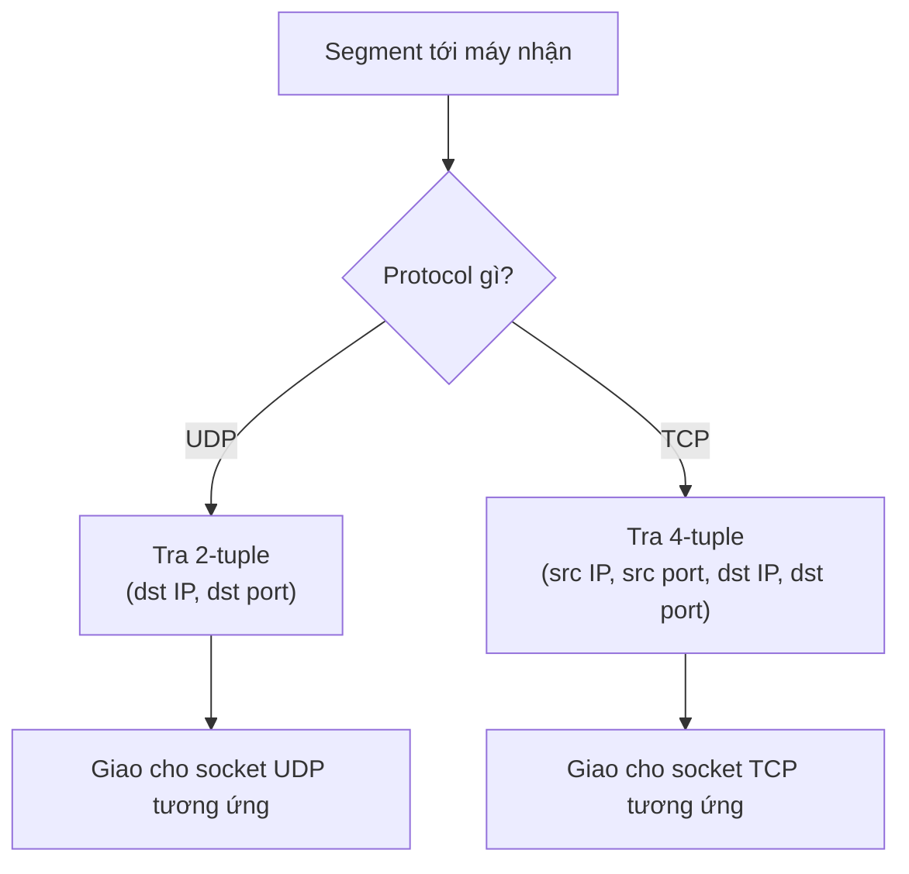

import { Callout } from "nextra/components";

# Port & Socket

Tầng Network đưa được packet tới **đúng máy** nhờ địa chỉ IP, nhưng trên một máy có hàng chục tiến trình cùng dùng mạng: trình duyệt, ứng dụng mail, trình nghe nhạc. Vậy khi packet tới nơi, làm sao hệ điều hành biết dữ liệu này thuộc về tiến trình nào? Câu trả lời là **port** và **socket** — hai khái niệm nền tảng mà cả TCP lẫn UDP đều dựa vào. Bài học này giải thích port, các dải port, socket, và cơ chế **multiplexing/demultiplexing**.

## Port là gì?

Một **port** (cổng — một số nguyên 16-bit dùng để định danh một tiến trình hoặc dịch vụ trên một máy) cho phép một địa chỉ IP duy nhất phục vụ nhiều ứng dụng cùng lúc. Vì port rộng 16 bit nên giá trị nằm trong khoảng từ `0` đến `65535`, cho mỗi máy tối đa 65536 port cho mỗi protocol vận chuyển.

Port biến địa chỉ "tới máy nào" (IP) thành địa chỉ "tới ứng dụng nào trên máy đó". Khi web server lắng nghe ở port `443`, mọi segment có destination port `443` sẽ được hệ điều hành giao cho tiến trình web server, còn segment tới port `25` thì giao cho mail server. Nhờ vậy một server vật lý chạy được nhiều dịch vụ đồng thời.

## Ba dải port

**IANA** (Internet Assigned Numbers Authority — tổ chức quản lý việc cấp phát số hiệu trên Internet, gồm cả port) chia không gian 65536 port thành ba dải với mục đích khác nhau:

| Dải port        | Tên             | Phạm vi         | Dùng cho                                                  |
| --------------- | --------------- | --------------- | --------------------------------------------------------- |
| Well-known      | System ports    | `0 – 1023`      | Dịch vụ chuẩn, cố định (HTTP 80, HTTPS 443, SSH 22, DNS 53) |
| Registered      | User ports      | `1024 – 49151`  | Ứng dụng đăng ký với IANA (MySQL 3306, RDP 3389)          |
| Dynamic/Private | Ephemeral ports | `49152 – 65535` | Port tạm máy client tự chọn cho mỗi kết nối ra ngoài       |

Dải **well-known** chứa các port mà mọi máy ngầm hiểu giống nhau, nên client biết phải gõ cửa port nào (ví dụ trình duyệt mặc định nối tới port `443` cho HTTPS). Dải **registered** dành cho phần mềm phổ biến nhưng không phải chuẩn lõi của Internet. Dải **dynamic** (còn gọi **ephemeral port** — port tạm thời, cấp phát ngắn hạn cho phía khởi tạo kết nối) là nơi hệ điều hành lấy ra một số ngẫu nhiên làm source port mỗi khi ứng dụng mở một kết nối đi ra.

<Callout type="info">
  Trên nhiều hệ điều hành, mở một port nhỏ hơn `1024` để lắng nghe cần quyền
  quản trị (root/administrator). Đây là lý do các dịch vụ chuẩn thường chạy dưới
  quyền hệ thống, còn ứng dụng người dùng hay chọn port từ `1024` trở lên.
</Callout>

## Socket: ghép IP với port

Một **socket** (ổ cắm — điểm cuối của một kênh truyền thông, xác định bằng cặp địa chỉ IP và port) là sự kết hợp của một địa chỉ IP và một port. Cách viết quy ước là `IP:port`, ví dụ `192.0.2.1:443` nghĩa là dịch vụ ở port `443` trên máy có IP `192.0.2.1`.

Một socket đơn lẻ chỉ mô tả **một đầu** của cuộc trò chuyện. Một kết nối hoàn chỉnh cần **hai** socket, nên ta thường nói tới một **socket pair** (cặp socket — bộ bốn giá trị xác định duy nhất một kết nối): `(source IP, source port, destination IP, destination port)`. Bộ bốn này (4-tuple) là "danh tính" của một kết nối; không có hai kết nối nào cùng tồn tại với bộ bốn giống hệt nhau.

```text
        Client                                   Server
  192.0.2.10 : 51514   <===== kết nối =====>   203.0.113.5 : 443

  Socket pair (4-tuple):
    ( 192.0.2.10 , 51514 , 203.0.113.5 , 443 )
       src IP     src port   dst IP    dst port
```

## Multiplexing và Demultiplexing

**Multiplexing** (dồn kênh — gom dữ liệu từ nhiều socket ở máy gửi, gắn thông tin port rồi đẩy xuống tầng Network) và **demultiplexing** (phân kênh — ở máy nhận, đọc thông tin trong header để giao mỗi segment đúng socket) là cặp thao tác cốt lõi của Transport Layer. Multiplexing xảy ra ở phía gửi, demultiplexing ở phía nhận.

Điểm tinh tế: UDP và TCP demultiplex khác nhau. **UDP** demultiplex chỉ dựa trên 2 giá trị `(destination IP, destination port)` — mọi datagram tới cùng một destination port đều vào chung một socket, bất kể ai gửi. **TCP** demultiplex dựa trên đủ 4 giá trị `(source IP, source port, destination IP, destination port)` — nhờ vậy hai client khác nhau (hoặc hai kết nối khác nhau từ cùng một client) cùng nối tới port `443` của server vẫn được tách thành hai socket riêng.



## Ví dụ thực tế: hai kết nối tới cùng một server

Giả sử bạn mở hai tab trình duyệt cùng vào một website HTTPS (port `443`) trên server `203.0.113.5`. Hệ điều hành cấp cho mỗi kết nối một ephemeral port khác nhau. Lệnh `ss` (công cụ Linux liệt kê socket đang hoạt động) cho output quan sát được như sau:

```bash
$ ss -tn
State   Recv-Q  Send-Q   Local Address:Port      Peer Address:Port
ESTAB   0       0        192.0.2.10:51514        203.0.113.5:443
ESTAB   0       0        192.0.2.10:51515        203.0.113.5:443
```

Hai dòng có cùng `Local Address`, cùng `Peer Address:443`, chỉ khác source port (`51514` và `51515`). Vì TCP demultiplex theo 4-tuple, hệ điều hành tách được hai luồng dữ liệu này thành hai socket độc lập dù chúng đi tới đúng một destination socket `203.0.113.5:443`. Đây chính là lý do bạn có thể tải nhiều thứ song song từ cùng một server mà dữ liệu không bị lẫn vào nhau.

## Tóm tắt nhanh

- **Port** là số 16-bit (`0 – 65535`) định danh tiến trình/dịch vụ trên một máy; nó đưa dữ liệu tới đúng ứng dụng chứ không chỉ đúng máy.
- Ba dải: **well-known** (`0 – 1023`), **registered** (`1024 – 49151`), **dynamic/ephemeral** (`49152 – 65535`).
- **Socket** = `IP:port`; một kết nối được xác định duy nhất bằng **socket pair** (4-tuple).
- **Multiplexing** gom dữ liệu ở phía gửi; **demultiplexing** giao đúng socket ở phía nhận. UDP dùng 2-tuple, TCP dùng 4-tuple.

## Bài tập

### Câu hỏi lý thuyết

1. Giải thích vì sao một server có duy nhất một địa chỉ IP vẫn có thể phục vụ đồng thời web (HTTPS), email và SSH. Khái niệm nào làm được điều đó?
2. Một ephemeral port thuộc dải nào, và do bên nào (client hay server) chọn? Vì sao server lại dùng well-known port thay vì ephemeral port?

### Bài tập phân tích

3. Hai client `198.51.100.7` và `198.51.100.8` cùng kết nối tới web server `203.0.113.5:443`. Viết socket pair (4-tuple) cho mỗi kết nối (giả sử mỗi client dùng source port `50000`). Giải thích vì sao server không nhầm lẫn hai kết nối này dù chúng cùng tới port `443`.

<details>
  <summary>Đáp án & gợi ý</summary>

1. Nhờ **port**: mỗi dịch vụ lắng nghe ở một port riêng (HTTPS `443`, SSH `22`, SMTP `25`). Hệ điều hành đọc destination port trong mỗi segment và **demultiplex** dữ liệu tới đúng tiến trình, nên một IP phục vụ được nhiều dịch vụ cùng lúc.
2. Ephemeral port thuộc dải **dynamic/private** (`49152 – 65535`) và do **client** (bên khởi tạo kết nối) chọn. Server dùng **well-known port** cố định để client biết trước phải nối tới đâu; nếu server cũng đổi port ngẫu nhiên thì client sẽ không biết "gõ cửa" ở đâu.
3. Hai socket pair: `(198.51.100.7, 50000, 203.0.113.5, 443)` và `(198.51.100.8, 50000, 203.0.113.5, 443)`. Tuy cùng source port `50000` và cùng destination `203.0.113.5:443`, hai bộ bốn vẫn khác nhau ở **source IP**. TCP demultiplex theo đủ 4-tuple nên phân biệt được hai kết nối thành hai socket riêng.

</details>

## Nguồn tham khảo

- M. Cotton et al., _Internet Assigned Numbers Authority (IANA) Procedures for the Management of the Service Name and Transport Protocol Port Number Registry_, RFC 6335, mục 6 (ba dải port: System, User, Dynamic).
- J. F. Kurose & K. W. Ross, _Computer Networking: A Top-Down Approach_, 8th ed., mục 3.2 ("Multiplexing and Demultiplexing").
