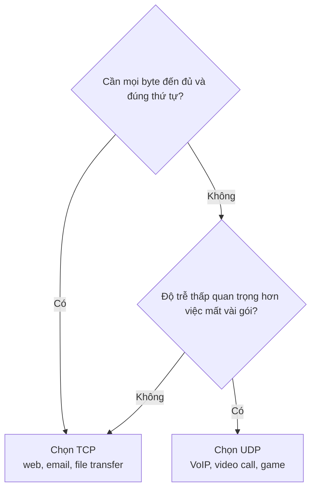

import { Callout } from "nextra/components";

# So sánh TCP & UDP

Hai bài trước đã mổ xẻ TCP và UDP riêng rẽ. Bài này đặt chúng cạnh nhau để bạn thấy rõ sự đánh đổi (trade-off) cốt lõi: **độ tin cậy đổi lấy độ trễ**. TCP cho bạn một dòng dữ liệu chắc chắn nhưng phải trả giá bằng handshake, xác nhận và đôi khi là chờ đợi; UDP cho bạn tốc độ và sự gọn nhẹ nhưng đẩy mọi trách nhiệm về độ tin cậy cho ứng dụng. Hiểu được trục đánh đổi này là chìa khóa để chọn đúng protocol.

## Bảng so sánh TCP và UDP

| Tiêu chí                | TCP                                            | UDP                                          |
| ----------------------- | ---------------------------------------------- | -------------------------------------------- |
| Mô hình kết nối         | Connection-oriented (three-way handshake)      | Connectionless (gửi ngay, không bắt tay)     |
| Độ tin cậy              | Đảm bảo (ACK + gửi lại gói mất)                | Không đảm bảo (gói mất là mất luôn)          |
| Thứ tự dữ liệu          | Giữ đúng thứ tự (sequence number)              | Không đảm bảo thứ tự                         |
| Flow control            | Có (sliding window, `rwnd`)                    | Không                                        |
| Congestion control      | Có (slow start, congestion avoidance)          | Không                                        |
| Kích thước header       | Tối thiểu 20 byte                              | Cố định 8 byte                               |
| Đơn vị truyền           | Byte stream (dòng byte liên tục)               | Datagram (gói độc lập, có ranh giới)         |
| Overhead & độ trễ       | Cao hơn (thiết lập + xác nhận)                 | Thấp (gửi thẳng)                             |
| Hỗ trợ broadcast/multicast | Không                                       | Có                                           |
| Use case tiêu biểu      | Web (HTTP/HTTPS), email (SMTP), truyền file    | DNS, VoIP, video call, gaming, streaming     |

Bảng trên cho thấy một quy luật: gần như mọi điểm "mạnh" của TCP (tin cậy, đúng thứ tự, tự điều tiết) đều đi kèm chi phí về độ trễ hoặc overhead, và đó chính xác là những thứ UDP cắt bỏ để đổi lấy tốc độ.

## Khi nào chọn cái nào?

Câu hỏi quyết định là: **ứng dụng có cần mọi byte đến đủ và đúng thứ tự không?** Nếu thiếu một mẩu dữ liệu làm kết quả sai (file hỏng, trang web vỡ, email mất chữ), hãy chọn TCP. Nếu ứng dụng chịu được mất mát một phần nhưng cực kỳ nhạy với độ trễ, hãy chọn UDP.



Một hướng dẫn thực dụng: **chọn TCP làm mặc định**, vì phần lớn ứng dụng cần độ tin cậy và không muốn tự cài lại cơ chế gửi lại gói. Chỉ **chuyển sang UDP** khi bạn có lý do rõ ràng — dữ liệu thời gian thực, trao đổi siêu ngắn, hoặc cần broadcast/multicast — và sẵn sàng tự xử lý mất mát ở tầng ứng dụng nếu cần.

<Callout type="info">
  Ranh giới này đang mờ dần. Protocol **QUIC** (nền tảng của HTTP/3) chạy **trên
  UDP** nhưng tự xây lại độ tin cậy và kiểm soát tắc nghẽn ở tầng ứng dụng, nhằm
  lấy tốc độ của UDP mà vẫn có đảm bảo kiểu TCP. Nó cho thấy "TCP hay UDP" là
  điểm khởi đầu, không phải giới hạn cứng.
</Callout>

## Ví dụ thực tế: cùng một thông điệp, hai cách gửi

Giả sử ứng dụng cần gửi một thông điệp 20 byte. So sánh chi phí trên dây giữa hai protocol cho thấy rõ sự đánh đổi:

```text
Gửi 20 byte payload qua UDP:
  - Không handshake.
  - 1 datagram = 8 byte header + 20 byte data = 28 byte.
  - Tổng gói trên mạng: 1 (chưa kể có thể không có gói trả lời).

Gửi 20 byte payload qua TCP:
  - Handshake trước: 3 segment (SYN, SYN-ACK, ACK), mỗi cái >= 20 byte header.
  - Segment dữ liệu: 20 byte header + 20 byte data = 40 byte.
  - Cộng thêm ACK cho dữ liệu, rồi 3-4 segment đóng kết nối (FIN/ACK).
  - Tổng: ~8 gói và ít nhất 1 RTT chờ trước khi byte đầu tiên đi được.
```

Với một trao đổi nhỏ và một lần (như truy vấn DNS), UDP gửi xong trong 1 gói còn TCP tốn khoảng tám gói cùng độ trễ một vòng RTT cho handshake. Nhưng nếu phải gửi một file 50 MB, chi phí thiết lập của TCP trở nên không đáng kể, còn việc đảm bảo đủ và đúng thứ tự của nó lại là thứ bắt buộc — lúc đó TCP mới là lựa chọn hợp lý.

## Tóm tắt nhanh

- Đánh đổi cốt lõi: TCP đổi **độ trễ/overhead** lấy **độ tin cậy + đúng thứ tự**; UDP đổi các đảm bảo đó lấy **tốc độ + gọn nhẹ**.
- TCP: connection-oriented, tin cậy, đúng thứ tự, có flow/congestion control, header 20 byte. UDP: connectionless, không đảm bảo, header 8 byte, hỗ trợ broadcast/multicast.
- Câu hỏi chọn lựa: **cần đủ và đúng thứ tự?** Có → TCP; không và nhạy độ trễ → UDP.
- Mặc định chọn TCP; chuyển sang UDP khi có lý do rõ ràng (real-time, trao đổi siêu ngắn, multicast).

## Bài tập

### Câu hỏi lý thuyết

1. Lập bảng (hoặc liệt kê) ít nhất bốn tiêu chí phân biệt TCP và UDP. Với mỗi tiêu chí, nêu giá trị của từng protocol.
2. Giải thích câu "TCP đổi độ trễ lấy độ tin cậy". Cơ chế cụ thể nào của TCP tạo ra độ tin cậy, và vì sao nó làm tăng độ trễ?

### Bài tập tình huống

3. Với mỗi ứng dụng sau, chọn TCP hay UDP và giải thích bằng câu hỏi quyết định ("cần đủ và đúng thứ tự không?"): (a) tải một file PDF, (b) phát trực tiếp một trận đấu thể thao, (c) tra cứu địa chỉ IP của một tên miền, (d) đăng nhập ngân hàng qua web.

<details>
  <summary>Đáp án & gợi ý</summary>

1. Ví dụ bốn tiêu chí — **Mô hình kết nối**: TCP connection-oriented / UDP connectionless; **Độ tin cậy**: TCP đảm bảo / UDP không; **Thứ tự**: TCP giữ đúng / UDP không; **Header**: TCP 20 byte / UDP 8 byte. (Có thể bổ sung flow/congestion control, byte stream vs datagram.)
2. Độ tin cậy của TCP đến từ **sequence number + ACK + gửi lại gói mất** (và handshake để thiết lập trạng thái). Những cơ chế này tăng độ trễ vì: phải tốn một RTT cho handshake trước khi gửi dữ liệu, và khi mất gói thì dữ liệu sau phải **chờ** gói cũ được gửi lại (head-of-line blocking).
3. (a) PDF → **TCP**: thiếu một byte là file hỏng, cần đủ và đúng thứ tự. (b) Phát trực tiếp → **UDP**: nhạy độ trễ, chịu được mất vài gói; dữ liệu cũ vô dụng. (c) Tra cứu tên miền (DNS) → **UDP**: trao đổi siêu ngắn, mất thì hỏi lại. (d) Đăng nhập ngân hàng qua web → **TCP**: web/HTTPS chạy trên TCP, dữ liệu phải chính xác tuyệt đối.

</details>

## Nguồn tham khảo

- W. Eddy (Ed.), _Transmission Control Protocol (TCP)_, RFC 9293, mục 1 (tổng quan dịch vụ tin cậy, hướng kết nối của TCP).
- J. Postel, _User Datagram Protocol_, RFC 768 (mô hình datagram không kết nối của UDP).
- J. F. Kurose & K. W. Ross, _Computer Networking: A Top-Down Approach_, 8th ed., mục 3.3 và 3.5 (so sánh dịch vụ UDP và TCP).
