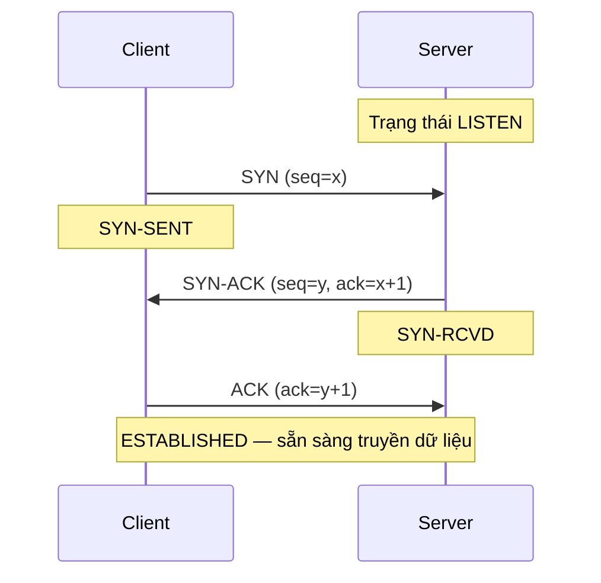
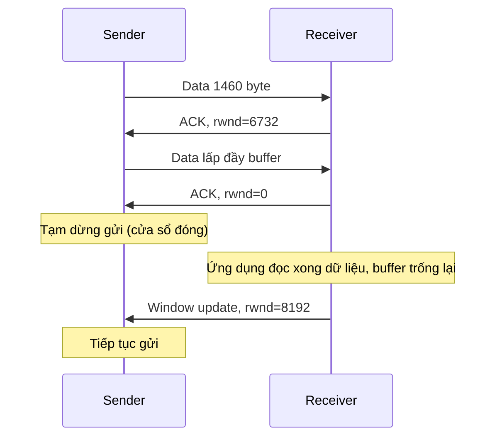

import { Callout } from "nextra/components";

# TCP

**TCP** (Transmission Control Protocol — protocol vận chuyển hướng kết nối, đảm bảo dữ liệu tới đủ và đúng thứ tự) là lựa chọn mặc định cho phần lớn ứng dụng cần độ tin cậy: web, email, truyền file. TCP biến một kênh IP vốn "best-effort" (cố gắng hết sức nhưng không hứa hẹn) thành một dòng byte tin cậy giữa hai tiến trình. Bài học này đi qua ba cơ chế cốt lõi của TCP: **three-way handshake** để mở kết nối, **flow control** để không làm ngợp máy nhận, và **congestion control** để không làm nghẽn mạng.

## TCP là gì?

TCP có ba tính chất định hình mọi thứ còn lại. Thứ nhất, nó **connection-oriented** (hướng kết nối — hai bên phải bắt tay thiết lập trạng thái trước khi gửi dữ liệu). Thứ hai, nó **reliable** (tin cậy — dùng số thứ tự và ACK để phát hiện và gửi lại dữ liệu mất). Thứ ba, nó truyền một **byte stream** (dòng byte liên tục, không có ranh giới message; ứng dụng tự cắt nghĩa dữ liệu).

Để làm được điều đó, mỗi byte trong dòng dữ liệu được gắn một **sequence number** (số thứ tự — đánh số byte để máy nhận xếp lại đúng thứ tự và phát hiện thiếu hụt). Máy nhận xác nhận bằng **ACK** (acknowledgment — báo đã nhận, mang số thứ tự của byte kế tiếp mà nó mong nhận). Hai khái niệm này là nền tảng cho cả ba cơ chế bên dưới.

## Three-way handshake

Trước khi gửi dữ liệu, hai bên thực hiện **three-way handshake** (bắt tay ba bước — trao đổi ba segment để đồng bộ sequence number và xác nhận hai chiều đều thông). Mục tiêu: cả client lẫn server cùng biết số thứ tự khởi đầu của nhau và xác nhận rằng cả hai chiều gửi/nhận đều hoạt động.



Ba bước diễn ra như sau. Bước 1, client gửi một segment đặt cờ **SYN** (synchronize — yêu cầu mở kết nối và công bố sequence number khởi đầu `x`). Bước 2, server đáp lại bằng segment đặt cả hai cờ **SYN** và **ACK**: nó xác nhận đã nhận `x` (qua `ack=x+1`) và công bố sequence number khởi đầu của riêng nó là `y`. Bước 3, client gửi **ACK** xác nhận `y` (qua `ack=y+1`); kết nối chuyển sang trạng thái `ESTABLISHED` và dữ liệu bắt đầu chảy.

<Callout type="info">
  Vì sao cần **ba** bước chứ không phải hai? Hai bước chỉ xác nhận một chiều.
  Bước thứ ba để server chắc chắn rằng client thật sự nhận được `SYN-ACK` của
  mình, tránh trường hợp một `SYN` cũ bị trễ trong mạng làm server mở nhầm một
  kết nối "ma".
</Callout>

## Flow control: sliding window

**Flow control** (điều khiển luồng — cơ chế để máy gửi không đẩy dữ liệu nhanh hơn khả năng tiêu thụ của máy nhận) tránh tình huống bộ đệm (buffer) của máy nhận bị tràn. Công cụ của TCP là **sliding window** (cửa sổ trượt — lượng dữ liệu tối đa được phép gửi mà chưa cần chờ ACK).

Máy nhận liên tục thông báo **rwnd** (receive window — số byte trống còn lại trong buffer nhận) trong mỗi ACK. Máy gửi không được để số byte "đã gửi nhưng chưa được ACK" vượt quá `rwnd`. Khi máy nhận xử lý xong dữ liệu và giải phóng buffer, nó gửi giá trị `rwnd` lớn hơn, "trượt" cửa sổ về phía trước để máy gửi tiếp tục.

```text
Dòng byte ở máy gửi (cửa sổ rwnd = 4 đơn vị):

[ đã gửi & đã ACK ][ đã gửi, chờ ACK ][ được phép gửi ][ chưa được gửi ]
                   |<------------ cửa sổ (rwnd) ------->|
                   ^                                    ^
                   biên trái                           biên phải

Khi ACK tới, cả hai biên "trượt" sang phải -> được gửi thêm dữ liệu mới.
```

Ví dụ một chu trình flow control với buffer nhận 8192 byte:



## Congestion control: slow start & congestion avoidance

Flow control bảo vệ **máy nhận**, còn **congestion control** (điều khiển tắc nghẽn — cơ chế để máy gửi không bơm quá nhiều dữ liệu làm nghẽn các router trên đường đi) bảo vệ **mạng**. TCP giữ thêm một biến **cwnd** (congestion window — giới hạn dữ liệu chưa được ACK mà mạng được cho là chịu đựng nổi). Lượng gửi thực tế bị chặn bởi giá trị nhỏ hơn giữa `rwnd` và `cwnd`.

TCP dò tìm băng thông khả dụng theo các bước sau:

1. **Slow start** (khởi động chậm — tăng `cwnd` theo cấp số nhân để nhanh chóng tìm giới hạn). `cwnd` bắt đầu ở 1 **MSS** (Maximum Segment Size — kích thước payload tối đa của một TCP segment) và **gấp đôi mỗi RTT** (round-trip time — thời gian một gói đi và ACK quay về): 1 → 2 → 4 → 8 ...
2. Khi `cwnd` đạt ngưỡng **ssthresh** (slow start threshold — ngưỡng chuyển pha), TCP chuyển sang **congestion avoidance** (tránh tắc nghẽn — tăng tuyến tính, mỗi RTT chỉ cộng thêm 1 MSS) để dò băng thông một cách thận trọng.
3. Khi phát hiện mất gói (dấu hiệu tắc nghẽn), TCP **giảm mạnh** `cwnd` rồi lặp lại quá trình, nên `cwnd` có hình "răng cưa" đặc trưng.

```text
cwnd (đơn vị MSS)
 12 |                                   *
 11 |                                *
 10 |                             *      Congestion Avoidance
  9 |                          *         (tuyến tính: +1 mỗi RTT)
  8 |                    *  ssthresh = 8  (kết thúc Slow Start)
  4 |           *           Slow Start
  2 |      *                (cấp số nhân: x2 mỗi RTT)
  1 | *
    +----------------------------------------------- vòng RTT
      1    2    3    4     5    6    7    8
```

<Callout type="warning">
  Mất gói được TCP hiểu là tín hiệu mạng đang tắc. Vì vậy trên các liên kết hay
  rớt gói vì nhiễu (ví dụ Wi-Fi yếu) chứ không phải vì tắc nghẽn, TCP có thể giảm
  tốc độ "oan", khiến thông lượng tụt dù băng thông vẫn còn.
</Callout>

## Ví dụ thực tế: quan sát handshake bằng tcpdump

Khi client `192.0.2.10` mở một kết nối HTTPS tới server `203.0.113.5:443`, công cụ bắt gói `tcpdump` cho ta chuỗi cờ quan sát được — đúng ba bước của handshake:

```bash
$ sudo tcpdump -i any -n 'tcp port 443'
10:01:22.100  IP 192.0.2.10.51514 > 203.0.113.5.443: Flags [S],  seq 1000, win 64240
10:01:22.140  IP 203.0.113.5.443 > 192.0.2.10.51514: Flags [S.], seq 5000, ack 1001, win 65535
10:01:22.141  IP 192.0.2.10.51514 > 203.0.113.5.443: Flags [.],  ack 5001, win 64240
```

Đọc từng dòng: `[S]` là segment SYN với `seq 1000` (client chọn `x = 1000`); `[S.]` là SYN-ACK (`S` cộng dấu `.` biểu thị cờ ACK) với `seq 5000` và `ack 1001` — server xác nhận `1000+1`; `[.]` là ACK cuối với `ack 5001` — client xác nhận `5000+1`. Sau ba dòng này kết nối đã `ESTABLISHED` và dữ liệu HTTPS bắt đầu truyền. Trường `win` chính là cửa sổ flow control được quảng bá ở mỗi chiều.

## Tóm tắt nhanh

- TCP là protocol **connection-oriented**, **reliable**, truyền **byte stream**; dựa trên **sequence number** và **ACK**.
- **Three-way handshake**: `SYN` → `SYN-ACK` → `ACK` để đồng bộ sequence number hai chiều trước khi truyền dữ liệu.
- **Flow control** dùng **sliding window** với `rwnd` để không làm tràn buffer máy nhận.
- **Congestion control** dùng `cwnd`: **slow start** tăng cấp số nhân, **congestion avoidance** tăng tuyến tính; mất gói làm `cwnd` giảm mạnh.
- Lượng dữ liệu được gửi bị giới hạn bởi giá trị nhỏ hơn giữa `rwnd` và `cwnd`.

## Bài tập

### Câu hỏi lý thuyết

1. Mô tả ba bước của three-way handshake, nêu rõ cờ nào được đặt ở mỗi bước và giá trị `ack` được tính như thế nào. Vì sao cần bước thứ ba?
2. Phân biệt mục đích của **flow control** với **congestion control**. Mỗi cơ chế bảo vệ thành phần nào (máy nhận hay mạng), và dùng biến cửa sổ nào?

### Bài tập tính toán

3. Một kết nối TCP có `rwnd = 16` KB và `cwnd = 10` KB. Máy gửi được phép có tối đa bao nhiêu dữ liệu chưa được ACK trên đường truyền? Nếu `cwnd` đang ở pha slow start với giá trị 4 MSS, sau 2 RTT nữa (không mất gói) `cwnd` sẽ là bao nhiêu MSS?

<details>
  <summary>Đáp án & gợi ý</summary>

1. Bước 1: client gửi **SYN** với `seq=x`. Bước 2: server gửi **SYN-ACK** với `seq=y` và `ack=x+1` (xác nhận đã nhận SYN của client). Bước 3: client gửi **ACK** với `ack=y+1` (xác nhận đã nhận SYN của server). Cần bước thứ ba để server chắc chắn client đã nhận được `SYN-ACK`, tránh mở kết nối "ma" do một SYN cũ bị trễ.
2. **Flow control** bảo vệ **máy nhận** khỏi tràn buffer, dùng biến `rwnd` do máy nhận quảng bá. **Congestion control** bảo vệ **mạng** (các router) khỏi nghẽn, dùng biến `cwnd` do máy gửi tự điều chỉnh.
3. Lượng dữ liệu cho phép = `min(rwnd, cwnd) = min(16, 10) = 10` KB. Slow start gấp đôi mỗi RTT: `4 → 8 → 16`, vậy sau 2 RTT `cwnd = 16` MSS.

</details>

## Nguồn tham khảo

- W. Eddy (Ed.), _Transmission Control Protocol (TCP)_, RFC 9293, mục 3.5 ("Establishing a Connection") và mục 3.8 (flow control, cửa sổ nhận).
- J. F. Kurose & K. W. Ross, _Computer Networking: A Top-Down Approach_, 8th ed., mục 3.5 (connection-oriented transport: TCP) và mục 3.7 (TCP congestion control).
